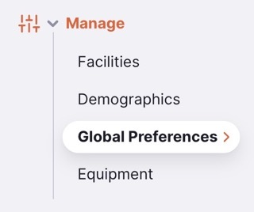
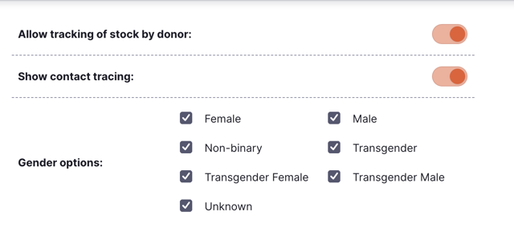
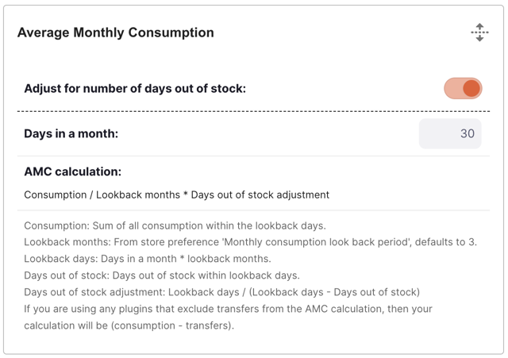
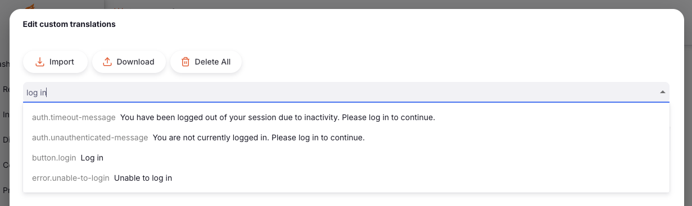
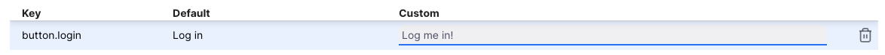
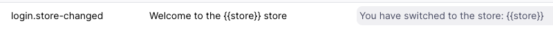
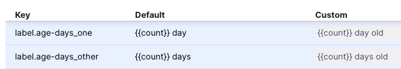
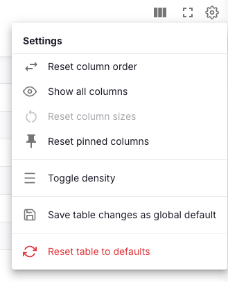

+++
title = "Global Preferences"
description = "Global Preferences Configuration"
date =  2025-05-21
updated = 2025-05-21
draft = false
weight = 2
sort_by = "weight"
template = "docs/page.html"

[extra]
toc = true
top = false
+++

The Global preferences list is available only on the [Open mSupply Central Server](/docs/getting_started/central-server). They are preferences which apply to all Open mSupply sites.

## Viewing Global Preferences

To configure Global Preferences, go to the Global Preferences page under the Manage menu:

You will be presented with the set of currently available Global Preferences:

## Available Preferences

| Preference Name                                                   | Description                                                                                                                                                                                                                                                                                                                                                                                                                                                                           |
| :---------------------------------------------------------------- | :------------------------------------------------------------------------------------------------------------------------------------------------------------------------------------------------------------------------------------------------------------------------------------------------------------------------------------------------------------------------------------------------------------------------------------------------------------------------------------ |
| **Allow tracking of stock by donor**                              | Adds a donor column to stock management screens. This allows you to track which donor a stock item is from.                                                                                                                                                                                                                                                                                                                                                                           |
| **Gender options**                                                | The gender options available for clinicians and patients. This defines the options shown in gender filters and which can be assigned to clinicians and patients.                                                                                                                                                                                                                                                                                                                      |
| **Show contact tracing**                                          | Enables the [Contact Tracing](/docs/programs/program-module/#contact-tracing) feature for Patients                                                                                                                                                                                                                                                                                                                                                                                    |
| **Custom Translations**                                           | Configure overrides for terms used throughout the application.                                                                                                                                                                                                                                                                                                                                                                                                                        |
| **Sync records display threshold**                                | The number of sync records that will need to be pending before showing an indicator over the Sync menu item                                                                                                                                                                                                                                                                                                                                                                           |
| **Authorise purchase orders**.                                    | Whether the purchase order process includes an authorisation step                                                                                                                                                                                                                                                                                                                                                                                                                     |
| **Prevent transfers from this many months before initialisation** | When migrating older mSupply Desktop & mobile sites to Open mSupply this preference can prevent the generation of hundreds of locked inbound shipments. Open mSupply will not create `Picked` status inbound shipments corresponding to outbound shipments from supplier's stores that were picked this many months before the date the site was initialised. Similarly, it will not make customer requisitions for internal orders finalised this many months before initialisation. |
| **Authorise goods received**                                      | Whether the goods receiving process includes an authorisation step                                                                                                                                                                                                                                                                                                                                                                                                                    |
| **Item margin overrides supplier margin**                         | Give priority to the item margin on the receiving store over the supplier's margin if both are configured when receiving an inbound shipment.                                                                                                                                                                                                                                                                                                                                         |
| **Display population based forecasting**                          | Whether to show the population based forecasting calculation instead of the standard AMC calculation in internal orders and requisitions. This will also show the target stock (population) field in internal orders and requisitions.                                                                                                                                                                                                                                                |

### Average Monthly Consumption (AMC)

The `Average Monthly Consumption` preferences allow you to customise the item consumption calculation for your stores.

The base calculation is: **(Consumption / Lookback months) \* Lookback days / (Lookback days - Days out of stock)**

You can adjust how the calculation works using the following preferences:

| Preference Name                             | Description                                                                                                                                                                                                                                                                                                                                                                     |
| :------------------------------------------ | :------------------------------------------------------------------------------------------------------------------------------------------------------------------------------------------------------------------------------------------------------------------------------------------------------------------------------------------------------------------------------ |
| **Adjust for number of days out of stock:** | Exclude days within the lookback period where the item was out of stock for the full day. The lookback days is adjusted to exclude the number days out for stock if this preference is on. Note: days are counted as out of stock where the item has been in stock before (ie not a new item), and had a balance of zero at the end of the day and the end of the previous day. |
| **Days in a month:**                        | The number of days per month used in the AMC calculation. If no value is provided, the default is used (average days per month = 30.4375).                                                                                                                                                                                                                                      |

[Lookback months](https://docs.msupply.org.nz/other_stuff:virtual_stores#preferences_tab) are configurable per store in mSupply with the `Monthly consumption look back period` preference. The default setting is 3 months.

Lookback days are calculated as `Days in a month * Lookback months`.

 If you are using any plugins that exclude transfers from the AMC calculation, then your calculation will be (consumption - transfers).

### Custom translations

The `Custom translations` preference allows you to override specific terms used in the application. This is useful for localisation (or even localization!) or to adapt terminology to your specific context.

Use this feature carefully. It can lead to confusion if terms do not match our documentation, or if they are not consistent across the application.

You can search by any text you see within the application, or if you know the translation key, you can search by that as well:

Select the translation you want to change, and then enter the new text in the input field:

Some translations include variables, which will be replaced with the appropriate values when they are used. You can move these variables around within the text, but ensure you keep them intact, so the messages continue to make sense. Variables are enclosed in double curly braces, like this: `{{variable_name}}`.

For translations that include number-based variables, we also support pluralisation. If you select one of these translations, you will see both `_one` and `_other` translations are added. Make sure you provide the correct text for both cases:

## Default settings for tables

There is a particular type of global configuration which is accessed in a special way. This is the default settings for tables.

Open mSupply tables are highly customisable. You can show or hide columns, reorder them, resize them, pin them, and change the row density. By default, these changes are saved only in your browser and apply only to you.

Administrators on the central server can go one step further: they can save their current table configuration as a global default that applies to all users across the system. This sets a consistent baseline so that every user sees the same table layout until they choose to personalise it.

### Who can save global defaults

To save a global default table configuration, you must meet both of the following conditions:

- You are logged in to the central server (not a remote site)
- Your account has the Edit Central Data permission

If you do not meet these conditions, you can still customise tables for yourself, but you will not see the option to save a global default.

### What gets saved

When you save a global default, the following settings are captured for that table:

| Setting           | Description                                        |
| ----------------- | -------------------------------------------------- |
| Column visibility | Which columns are shown or hidden                  |
| Column order      | The sequence in which columns appear               |
| Column sizing     | The width of each column                           |
| Column pinning    | Which columns are pinned to the left or right edge |
| Row density       | The row height — compact, comfortable, or spacious |

Each table in Open mSupply has its own independent global default. Saving a default on the _Items_ table does not affect the _Outbound shipments_ or any other table.

### How to save a global default

1. Navigate to the table you want to configure
2. Adjust the table to your preferred layout — show or hide columns, reorder them, resize them, pin columns, and set the row density
3. Click the **Settings** icon (the gear/cog) in the right hand end of the table toolbar. A dropdown menu opens
4. At the bottom of the menu, click **Save table changes as global default**
5. A success notification confirms the configuration has been saved

The global default is now in effect for all users who have not already made their own personal customisations to that table.

The <b>Save table changes as global default</b> option only appears for administrators on the central server who have the Edit Central Data permission. If you do not see this option, check that you are logged in to the central server with the correct permissions.

### How defaults are applied

When any user opens a table, Open mSupply determines which configuration to display using the following priority order:

1. **Personal customisation** — If the user has previously adjusted this table in their browser, those personal settings are used
2. **Global default** — If no personal customisation exists, the global default set by an administrator is used
3. **Built-in default** — If neither a personal customisation nor a global default exists, the application's built-in default is used

Personal customisations always take priority. This means that users who prefer a different layout can still adjust tables to suit their own needs without being affected by the global default.

### Resetting a table

The settings menu provides several ways to reset a table back to its defaults.

#### Reset the entire table

Click the **Settings** icon and then click **Reset table to defaults** (shown in red at the bottom of the menu). A confirmation message appears:

`The column order, size, pinning & visibility will all be reset to their default settings for this table.`

What happens when you confirm depends on your role:

- **Regular users** — The table resets to the global default (if one has been set by an administrator). If no global default exists, it resets to the built-in default.
- **Administrators on the central server** — The table resets to the application's built-in default, bypassing any global default. This allows administrators to start fresh before saving a new global default.

#### Reset individual settings

The settings menu also includes options to reset specific aspects of the table independently:

- **Reset column order** — restores the default column sequence
- **Show all columns** — makes all available columns visible
- **Reset column sizes** — restores the default column widths
- **Reset pinned columns** — unpins all columns

Each of these individual resets follows the same priority: it restores the global default if one exists, otherwise the built-in default.

### Things to keep in mind

- **Global defaults are per table**. You need to configure and save each table separately.
- **Users are not forced into your layout**. Any user can still personalise their own tables. The global default only affects users who have not made personal changes.
- **Saving an unchanged table clears the global default**. If you save a table configuration that matches the built-in default (or is empty), the global default for that table is removed rather than stored.
