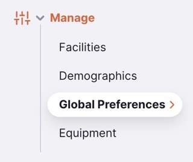
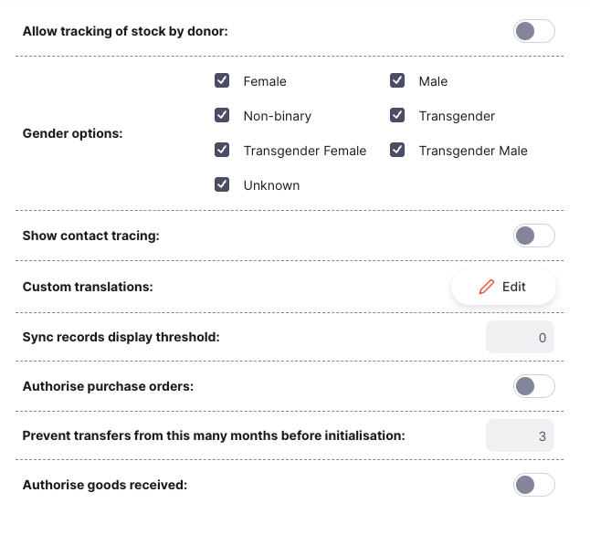

+++
title = "Global Preferences"
description = "Global Preferences Configuration"
date =  2025-05-21
updated = 2025-05-21
draft = false
weight = 2
sort_by = "weight"
template = "docs/page.html"

[extra]
toc = true
top = false
+++

The Global preferences list is available only on the [Open mSupply Central Server](/docs/getting_started/central-server). They are preferences which apply to all Open mSupply sites.

## Viewing Global Preferences

To configure Global Preferences, go to the Global Preferences page under the Manage menu:

You will be presented with the set of currently available Global Preferences:

## Available Preferences

| Preference Name                                                   | Description                                                                                                                                                                                                                                                                                                                                                                                                                                                                           |
| :---------------------------------------------------------------- | :------------------------------------------------------------------------------------------------------------------------------------------------------------------------------------------------------------------------------------------------------------------------------------------------------------------------------------------------------------------------------------------------------------------------------------------------------------------------------------ |
| **Allow tracking of stock by donor**                              | Adds a donor column to stock management screens. This allows you to track which donor a stock item is from.                                                                                                                                                                                                                                                                                                                                                                           |
| **Gender options**                                                | The gender options available for clinicians and patients. This defines the options shown in gender filters and which can be assigned to clinicians and patients.                                                                                                                                                                                                                                                                                                                      |
| **Show contact tracing**                                          | Enables the [Contact Tracing](/docs/programs/program-module/#contact-tracing) feature for Patients                                                                                                                                                                                                                                                                                                                                                                                    |
| **Custom Translations**                                           | Configure overrides for terms used throughout the application.                                                                                                                                                                                                                                                                                                                                                                                                                        |
| **Sync records display threshold**                                | The number of sync records that will need to be pending before showing an indicator over the Sync menu item                                                                                                                                                                                                                                                                                                                                                                           |
| **Authorise purchase orders**.                                    | Whether the purchase order process includes an authorisation step                                                                                                                                                                                                                                                                                                                                                                                                                     |
| **Prevent transfers from this many months before initialisation** | When migrating older mSupply Desktop & mobile sites to Open mSupply this preference can prevent the generation of hundreds of locked inbound shipments. Open mSupply will not create `Picked` status inbound shipments corresponding to outbound shipments from supplier's stores that were picked this many months before the date the site was initialised. Similarly, it will not make customer requisitions for internal orders finalised this many months before initialisation. |
| **Authorise goods received**                                      | Whether the goods receiving process includes an authorisation step                                                                                                                                                                                                                                                                                                                                                                                                                    |
| **Item margin overrides supplier margin**                         | Give priority to the item margin on the receiving store over the supplier's margin if both are configured when receiving an inbound shipment.                                                                                                                                                                                                                                                                                                                                         |

### Average Monthly Consumption (AMC)

The `Average Monthly Consumption` preferences allow you to customise the item consumption calculation for your stores.

The base calculation is: **(Consumption / Lookback months) \* Lookback days / (Lookback days - Days out of stock)**

You can adjust how the calculation works using the following preferences:

| Preference Name                             | Description                                                                                                                                                        |
| :------------------------------------------ | :----------------------------------------------------------------------------------------------------------------------------------------------------------------- |
| **Adjust for number of days out of stock:** | Exclude days where the item was out of stock from the AMC calculation. If the day ended with a balance of 0 for the item, this is counted as one day out of stock. |
| **Days in a month:**                        | The number of days per month used in the AMC calculation. If no value is provided, the default is used (average days per month = 30.4375).                         |

[Lookback months](https://docs.msupply.org.nz/other_stuff:virtual_stores#preferences_tab) are configurable per store in mSupply with the `Monthly consumption look back period` preference. The default setting is 3 months.

Lookback days are calculated as `Days in a month * Lookback months`.

 If you are using any plugins that exclude transfers from the AMC calculation, then your calculation will be (consumption - transfers).

### Custom translations

The `Custom translations` preference allows you to override specific terms used in the application. This is useful for localisation (or even localization!) or to adapt terminology to your specific context.

Use this feature carefully. It can lead to confusion if terms do not match our documentation, or if they are not consistent across the application.

You can search by any text you see within the application, or if you know the translation key, you can search by that as well:

Select the translation you want to change, and then enter the new text in the input field:

Some translations include variables, which will be replaced with the appropriate values when they are used. You can move these variables around within the text, but ensure you keep them intact, so the messages continue to make sense. Variables are enclosed in double curly braces, like this: `{{variable_name}}`.

For translations that include number-based variables, we also support pluralisation. If you select one of these translations, you will see both `_one` and `_other` translations are added. Make sure you provide the correct text for both cases:

