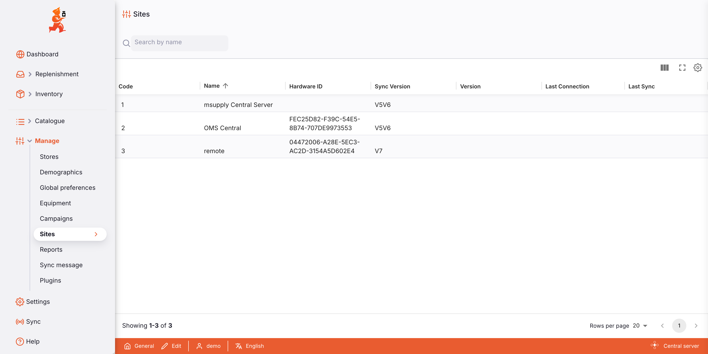
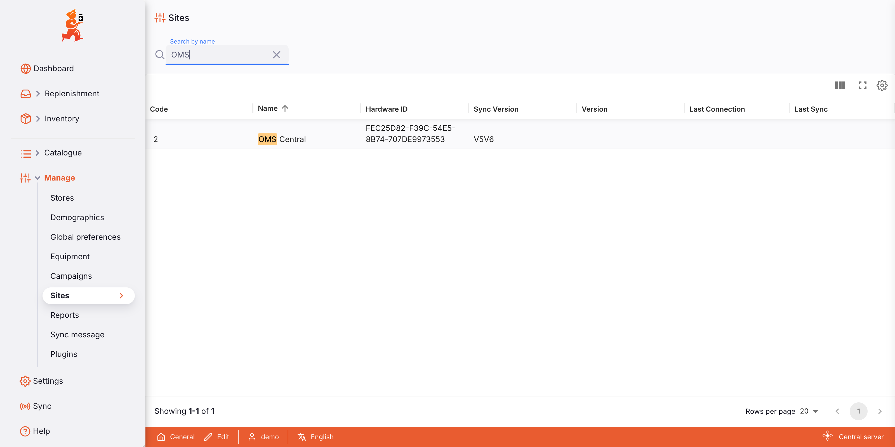
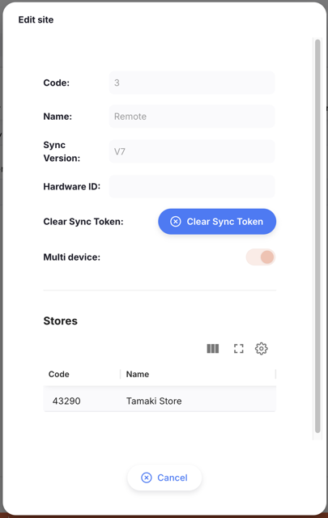
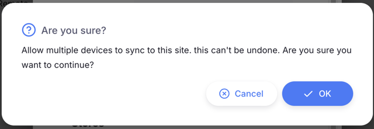

+++
title = "Sites"
description = "Manage sites that sync to the central server"
date = 2026-07-13T09:30:00+00:00
updated = 2026-07-13T09:30:00+00:00
draft = false
weight = 6
sort_by = "weight"
template = "docs/page.html"

[extra]
toc = true
top = false
+++

The Sites list is available only on the [Open mSupply Central Server](/docs/getting-started/central-server). This is where you can view all the sites that sync to your central server, and manage their settings.

A **site** is a single installation of Open mSupply that syncs to the central server. Each site normally runs on one device and can hold one or more stores.

Sites are still created on the [Legacy mSupply](https://docs.msupply.org.nz/synchronisation:sync_sites) server, and then sync to the central server. There are some settings for sites that you can now manage on the central server.

## Viewing sites

Choose `Manage` > `Sites` in the navigation panel.

You will be presented with a list of the sites that sync to your central server.

The list is divided into columns:

| Column              | Description                                        |
| :------------------ | :------------------------------------------------- |
| **Code**            | The site's code                                    |
| **Name**            | The site's name                                    |
| **Hardware ID**     | Identifies the device currently linked to the site |
| **Sync version**    | The sync version the site is using                 |
| **Version**         | The Open mSupply version running on the site       |
| **Last connection** | When the site last connected to the central server |
| **Last sync**       | When the site last synced its data                 |

1. The list can display a fixed number of sites per page. On the bottom left corner, you can see how many sites are currently displayed on your screen.
2. If you have more sites than the current limit, you can navigate to the other pages by clicking on the page number or using the left or right arrows (bottom right corner).
3. You can also select a different number of rows to show per page using the option at the bottom right of the page.

### Searching sites

You can filter the list of sites by name. This can be useful if you're looking for one particular site!

In the search bar in the top left of your screen, type some (or all) of a site name. The list will now contain all matching sites.

## Site settings

To view a site, click on it in the list. This will open the `Edit Site` window.

The window shows the site's `Code`, `Name`, `Sync version` and `Hardware ID`. From here you can clear the site's hardware ID or sync token, and see the stores assigned to the site. Click `Cancel` to close the window.

### Clearing the hardware ID

Each site is linked to a single device by its hardware ID. If a site needs to move to a different device — for example, the original device was lost or replaced — you can clear the hardware ID so a new device can connect.

Click `Clear hardware ID`, then confirm when prompted. The next device to sync will become the site's device.

### Clearing the sync token

If a site is having trouble syncing, clearing its sync token forces it to re-establish its connection to the central server on the next sync.

Click `Clear sync token`, then confirm when prompted.

The <code>Clear hardware ID</code> and <code>Clear sync token</code> options are only shown for remote sites, and only once the site is using V7 sync.

### Stores on a site

A site holds one or more stores. At the bottom of the `Edit Site` window you'll see the **Stores** assigned to the site.

Store assignments are read-only in Open mSupply — they're shown here for reference. Stores are assigned to sites in Legacy mSupply.

## Multi-device sites

Normally each site in Open mSupply is used by a single device. A **multi-device site** lets several devices sync to the same site at the same time.

This is useful when more than one device needs to work with the same facility's data — most commonly for **cold chain monitoring**, where a facility might have several devices logging temperatures and managing vaccine assets.

A multi-device site carries the data needed for cold chain monitoring — sensors, temperature logs, assets and locations. Stock and logistics data (stock levels, shipments, requisitions, stocktakes, purchase orders, and dispensing) isn't synced to it.

### Turning on multi-device for a site

Multi-device is turned on per site, from the central server.

1. Select the site from the list.
2. Turn on the `Multi device` toggle.
3. Confirm when prompted — _"Allow multiple devices to sync to this site."_

_Confirm the prompt to allow multiple devices to sync to the site._

Turning on multi-device can't be undone. Once a site is set to multi-device it stays that way, so only turn it on when you're sure the site needs it. You can't turn on multi-device for the central server's own site.

### Setting up devices

Once a site is set to multi-device, you can set up more than one device against it. Each device is set up the same way as any other Open mSupply device, using the central server's sync URL, the site name, and the site password. **Use the same site name and password on every device**, as all devices for the site share one login. Once set up, each device syncs down the site's data and is ready to use.

### Using a multi-device site

For everyone using the site:

- Data entered on one device appears on the others after they sync — for example, an asset added on one tablet shows up on the others.
- Each device syncs on its own schedule, so changes appear after the next sync.
- Only the data a multi-device site syncs is shared between devices.

## Permissions & restrictions

Sites are only visible on the [Open mSupply Central Server](/docs/getting-started/central-server).

To change site settings — such as clearing the hardware ID, clearing the sync token, or turning on multi-device — you need the `Can modify central data` permission, enabled in the [omSupply Permissions Tab](https://docs.msupply.org.nz/admin:managing_users?s[]=permission#open_msupply_permissions_tab) on your central store.

