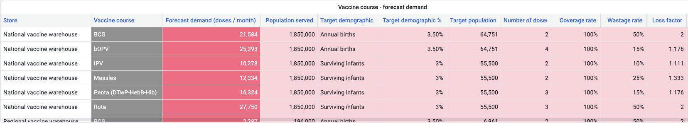

+++
title = "General Plugins"
description = "Plugins designed for any organization"
date = 2024-06-27T18:20:00+00:00
updated = 2024-06-27T18:20:00+00:00
draft = false
weight = 5
sort_by = "weight"
template = "docs/page.html"

[extra]
toc = true
+++

This page provides a list of plugins that are not specific to a particular organization and are therefore suitable for use by any organization. 

## Population-based forecasting for vaccines

The <b>Population-based forecasting for vaccines</b> plugin can be found in our <a href="https://github.com/msupply-foundation/open-msupply-forecasting-plugins" target="_blank">GitHub plugin repository</a>.

#### Overview 
The **Population-based forecasting for vaccines** plugin does three things: 

1. It calculates the `Forecast demand` for vaccines based on the population of each facility
2. It calculates the `Target stock` that each facility should have to service their `Forecast demand`
3. It offers a `Suggested quantity` that should be ordered to maintain the `Target stock` levels

These values are calculated based on the following formulas: 

**Forecast demand**

**Target stock**

**Suggested quantity**

The `Target stock` and `Suggested quantity` are then displayed to the facility user to assist with decision-making while making an order for new stock: 

#### Configuration

In order to provide the `Forecast demand`, the `Target stock` and the `Suggested quantity`, key indicators must be input by the user in the system. 

These include:

- **Country demographics** (see [Manage > Demographics](/docs/manage/demographics))
- Details of the **National Immunization Schedule** (see [Programs > Immunizations](/docs/programs/immunisations/))
- **Population coverage**, **supply interval** and **buffer stock** for each facility (see  [Manage > Store properties](/docs/manage/facilities/#editing-your-store-properties))

#### Notes

**Note 1**: Enabling the **Population-based forecasting for vaccines** plugin will replace the *AMC forecasting method* with the *Population-based forecasting method*. The AMC value will still be displayed to the facility user but the `Suggested quantity` will not use the AMC value to make  its calculations. 

**Note 2**: The `Forecast demand` is made at the [`Vaccine course`](/docs/programs/immunisations/#vaccine-courses) level, not the [`Vaccine item`](/docs/catalogue/items/) level. This also means that the `Target stock` and `Suggested quantity` values apply to the `Vaccine course` level too, not the vaccine item level.

This is important to note because multiple vaccines items may be associated with one vaccine course. Therefore, <i>if an order is being placed for <u>multiple vaccine items associated with the same vaccine course</u> then the system will display the same  `Target stock` and `Suggested quantity` for each vaccine item in that order.</i>

In other words, the system does not take into account stock on order for *other* vaccine items when displaying a `Suggested quantity` for a vaccine item. 

**Note 3**: the `Forecast demand` is not displayed explicitly to the facility user, but the values can be reviewed in the mSupply Dashboard

