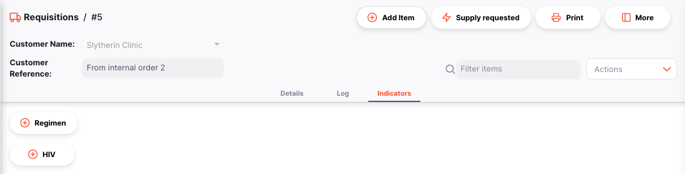
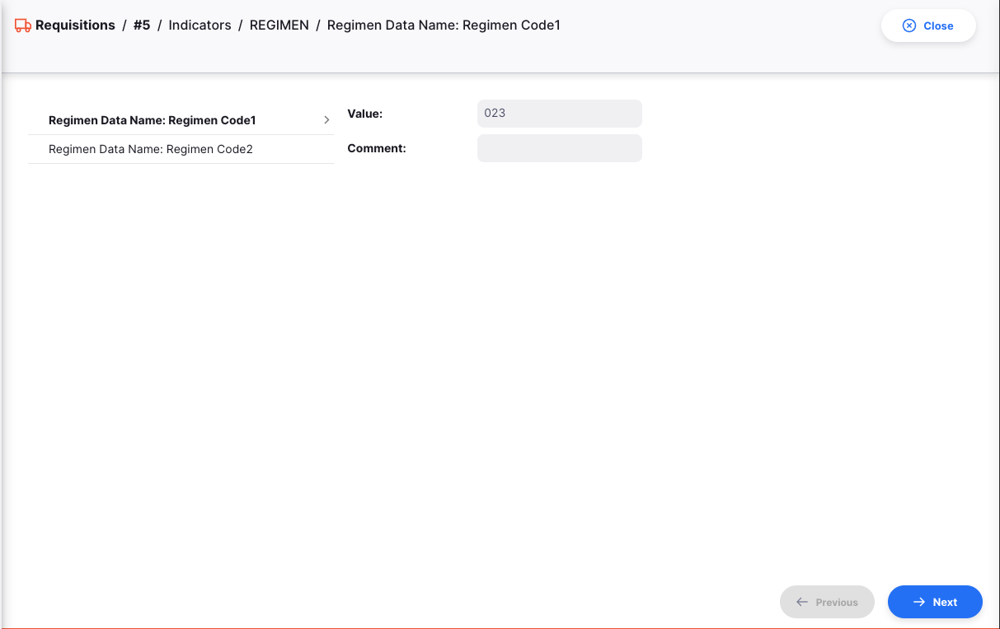

+++
title = "Indicadores de Programa"
description = "Indicadores de Programa"
date = 2023-05-19T00:00:00+00:00
updated = 2023-05-19T00:00:00+00:00
draft = false
weight = 62
sort_by = "weight"
template = "docs/page.html"

[extra]
lead = "Collecting data metrics across mSupply stores"
toc = true
top = false
+++

El término "Indicadores de Programa" se refiere a un conjunto de preguntas configurables que pueden responderse como parte de una requisición de programa. Estas respuestas se registran en el período de la requisición del programa y se utilizan con fines de generación de informes.

## Activación de Indicadores del Programa

Los Indicadores de Programa se configuran en el servidor central de mSupply, siguiendo la documentación disponible [aquí](https://docs.msupply.org.nz/items:programs#adding_indicators_to_a_program).

## Requisiciones Manuales de Clientes

Se pueden realizar requisiciones manuales de clientes a otros almacenes como una alternativa si el almacén de Open mSupply no puede crear una requisición por sí mismo (por ejemplo, si la tableta o computador portátil utilizada por ese almacén deja de funcionar).

El proceso para ingresar los indicadores del programa es el siguiente:

1. Crea una requisición manual a otro almacén como se describe [aquí](/docs/distribution/requisitions/#manual-requisition)
2. Haz clic en la pestaña Indicadores

El indicador "VIH" solo está disponible en programas donde se haya habilitado la opción "VIH".

3. Haz clic en uno de los botones de Indicadores de Programa

Desde aquí puedes ingresar los datos configurados para cada indicador de este programa.
