+++
title = "Programas para Pacientes"
description = "Introduction to Patient Programs"
date = 2023-01-27T00:00:00+00:00
updated = 2023-01-27T00:00:00+00:00
draft = false
weight = 60
sort_by = "weight"
template = "docs/page.html"

[extra]
lead = "Ver y gestionar los programas para pacientes"
toc = true
top = false
+++

Puedes gestionar pacientes por programas en Open mSupply. Esto implica algunas configuraciones especiales. Consulta la sección de [Pacientes](/docs/dispensary/patients) para obtener más información sobre cómo ver y crear pacientes.

Para usar los programas de pacientes, asegúrate de que tu almacén esté configurado en modo `Dispensario` (consulta la documentación sobre [almacenes virtuales](https://docs.msupply.org.nz/other_stuff:virtual_stores#store_type) para saber como hacerlo).

También deberás habilitar la preferencia del almacén para `Open mSupply: Usa el módulo de programas`.
Esta preferencia es compatible con Open mSupply `v1.2.0+` y mSupply `v7-07-00-beta9+`.

Además, necesitas habilitar los permisos de usuario que se muestran a continuación en el servidor central:

Este es un ejemplo de los permisos necesarios para que un usuario visualice y gestione las características específicas del programa. Los permisos requeridos pueden variar según tus configuraciones.

El módulo de programas para pacientes es altamente personalizable y puede verse diferente dependiendo de tus configuraciones. Contacta a tu administrador para personalizaciones.

### Lista de Pacientes

Se añadirá una nueva columna llamada `Inscripciones en Programas` a la lista de pacientes para mostrar los programas en los que está inscrito el paciente, si el módulo de programas de pacientes ha sido habilitado.

#### Ver un Paciente

La página de detalles de un paciente incluye cinco pestañas:

1. **Detalles del Paciente**: Esta pestaña contiene los datos del paciente.

La página de detalles del paciente puede verse muy diferente a la estándar. Esta vista es altamente personalizable y puede adaptarse a necesidades específicas. Contacta a tu administrador si deseas personalizar esta vista.

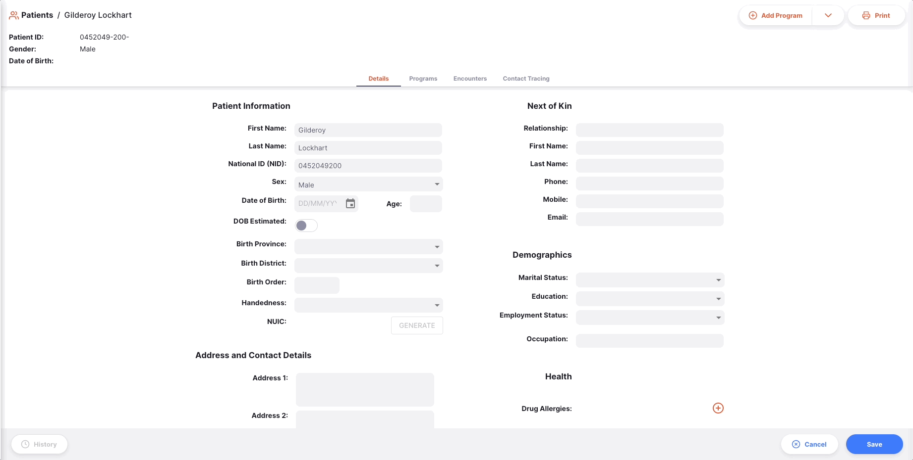

También hay un botón de `Historial` en la esquina inferior izquierda de la página de detalles del paciente. Al hacer clic en este botón, se mostrará un historial simple de los cambios realizados en el registro del paciente.

2. **Programas**: Esta pestaña muestra los programas en los que está inscrito el paciente.

Hacer clic en un programa llevará a los detalles de la inscripción del paciente en ese programa. Consulta [Inscripción en Programas](/docs/programs/program-module/#program) para más información.

Esta pestaña muestra cinco columnas:

| Columna                   | Descripción                                                                        |
| :------------------------ | :--------------------------------------------------------------------------------- |
| **Programa**              | El nombre del programa                                                             |
| **ID de inscripción**     | El ID del paciente en el programa                                                  |
| **Información Adicional** | Información específica del programa, por ejemplo, LTFU (Perdido en el seguimiento) |
| **Estado del Programa**   | El estado del programa                                                             |
| **Fecha de Inscripción**  | La fecha en que el paciente se inscribió en el programa                            |

3. **Encuentros**: Esta pestaña muestra los encuentros que el paciente ha tenido.

Hacer clic en un encuentro llevará a los detalles de dicho encuentro. Consulta [Encuentros](/docs/programs/program-module/#encounter) para más información.

Esta pestaña muestra seis columnas:

| Columna                   | Descripción                                                                                                             |
| :------------------------ | :---------------------------------------------------------------------------------------------------------------------- |
| **Tipo**                  | El tipo de encuentro                                                                                                    |
| **Programa**              | El programa asociado al encuentro                                                                                       |
| **Fecha**                 | La fecha de la cita del encuentro                                                                                       |
| **Inicio**                | La hora de inicio de la cita del encuentro                                                                              |
| **Fin**                   | La hora de finalización de la cita del encuentro                                                                        |
| **Información Adicional** | Información adicional sobre el encuentro, por ejemplo, _Encuentro Programado_ significa que la cita ha sido programada. |

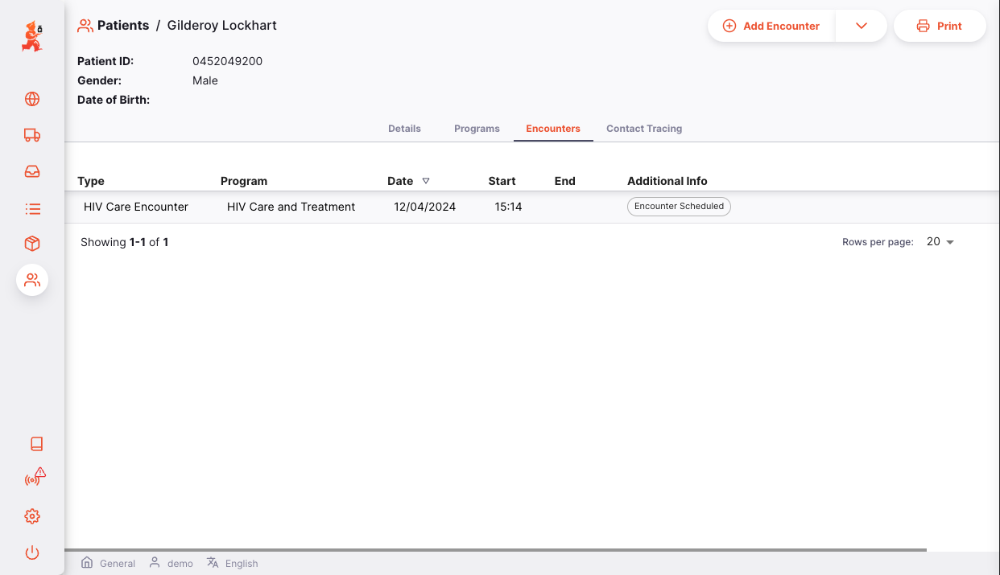

4. **Rastreo de Contactos**: Esta pestaña muestra la información de rastreo de contactos del paciente.

Hacer clic en un contacto llevará a los detalles de dicho contacto. Consulta [Rastreo de Contactos](/docs/programs/program-module/#contact-tracing) para más información

Esta pestaña muestra siete columnas:

| Columna               | Descripción                                 |
| :-------------------- | :------------------------------------------ |
| **Programa**          | El nombre del programa asociado al contacto |
| **Fecha de Creación** | La fecha en que se creó el contacto         |
| **Nombre**            | Nombre del contacto                         |
| **Apellido**          | Apellido del contacto                       |
| **Género**            | Género del contacto                         |
| **Relación**          | Relación del contacto con el paciente       |
| **Edad**              | Edad del contacto                           |

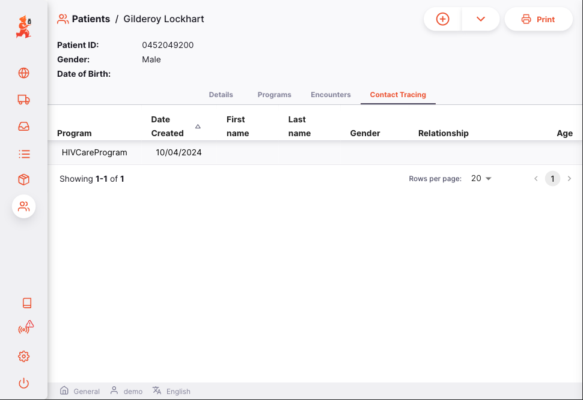

5. **Vacunas**: Esta pestaña muestra la lista de Programas de Inmunización en los que está inscrito el paciente

Hacer clic en un Programa de Inmunización llevará a la Tarjeta de Vacunación del paciente para ese programa. Consulta [Tarjetas de Vacunación](/docs/programs/program-module/#vaccination-cards) para más información.

Esta pestaña muestra cuatro columnas:

| Columna                  | Descripción                                             |
| :----------------------- | :------------------------------------------------------ |
| **Programa**             | El nombre del programa                                  |
| **ID de Inscripción**    | El ID del paciente en el programa                       |
| **Estado del Programa**  | El estado del programa                                  |
| **Fecha de Inscripción** | La fecha en que el paciente se inscribió en el programa |

### Program

Los pacientes pueden inscribirse en un programa relevante para su condición de salud. Un paciente puede estar inscrito en múltiples programas.

#### Inscribir a un paciente en un programa

Para inscribir a un paciente en un programa, haz clic en el botón `Agregar Programa` en la esquina superior derecha de la pantalla o selecciona la opción `Agregar Programa` haciendo clic en la flecha desplegable junto al botón, si este no muestra directamente la opción `Agregar Programa`. parecerá una nueva ventana para seleccionar el programa en el que deseas inscribir al paciente. Los programas en los que el paciente ya está inscrito aparecerán deshabilitados.

Después de seleccionar el programa, aparecerá otra ventana para ingresar información específica del programa.

En este ejemplo, estamos inscribiendo al paciente en el Programa de Atención y Tratamiento del VIH.

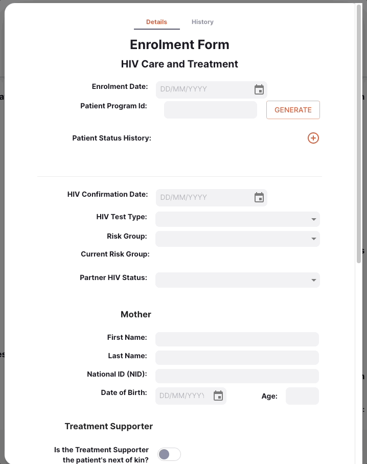

### Encuentro

Un encuentro es una visita registrada del paciente y su tratamiento dentro de un programa específico.

#### Ver la Lista de Encuentros

Ve a `Dispensario` > `Encuentros` para ver la lista de encuentros.

La lista de encuentros se divide en 8 columnas:

| Columna                   | Descripción                                                                                                                                         |
| :------------------------ | :-------------------------------------------------------------------------------------------------------------------------------------------------- |
| **Tipo**                  | El tipo de encuentro                                                                                                                                |
| **Programa**              | El programa al que está asociado el encuentro                                                                                                       |
| **Fecha**                 | La fecha de la cita del encuentro                                                                                                                   |
| **Inicio**                | La hora de inicio de la cita del encuentro                                                                                                          |
| **Fin**                   | La hora de finalización de la cita del encuentro                                                                                                    |
| **Paciente**              | El paciente al que está asociado el encuentro                                                                                                       |
| **Información adicional** | Muestra información adicional sobre el encuentro. Por ejemplo, _Encuentro Programado_ significa que la cita para este encuentro ha sido programada. |
| **Estado**                | El estado del encuentro                                                                                                                             |

Al hacer clic en un encuentro, serás dirigido a los detalles del mismo.

#### Agregar un Encuentro

Para agregar un Encuentro para el paciente, haz clic en el botón `Agregar Encuentro` en la esquina superior derecha de la pantalla. Si el botón no dice `Agregar Encuentro` , haz clic en la flecha hacia abajo junto al botón y selecciona `Agregar Encuentro`.

Se abrirá una ventana donde podrás seleccionar el tipo de encuentro (esta selección variará según los programas en los que esté inscrito el paciente), la fecha de la visita, el médico tratante y agregar notas para este encuentro.

En el siguiente ejemplo, estamos creando un Encuentro de Cuidado del VIH

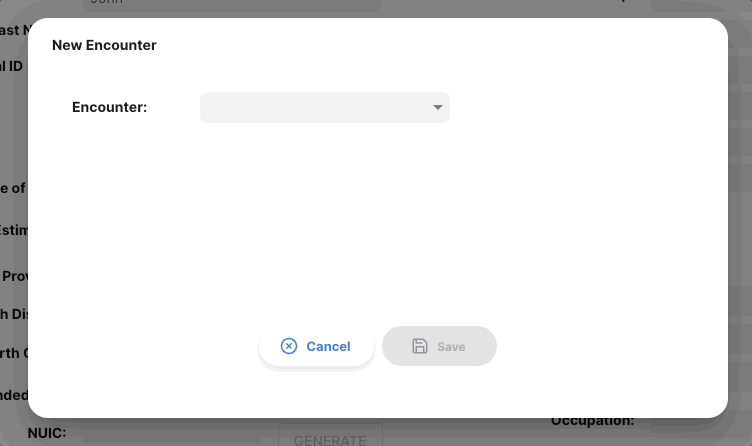

Si el encuentro es dentro de la última hora, serás redirigido a la página del encuentro. De lo contrario, serás redirigido a la pestaña de encuentros en la vista de detalles del paciente.

Cada documento de encuentro será diferente, pero hay algunas características comunes:

- La parte superior de cada encuentro contendrá detalles comunes del encuentro. Algunos de estos detalles pueden ser editables, como _Médico Tratante_ and _Fecha y Hora de la Visita_.

Un encuentro puede tener tres estados:

- **Pendiente**: El encuentro ha sido programado pero aún no se ha completado.
- **Visitado**: El encuentro ha sido completado.
- **Cancelado**: El encuentro ha sido cancelado.

- El panel lateral (que se abre al hacer clic en `Más` en la esquina superior derecha) contendrá información adicional, como encuentros anteriores.

En este ejemplo, estamos viendo el Encuentro de Cuidado del VIH

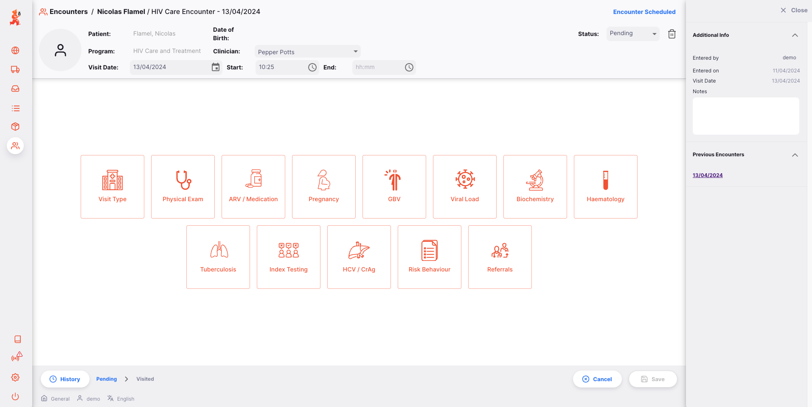

  Los Encuentros del Programa de Inmunización tendrán una pestaña adicional llamada <code>Vacunas</code>, que muestra la Tarjeta de Vacunación del paciente para ese programa. Consulta <a href='#vaccination-encounters'>Encuentros de Vacunación</a> para más información

### Rastreo de contactos

El rastreo de contactos es el proceso de identificar a las personas que podrían haber estado expuestas a una enfermedad a través del paciente. Posteriormente, se puede contactar a estas personas, registrarlas e inscribirlas en un programa correspondiente si es necesario.

#### Agregar un contacto

Para agregar un contacto para un paciente, haz clic en el botón `Agregar contacto` en la esquina superior derecha de la pantalla. Haz clic en la flecha hacia abajo junto al botón y selecciona `Agregar contacto` si el botón no muestra esa opción.

Se abrirá una ventana que te invitará a seleccionar el tipo de contacto que deseas agregar. Actualmente, solo está disponible la opción de prueba de parejas para VIH. Haz clic en "Aceptar" para continuar.

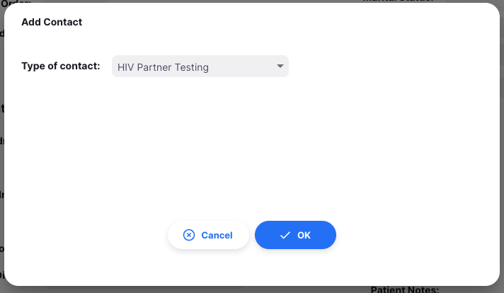

#### Editar un Contacto

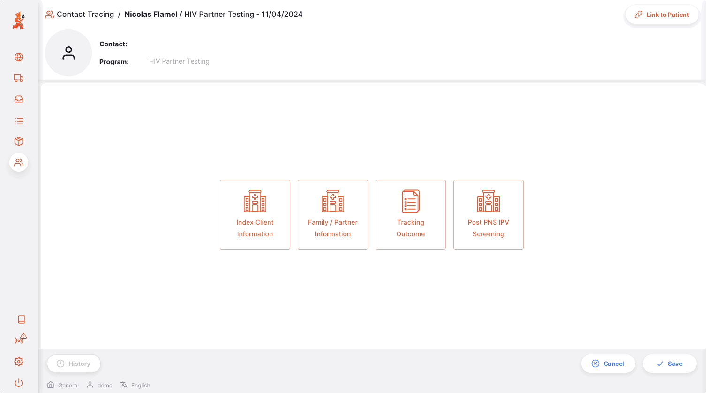

#### Vincular un contacto a un paciente

Una vez que un contacto ha sido agregado a mSupply, se puede vincular al paciente que estuvo en contacto con él. Para hacerlo, haz clic en el botón `Vincular al Paciente` en la esquina superior derecha de la pantalla.

Esto abrirá una ventana de búsqueda donde podrás buscar al paciente por su nombre, apellido o ID de paciente. Una vez que encuentres al paciente, haz clic sobre él para vincularlo al contacto.

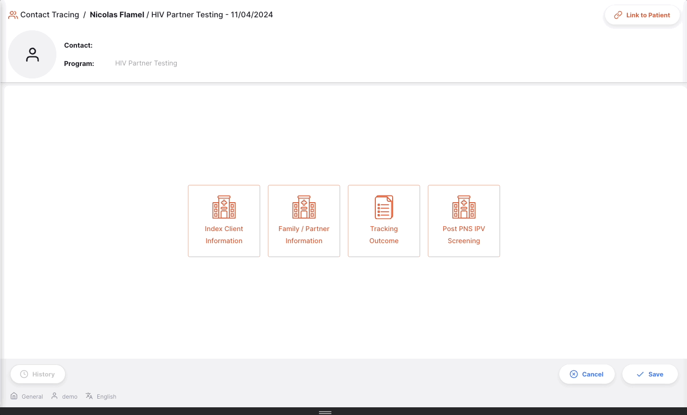

Si el paciente ya está vinculado al contacto, pero deseas cambiarlo porque vinculaste al paciente incorrecto, haz clic en el botón `Desvincular Paciente` en la esquina superior derecha de la pantalla.

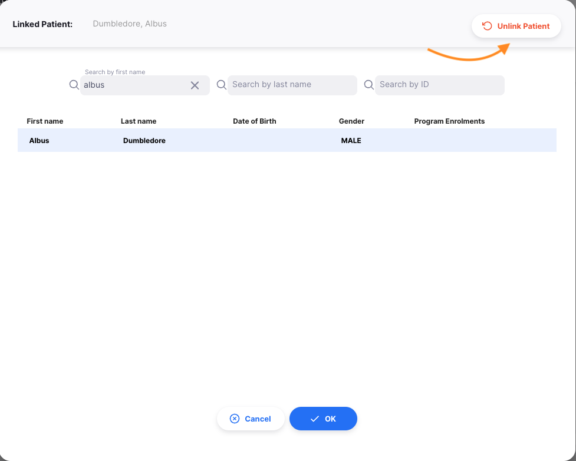

### Tarjetas de vacunación

Si el paciente está inscrito en un Programa de Inmunización, puedes ver su progreso en el programa consultando su Tarjeta de Vacunación.

  La Tarjeta de Vacunación solo puede ser vista desde la instalación donde el paciente se inscribió en el programa. Si el paciente se inscribió en el programa en una instalación diferente, no podrás ver su Tarjeta de Vacunación.

Desde la pestaña `Vacunas` en la vista de detalles del paciente, selecciona el Programa de Inmunización que deseas consultar.

Serás redirigido a la Tarjeta de Vacunación del paciente para ese programa.

La Tarjeta de Vacunación incluye las siguientes columnas:

| Columna            | Descripción                                                                                                                              |
| :----------------- | :--------------------------------------------------------------------------------------------------------------------------------------- |
| **Edad**           | La edad mínima que debe tener el paciente para recibir la dosis                                                                          |
| **Dosis**          | El nombre de la dosis                                                                                                                    |
| **Estado**         | El estado de la vacuna (ver abajo)                                                                                                       |
| **Fecha sugerida** | La fecha recomendada más temprana para administrar la dosis (basada en la edad del paciente y el intervalo mínimo desde su última dosis) |
| **Fecha aplicada** | La fecha en que se registró la vacuna                                                                                                    |
| **Lote**           | El lote del artículo de vacuna administrado al paciente                                                                                  |
| **Instalación**    | La Ubicación donde se administró la vacunación                                                                                           |

**Estados de vacunación:**

- **Administrada**: El paciente ha recibido la vacuna
- **No administrada**: El paciente no ha recibido la vacuna (por ejemplo, la rechazó o no había stock disponible)
- **Pendiente**: El paciente es elegible para esta dosis; ha recibido la dosis anterior y supera la edad mínima
- **Atrasada**: El paciente supera la edad máxima recomendada para esta dosis

Para ver los detalles de una vacunación específica, haz clic en esa fila de la tarjeta. Esto abrirá una nueva ventana con toda la información de la vacunación.

    

 

Ten en cuenta que solo las filas donde se haya registrado una vacunación (como `Administrada` o `No administrada`) serán clicables en esta vista. Las nuevas vacunaciones se administran dentro de un encuentro.

#### Encuentros de Vacunación

Los encuentros del Programa de Inmunización tendrán una pestaña adicional llamada `Vacunas`, que muestra la misma tarjeta de vacunación que en la vista del paciente mencionada anteriormente. Sin embargo, también se pueden administrar nuevas dosis dentro del encuentro.

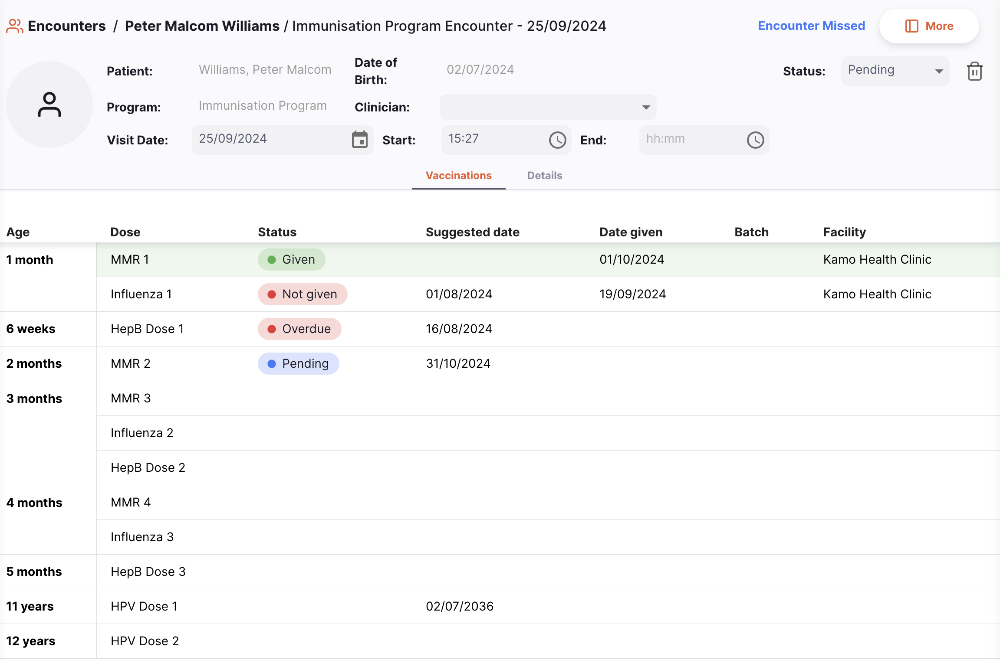

#### Agregar Registros de Vacunación

Para agregar un nuevo registro de vacunación, haz clic en la fila de la tarjeta de vacunación que corresponde a la dosis que deseas administrar. Solo puedes agregar registros de vacunación para una dosis si la dosis anterior en ese esquema de vacunación ha sido marcada como `Administrada`. Las filas para dosis futuras estarán deshabilitadas.

Al hacer clic en la fila de la dosis, se abrirá una nueva ventana donde podrás ingresar los detalles de la vacunación.

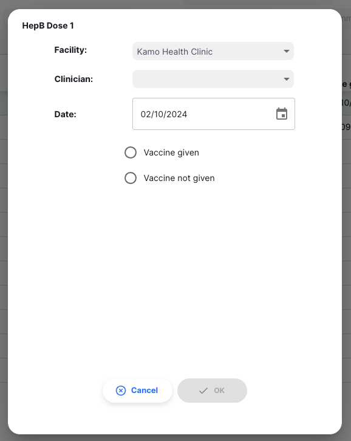

A continuación, repasemos cada sección:

- `Instalación`: estará pre-rellenada con la instalación en la que estás registrado. Esto puede cambiarse si la vacunación se administró en otra instalación.

- `Médico`: estará pre-rellenado con el médico asociado al encuentro, si se seleccionó. Puede cambiarse si la vacunación fue administrada por otro médico. Este campo no estará disponible para vacunaciones registradas en instalaciones marcadas como `Otras`.

- `Fecha`: por defecto será la fecha de hoy, pero puede modificarse para agregar registros históricos de vacunación según sea necesario.

- `Administrada`/`No administrada`: dependiendo de si seleccionas `Vacuna administrada` o `Vacuna no administrada`, aparecerán campos adicionales.

- `Item de vacuna` y `Lote`: si seleccionas `Vacuna administrada`, podrás seleccionar el `Item` y `Lote` de la vacuna administrada. Si solo hay un ítem/lote disponible, estos campos estarán pre-rellenados. De lo contrario, podrás seleccionarlos de un menú desplegable.

Ten en cuenta que si seleccionas una instalación marcada como `Otra instalación`, no tendrás la opción de seleccionar un ítem y un lote.

Si seleccionas una `Fecha` en el pasado, aparecerá un interruptor para `Registrar transacción de stock para vacunación pasada`.

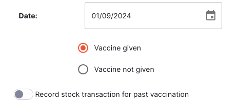

Activa esta opción si deseas registrar una transacción de stock para esta vacunación (ver más detalles abajo). Esto habilitará los campos de ítem y lote.

- `Motivo`: Si seleccionas `Vacuna no administrada`, podrás seleccionar un motivo por el cual la vacuna no fue administrada.

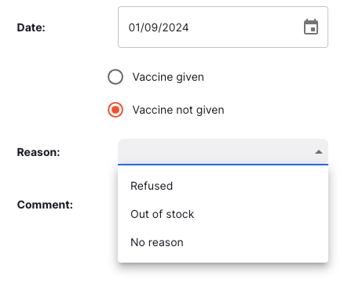

- `Comentario`: también está disponible un campo opcional para cualquier observación o nota sobre la vacunación.

Cuando estés satisfecho con los cambios, puedes hacer clic en el botón Aceptar para guardar el registro de vacunación. Si deseas descartar los cambios, haz clic en el botón Cancelar.

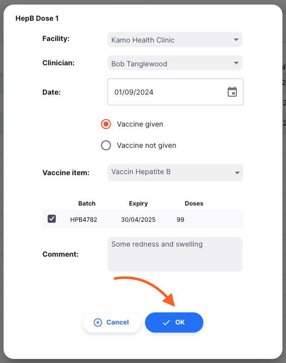

Si se seleccionaron un ítem y un lote de vacuna, el sistema creará y finalizará automáticamente una [Prescripción](/docs/dispensary/prescriptions). Las prescripciones se generan para cada registro de vacunación con el fin de rastrear el uso de inventario.

Ten en cuenta que la prescripción siempre se creará con la fecha de hoy, independientemente de la fecha seleccionada para la vacunación.

Puedes ver la prescripción creada haciendo clic nuevamente en la fila de la dosis en el registro de vacunación. Si se generó una prescripción, verás un enlace `Ver prescripción` en el cuadro de información en la parte superior de la ventana.

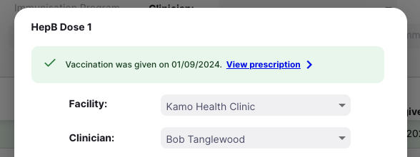

#### Editar Registros de Vacunación

Los registros de vacunación deben ingresarse en el momento de la vacunación, por lo que no debería ser necesario editarlos. Sin embargo, si necesitas corregir un error, puedes hacerlo haciendo clic en la fila de la tarjeta de vacunación que corresponde a la dosis que deseas editar, para abrir la ventana de edición.

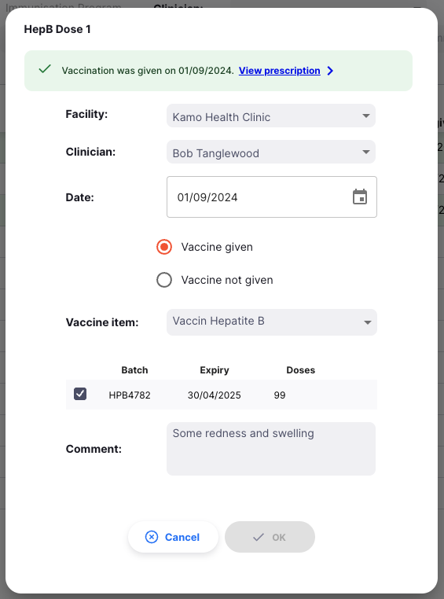

Todos los campos son editables. Algunas cosas importantes a tener en cuenta:

- Cambiar la fecha no modificará la fecha de la prescripción.
- Si cambias de `Administrada` a `No administrada`, y anteriormente se creó una prescripción a partir de la vacunación, tendrás la opción de `revertir la transacción de stock existente`
  - Si se habilita, se creará una [Devolución de Cliente](/docs/distribution/customer-returns) para el ítem de vacuna que fue administrado previamente (ten en cuenta que la prescripción continuará existiendo, ya que las prescripciones finalizadas no pueden eliminarse).

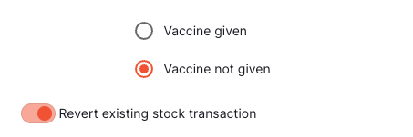

- Si cambias el ítem o lote, y anteriormente se creó una prescripción a partir de la vacunación, tendrás la opción de ` actualizar las transacciones de stock`. Si se habilita:
  - Una [Devolución de Cliente](/docs/distribution/customer-returns) para el ítem de vacuna que fue administrado previamente
  - Una [Prescripción](/docs/dispensary/prescriptions) para el nuevo ítem/lote de vacuna
  - Ten en cuenta que la prescripción anterior continuará existiendo, ya que las prescripciones finalizadas no pueden eliminarse

