+++
title = "Patient Programs"
description = "Introduction to Patient Programs"
date = 2023-01-27
updated = 2023-01-27
draft = false
weight = 60
sort_by = "weight"
template = "docs/page.html"

[extra]
lead = "View and Manage Patient Programs"
toc = true
top = false
+++

You can manage Patients by programs in Open mSupply. This involves some special settings. Please see [Patients](/docs/dispensary/patients) for more information on how to view and create patients.

To use Patient Programs, ensure that your store is set to `Dispensary` mode (see the [virtual stores](https://docs.msupply.org.nz/other_stuff:virtual_stores#store_type) documentation for how to do this).

You will also need to enable the store preference for `Open mSupply: Uses program module`.
This preference is compatible with Open mSupply `v1.2.0+` and mSupply `v7-07-00-beta9+`.

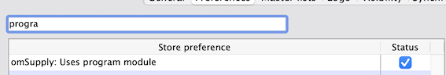

You will also need to enable the user permissions shown below on the central server:

This is an example of the permissions required for a user to view and manage program specific features. The permissions required may vary depending on your configurations.

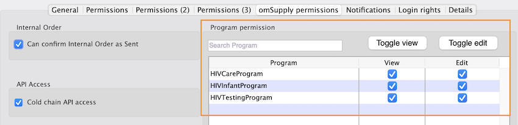

The Patient Programs module is highly customisable and may look different depending on your configurations. Please contact your administrator for customisations.

### Patients List

A new column named `Program Enrolments` will be added to the patient list to show the programs that the patient is enrolled in if the patient programs module has been enabled.

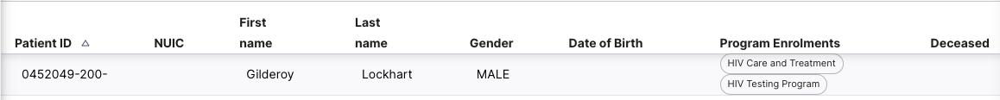

#### Viewing a Patient

There are five tabs on the patient detail page:

1. **Patient Details**: This tab contains the patient details.

The patient detail page will look very different from the standard patient detail page. This view is highly customisable and can be tailored to specific needs. Please contact your administrator if you would like to customise this view.

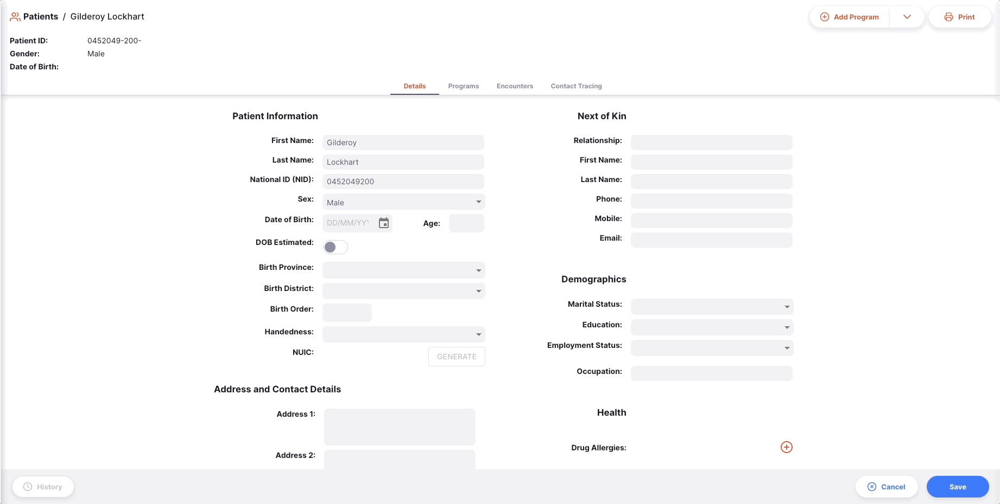

There is also a `History` button on the bottom left corner of the patient detail page. Clicking on this button will show you a simple history of changes made to the patient record.

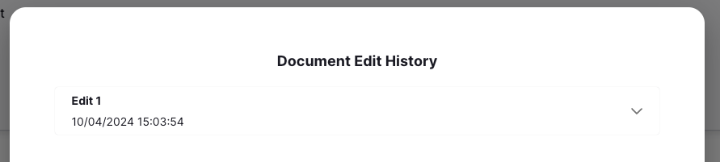

2. **Programs**: This tab contains the programs that the patient is enrolled in.

Clicking on a program will take you to the patient's program enrolment details. See [Program Enrolment](/docs/programs/program-module/#program) for more information.

This program tab will display 5 columns:

| Column                   | Description                                                          |
| :----------------------- | :------------------------------------------------------------------- |
| **Program**              | The name of the program                                              |
| **Enrolment Patient ID** | The patient's program ID                                             |
| **Additional Info**      | Displays program specific information. E.g. _LTFU_ lost to follow up |
| **Program Status**       | The status of the program                                            |
| **Enrolment Date**       | The date the patient was enrolled in the program                     |

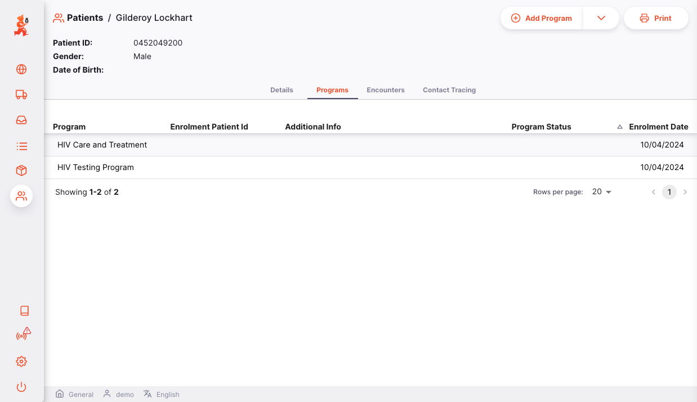

3. **Encounters**: This tab contains the encounters that the patient has had.

Clicking on an encounter will take you to the encounter details. See [Encounter](/docs/programs/program-module/#encounter) for more information.

This encounters tab will display 6 columns:

| Column              | Description                                                                                                                                       |
| :------------------ | :------------------------------------------------------------------------------------------------------------------------------------------------ |
| **Type**            | The encounter type                                                                                                                                |
| **Program**         | The program the encounter is associated with                                                                                                      |
| **Date**            | The date of the encounter appointment                                                                                                             |
| **Start**           | The start time of the encounter appointment                                                                                                       |
| **End**             | The end time of the encounter appointment                                                                                                         |
| **Additional Info** | Displays additional information about the encounter. E.g. _Encounter Scheduled_ means that the appointment for this encounter has been scheduled. |

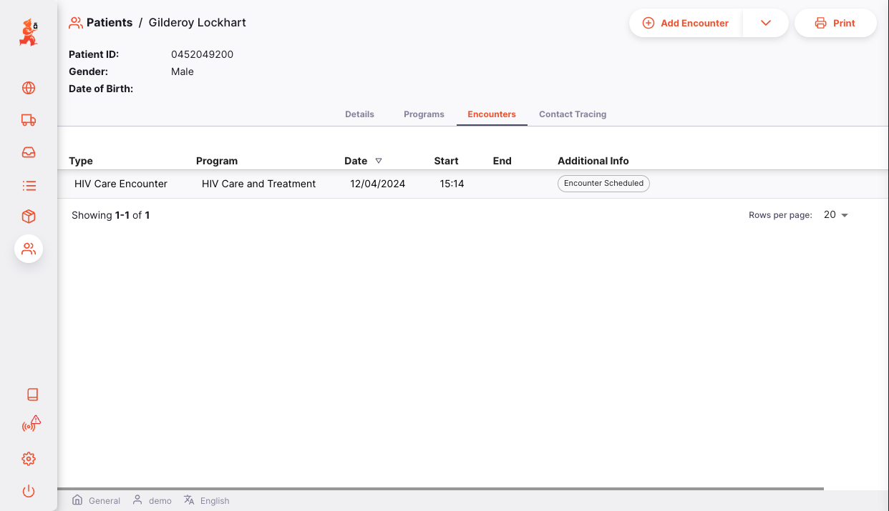

4. **Contact Tracing**: This tab contains the contact tracing information for the patient.

Clicking on a contact will take you to the contact details. See [Contact Tracing](/docs/programs/program-module/#contact-tracing) for more information.

This contact tracing tab will display 7 columns:

| Column           | Description                                             |
| :--------------- | :------------------------------------------------------ |
| **Program**      | The name of the program this contact is associated with |
| **Date Created** | The date the contact was created                        |
| **First name**   | First name of the contact                               |
| **Last name**    | Last name of the contact                                |
| **Gender**       | Gender of the contact                                   |
| **Relationship** | The relationship of the contact to the patient          |
| **Age**          | The age of the contact                                  |

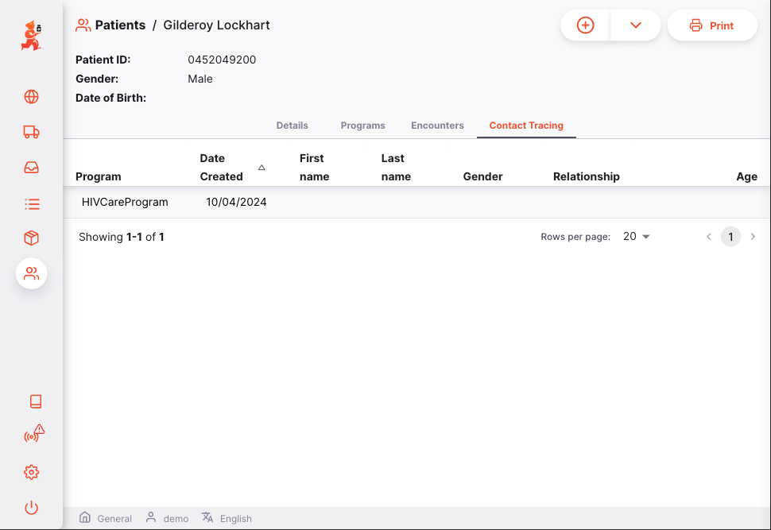

5. **Vaccinations**: This tab contains the list of Immunization Programs that the patient is enrolled in.

Clicking on an Immunization Program will take you to the patient's Vaccination Card for that program. See [Vaccination Cards](/docs/programs/program-module/#vaccination-cards) for more information.

This Vaccinations tab will display 4 columns:

| Column                   | Description                                      |
| :----------------------- | :----------------------------------------------- |
| **Program**              | The name of the program                          |
| **Enrolment Patient ID** | The patient's program ID                         |
| **Program Status**       | The status of the program                        |
| **Enrolment Date**       | The date the patient was enrolled in the program |

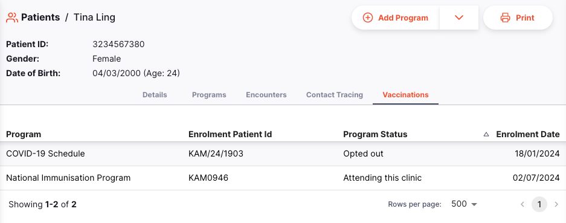

### Program

Patients can be enrolled in a program that is relevant to their health condition. A patient can be enrolled in multiple programs.

#### Enrolling a Patient in a Program

To enrol a patient in a program, click on the `Add Program` button in the top right corner of the screen or click the down arrow next to the button and select `Add Program` if the button does not say `Add Program`. A new window will appear for you to select the program you want to enrol the patient in. Programs that the patient is already enrolled in will be greyed out.

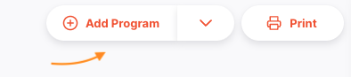

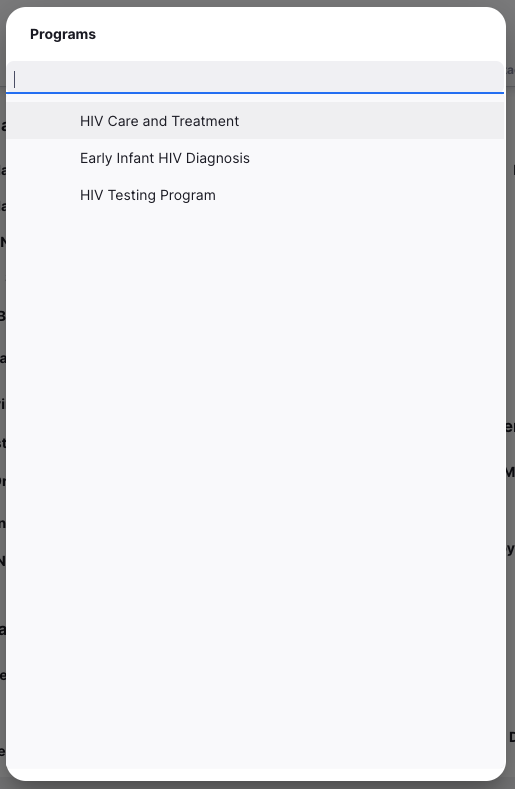

After selecting the program, another window will appear for you to enter program specific information.

In this example, we are enrolling the patient into the HIV Care and Treatment Program.

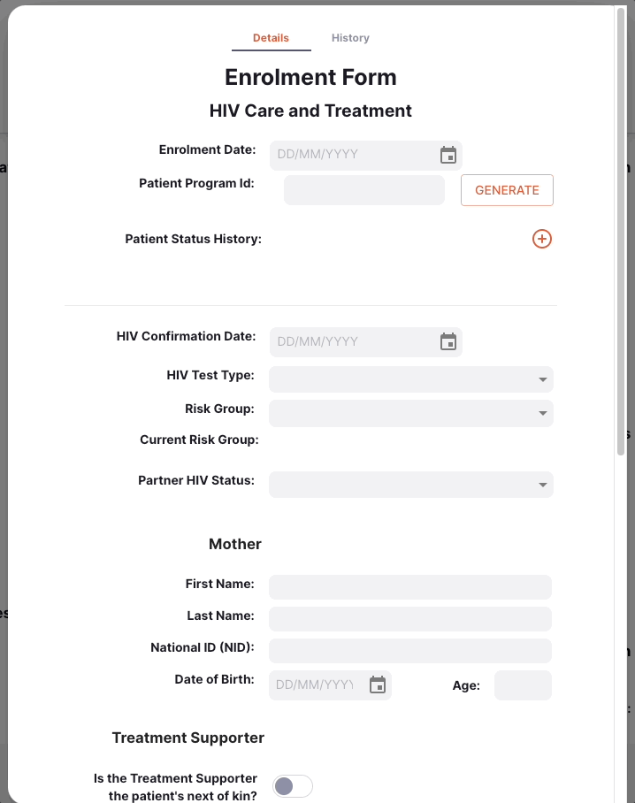

### Encounter

An Encounter is a recorded visit of the patient and their treatment under a specific program.

#### Viewing the Encounter List

Go to `Dispensary` > `Encounters` to view the list of encounters.

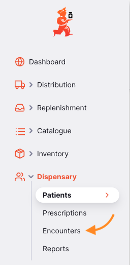

The list of encounters is divided into 8 columns:

| Column              | Description                                                                                                                                       |
| :------------------ | :------------------------------------------------------------------------------------------------------------------------------------------------ |
| **Type**            | The encounter type                                                                                                                                |
| **Program**         | The program the encounter is associated with                                                                                                      |
| **Date**            | The date of the encounter appointment                                                                                                             |
| **Start**           | The start time of the encounter appointment                                                                                                       |
| **End**             | The end time of the encounter appointment                                                                                                         |
| **Patient**         | The patient the encounter is associated with                                                                                                      |
| **Additional Info** | Displays additional information about the encounter. E.g. _Encounter Scheduled_ means that the appointment for this encounter has been scheduled. |
| **Status**          | The status of the encounter                                                                                                                       |

Clicking on an encounter will take you to the encounter details.

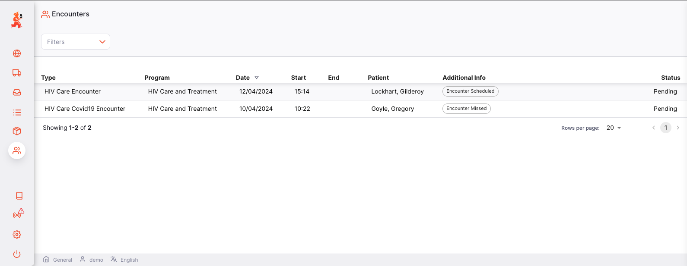

#### Add an Encounter

To add an Encounter for the patient, click the `Add Encounter` button on the top right corner of the screen. Click on the down arrow next to the button and select `Add Encounter` if the button does not say `Add Encounter`.

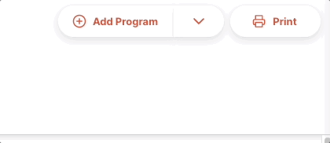

A window will open for you to select the encounter (this selection will vary depending on what programs the patient is enrolled in), visit date, clinician and add notes for this encounter.

In the below example, we are creating a HIV Care Encounter

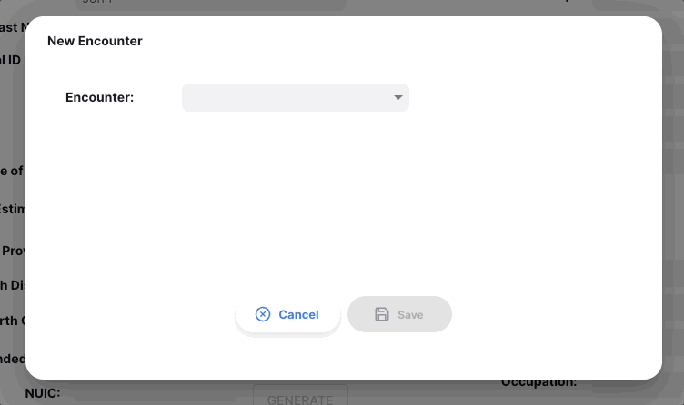

If the encounter is within the last hour, then you will be re-directed to the encounter page, otherwise, you will be re-directed to the encounter tab in the patient detail view.

Every encounter document will look differently, however there are some common features:

- The top of every encounter will contain common encounter details. Some of these details may be editable like _Clinician_ and _Visit Date and Time_.

An encounter can have three statuses:

- **Pending**: The encounter has been scheduled but not yet completed.
- **Visited**: The encounter has been completed.
- **Cancelled**: The encounter has been cancelled.

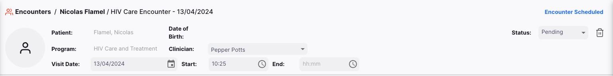

- The side panel (opened by clicking `More` on the top right corner) will contain additional information such as previous encounters.

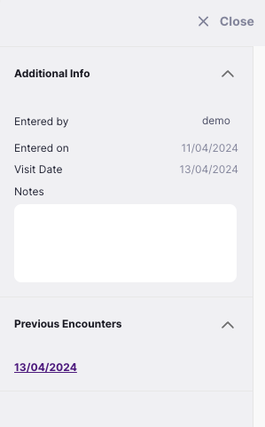

In this example, we are viewing the HIV Care Encounter

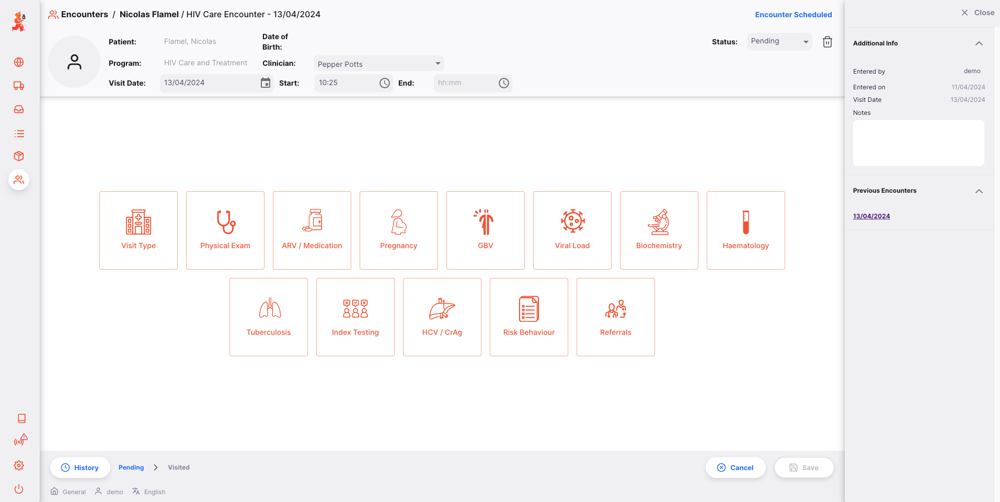

  Immunization Program Encounters will have an additional <code>Vaccinations</code> tab, which displays the patient's Vaccination Card for that program. See <a href='#vaccination-encounters'>Vaccination Encounters</a> for more information.

### Contact tracing

Contact tracing is the process of identifying people who might have been exposed to a disease through the patient. The contact can then be contacted, registered and enrolled into a matching program if needed.

#### Add a Contact

To add a contact for a patient, click the `Add Contact` button on the top right corner of the screen. Click on the down arrow next to the button and select `Add Contact` if the button does not say `Add Contact`.

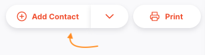

A window will open, inviting you to select the type of contact you want to add. Currently, only HIV Partner Testing is available. Click Ok to proceed.

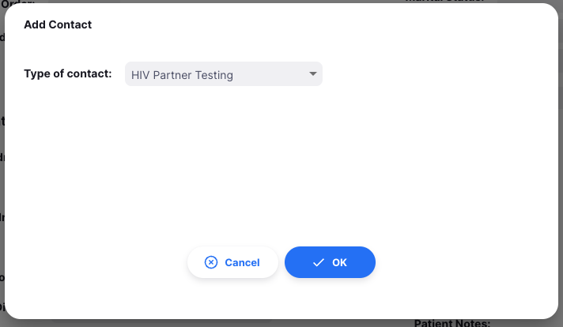

#### Edit a Contact

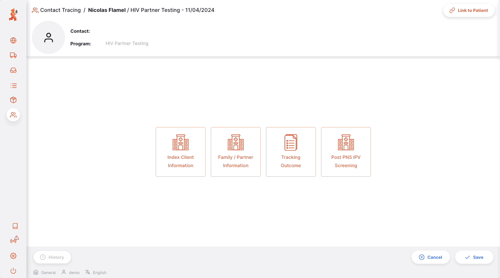

#### Linking a Contact to a Patient

Once a contact has been added to mSupply, they can then be linked to patient who came into contact with them. Do this by clicking the `Link to Patient` button on the top right of the screen.

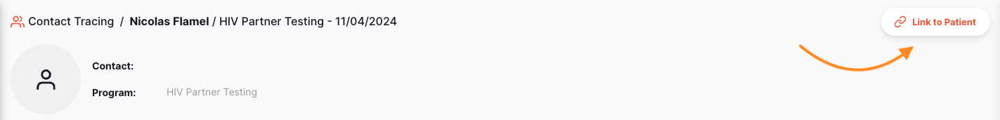

This will open a search window where you can search for the patient you want by their first name, last name or patient ID. Once you have found the patient, click on the patient to link them to the contact.

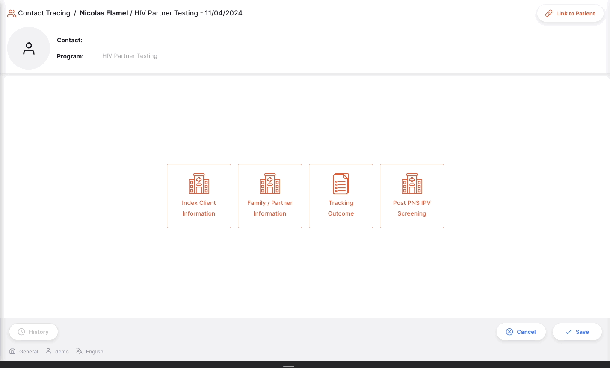

If the patient is already linked to the contact, but you want to change the patient because you linked the wrong patient, click the `Unlink Patient` button on the top right of the screen.

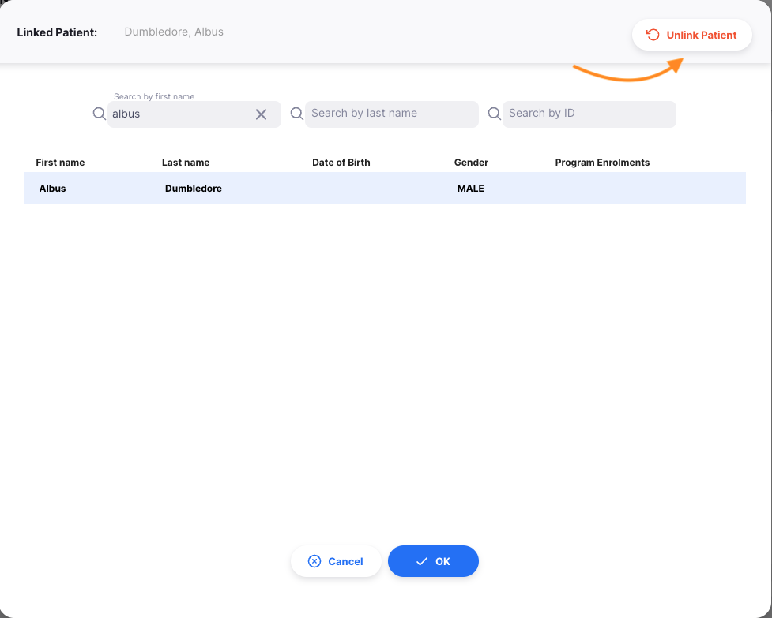

### Vaccination Cards

If the patient is enrolled in an Immunization Program, you can view their progress through the program by viewing their Vaccination Card.

From the `Vaccinations` tab in the patient detail view, select the Immunization Program you want to view the Vaccination Card for.

You will be redirected to the patient's Vaccination Card for that program.

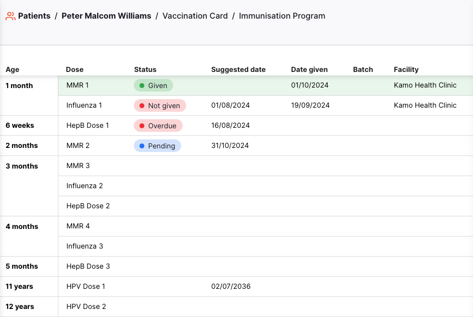

The Vaccination Card includes the following columns:

| Column             | Description                                                                                                                 |
| :----------------- | :-------------------------------------------------------------------------------------------------------------------------- |
| **Age**            | The minimum age the patient should be to receive the dose                                                                   |
| **Dose**           | The name of the dose                                                                                                        |
| **Status**         | The vaccination status (see below)                                                                                          |
| **Suggested date** | The earliest recommended date to give the dose (based on the patient's age, and the minimum interval since their last dose) |
| **Date given**     | The date of the recorded vaccination                                                                                        |
| **Batch**          | The batch of the vaccine item given to the patient                                                                          |
| **Facility**       | The facility where the vaccination was administered                                                                         |

**Vaccination statuses:**

- **Given**: The patient has received the vaccination
- **Not Given**: The patient has not received the vaccination (e.g. refused, no stock available)
- **Pending**: The patient is eligible for this dose - they have received the previous dose and are above the minimum age
- **Overdue**: The patient is older than the recommended max age for this dose

To view the details of a specific vaccination, click on that row in the card. This will open a new window containing all the vaccination information.

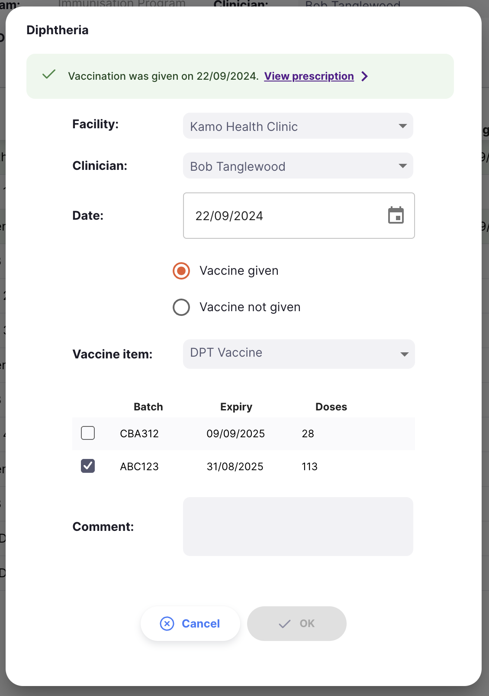

Note that only the rows where a vaccination has been recorded (as `Given` or `Not given`) will be clickable in this view. New vaccinations are administered from within an encounter.

#### Vaccination Encounters

Immunization Program Encounters will have an additional `Vaccinations` tab, which displays the same Vaccination card as in the patient view above. However, new doses can also be administered from within the encounter.

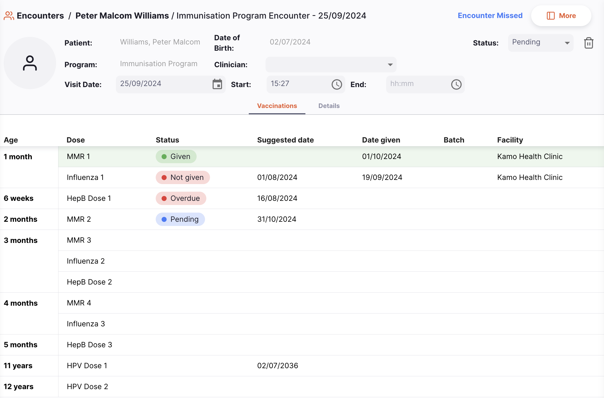

#### Adding Vaccination Records

  Patient vaccination records from other facilities may be out of date. Ensure that you have synced recently, and always confirm against the patient's physical vaccination card first. If in doubt, we recommend phoning the other facility to validate given doses.

To add a new vaccination record, click the row in the Vaccination Card that corresponds to the dose you want to administer. You can only add vaccination records for a dose if the previous dose in that Vaccine Course has been `Given`. Rows for future doses will be disabled.

Clicking the dose row will open a new window where you can enter the details of the vaccination.

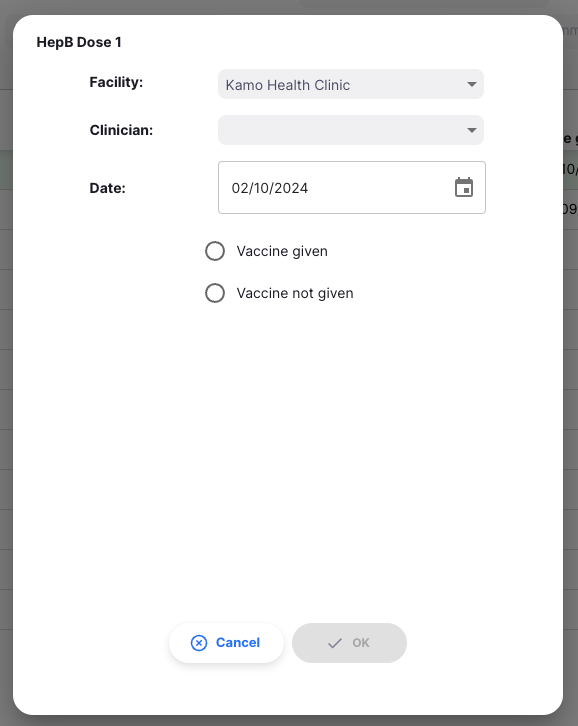

Let's step through each section.

- `Facility`: will be pre-populated with the logged in facility. This can be changed if the vaccination was administered at a different facility.

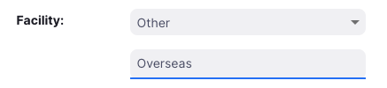

- `Clinician`: only available if clinicians are configured for your store - will be pre-populated with the clinician for the encounter, if selected. Can be changed if the vaccination was administered by a different clinician. This field is not available for vaccinations recorded at `Other` facilities.

- `Date`: defaults to today's date, but can be changed to add historic vaccination records as needed.

- `Given`/`Not given`: based on whether you select `Vaccine given` or `Vaccine not given`, more fields will appear.

- `Vaccine item` and `Batch`: If you select `Vaccine given`, you will be able to select the `Item` and `Batch` of the vaccine administered. If there is only one item/batch available, these fields will be pre-populated. Otherwise they can be selected from a dropdown.

Note that if you selected an `Other facility`, you will not receive the option to select a batch. A stock transaction will not be recorded.

If you selected a `Date` in the past, a switch will appear to `Record stock transaction for past vaccination`.

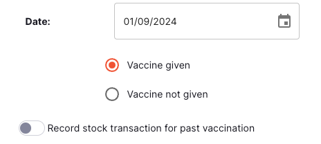

Switch this on if you want to record a stock transaction for this vaccination (see more below). This will enable the batch selector.

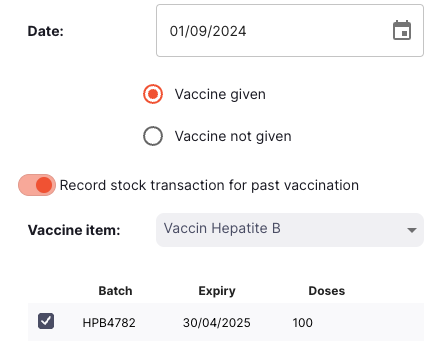

- `Reason`: If you instead select `Vaccine not given`, you will be able to select a reason why the vaccine was not given.

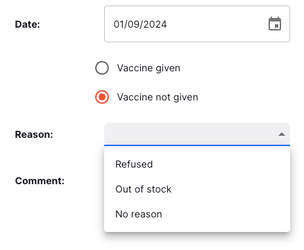

- `Comment`: an optional comment field is also available for any observations or notes about the vaccination.

When you are happy with your changes, you can click the OK button to save the vaccination record. If you want to discard your changes, click the Cancel button.

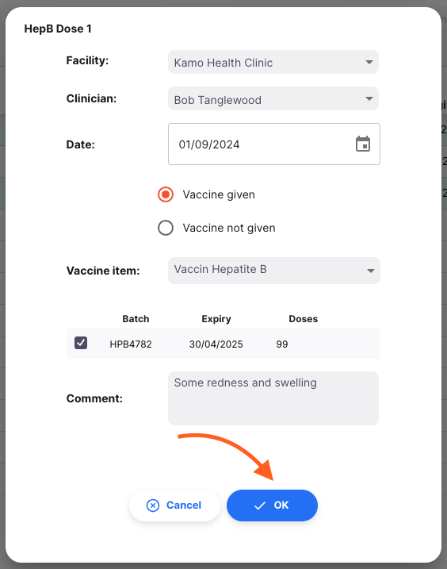

If a vaccine item and batch were selected, the system will automatically create and finalise a [Prescription](/docs/dispensary/prescriptions). Prescriptions are created for each vaccination record to track stock usage.

Note that the prescription will always be created for today's date, regardless of the date you selected for the vaccination.

You can view the created prescription by clicking on the dose row again in the vaccination record. If a prescription was created, you will see a `View prescription` link in the info box at the top of the window.

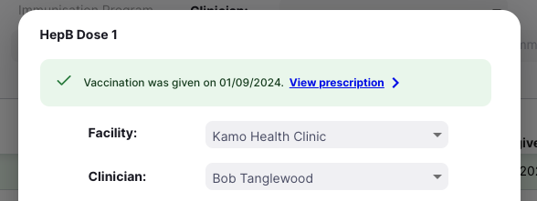

#### Editing Vaccination Records

Vaccination records should be entered at the time of vaccination, so there shouldn't be a need to edit them. However, you may need to edit a vaccination if:

- You need to correct a mistake
- A vaccination was originally recorded as `Not given` (e.g. out of stock) but is now being `given`

You can do so by clicking on the row in the Vaccination Card that corresponds to the dose you want to edit, to open the edit window.

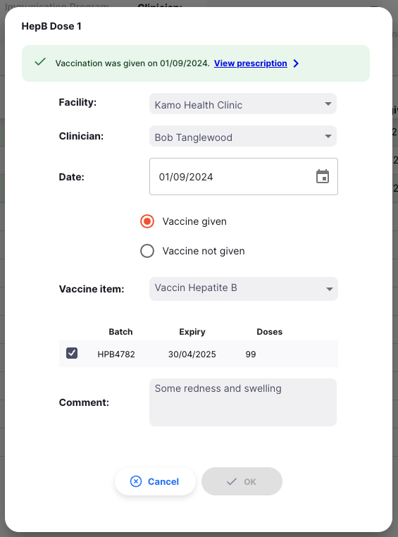

All fields are editable. Some things to note:

- Changing the date will not change the prescription date
- If you change from `Given` to `Not given`, and a Prescription was previously created from the vaccination, you will have the option to `revert the existing stock transaction`
  - If enabled, a [Customer Return](/docs/distribution/customer-returns) will be created for the vaccine item that was previously administered (note that the prescription will continue to exist - finalised prescriptions cannot be deleted)

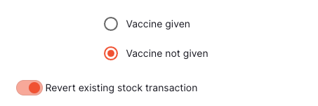

- If you change the item or batch, and a Prescription was previously created from the vaccination, you will have the option to `update stock transactions`. If enabled:
  - A [Customer Return](/docs/distribution/customer-returns) will be created for the vaccine item that was previously administered
  - A [Prescription](/docs/dispensary/prescriptions) will be created for the new vaccine item/batch
  - Note that the previous prescription will continue to exist - finalised prescriptions cannot be deleted

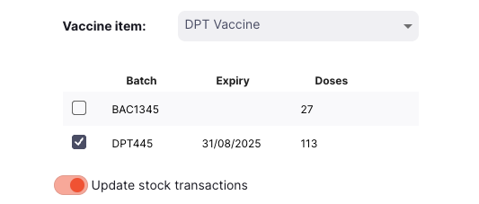

Note that vaccinations that are marked as `Given` at another facility won't be editable to you, except for the comment field:

    

