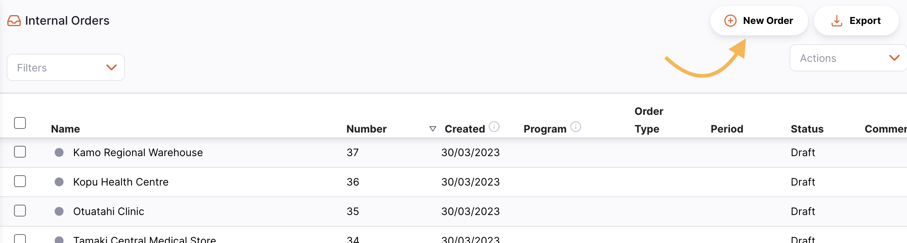
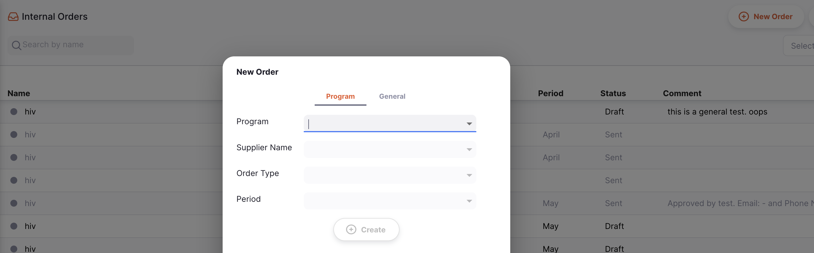
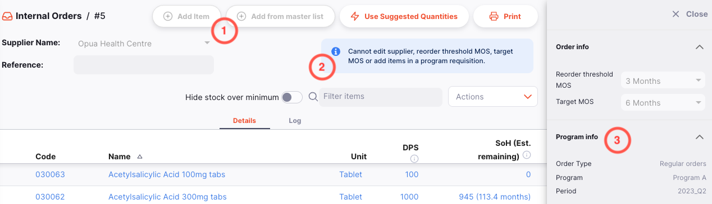
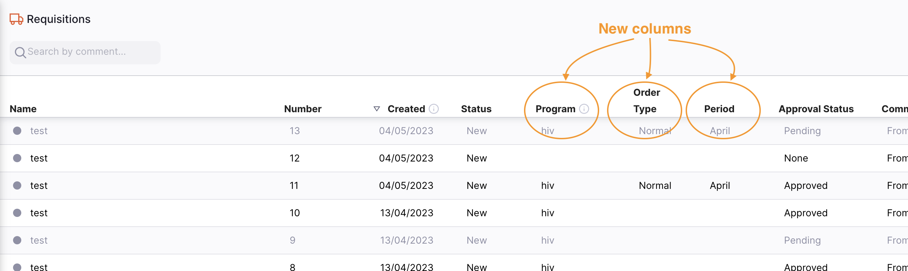
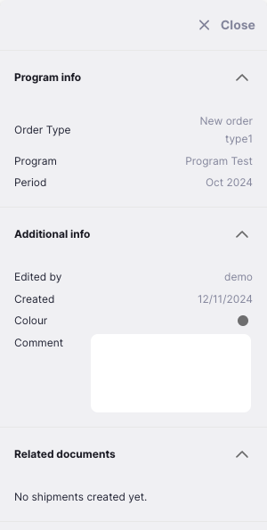

+++
title = "Requisitions"
description = "Program based requisitions"
date = 2023-05-19
updated = 2023-05-19
draft = false
weight = 61
sort_by = "weight"
template = "docs/page.html"

[extra]
lead = "Commande par Programme"
toc = true
top = false
+++

Vous pouvez gérer les commandes internes par programme dans Open mSupply. Cela implique l’utilisation de certains paramètres spéciaux pour les listes maîtresses. Dans cette méthode, un programme est une extension d’une liste principale. Un programme comprend une liste standard d’articles ainsi que :

- **Types de commande**: Catégories définies fixant le nombre maximal de commandes et la quantité de stock à commander par période
- **Periodes**: des intervalles de temps définis pour la passation des commandes; les horaires et les périodes doivent être établis avant la création des programmes
- **Indicateurs**: une liste définie de renseignements supplémentaires qu’un client pourrait devoir fournir lorsqu’il fait une commande par programme

Examples of items commonly managed by programs include Malaria, HIV and TB medicines and medical supplies.

Les modifications de configuration nécessaires lors de la mise en place d’un programme sont effectuées sur le serveur central. Voir la documentation ci-dessous pour une explication :

- [Créer un programme](https://docs.msupply.org.nz/items:programs#creating_a_program)

## Creation d'une Commande Interne par programme

Créons une commande interne par programme.

1. Cliquez sur le bouton `Nouvelle commande` (en haut à droite) :

2. Si vous avez des programmes configurés, vous verrez un modèle différent de l’habituel :

Vous pouvez sélectionner ici :

- Le programme
- Le fournisseur
- Le type de commande
- La période

Les programmes et la période de commande que vous voyez seront affectés par les étiquettes du dépot et la préférence du programme. [Cliquez ici pour savoir comment connecter un programme à un dépot](https://docs.msupply.org.nz/items:programs#connecting_a_program_to_a_store).

3. Une fois que vous avez sélectionné tous les éléments ci-dessus, cliquez sur `Creer` et continuez.

Le programme que vous sélectionnez affectera les fournisseurs, les types de commandes et les périodes disponibles pour la sélection

## Différences dans l’utilisation des commandes par programme

### Commandes internes

Il y a plusieurs zones où vous verrez des informations supplémentaires lorsque vous utilisez une commande interne par programme.

1. Les boutons `Ajouter article` et `Ajouter article depuis une liste maître` sont désactivés. Les articles dans une commande interne par programme sont configurés dans le programme.
2. Un message expliquant que vous ne pouvez pas modifier les valeurs MDS de la cible et du seuil de réordonnancement sur une commande interne par programme. Ces valeurs sont configurées par le programme.
3. Renseignements supplémentaires vous indiquant le programme, le type de commande et la période pour lesquels cette commande interne est en vigueur. Ce panneau de détails peut être ouvert en cliquant sur le bouton `Plus` dans le coin supérieur droit de la page.

### Requisitions

La vue de liste a gagné quelques colonnes supplémentaires, montrant les données liées au programme :

- **Programmes**: le nom du programme pour lequel cette commande interne a été crééé
- **Type de commande**: le nom du type de commande (généralement, une commande normale ou commande urgente)
- **Periodes**: le nom de la période sélectionnée

Et la vue détaillée affiche également les renseignements sur le programme :

