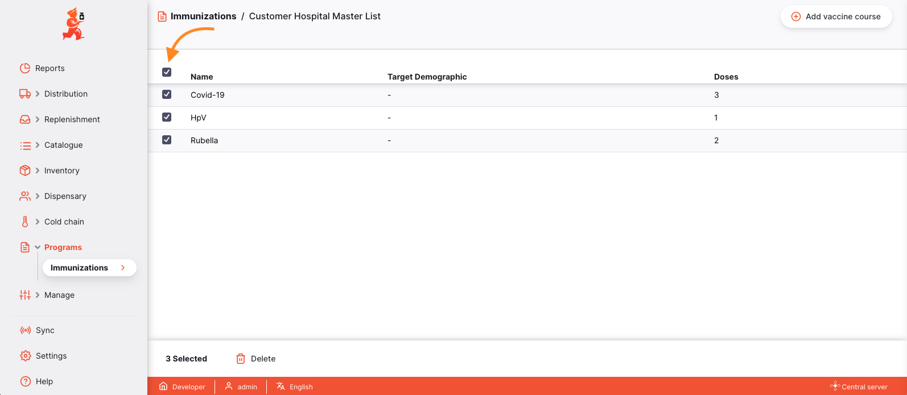

+++
title = "Imunização"
description = "Programas de Imunização"
date = 2022-05-17T16:20:00+00:00
updated = 2022-05-17T16:20:00+00:00
draft = false
weight = 61
sort_by = "weight"
template = "docs/page.html"

[extra]
toc = true
top = false
+++

## Configurar

Os Programas Básicos de Imunização são configurados no servidor central mSupply.

Para a funcionalidade GAPS, apenas terá de configurar uma nova Lista Mestre e marcá-la como um Programa de Imunização.

 

 

Para a imunização [Programas de doentes](/docs/programs/program-module), contacte o seu administrador para fazer a configuração.

Depois de o Programa de Imunização base ser criado, pode ser ainda mais configurado no <a href='/docs/getting_started/central-server'>Open mSupply Central Server<a>. Consulte a secção <a href="#permissions-restrictions">Permissões e restrições</a> para mais detalhes.

## Visualização de programas de imunização

Selecione `Programas` > `Imunizações` no painel de navegação.

Será apresentada uma lista de Programas de Vacinação:

A lista de Programas de Imunização está dividida em 2 colunas:

| Coluna                | Descrição                                                      |
| :-------------------- | :------------------------------------------------------------- |
| **Nome do programa**  | O nome do Programa de Vacinação                                |
| **Cursos de Vacinas** | Os Cursos de Vacinação que integram este Programa de Vacinação |

## Visualização de detalhes do programa de imunização

Para ver um Programa de Vacinação com mais detalhe, clique sobre ele. Isto levá-lo-á para a página de detalhes desse programa.

Pode utilizar o botão "Fechar" no canto inferior direito para fechar a vista de detalhes e voltar à lista de Programas de Imunização.

### Cursos de Vacinas

A visualização detalhada do Programa de Vacinação apresenta uma lista dos Cursos de Vacinação que fazem parte do programa.

A lista dos Cursos de Vacinação está dividida em 3 colunas:

| Coluna           | Descrição                                                       |
| :--------------- | :-------------------------------------------------------------- |
| **Nome**         | O nome do Curso de Vacinação                                    |
| **Público-alvo** | O grupo demográfico que vai receber a vacina Curso de Vacinação |
| **Doses**        | O número de doses incluídas no curso                            |

### Adicionar um novo curso de vacinas

Para adicionar um novo curso de vacinação, clique no botão `Adicionar curso de vacinação' no canto superior direito.

Isto abrirá uma nova janela, onde poderá introduzir os detalhes do novo curso de vacinação, por exemplo, nome do curso de vacinação, taxa de desperdício, esquema de dosagem.

#### Doses

Para adicionar doses ao Curso de Vacinação, clique no botão `(+) Dose`. Isto irá adicionar uma nova linha à tabela `cronograma de dosagem`, onde os detalhes da dose podem ser introduzidos, incluindo quando a dose pode ser administrada.

A tabela do esquema posológico está dividida em 6 colunas:

| Coluna                            | Descrição                                                                                                                                                      |
| :-------------------------------- | :------------------------------------------------------------------------------------------------------------------------------------------------------------- |
| **Dose #**                        | O número da dose no esquema                                                                                                                                    |
| **Etiqueta**                      | O rótulo da dose, a apresentar no [Cartão de Vacinação](/docs/programs/program-module#vaccination-cards)                                                       |
| **Idade mínima**                  | Idade mínima recomendada para receber a dose (em anos e meses)                                                                                                 |
| **Idade màxima**                  | Idade máxima recomendada para receber a dose (em anos e meses)                                                                                                 |
| **Rótulo de idade personalizada** | Etiqueta de idade personalizada para ser exibida no Boletim de Vacinação. Se não estiver definido, o predefinido é `A partir da idade` (por exemplo, `6 anos`) |
| **Intervalo mínimo (dias)**       | Número mínimo de dias antes de o doente receber a dose seguinte                                                                                                |

 Se forem utilizados rótulos de idade personalizados, certifique-se de que o rótulo é o mesmo em todas as doses do Programa de Vacinação com a mesma <code>Idade inicial</code>. Por exemplo, se pretender substituir "0 meses" por "Nascimento", todas as doses em todos os Ciclos de Vacinação com <code>Idade a partir de</code> dos 0 meses necessitarão do rótulo de idade personalizado "Nascimento". Isto garante o agrupamento correto das doses no Boletim de Vacinas.

Quando estiver satisfeito com os detalhes do Curso de Vacinação, clique em OK para guardar o novo Curso de Vacinação.

Clique em `Cancelar` a qualquer momento para fechar a janela e descartar as suas alterações.

### Editar um curso de vacinas

To view or edit the details of a Vaccine Course, click on the row in the list. This will re-open the editing window, for you to view or change any details.

### Excluir um curso de vacina

Pode eliminar o Curso de Vacinação da lista.

Selecione o Ciclo de Vacinação que pretende eliminar, assinalando a caixa no canto direito da lista. Pode selecionar mais do que um ciclo de vacinação para ser excluído de uma só vez. Pode até selecioná-los todos utilizando a caixa de seleção principal no cabeçalho da tabela.

O rodapé `Ações` será apresentado na parte inferior do ecrã quando uma linha de imunização for selecionada. Irá exibir o número de linhas de imunização selecionadas e as ações que podem ser tomadas. Clique em `Apagar`.

Ser-lhe-á pedido que confirme que deseja excluir os Cursos de Vacinação selecionados. Prima `Cancelar` para impedir a eliminação ou `Ok` para confirmar.

Uma notificação no canto inferior esquerdo confirmará quantos cursos foram eliminados.

## Permissões e Restrições

Os programas de imunização só podem ser geridos no [Open mSupply Central Server](/docs/getting_started/central-server) e requerem a preferência de loja [`mobile: Usa o módulo de vacinas`](https://docs.msupply.org.nz/cold_chain_equipment:mobile?s[]=vaccine#enable_the_vaccine_module_for_the_mobile_store).

Para configurar Programas de Imunização ou Cursos de Vacinação, precisa de ter a permissão `Pode modificar dados centrais` ativada no [Abrir separador Permissões do mSupply](https://docs.msupply.org.nz/admin:managing_users?s[]=permission#open_msupply_permissions_tab) no seu Armazenamento Central.

