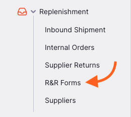
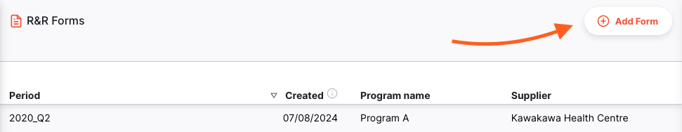
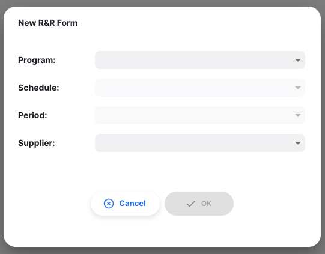
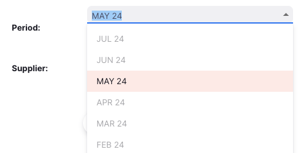
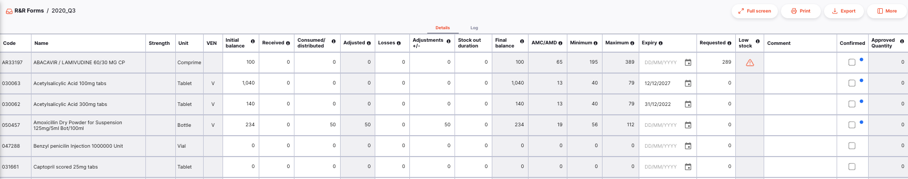
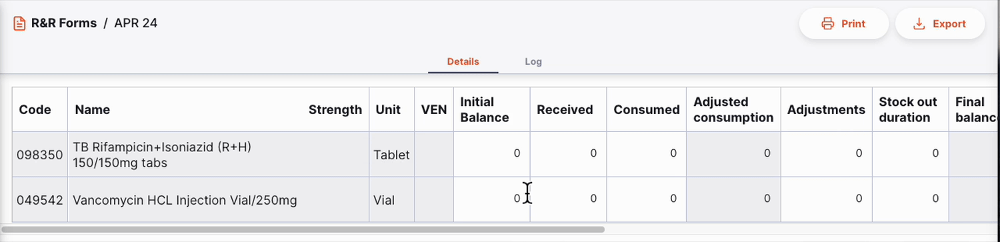
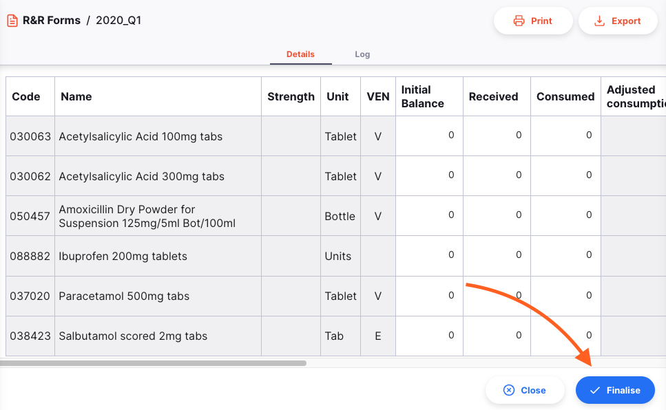

+++
title = "Formularios R&R"
description = "Introducción a los Formularios R&R"
date = 2024-08-06
updated = 2024-08-06
draft = false
weight = 46
sort_by = "weight"
template = "docs/page.html"

[extra]
lead = "Los Formularios de Reporte y Requisición (R&R) se utilizan para reportar el uso de artículos y solicitar inventario a los proveedores. Ayudan a garantizar que tengas suficiente stock disponible para satisfacer las necesidades de tus pacientes."
toc = true
top = false
+++

## Configuración

Para utilizar los Formularios R&R, asegúrate de habilitar la preferencia del almacén para `Open mSupply: Utiliza el módulo del programa`.

También necesitarás un programa configurado y visible en tu tienda, y dicho programa deberá tener un calendario de períodos asociado.

Comienza configurando [periodos y horarios](https://docs.msupply.org.nz/admin:schedules_periods), luego crea un programa y asocia el calendario.

Consulta la [documentación de mSupply](https://docs.msupply.org.nz/items:programs) para configurar programas; sin embargo, ten en cuenta que solo necesitarás el inicio de este proceso, que es crear un programa y asociar un calendario. Para los formularios R&R, los otros aspectos de configuración del programa aún no se utilizan.

## Formularios R&R - Vista de lista

Ve a `Reabastecimiento` > `Formularios R&R` para ver la lista de formularios R&R.

Puedes hacer clic en los encabezados de las columnas para ordenar la lista por esa columna.

Al hacer clic en un formulario R&R, serás dirigido a la página de detalles.

### Agregar un formulario R&R

Para agregar un formulario R&R, haz clic en el botón `Agregar Formulario` en la esquina superior derecha de la pantalla.

Se abrirá una ventana para que selecciones el programa, el horario, el período y el proveedor para el formulario R&R.

La primera vez que crees un formulario R&R, deberás seleccionar cada una de estas opciones. Después de eso, los campos se rellenarán automáticamente con los datos del período anterior.

Nuestro formulario R&R más reciente fue de abril de 2024, para el programa Tb. El mismo programa, horario y proveedor están seleccionados, y el siguiente período se elige automáticamente.

La primera vez que crees un formulario R&R, puedes seleccionar cualquier período disponible. Después de eso, solo podrás seleccionar el siguiente período en la secuencia.

El formulario R&R anterior fue para el período de ABR 24/div>

Ten en cuenta que no podrás crear el siguiente formulario R&R hasta que el anterior esté finalizado:

Una vez que estés satisfecho con tus opciones, haz clic en `OK` para generar el formulario. Serás redirigido a la página de detalles del formulario R&R.

## Vista de Detalle

El formulario R&R contiene las siguientes columnas. Las columnas calculadas/no editables están en gris. Las columnas marcadas con un asterisco (*) son editables.

| Columna                                | Descripción                                                                                                                                                                                                   |
| :------------------------------------ | :------------------------------------------------------------------------------------------------------------------------------------------------------------------------------------------------------------ |
| **Código**                              | Código del artículo                                                                                                                                                                                                     |
| **Nombre**                              | Nombre del artículo                                                                                                                                                                                                     |
| **Fuerza**                          | Fuerza del artículo                                                                                                                                                                                          |
| **Unidad**                              | Unidad de medida del artículo                                                                                                                                                                                  |
| **VEN**                               | Categoría VEN del artículo: Vital (V), Esencial (E), No esencial (N)                                                                                                                                                |
| **Saldo Inicial\***                 | Stock disponible de este artículo al inicio del período. Utiliza el saldo final del formulario R&R anterior (si existe) o intenta calcular el saldo basado en cualquier dato de transacción en Open mSupply. |
| **Recibido\***                        | Cantidad de este artículo recibida durante el período. Poblada por las cantidades recibidas a través de Entradas.                                                                                                 |
| **Consumido/distribuido\***            | Cantidad de este artículo consumido durante el período. Poblada por las cantidades distribuidas a través de Salidas o Prescripciones                                                                           |
| **Consumo/distribución ajustada** | Consumo, ajustado por los días sin stock. El cálculo es <code>Consumido x Días en el período / Días en stock</code>                                                                                  |
| **Ajustes +/-\***                 | Pérdidas/ajustes realizados para este artículo durante el período. Pueden ser positivos o negativos. Poblada por datos de Inventarios o Ajustes de Inventario.                                                            |
| **Duración sin Stock\***              | Número de días en el período donde el stock disponible del artículo fue 0.                                                                                                                                         |
| **Saldo Inicial**                     | Stock disponible del artículo al final del período. El cálculo es <code>Saldo inicial + Recibido - Consumido + Ajustes</code>                                                                         |
| **AMC/AMD**                           | Consumo promedio mensual (distribución) durante los últimos 3 períodos                                                                                                                                         |
| **Máximo**                           | Cantidad ideal de stock disponible, la cantidad solicitada podría ser cualquier valor hasta este valor. Calculado como <code>AMC x 2</code>                                                                          |
| **Vencimiento\***                          | Fecha de vencimiento del lote disponible con la fecha de caducidad más cercana de este artículo                                                                                                                                             |
| **Solicitado\***                       | Cantidad a solicitar en la requisición. Calculado como <code>Máximo - Saldo final</code>                                                                                                              |
| **Inventario bajo**                         | Indicador de advertencia si tu saldo final es bajo en comparación con el nivel ideal de stock. Mostrará  `!` cuando el `Saldo final` sea menos de la mitad de `Máximo`, y `!!` uando sea menos de un cuarto                     |
| **Comentario\***                         | Puedes agregar cualquier comentario a la línea según sea necesario                                                                                                                                                               |
| **Confirmado\***                       | Utiliza esta columna para hacer un seguimiento de qué líneas están completas. Actúa como el botón de guardar para los cambios en una línea.                                                                                                    |
| **Cantidad aprobada**                 | Una vez que el formulario R&R esté finalizado, esta columna mostrará la cantidad aprobada por el autorizador (si la autorización está configurada)                                                                                |

### Editar el formulario R&R

Puedes realizar cambios en los datos de uso de cada artículo en el formulario R&R, así como en la cantidad a solicitar al proveedor.

Una vez que estés satisfecho con la información de un artículo, marca la casilla `Confirmado` para guardar los datos.

### Imprimir y Exportar

Puedes imprimir o exportar el formulario R&R haciendo clic en los botones `Imprimir` o `Exportar` en la esquina superior derecha de la pantalla.

- EL botón `Imprimir` abrirá la ventana de impresión de tu navegador. Desde allí también puedes guardar el informe como un archivo PDF.
- El botón `Exportar` descargará el formulario R&R como un archivo de Exce

Para imprimir o exportar, necesitas tener configurado un informe de formulario R&R. Por favor, contacta al soporte técnico para obtener ayuda.

### Finalizar un formulario R&R

Cuando estés listo para finalizar el formulario R&R, haz clic en el botón `Finalizar` en la esquina inferior derecha de la pantalla. En este punto:

- El formulario R&R ya no será editable
- Se creará una Orden Interna y se enviará al proveedor seleccionado. Los valores ingresados para cada artículo en el formulario R&R se utilizarán para completar la Orden Interna, ¡así que verifica el valor `Solicitado` antes de confirmar!
- Una vez que la Orden Interna sea aprobada por el autorizador, la columna `Cantidad Aprobada` se llenará con las cantidades aprobadas

También puedes hacer clic en el botón `Cerrar` en cualquier momento para volver a la vista de lista.
