+++
title = "Formulaires R&R"
description = "Introduction aux Formulaires R&R"
date = 2024-08-06
updated = 2024-08-06
draft = false
weight = 46
sort_by = "weight"
template = "docs/page.html"

[extra]
lead = "Les Formulaires de Rapport et Réquisition (R&R) sont utilisés pour rendre compte de l'utilisation des articles et demander du stock aux fournisseurs. Ils permettent de s'assurer que vous disposez d'un stock suffisant pour répondre aux besoins de vos patients."
toc = true
top = false
+++

## Configuration

Pour utiliser les Formulaires R&R, assurez-vous d'activer la préférence du dépôt `Open mSupply : Utilise le module programme`.

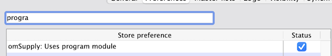

Vous aurez également besoin d'un programme configuré et visible dans votre dépôt, et le programme devra être associé à un calendrier de périodes.

Commencez par configurer les [périodes et calendriers](https://docs.msupply.org.nz/admin:schedules_periods), puis créez un programme et associez-y le calendrier.

Consultez la [documentation mSupply](https://docs.msupply.org.nz/items:programs) pour la configuration des programmes — notez toutefois que vous n'aurez besoin que du début de ce processus, c'est-à-dire créer un programme et associer un calendrier. Pour les formulaires R&R, les autres aspects de configuration des programmes ne sont pas encore utilisés. Vous devrez également [connecter un programme à un dépôt](https://docs.msupply.org.nz/items:programs#connecting_a_program_to_a_store).

Notez également que les programmes marqués comme `Programme de vaccination` n'apparaîtront pas dans la liste des programmes disponibles lors de la création d'un formulaire R&R.

Assurez-vous d'avoir configuré les seuils corrects pour le sous-stock et le sur-stock dans vos [préférences du dépôt](https://docs.msupply.org.nz/other_stuff:virtual_stores?s%5B%5D=threshold&s%5B%5D=overstock#notification_preferences). Ces seuils sont utilisés pour calculer les niveaux de stock minimum et maximum pour chaque article.

## Formulaires R&R - Vue Liste

Allez dans `Réapprovisionnement` > `Formulaires R&R` pour afficher la liste des Formulaires R&R.

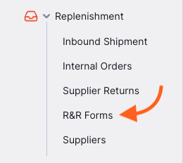

Vous pouvez cliquer sur les en-têtes de colonnes pour trier la liste par cette colonne.

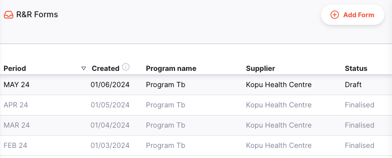

Cliquer sur un formulaire R&R vous amènera à la page de détails.

### Ajouter un Formulaire R&R

Pour ajouter un Formulaire R&R, cliquez sur le bouton `Ajouter un formulaire` dans le coin supérieur droit de l'écran.

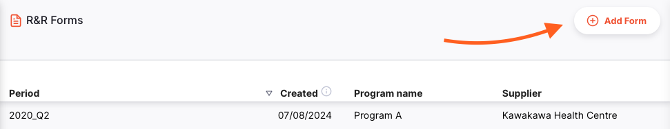

Une fenêtre s'ouvrira pour vous permettre de sélectionner le programme, le calendrier, la période et le fournisseur pour le formulaire R&R.

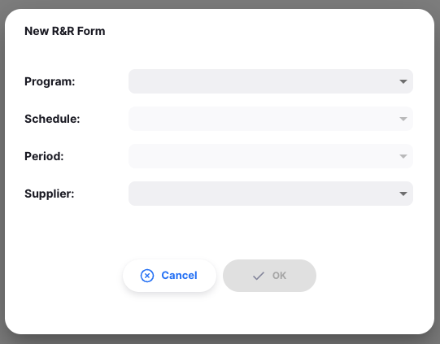

La première fois que vous créez un formulaire R&R, vous devrez sélectionner chacune de ces options. Ensuite, les champs seront pré-remplis avec les données de la période précédente.

La période suivante sera sélectionnée automatiquement. Vous pouvez modifier la période si nécessaire — notez cependant que si vous sautez une période, le nouveau formulaire R&R n'utilisera pas le formulaire R&R précédent pour ses soldes initiaux.

Notre formulaire R&R le plus récent était d'avril 2024, pour le Programme TB. Le même programme, calendrier et fournisseur sont sélectionnés, et la période suivante est choisie automatiquement.

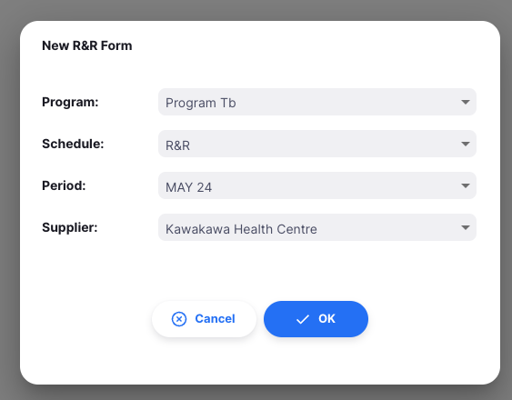

Notez que vous ne pouvez pas créer le prochain formulaire R&R tant que le précédent n'est pas finalisé :

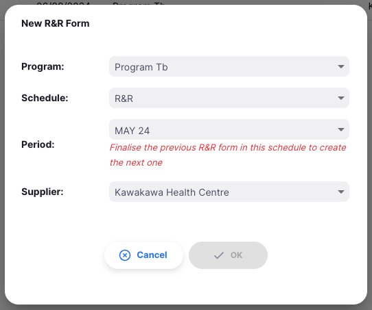

Une fois satisfait de vos saisies, cliquez sur `OK` pour générer le formulaire. Vous serez redirigé vers la page de détails du formulaire R&R.

## Vue Détaillée

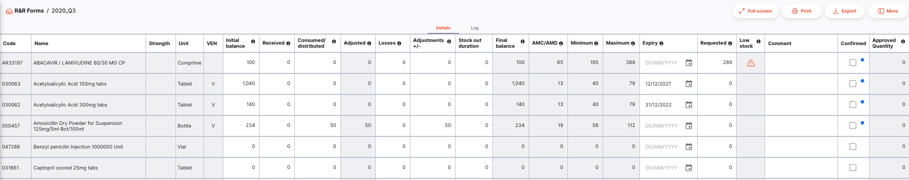

Le formulaire R&R contient les colonnes suivantes. Les colonnes calculées/non modifiables sont grisées. Les colonnes marquées d'un astérisque (\*) sont modifiables.

| Colonne                       | Description                                                                                                                                                                                                                   |
| :---------------------------- | :---------------------------------------------------------------------------------------------------------------------------------------------------------------------------------------------------------------------------- |
| **Code**                      | Code de l'article                                                                                                                                                                                                             |
| **Nom**                       | Nom de l'article                                                                                                                                                                                                              |
| **Concentration**             | Concentration de l'article                                                                                                                                                                                                    |
| **Unité**                     | Unité de mesure de l'article                                                                                                                                                                                                  |
| **VEN**                       | Catégorie VEN de l'article : Vital (V), Essentiel (E), Non essentiel (N)                                                                                                                                                      |
| **Solde initial\***           | Stock en dépôt pour cet article au début de la période. Utilise le solde final du formulaire R&R précédent (s'il existe), ou tente de calculer le solde sur la base des données de transaction dans Open mSupply.            |
| **Reçu\***                    | Quantité de cet article reçue durant la période. Rempli par les quantités reçues via les Expéditions Entrantes.                                                                                                               |
| **Consommé/distribué\***      | Quantité de cet article consommée durant la période. Rempli par les quantités distribuées via les Expéditions Sortantes ou les Prescriptions.                                                                                 |
| **Ajusté**                    | Consommation/distribution, ajustée pour les jours de rupture de stock. Calcul : <code>Consommé/distribué x Jours dans la période / Jours en stock</code>                                                                     |
| **Pertes\***                  | Pertes enregistrées pour cet article durant la période. Saisie manuelle.                                                                                                                                                     |
| **Ajustements +/-\***         | Pertes/ajustements effectués pour cet article durant la période. Peut être positif ou négatif. Rempli par les données des Inventaires ou Ajustements de Stock.                                                                |
| **Durée de rupture\***        | Nombre de jours dans la période où le stock en dépôt pour l'article était à 0.                                                                                                                                                |
| **Solde final**               | Stock en dépôt pour l'article à la fin de la période. Calcul : <code>Solde initial + Reçu - Consommé + Ajustements</code>                                                                                                    |
| **CMM/DMM**                   | Consommation (Distribution) Mensuelle Moyenne sur les 3 dernières périodes                                                                                                                                                    |
| **Minimum**                   | Quantité minimale de stock à avoir en dépôt, la quantité demandée doit garantir que le stock ne descendra pas en dessous de cette valeur. Calculé comme <code>CMM x Seuil de sous-stock</code> (préférence du dépôt)         |
| **Maximum**                   | Quantité idéale de stock à avoir en dépôt, la quantité demandée peut aller jusqu'à cette valeur. Calculé comme <code>CMM x Seuil de sur-stock</code> (préférence du dépôt)                                                   |
| **Expiration\***              | Date d'expiration du lot disponible expirant le plus tôt pour cet article                                                                                                                                                     |
| **Demandée\***                | Quantité à demander dans la réquisition. Calculé comme <code>Maximum - Solde final</code>                                                                                                                                     |
| **Stock faible**              | Indicateur d'avertissement si votre solde final est faible par rapport au niveau de stock idéal. Affiche `!` quand le `Solde final` est inférieur à la moitié du `Maximum`, et `!!` quand il est inférieur au quart           |
| **Commentaire\***             | Vous pouvez ajouter des commentaires à la ligne si nécessaire                                                                                                                                                                 |
| **Confirmé\***                | Utilisez cette colonne pour suivre les lignes complétées. Sert de bouton de sauvegarde pour les modifications d'une ligne.                                                                                                    |
| **Quantité approuvée**        | Une fois le Formulaire R&R finalisé, cette colonne affiche la quantité approuvée par l'approbateur (si l'autorisation est configurée)                                                                                         |

### Modifier le Formulaire R&R

Vous pouvez apporter des modifications aux données d'utilisation de chaque article dans le formulaire R&R, ainsi qu'à la quantité à demander au fournisseur.

Une fois satisfait des informations pour un article, cochez la case `Confirmé` pour enregistrer les données.

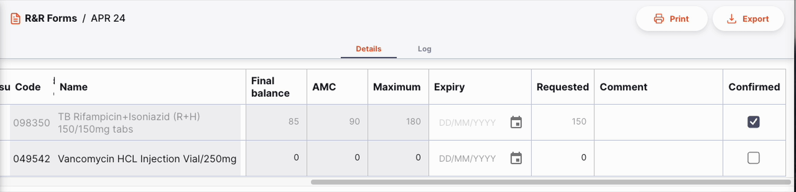

### Imprimer et exporter

Vous pouvez imprimer ou exporter le formulaire R&R en cliquant sur les boutons `Imprimer` ou `Exporter` dans le coin supérieur droit de l'écran.

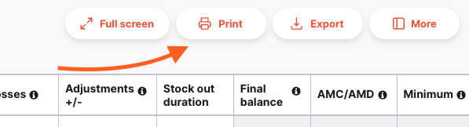

- Le bouton `Imprimer` ouvrira la fenêtre d'impression de votre navigateur. Vous pouvez également enregistrer le rapport en PDF depuis cette fenêtre.
- Le bouton `Exporter` téléchargera le formulaire R&R en tant que fichier Excel.

L'impression ou l'export des Formulaires R&R nécessite un formulaire imprimable personnalisé, configuré sur votre Serveur Central Open mSupply. Veuillez contacter le support pour obtenir de l'aide.

### Panneau de détails

Le bouton `Plus` dans le coin supérieur droit de l'écran ouvrira le panneau de détails. Vous pouvez y voir des informations supplémentaires sur le formulaire R&R, telles que le nom du programme et le fournisseur.

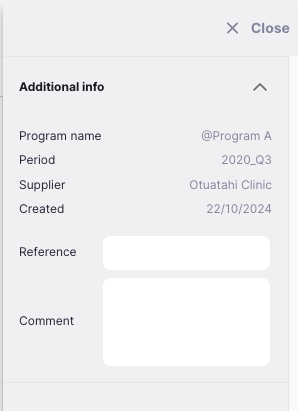

Vous pouvez également définir une référence, qui sera incluse dans la Commande Interne envoyée au fournisseur.

### Supprimer un Formulaire R&R

En bas du panneau de détails, il y a une section `Actions` :

Vous pouvez supprimer un formulaire R&R tant qu'il est encore en statut `Brouillon`. Cette action supprimera le Formulaire R&R et toutes les données associées.

### Mode Plein Écran

Le formulaire R&R contient beaucoup d'informations, et il peut parfois être difficile de tout voir en même temps. Cliquez sur le bouton `Plein Écran` dans le coin supérieur droit de l'écran pour agrandir la vue.

Cliquez sur le bouton `Quitter` dans le coin supérieur droit de l'écran pour revenir à la vue normale, ou utilisez la touche `Échap` si vous utilisez un clavier.

### Finaliser un Formulaire R&R

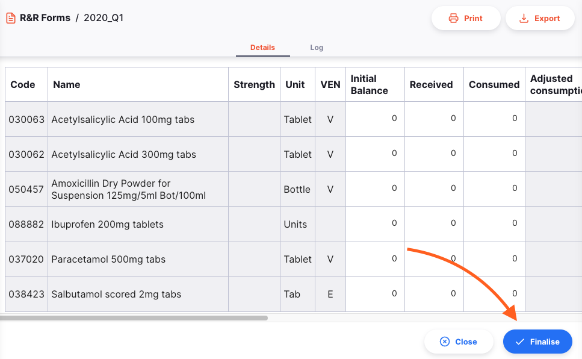

Lorsque vous êtes prêt à finaliser le formulaire R&R, cliquez sur le bouton `Finaliser` en bas à droite de l'écran. À ce stade :

- Le formulaire R&R ne sera plus modifiable
- Une Commande Interne sera créée et envoyée au fournisseur sélectionné. Les valeurs saisies pour chaque article dans le formulaire R&R sont utilisées pour remplir la Commande Interne, vérifiez donc la valeur `Demandée` avant de confirmer !
- Une fois la Commande Interne approuvée par l'approbateur, la colonne `Quantité approuvée` sera remplie avec les quantités approuvées.

Vous pouvez également cliquer sur le bouton `Fermer` à tout moment pour revenir à la vue liste.
