+++
title = "R&R Forms"
description = "Introduction to R&R Forms"
date = 2024-08-06
updated = 2024-08-06
draft = false
weight = 46
sort_by = "weight"
template = "docs/page.html"

[extra]
lead = "Report and Requisition (R&R) Forms are used to report on item usage and request stock from suppliers. They help to ensure that you have enough stock on hand to meet the needs of your patients."
toc = true
top = false
+++

## Setup

To use R&R Forms, ensure that you enable the store preference for `Open mSupply: Uses program module`.

You'll also need a program configured and visible in your store, and the program will need a period schedule associated with it.

Start with configuring [periods and schedules](https://docs.msupply.org.nz/admin:schedules_periods), then create a program and associate the schedule.

See the [mSupply docs](https://docs.msupply.org.nz/items:programs) for configuring programs - note though that you'll only need the start of this process, which is to create a program and associate a schedule. For R&R forms, the other program configuration aspects aren't used yet. You will also need to [connect a program to a store](https://docs.msupply.org.nz/items:programs#connecting_a_program_to_a_store).

Also note that programs marked as an `Immunization program` will not be shown in the list of available programs when creating an R&R form.

Make sure you have the correct thresholds set up for understock and overstock in your [store preferences](https://docs.msupply.org.nz/other_stuff:virtual_stores?s%5B%5D=threshold&s%5B%5D=overstock#notification_preferences). These are used to calculate the minimum and maximum stock levels for each item.

## R&R Forms - List View

Go to `Replenishment` > `R&R Forms` to view the list of R&R Forms.

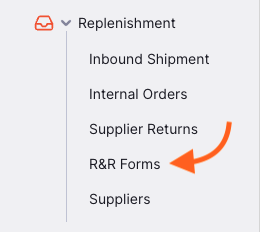

You can click the column headers to sort the list by that column.

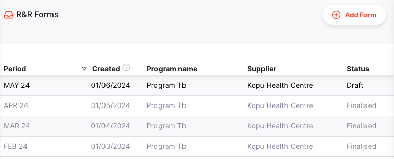

Clicking on an R&R form will take you to the details page.

### Add an R&R Form

To add an R&R Form, click the `Add Form` button on the top right corner of the screen.

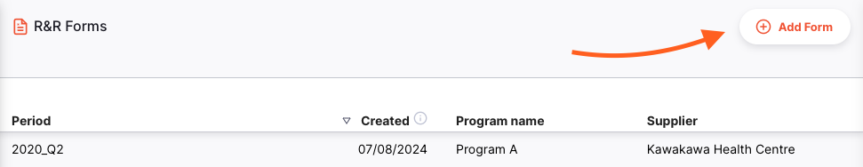

A window will open for you to select the program, schedule, period and supplier for the R&R form.

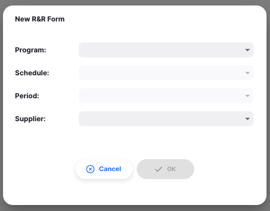

The first time you create an R&R form, you will need to select each of these options. After that, the inputs will be pre-filled with the previous period's data.

Our most recent R&R form was from April 2024, for Program Tb. The same program, schedule and supplier are selected, and the next period is chosen automatically.

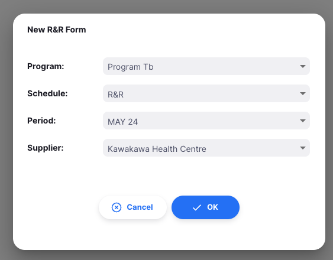

The first time you create an R&R form, you can select any available period. After that, you will only be able to select the next period in the sequence.

The previous R&R form was for the APR 24 period

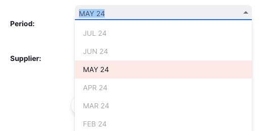

Note that you cannot create the next R&R form until the previous one is finalised:

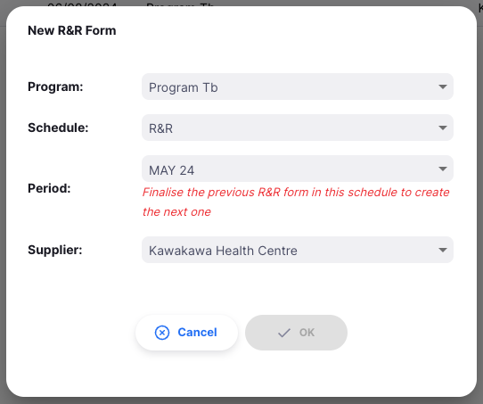

Once you are happy with your inputs, click `OK` to generate the form. You will be redirected to the R&R form details page.

## Detail View

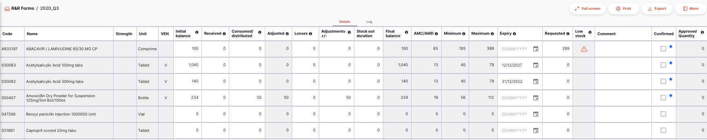

The R&R form contains the following columns. Calculated/non-editable columns are greyed out. Columns marked with an asterisk (\*) below are editable.

| Column                     | Description                                                                                                                                                                                                   |
| :------------------------- | :------------------------------------------------------------------------------------------------------------------------------------------------------------------------------------------------------------ |
| **Code**                   | Item code                                                                                                                                                                                                     |
| **Name**                   | Item name                                                                                                                                                                                                     |
| **Strength**               | Strength of the item                                                                                                                                                                                          |
| **Unit**                   | Unit of measure for the item                                                                                                                                                                                  |
| **VEN**                    | Item VEN category: Vital (V), Essential (E), Non-essential (N)                                                                                                                                                |
| **Initial balance\***      | Stock on hand for this item at the start of the period. Uses the final balance from the previous R&R form (if it exists), or attempts to calculate the balance based on any transaction data in Open mSupply. |
| **Received\***             | Quantity of this item received during the period. Populated by quantities received through Inbound Shipments.                                                                                                 |
| **Consumed/distributed\*** | Quantity of this item consumed during the period. Populated by quantities distributed through Outbound Shipments or Prescriptions.                                                                            |
| **Adjusted**               | Consumption/distribution, adjusted for any days out of stock. Calculation is <code>Consumed/distributed x Days in period / Days in stock</code>                                                               |
| **Losses\***               | Losses recorded for this item during the period. Manually entered.                                                                                                                                            |
| **Adjustments +/-\***      | Losses/adjustments made for this item during the period. Can be positive or negative. Populated by data from Stocktakes or Inventory Adjustments.                                                             |
| **Stock out duration\***   | Number of days in the period where stock on hand for the item was 0.                                                                                                                                          |
| **Final balance**          | Stock on hand for the item at the end of the period. Calculation is <code>Initial balance + Received - Consumed + Adjustments</code>                                                                          |
| **AMC/AMD**                | Average monthly consumption (distribution) over the last 3 periods                                                                                                                                            |
| **Minimum**                | Minimum amount of stock to have on hand, requested quantity should ensure stock won't drop below this value. Calculated as <code>AMC x Threshold for understock</code> (store preference)                     |
| **Maximum**                | Ideal amount of stock to have on hand, requested quantity could be any amount up to this value. Calculated as <code>AMC x Threshold for overstock</code> (store preference)                                   |
| **Expiry\***               | Expiry date of the earliest expiring available batch of this item                                                                                                                                             |
| **Requested\***            | Quantity to be requested in the requisition. Calculated as <code>Maximum - Final balance</code>                                                                                                               |
| **Low stock**              | Warning indicator if your final balance is low in comparison to the ideal stock level. Will show `!` when `Final balance` is less than half of `Maximum`, and `!!` when less than quarter                     |
| **Comment\***              | You can add any comments to the line as needed                                                                                                                                                                |
| **Confirmed\***            | Use this column to keep track of which lines are complete. Acts as the save button for changes to a line.                                                                                                     |
| **Approved Quantity**      | Once the R&R Form is finalised, this column will show the quantity approved by the authoriser (if authorisation is configured)                                                                                |

### Editing the R&R Form

You can make changes to the usage data for each item in the R&R form, as well as the quantity to request from the supplier.

Once you are happy with the information for an item, click the `Confirmed` checkbox to save the data.

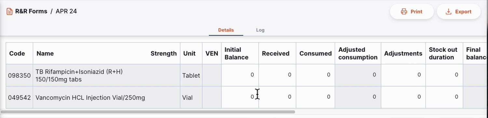

### Print and Export

You can print or export the R&R form by clicking the `Print` or `Export` buttons in the top right corner of the screen.

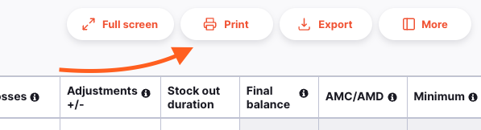

- The `Print` button will open your browser's print window. You can also save the report as a PDF from here.
- The `Export` button will download the R&R form as an Excel file.

In order to print or export, you will need an R&R Form report configured. Please contact support for assistance.

### Detail Panel

The `More` button in the top right corner of the screen will open the detail panel. Here you can see addition information about the R&R form, such as the program name and the supplier.

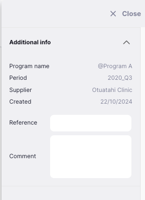

You can also set a reference, which will be included in the Internal Order sent to the supplier.

### Full Screen Mode

There's a lot of information on the R&R form, and sometimes it can be hard to see everything at once. Click the `Full Screen` button in the top right corner of the screen to expand the view.

Click the `Exit` button in the top right corner of the screen to return to the normal view, or you can use the `Escape` key if you are using a keyboard.

### Finalising an R&R Form

When you are ready to finalise the R&R form, click the `Finalise` button at the bottom right of the screen. At this point:

- The R&R form will no longer be editable
- An Internal Order will be created and sent to the selected supplier. The values entered against each item in the R&R form are used to populate the Internal Order, so check the `Requested` value before confirming!
- Once the Internal Order has been approved by the authoriser, the `Approved Quantity` column will be populated with the approved quantities.

You can also click the `Close` button at any time to return to the list view.
