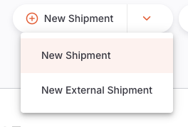

+++
title = "External Inbound Shipments"
description = "Receiving stock from external suppliers via Purchase Orders."
date = 2026-04-10
updated = 2026-04-10
draft = false
weight = 44
sort_by = "weight"
template = "docs/page.html"

[extra]
toc = true
top = false
+++

External Inbound Shipments are used to receive stock from external suppliers. Typically these will be based on a [Purchase Order](/docs/replenishment/purchase-orders/), however you can create a manual _Inbound Shipment_ requesting stock from an external supplier in the same way that you would when requesting from an internal supplier. For details of external inbound shipments which are not linked to a purchase order, see the <a href="/docs/replenishment/inbound-shipments">Inbound shipments</a> page.

When an External Inbound Shipment is linked to a Purchase Order it provides additional features for tracking deliveries, managing foreign currencies, and optionally authorising individual lines before receiving goods.

## Viewing External Inbound Shipments

External Inbound Shipments appear alongside regular Inbound Shipments in the Inbound Shipment list.

### Identifying External Inbound Shipments

In the _Inbound Shipment_ list, you can distinguish _External Inbound Shipments_ from other types by the icon shown next to the supplier name:

- A **truck icon** indicates an External Inbound Shipment (from a Purchase Order or external supplier)
- A **home icon** indicates an internal shipment (from another store in your mSupply system)

## Creating a new External Inbound Shipment

To create an External Inbound Shipment, you need an existing Purchase Order in `Sent` status.

1. Go to `Replenishment` > `Inbound Shipment`
2. Click the dropdown arrow next to the `New Shipment` button
3. Select `New External Shipment`

### Select a Purchase Order

A window will appear showing all Purchase Orders with a `Sent` status. The list displays:

| Column       | Description                           |
| :----------- | :------------------------------------ |
| **Supplier** | Name of the supplier                  |
| **Number**   | Purchase Order number                 |
| **Ref**      | Your reference for the Purchase Order |
| **Comment**  | Any comment on the Purchase Order     |

<!--  -->

Select a Purchase Order from the list. You will then have two options:

- **Add with all lines**: Creates the External Inbound Shipment and automatically populates it with all lines from the Purchase Order. This is the recommended option in most cases.
- **Add with no lines**: Creates an empty External Inbound Shipment linked to the Purchase Order. You can then add lines manually.

<!--  -->

Once created, the shipment will open in the detail view with the supplier name shown in the top left corner and a status of `New`.

You need the <code>Add/edit goods received</code> permission to create External Inbound Shipments.

## External Inbound Shipment Detail View

The detail view for an External Inbound Shipment has several additional tabs compared to a manual Inbound Shipment:

- **Details**: The main shipment line view
- **Financial**: Line-by-line pricing information
- **Currency**: Foreign currency and charges management
- **Delivery**: Delivery tracking against the Purchase Order
- **Documents**: Upload and manage related documents
- **Activity Log**: View the history of changes

### Details Tab

The Details tab shows the shipment lines. For External Inbound Shipments, lines are grouped by **PO line number** rather than item code. This lets you easily see which Purchase Order line each shipment line corresponds to.

The columns shown include:

| Column          | Description                                             |
| :-------------- | :------------------------------------------------------ |
| **PO Line**     | The line number from the linked Purchase Order          |
| **Code**        | Item code                                               |
| **Name**        | Item name                                               |
| **Batch**       | Batch number                                            |
| **Expiry**      | Expiry date of the batch                                |
| **Pack Size**   | Number of units per pack                                |
| **Packs**       | Number of packs received                                |
| **Unit Qty**    | Total units received                                    |
| **Auth Status** | Line authorisation status (if authorisation is enabled) |

You can change the grouping and show or hide columns using the options at the top right of the table.

### Financial Tab

The Financial tab provides a detailed view of pricing for each line on the shipment. This tab is only available for External Inbound Shipments.

The columns include:

| Column               | Description                                                    |
| :------------------- | :------------------------------------------------------------- |
| **Item Name**        | Name of the item                                               |
| **PO Line**          | Purchase Order line number                                     |
| **Pack Qty**         | Number of packs                                                |
| **Pack Size**        | Units per pack                                                 |
| **Unit**             | Unit of measure                                                |
| **PO Price**         | Price per pack from the Purchase Order                         |
| **Local Cost Price** | Cost price in local currency (shown if using foreign currency) |
| **Sell Price**       | Sell price per pack                                            |
| **Line Total**       | Total value for the line                                       |
| **Adjusted Total**   | Total after adjustments                                        |

<!--  -->

### Currency Tab

The Currency tab allows you to manage foreign currency settings and additional charges for the shipment.

| Field                        | Description                                                      |
| :--------------------------- | :--------------------------------------------------------------- |
| **PO Currency**              | The currency of the linked Purchase Order (read-only)            |
| **Currency Rate**            | Exchange rate between PO currency and local currency             |
| **Charges (PO Currency)**    | Additional charges (e.g. freight) in the Purchase Order currency |
| **Charges (Local Currency)** | Additional charges in your local currency                        |

The tab also shows a summary with total values and the cost adjustment percentage applied across lines.

<!--  -->

The currency rate can be edited if the PO currency differs from your home currency.

### Delivery Tab

The Delivery tab provides an overview of how much of each item on the Purchase Order has been delivered, both by this shipment and any previous deliveries. This helps you track outstanding quantities.

| Column                  | Description                                  |
| :---------------------- | :------------------------------------------- |
| **Item Name**           | Name of the item                             |
| **Previous Deliveries** | Quantity delivered in previous shipments     |
| **This Delivery**       | Quantity on this shipment                    |
| **In Transit**          | Quantity currently in transit                |
| **Remaining**           | Quantity still to be delivered               |
| **PO Quantity**         | Total quantity ordered on the Purchase Order |

<!--  -->

The values shown in the Delivery tab change based on the shipment status. For example, once the shipment is marked as Delivered, the quantities move from "In Transit" to "This Delivery".

### Information Panel

Like manual Inbound Shipments, you can open the Information Panel by clicking the `More` button in the top right corner. This provides access to:

- **Additional Info**: Creator, colour, comment
- **Related Documents**: Links to the associated Purchase Order and any other related transactions
- **Invoice Details**: Cost totals and service charges
- **Transport Details**: Booking or tracking reference numbers

## External Inbound Shipment Status Sequence

The status sequence for External Inbound Shipments is:

| Status        | Description                                                           | Editable |
| :------------ | :-------------------------------------------------------------------- | :------: |
| **New**       | Initial status when the shipment is created                           |   Yes    |
| **Shipped**   | Goods have been shipped and are in transit                            |   Yes    |
| **Delivered** | You have confirmed that the goods have arrived at your facility       |   Yes    |
| **Received**  | Goods have been inspected and accepted into your inventory            |   Yes    |
| **Verified**  | Final verification is complete. The shipment can no longer be edited. |    No    |

You can skip statuses if needed. For example, you can go directly from <code>New</code> to <code>Delivered</code> if the goods arrive before you have a chance to record the shipment as shipped.

### Status Transitions

The `Confirm` button at the bottom right of the screen allows you to advance the shipment to the next status. Use the dropdown arrow to skip to a later status.

| Confirm...            | Current Status | Next Status |
| :-------------------- | :------------- | :---------- |
| **Confirm Shipped**   | New            | Shipped     |
| **Confirm Delivered** | Shipped        | Delivered   |
| **Confirm Received**  | Delivered      | Received    |
| **Confirm Verified**  | Received       | Verified    |

Confirming <b>Verified</b> requires the <code>Finalise goods received</code> permission.

### Hold Checkbox

Located at the bottom left corner of the screen, the `Hold` checkbox prevents the shipment from being updated to the next status while checked.

## Adding Lines to an External Inbound Shipment

### Auto-populated Lines from a Purchase Order

If you selected **Add with all lines** when creating the shipment, lines will be automatically populated from the Purchase Order. These lines include the item, quantity, and pricing information from the PO.

### Adding Lines Manually

You can also add lines manually by clicking the `Add Item` button. The process is the same as for a regular [Inbound Shipment](/docs/replenishment/inbound-shipments/#adding-lines-to-an-inbound-shipment) with the exception that only items on the purchase order are available for adding to the external inbound shipment.

### Editing a Line

To edit a line, click on it to open the edit window. You can adjust:

- **Batch** and **Expiry Date**
- **Pack Size** and **Packs Received**
- **Pricing** (cost price and sell price per pack)
- **Location** for storage
- **Auth Status** (if line authorisation is enabled - see below)

### Deleting Lines

1. Select lines by checking the box on the left of the list
2. Click `Delete` in the footer bar

Lines can only be deleted if the shipment status is below <code>Verified</code>.

### Other Line Actions

When one or more lines are selected, the following actions are available in the footer bar:

| Action                      | Description                                                              |
| :-------------------------- | :----------------------------------------------------------------------- |
| **Delete**                  | Delete the selected lines                                                |
| **Change Campaign/Program** | Associate selected lines with a campaign or program                      |
| **Set quantities to 0**     | Set pack quantities to zero for selected lines                           |
| **Return selected lines**   | Create a supplier return for the selected lines                          |
| **Approve**                 | Set line authorisation status to Passed (if authorisation enabled)       |
| **Reject**                  | Set line authorisation status to Rejected (if authorisation enabled)     |
| **Pending**                 | Set line authorisation status back to Pending (if authorisation enabled) |

## Line Authorisation

External Inbound Shipments support an optional line-level authorisation workflow. When enabled, individual lines must be approved or rejected before the shipment can be received.

### Enabling Line Authorisation

Line authorisation is controlled by the store preference **External inbound shipment lines must be authorised**. This can be enabled in [Manage > Stores](/docs/manage/facilities/#editing-store-preferences).

When this preference is enabled:

- Lines added from a Purchase Order will start with a `Pending` authorisation status
- An **Auth Status** column appears in the line list
- The authorisation status is also editable in the line edit window

### Authorisation Statuses

| Status       | Description                                |
| :----------- | :----------------------------------------- |
| **Pending**  | The line is awaiting review                |
| **Passed**   | The line has been approved and can proceed |
| **Rejected** | The line has been rejected                 |

### Authorising Lines

To change the authorisation status of a line, you can either:

1. **Select lines** in the list and use the **Approve**, **Reject**, or **Pending** buttons in the footer bar
2. **Edit a line** and change the Auth Status dropdown in the line edit window

Changing a line's status to <code>Passed</code> or <code>Rejected</code> requires the <code>Authorise goods received</code> permission. Users without this permission can only see the current status.

### Impact on Status Transitions

When line authorisation is enabled, the shipment **cannot be confirmed as Received or Verified** while any lines are still in `Pending` status. All lines must be either Passed or Rejected before the shipment can progress.

## Receiving Stock with an External Inbound Shipment

The process for receiving stock follows the same general steps as for a regular Inbound Shipment:

### 1. Confirm Shipped (optional)

If you know the goods have been dispatched, you can confirm the shipment as `Shipped`. This is optional - you can skip directly to Delivered.

### 2. Confirm Delivered

Confirm that the goods have physically arrived at your facility by clicking `Confirm Delivered`.

Any unallocated lines with a 0 number of packs will automatically be removed when you confirm delivery.

### 3. Confirm Received

After inspecting the goods, confirm the shipment as `Received`. At this point:

- Items on the shipment are added to your stock on hand
- Items become available for distribution

If line authorisation is enabled, all lines must be in <code>Passed</code> or <code>Rejected</code> status before you can confirm the shipment as Received.

### 4. Confirm Verified

Verification is the final step. Check that all information is correct:

- Batch numbers and expiry dates
- Quantities and pack sizes
- Pricing information
- Storage locations

Once verified:

- The shipment status is set to `Verified`
- Shipment lines can no longer be edited
- The shipment cannot be deleted

## Permissions

External Inbound Shipments use a separate set of permissions from regular Inbound Shipments:

| Permission                   | Description                                             |
| :--------------------------- | :------------------------------------------------------ |
| **View goods received**      | View External Inbound Shipments                         |
| **Add/edit goods received**  | Create, edit, and delete External Inbound Shipments     |
| **Authorise goods received** | Approve or reject lines (when authorisation is enabled) |
| **Finalise goods received**  | Confirm the shipment as Verified                        |

These permissions can be configured for each user in the mSupply central server.

## Returning Stock from an External Inbound Shipment

You can return stock received via an External Inbound Shipment by creating a [Supplier Return](/docs/replenishment/supplier-returns/). The process is the same as returning stock from a regular Inbound Shipment:

1. Open the External Inbound Shipment
2. Ensure the status is at least `Delivered`
3. Select the line(s) you want to return
4. Click `Return selected lines` in the footer bar
5. Follow the prompts to specify quantities and reasons

## Upload Documents

The External Inbound Shipment includes a `Documents` tab where you can upload and manage related documents such as delivery notes, transport documents, or temperature records. Select `Upload Document` at the top of the screen and choose a file to upload.

You can download or delete previously uploaded documents by selecting a document in the list and choosing the appropriate action in the footer bar.
