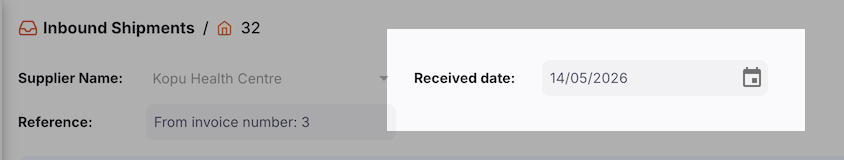
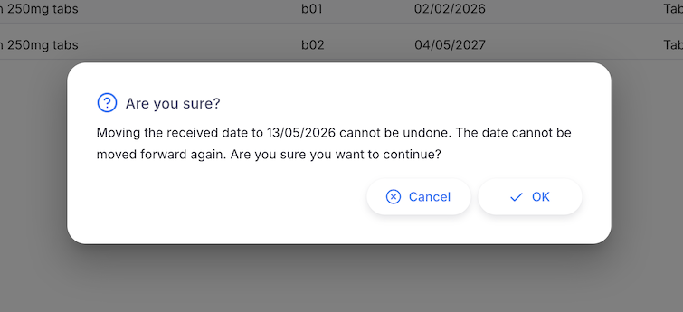

+++
title = "Backdating Inbound Shipments"
description = "Changing the received date of an inbound shipment to an earlier date."
date = 2026-05-14
updated = 2026-05-14
draft = false
weight = 50
sort_by = "weight"
template = "docs/page.html"

[extra]
toc = false
top = false
+++

Backdating allows you to correct the received date of an Inbound Shipment to an earlier date than when it was originally recorded. This is useful when stock was received physically on an earlier date but the shipment was entered into Open mSupply after the fact.

When a received date is backdated, the stock ledger is updated to reflect the correct historical date of receipt, ensuring accurate stock movement records.

Backdating must be enabled by an administrator before this feature is available. See <a href="/docs/manage/global-preferences/#backdating">global preferences</a> for configuration details.

## Requirements

### Permissions

Your user account requires the **Edit inbound shipment received date** permission to change the received date.

### Shipment status

The received date can only be changed on Inbound Shipments with a status of **Received**. It cannot be changed while the shipment is in **New**, **Picked** or **Verified** status.

### Direction

The received date can only be moved **earlier** — it cannot be moved forward to a later date. Once backdated, the date cannot be moved to a later date than the current backdated date.

## Changing the Received Date

The **Received date** field appears in the toolbar at the top of the Inbound Shipment detail view.

To change the received date:

1. Open the Inbound Shipment you want to backdate
2. Locate the **Received date** field in the toolbar
3. Click on the date field to open the date picker
4. Select the earlier date you want to assign as the received date
5. A confirmation dialogue will appear:

6. Click **OK** to confirm, or **Cancel** to leave the date unchanged.

### Stocktake warning

If a stocktake has been recorded for this store **after** the new received date you have selected, an additional warning will appear:

"Stocktake(s) have been recorded after [date]. Adding a new inbound shipment may result in stocktake counts that don't align with the ledger. Are you sure you want to continue with this date?"

Review this warning carefully. Backdating a receipt to before a stocktake date may create inconsistencies between the stocktake snapshot and the actual ledger history. Click **OK** to proceed anyway, or **Cancel** to choose a different date.

## What Changes When You Backdate

When you confirm a new received date:

- The **received date** on the shipment is updated to the new earlier date.
- All **stock movement records** for the shipment's lines are updated to reflect the new date. This means the stock will appear in your historical ledger from the new received date rather than the original date.
- The change is **permanent** — the date cannot be moved forward again once it has been backdated.

## When Backdating is Disabled

If backdating has not been enabled by your administrator, the **Received date** field will be read-only. The field may be read-only for other reasons though. To see why it is disabled, hovering over the field will display the reason:

| Message                                                                                  | Meaning                                                                                   |
| :--------------------------------------------------------------------------------------- | :---------------------------------------------------------------------------------------- |
| **Date editing on shipments is not enabled. This can be changed in global preferences.** | The backdating preference for shipments is turned off. Contact your system administrator. |
| **The received date can only be changed once the shipment has been received.**           | The shipment has not yet reached **Received** status.                                     |
| **The received date is already beyond the maximum backdating limit of [n] days.**        | The current received date is already older than the maximum allowed backdating window.    |
