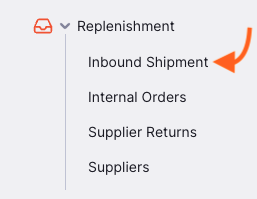
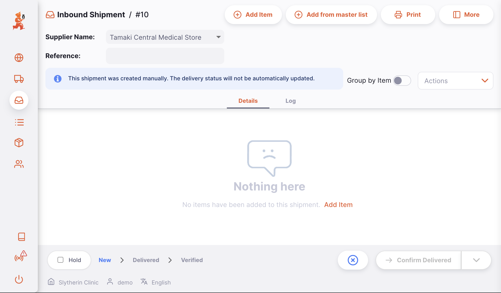
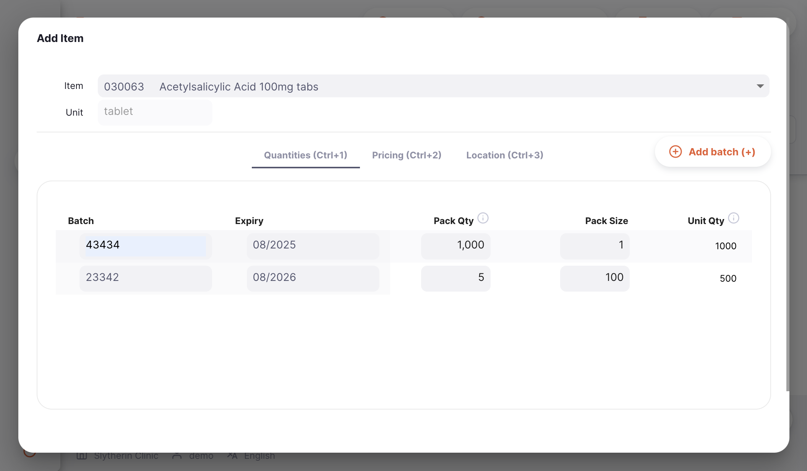
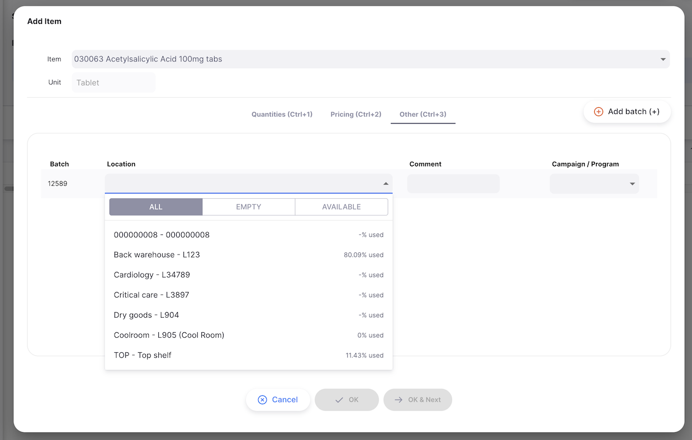
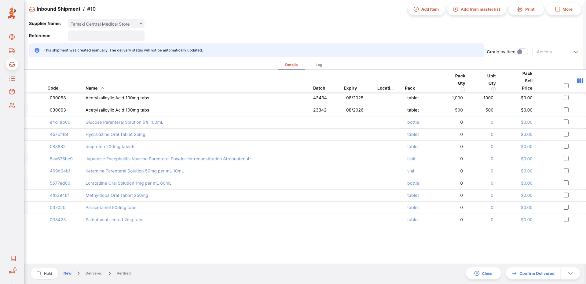

+++
title = "Entradas"
description = "Recibir inventario desde tus proveedores"
date = 2022-03-19
updated = 2022-03-19
draft = false
weight = 44
sort_by = "weight"
template = "docs/page.html"

[extra]
toc = true
top = false
+++

Las entradas se pueden usar para recibir existencias de proveedores.

Si ha utilizado mSupply en el pasado, es posible que esté familiarizado con el término **Factura de proveedor** en lugar de Entrada.

Todos los productos recibidos deben registrarse en mSupply ya sea:

- Creando manualmente una entrada (Entrada manual).
- Trabajando con una Entrada que se haya creado automáticamente como resultado de una transferencia de existencias desde otro almacén en su mSupply.

## Ver las entradas

### Ir al Menú de entradas

Para acceder al menú de **Entradas**:

1. Ir al menú de `Reabastecimiento` en el panel de navegación
2. Hacer clic en `Entrada`

### Lista de entradas

Lo primero que verá es una lista de Entradas existentes..

La lista de Entradas se divide en 7 columnas:

| Columna        | Descripción                      |
| :------------- | :------------------------------- |
| **Nombre**     | Nombre del proveedor             |
| **Estado**     | Estado actual del envío          |
| **Número**     | Número de referencia del archivo |
| **Creado**     | Fecha de creación del envío      |
| **Comentario** | Comentario para el envío         |
| **Total**      | Valor total del envío            |

2. La lista puede mostrar un número fijo de envíos por página. En la esquina inferior izquierda, puedes ver cuántos envíos se están mostrando actualmente en tu pantalla.

3. Si tiene más envíos que el límite actual, puede navegar a las otras páginas haciendo clic en el número de página o utilizando las flechas izquierda o derecha (en la esquina inferior derecha).

4. También puedes seleccionar un número diferente de filas para mostrar por página usando la opción en la parte inferior derecha de la página.

### Buscar por nombre de proveedor

Puede filtrar la lista de envíos por el nombre del proveedor. ¡Esto puede ser útil si está buscando un envío en particular!

Escriba el nombre del proveedor en el campo `Buscar por nombre` (a la izquierda, justo encima de los encabezados de la lista). Todos los envíos para este proveedor aparecerán en la lista.

### Exportar entradas

La lista de entradas puede ser exportada a un archivo separado por comas (CSV). Simplemente haga clic en el botón de exportación (a la derecha, en la parte superior de la página)

y el archivo se descargará. La función de exportación descargará todas las entradas, no solo la página actual, si tiene más de 20 de ellas.

### Eliminar una entrada

Puedes eliminar un envío de la Entradas.

1. Selecciona el envío que deseas eliminar marcando la casilla de verificación que se encuentra en el extremo izquierdo de la lista. Puedes seleccionar más de un envío para eliminarlos. Incluso puedes seleccionarlos todos usando la casilla maestra en los encabezados de la lista.

2. Abre el menú desplegable (en la esquina superior derecha, sobre la lista) y selecciona `Eliminar líneas seleccionadas`.

Una notificación confirma cuántos envíos se eliminaron (en la esquina inferior izquierda).

Solo puedes eliminar Entradas con estado <code>NUEVO</code>.

## Crear una nueva entrada manual

1. Ve a `Reabastecimiento`> `Entrada`
2. Presiona el botón `Nuevo envío`, en la esquina superior derecha
3. Se abrirá una nueva ventana `Proveedores`, invitándote a seleccionar un proveedor

### Selecciona un proveedor

1. En la proveedores `Proveedores`, se te presentará una lista de proveedores. Puedes seleccionar a tu proveedor de la lista o escribir parte del nombre del proveedor.

Puedes saber si un proveedor también utiliza mSupply en su tienda. Si es así, verás un ícono como este (images/is_msupplystoreicon.png" alt="Store" style="width:auto">) junto al código del proveedor. 

En el siguiente ejemplo, estamos recibiendo stock de <b>Tamaki Central Medical Store</b>. 

2. Una vez que hayas seleccionado un proveedor, se creará tu entrada

Si todo salió bien, deberías ver el nombre de tu proveedor en la esquina superior izquierda y el estado actual debería ser  <code>Nuevo</code>.

### Editar el nombre del proveedor

Si ha seleccionado el proveedor equivocado, puede cambiar el nombre del proveedor en el campo `Nombre del proveedor` o seleccionar uno de la lista desplegable:

En el siguiente ejemplo, estamos reemplazando <b>Tamaki Central Medical Store</b> by <b>Waikato District Store</b>. 

### Ingresar una referencia de proveedor

Una vez creada tu entrada, puedes ingresar una referencia del proveedor en el campo `Referencia del proveedor`, si la tienen (por ejemplo, _ PO#1234567 _)

### Ver o editar el panel de información de la entrada

El Panel de Información te permite ver o editar la información acerca de la Entrada. Está dividido en varias secciones:

- Información Adicional
- Documentos Relacionados
- Detalles de la Factura
- Detalles del Transporte

Estamos planeando agregar más secciones en el futuro a medida que Open mSupply crezca 

#### Cómo abrir y cerrar el Panel de Información?

Para abrir el Panel de Información, puede hacer clic en el botón `Más`, ubicado en la esquina superior derecha de la vista de entrada.

Puede cerrar haciendo clic en el botón `X Cerrar`, en la esquina superior derecha del panel de información.

#### Información Adicional

En la sección de **Información Adicional**, puedes:

- Ver quién creó la entrada (nombre del usuario)
- Ver y editar el color de la entrada. Para editar el color, haz clic en el círculo de color y selecciona un color en el menú emergente
- Escribir o editar un comentario

#### Documentos Relacionados

En la sección **Documentos Relacionados**, puedes ver otros documentos transaccionales relacionados con la entrada de mercancía.

Si la entrada de mercancía se creó para cumplir con una **Orden Interna**, el número de referencia de la orden aparecerá en esta sección.

En el futuro, también se incluirán otros documentos como registros de temperatura, documentos de transporte o notas de entrega.

#### Detalles de la factura

En esta sección, verá por defecto el precio total de costo de los artículos listados en la entrada.

También puede agregar **Cargos de Servicio** si desea agregar otros cargos como Costos de Flete. Para agregar un cargo de servicio a los Detalles de la Factura:

1. Toque el botón `Editar Cargos de Servicio`. Se abrirá una nueva ventana.
2. Toque el botón `Agregar Cargo`en la nueva ventana. Aparecerá una nueva línea en la lista de cargos. Toque `Cancelar` si no desea agregar nada.
3. **Nombre:** Seleccione un cargo de servicio en la lista desplegable. Puede personalizar la lista de cargos disponibles. Contacte a su administrador.
4. **Comentario:** Puede agregar un comentario para proporcionar más detalles sobre el nuevo cargo.
5. **Cantidad:** Ingrese el monto del cargo
6. **Impuesto:** Ingrese un % de impuestos para el cargo
7. **Total:** El campo total se calcula automáticamente en función del monto y el porcentaje de impuestos
8. **Delete:** Puede tocar el ícono `Eliminar` para eliminar el cargo

En esta sección, también puede editar la tasa de impuestos (%) para el precio de costo. Toque el icono del lápiz y ingrese la nueva tasa.

#### Detalles de Transporte

En esta sección, puede ver o editar un número de referencia de transporte (por ejemplo, un número de guía o seguimiento).

### Secuencia del estado de una Entrada

La secuencia de estados se encuentra en la esquina inferior izquierda de la pantalla de entrada de envío.

Los estados pasados están resaltados en azul, los próximos estados aparecen en gris.

<figure>
    
    <figcaption align="center">Secuencia de estado: el estado actual es <code>Nuevo</code>.</figcaption>
</figure>

<figure>
    
    <figcaption align="center">Secuencia de estado: el estado actual es </i><code>Enviado</code>.</figcaption>
</figure>

Hay 5 estados posibles para una entrada:

| Estado         | Descripción                                                                                                                     |
| :------------- | ------------------------------------------------------------------------------------------------------------------------------- |
| **Nuevo**      | Este es el primer estado cuando se crea una nueva entrada manual                                                                |
| **Recogido**   | El proveedor ha confirmado que el envío está recogido y listo para enviar (solo se aplica a los envíos creados automáticamente) |
| **Enviado**    | El envío ha sido enviado y los bienes están en tránsito (solo se aplica a los envíos creados automáticamente)                   |
| **Entregado**  | Cuando se confirma que el envío ha sido entregado                                                                               |
| **Verificado** | Cuando se ha verificado la entrada                                                                                              |

Probablemente hayas notado que dos de los valores de estado solo se aplican a los envíos creados automáticamente. Estos se crean automáticamente por el sistema cuando otro almacén en el sistema crea un envío saliente para entregar existencias a tu almacén. Si este es el caso, verás un mensaje cerca de la parte superior de la página:

Si, sin embargo, ha creado un envío de entrada manualmente, entonces se muestra el siguiente mensaje:

y verá que la barra de estado tiene solo los valores de estado que corresponden a este tipo de envío.

<figure align="center">
    
    <figcaption align="center">Secuencia de estado: el estado actual es </i><code>Nuevo</code>.</figcaption>
</figure>

Si colocas el cursor sobre la secuencia de estados, aparecerá una ventana de historial de envíos. Podrás ver la fecha en que se actualizó un envío de un estado a otro.

Este envío manual se ha creado el 03/03/2022

Este envío automático se ha creado el 03/03/2022, se ha asignado el 04/03/2022 y se ha recogido el 07/03/2022

### Casilla de verificación de Retener

Ubicada en la esquina inferior izquierda, a la izquierda de la secuencia de estado.

Marcar la casilla `Retener` evita que la entrada de envío entre en el siguiente estado.

### Botón de confirmar y cerrar

#### Botón Cerrar

Haz clic en el botón `Cerrar` para salir de la vista del envío entrante y volver a la lista de entradas.

#### Botón Confirmar

El botón confirmar `Confirmar` es el botón para actualizar el estado de un envío. El estado que se puede confirmar depende del estado actual del envío y sigue la secuencia que se muestra a continuación.

Cuando gestionas una entrada, solo puedes confirmarla como entregada o verificada.

| Confirmar...             | Estado actual | Siguiente estado |
| :----------------------- | :------------ | :--------------- |
| **Confirmar entregado**  | Enviado       | Entregado        |
| **Confirmar verificado** | Entregado     | Verificado       |

No es necesario que actualices un envío al siguiente estado de la secuencia. Puedes optar por saltar algunos de ellos y actualizarlo directamente a `Confirmar Verificado`, por ejemplo.

Como se muestra a continuación, haz clic en la flecha hacia abajo del botón `Confirmar` y selecciona el estado al que deseas actualizar el envío.

## Agregar líneas a una entrada

Para agregar una línea, haz clic en el botón `Agregar artículo` ubicado en la esquina superior izquierda de la pantalla.

Se abrirá una nueva ventana `Agregar Artículo`.

### Seleccionar un artículo

En la ventana `Agrgear Artículo`, puedes buscar un artículo de las siguientes maneras:

- Revisando la lista de artículos disponibles
- Escribiendo parte o todo el nombre del artículo
- Escribiendo parte o todo el código del artículo

Una vez que el artículo esté resaltado, haz clic en el nombre o presiona `Enter`.

### Pestaña de cantidades

En la pestaña `Cantidades`, Puedes actualizar los siguientes cambios:

1. **Lote**: Escriba aquí el número de lote. Deje en blanco si el artículo no se gestiona con número de lote.
2. **Caducidad**: La fecha de caducidad del número de lote. Deje en blanco si no corresponde
3. **# Paquetes**: La cantidad de paquetes que estás recibiendo.
4. **Tamaño del paquete**: La cantidad de unidades por paquete (por defecto, el tamaño del paquete es 1).
5. **Cantidad de unidades** (de sólo lectura): Se calcula automáticamente en función de # de paquetes y Tamaño del paquete (`[# Paquetes] x [Tamaño del paquete]`)
6. Si estás recibiendo más de un número de lote para el mismo artículo, puedes hacer clic en el botón `Agregar lote`

En el siguiente ejemplo, estamos recibiendo 2 números de lote para el artículo <i>030453 - Amoxicillina 250mg tabs</i> con un tamaño de paquete diferente. 

### Pestaña de precios

En la segunda pestaña, `Precios`, puedes actualizar los siguientes campos (todos son opcionales):

- **Venta**: El precio de venta por unidad del artículo (el valor predeterminado es 0)
- **Costo**: El precio de compra por unidad del artículo (el valor predeterminado es 0)
- **Cantidad de unidad** (solo lectura): Número total de unidades para el número de lote
- **Total de línea** (solo lectura): Valor total de compra para el número de lote (`[Cantidad de unidad] x [Costo]`)

Los precios de venta y costo son por unidad y no por paquete. 

En el siguiente ejemplo, el precio de venta es de $12 por unidad y el precio de costo es de $10 por unidad. 

### Pestaña de ubicación

En la tercera pestaña, `Ubicación`, puedes seleccionar una ubicación de almacenamiento para asignar el número de lote a una ubicación en tu almacén.

Simplemente selecciona una ubicación de almacenamiento en el menú desplegable `Ubicación`.

¿No conoces la ubicación de almacenamiento todavía? No es necesario que la captures de inmediato. Puedes actualizar la ubicación de almacenamiento en cualquier momento si aún no has confirmado la verificación. 

### Confirmar el artículo y las cantidades

Cuando hayas terminado, puedes agregar la nueva línea al tocar:

- `Aceptar`si no deseas agregar otra línea a tu envío
- `Aceptar & Siguiente` si tienes otras líneas para crear

De lo contrario, puedes presionar `Cancelar` y tusd cambios no se guardarán.

## Añadir líneas a una entrada utilizando una lista maestra

Haz clic en el botón `Añadir desde lista maestra` (esquina superior derecha).

El botón estará desactivado si el estado de la entrada es cualquier cosa que no sea <code>Nuevo</code>

Se abrirá una nueva ventana de `Listas Maestras`. Esto te permite seleccionar la lista maestra requerida. Simplemente haz clic en una de las listas (si tienes alguna disponible)

Haz clic en `Aceptar` en el cuadro de diálogo:

Luego se agregarán líneas de marcador de posición a tu envío, que se verán así:

Las filas importadas tendrán cero para el valor de número de paquetes y, por lo tanto, se mostrarán en una fuente azul sin mostrar el lote, la caducidad, la ubicación, etc. Puedes seguir los pasos para editar estas líneas, como se detalla arriba.

## Editar una línea de una entrada

Para editar una línea de una entrada, simplemente toca en ella. Se abrirá la ventana `Editar artículo`, que es idéntica a la ventana `Agregar artículo`, excepto que el elemento ya está seleccionado y no se puede modificar.

### Editar una línea de envío

 <b></b> Puedes editar una línea de envío si el estado del envío es menor que <code>Verificado</code>. 

1. Abre la entrada que deseas editar
2. Toca en la línea que deseas editar. Aparecerá una ventana idéntica a la de `Agregar artículo`. En este momento:

   - Edita el campo principal de `Cantidad recibida`
   - O cambia el valor de número de paquetes a nivel de número de lote

 <b></b> Cuando editas una línea de envío, no puedes cambiar el artículo. Deberás eliminar la línea de envío y crear una nueva. 

### Eliminar una línea de envío

1. Abre la entrada que deseas editar
2. Asegúrate de que el estado aún no es `VERIFICADO`
3. Selecciona la(s) línea(s) que deseas eliminar marcando la casilla a la derecha de la lista
4. Ve al menú desplegable `Acciones` (esquina superior derecha, encima de la lista)
5. Selecciona la acción `Eliminar líneas seleccionadas`

En el siguiente ejemplo, estamos eliminando <i>item 030453 - Amoxicillina 250mg tabs</i>

Puedes eliminar varias líneas a la vez. Asegúrate de revisar lo que está seleccionado antes de realizar la acción de Eliminar. 

## Recibir inventario con una entrada

### Confirmar la entrega del envío

Ya sea que su envío de entrada sea **manual** o **automatico**, el primer paso para recibir la mercancía es confirmar la entrega

En esta etapa, no tiene que verificar si las cantidades u otra información son correctas, solo tiene que reconocer que ha recibido la mercancía de su proveedor.

Para confirmar que se ha entregado una entrada, haga clic en el botón `Confirmar Entrega`.

En caso de que su Envío de entrada sea <b>automatico</b>, no puede confirmar su entrega a menos que el proveedor haya confirmado su envío. En otras palabras, su estado de envío debe ser <code>ENVIADO</code> antes de que pueda confirmar que ha recibido la mercancía. 

Cualquier línea no asignada con un valor de 0 para el número de paquetes se eliminará automáticamente cuando lo confirme.

### Verifica tu entrada

La verificación es el último paso para recibir bienes en mSupply. En esta etapa, puedes revisar lo que has recibido y asegurarte de que la información en mSupply sea correcta.

Tienes la posibilidad de verificar la siguiente información:

- Números de lote y sus fechas de vencimiento
- Cantidad de paquetes y tamaño de paquete
- Información de precios: precios de costo y venta

También puedes capturar dónde se almacenarán los productos recibidos en la pestaña `Ubicación`.

Una vez que se hayan capturado o verificado todas las información, puedes confirmar el envío como `VERIFICADO` tocando el botón `Confirmar verificado`.

Una vez que hayas hecho esto:

- Los productos forman parte de tu inventario
- El estado del envío ahora es `Verificado`
- Ya no puedes editar las líneas del envío
- Ya no puedes eliminar el envío

## Visualización de entradas

Cuando se visualiza un envío específico, puede ver los lotes en ese envío agrupados por artículo o con cada lote listado por separado.
Para cambiar el modo de vista, haga clic en el botón `Agrupar por artículo`.

Cuando se agrupa por artículo, puede expandir el artículo para ver los lotes individuales o utilizar la expansión en el encabezado de la tabla para expandir todas las filas agrupadas. Si hace clic en un artículo, también verá todos los lotes seleccionados, como se muestra en este ejemplo:

Si no tiene suficiente espacio en su pantalla, o simplemente no está interesado en algunas de las columnas mostradas, tiene la opción de ocultar las columnas que se muestran en esta vista.

Haga clic en el botón `Mostrar / ocultar columnas` que se encuentra en la parte superior derecha de la tabla. Esto muestra una lista de las columnas disponibles: puede marcar las columnas que desea ver. Las opciones elegidas se almacenan para el navegador actual, por lo que la próxima vez que vea una entrada, verá solo las columnas seleccionadas. Si ha elegido qué columnas mostrar, entonces el botón se muestra en azul para recordarle que hay más columnas disponibles.

