+++
title = "Livraisons Entrantes"
description = "Réception du stock des fournisseurs."
date = 2022-03-19
updated = 2022-03-19
draft = false
weight = 44
sort_by = "weight"
template = "docs/page.html"

[extra]
toc = true
top = false
+++

Les Livraisons Entrantes peuvent être utilisées pour recevoir du stock des fournisseurs.

Si vous avez utilisé mSupply par le passé, vous connaissez peut-être ce concept sous le nom de **Facture fournisseur**.

Tous les biens reçus doivent être enregistrés dans mSupply soit en :

- Créant manuellement une Expédition Entrante
- Travaillant avec une Expédition Entrante créée automatiquement suite à un transfert de stock depuis un autre dépôt de votre système mSupply

## Consulter les Livraisons Entrantes

### Accéder au menu Livraisons Entrantes

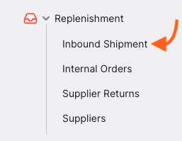

Pour accéder au menu **Expédition Entrante** :

1. Allez dans le menu `Réapprovisionnement` dans le panneau de navigation
2. Cliquez sur `Livraison Entrante`

### Liste des Livraisons Entrantes

La première chose que vous voyez est une liste des Livraisons Entrantes existantes.

La liste est divisée en 7 colonnes :

| Colonne         | Description                                                                         |
| :-------------- | :---------------------------------------------------------------------------------- |
| **Nom**         | Nom du fournisseur                                                                  |
| **Statut**      | Statut actuel de l'expédition                                                       |
| **Numéro**      | Numéro de référence de l'expédition                                                 |
| **Créée**       | Date de création de l'expédition                                                    |
| **Livrée**      | Date de livraison de l'expédition                                                   |
| **Commentaire** | Commentaire sur l'expédition                                                        |
| **Référence**   | Contiendra le numéro de facture fournisseur si l'expédition a été créée automatiquement |
| **Total**       | Valeur totale de l'expédition                                                       |

Les statuts existants continueront à s'afficher si vous avez déjà des Livraisons Entrantes dans votre système avant de configurer les statuts de facture pour votre dépôt.

2. La liste peut afficher un nombre fixe de livraisons par page. En bas à gauche, vous pouvez voir combien de livraisons sont actuellement affichées.

3. Si vous avez plus de livraisons que la limite actuelle, vous pouvez naviguer vers d'autres pages en cliquant sur le numéro de page ou en utilisant les flèches droite ou gauche (coin inférieur droit).

4. Vous pouvez également sélectionner un nombre différent de lignes à afficher par page en utilisant l'option en bas à droite.

### Filtrer les Livraisons Entrantes

Vous pouvez filtrer la liste par nom de fournisseur, date de création, statut ou numéro de facture.

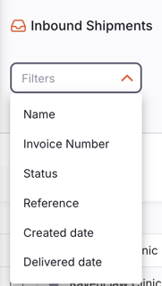

Par exemple, pour filtrer par nom de fournisseur, cliquez sur `Filtres`, sélectionnez `Nom` et commencez à saisir tout ou partie d'un nom de fournisseur. Toutes les livraisons pour ce fournisseur apparaîtront dans la liste.

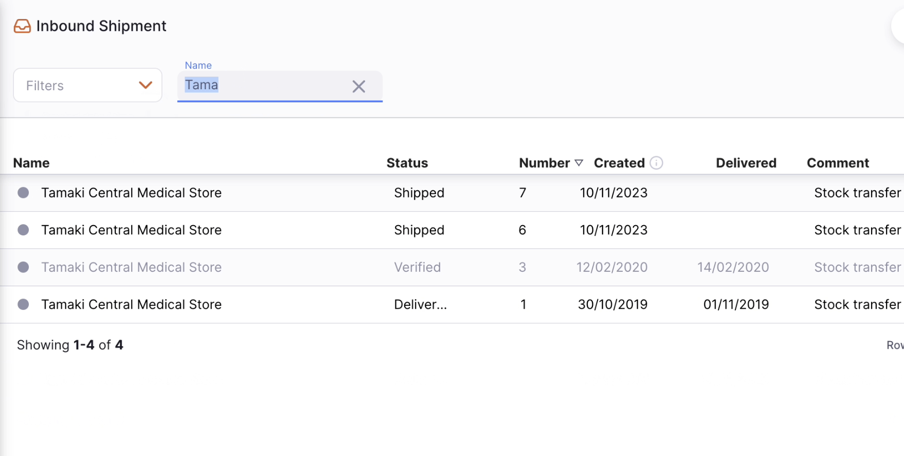

### Exporter les Livraisons Entrantes

La liste des Livraisons Entrantes peut être exportée en fichier CSV. Cliquez simplement sur le bouton d'export (à droite, en haut de la page).

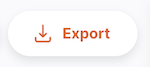

La fonction d'export téléchargera toutes les Livraisons Entrantes, pas seulement la page actuelle, si vous en avez plus de 20.

### Supprimer une Expédition Entrante

Vous pouvez supprimer une expédition depuis la liste.

1. Sélectionnez l'expédition à supprimer en cochant la case à gauche. Vous pouvez en sélectionner plusieurs, voire toutes en utilisant la case principale dans les en-têtes.

2. Le pied de page `Actions` s'affichera en bas de l'écran. Cliquez sur `Supprimer`.

Une notification confirme le nombre de livraisons supprimées (coin inférieur gauche).

Vous ne pouvez supprimer que les Livraisons Entrantes avec le statut <code>NOUVELLE</code>.

## Créer une nouvelle Expédition Entrante manuelle

1. Allez dans `Réapprovisionnement` > `Expédition Entrante`
2. Appuyez sur le bouton `Nouvelle Expédition`, dans le coin supérieur droit
3. Une nouvelle fenêtre `Fournisseurs` s'ouvre, vous invitant à sélectionner un fournisseur

### Sélectionner un fournisseur

1. Dans la fenêtre `Fournisseurs`, une liste de fournisseurs vous est présentée. Vous pouvez sélectionner votre fournisseur dans la liste ou saisir tout ou partie de son nom.

Vous pouvez savoir si un fournisseur utilise également Open mSupply dans son dépôt. Si c'est le cas, vous verrez une icône comme celle-ci  à côté du code fournisseur.

Dans l'exemple ci-dessous, nous recevons du stock de <b>Tamaki Central Medical Store</b>.

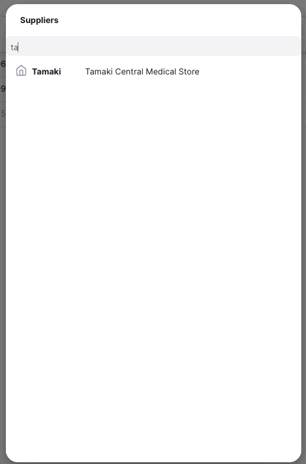

2. Une fois que vous avez sélectionné un fournisseur, votre Expédition Entrante est créée.

Si tout s'est bien passé, vous devriez voir le nom de votre fournisseur dans le coin supérieur gauche et le statut actuel devrait être <code>Nouvelle</code>.

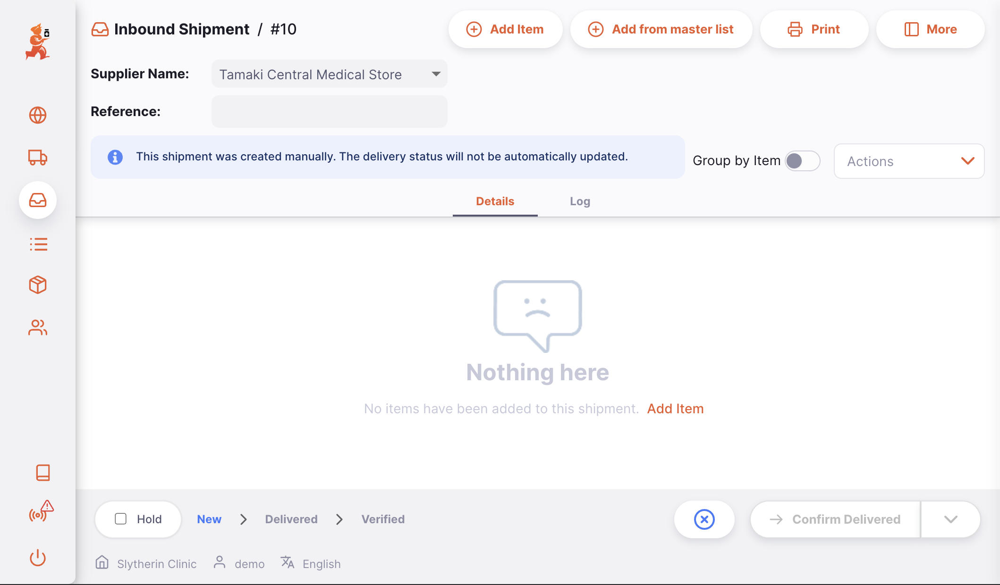

### Modifier le nom du fournisseur

Si vous avez sélectionné le mauvais fournisseur, vous pouvez changer le nom dans le champ `Nom du fournisseur` ou en sélectionner un dans la liste déroulante :

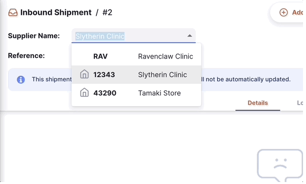

### Saisir une référence fournisseur

Une fois votre Expédition Entrante créée, vous pouvez saisir une référence fournisseur dans le champ `Réf. fournisseur`, s'ils en ont une (ex. BC#1234567)

### Consulter ou modifier le panneau d'informations

Le panneau d'informations vous permet de voir ou de modifier des informations sur l'Expédition Entrante. Il est divisé en plusieurs sections :

- Informations supplémentaires
- Documents liés
- Détails de la facture
- Détails de transport

#### Comment ouvrir et fermer le panneau d'informations ?

Pour ouvrir le panneau, appuyez sur le bouton `Plus` dans le coin supérieur droit. Pour le fermer, appuyez sur le bouton `X Fermer`.

#### Informations supplémentaires

Dans cette section, vous pouvez : voir le nom du donateur (si le suivi des donateurs est activé), voir qui a créé l'Expédition Entrante, voir et modifier la couleur de l'expédition, et rédiger ou modifier un commentaire.

#### Documents liés

Dans cette section, vous pouvez voir d'autres documents de transaction liés à l'Expédition Entrante. Si votre expédition a été créée pour satisfaire une **Commande Interne**, le numéro de référence de votre commande apparaîtra dans cette section.

#### Détails de la facture

Vous verrez par défaut le coût total des articles listés dans l'Expédition Entrante.

Vous pouvez également ajouter des **Frais de service** (ex. `Frais de transport`). Pour ajouter des frais de service :

1. Appuyez sur le bouton `Modifier les frais de service`. Une nouvelle fenêtre s'ouvre.
2. Appuyez sur `Ajouter un frais`. Une nouvelle ligne apparaît dans la liste.
3. **Nom :** sélectionnez un frais de service dans la liste déroulante.
4. **Commentaire :** vous pouvez ajouter un commentaire.
5. **Montant :** saisissez le montant du frais.
6. **Taxe :** saisissez un pourcentage de taxe.
7. **Total :** calculé automatiquement.
8. **Supprimer :** vous pouvez appuyer sur l'icône `Supprimer` pour effacer le frais.

###### Devises étrangères

Si votre dépôt émet en devises étrangères, suivez [ces instructions](https://docs.msupply.org.nz/other_stuff:currencies) dans la documentation du serveur central pour la configuration. Vous devrez également activer la préférence de dépôt `Dépôt : Peut émettre en devise étrangère`.

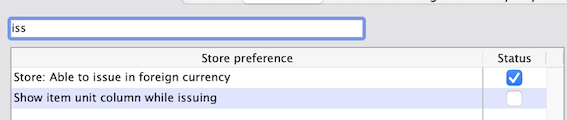

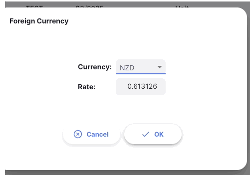
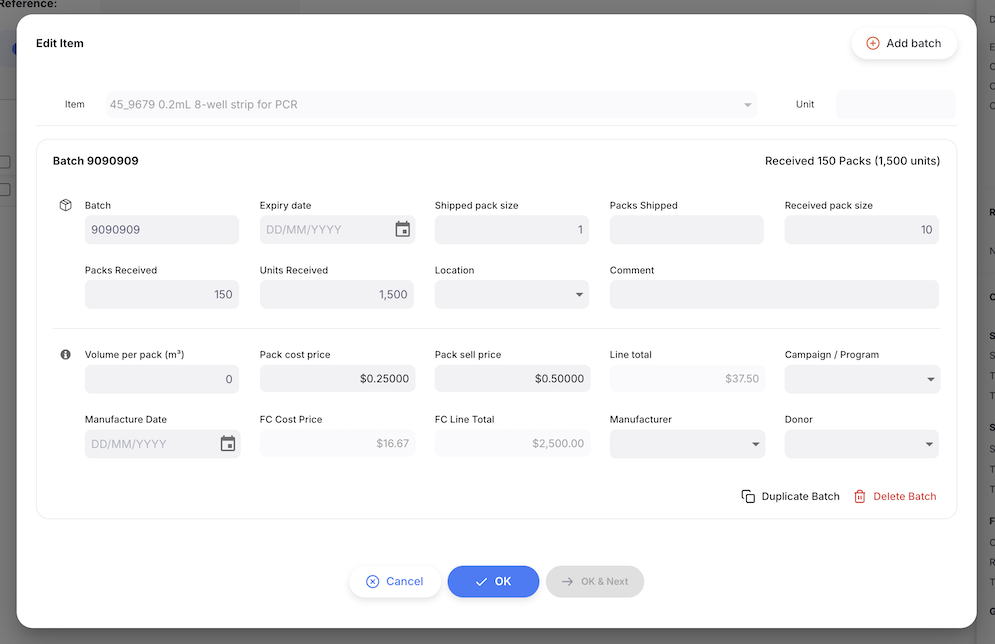

Voir la <a href="/docs/introduction/faq/#is-there-support-for-my-currency">question sur la prise en charge des devises</a> pour la liste des codes pris en charge

#### Détails de transport

Dans cette section, vous pouvez voir ou modifier un numéro de référence de transport (ex. un numéro de réservation ou de suivi).

#### Actions

1. **Supprimer :** appuyez sur le bouton `Supprimer` pour supprimer la facture
2. **Copier dans le presse-papiers** : copie les détails de la facture dans le presse-papiers.

### Séquence de statuts de l'Expédition Entrante

La séquence de statuts est située dans le coin inférieur gauche de l'écran.

Les statuts passés sont mis en surbrillance en bleu, les statuts suivants apparaissent en gris.

<figure>
    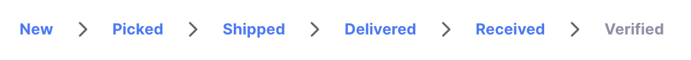
    <figcaption align="center">Séquence de statuts : le statut actuel est <code>Réceptionnée</code>.</figcaption>
</figure>

Il y a 6 statuts pour les Livraisons Entrantes :

| Statut       | Description                                                                                                                   | mSupply | Modifiable |
| :----------- | ----------------------------------------------------------------------------------------------------------------------------- | :-----: | :--------: |
| **Nouvelle** | Premier statut lors de la création d'une nouvelle Livraison Entrante manuelle                                                 |   nw    |            |
| **Prélevée** | Le fournisseur a confirmé que la livraison est prélevée et prête à être envoyée (uniquement pour les livraisons automatiques) |   nw    |            |
| **Expédiée** | La livraison a été envoyée et les articles sont en transit (uniquement pour les livraisons automatiques)                      |   nw    |            |
| **Livrée**   | Lorsque vous confirmez que la livraison a été livrée.                                                                         |   sg    |     ✓      |
| **Reçue**    | Lorsque vous confirmez que la livraison a été validée. Les articles font maintenant partie de votre inventaire.               |   cn    |     ✓      |
| **Vérifiée** | Lorsque vous avez vérifié la Livraison Entrante                                                                               |   fn    |            |

Vous avez probablement remarqué que deux statuts s'appliquent uniquement aux livraisons créées automatiquement. Si c'est le cas, vous verrez un message en haut de la page :

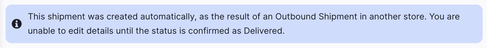

Ce message s'affiche différemment si le statut est `Livrée` ou `Vérifiée` :

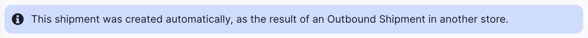

Si vous avez créé une Expédition Entrante manuellement, le message suivant s'affiche :

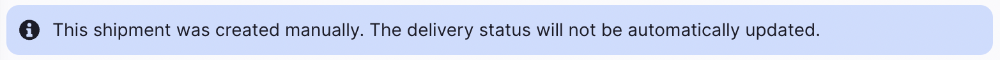

<figure align="center">
    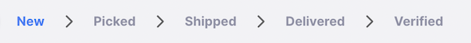
    <figcaption align="center">Séquence de statuts : le statut actuel est <code>Nouvelle</code>.</figcaption>
</figure>

Si vous survolez la séquence de statuts, un historique de l'expédition apparaît avec les dates de chaque changement de statut.

Cette expédition manuelle a été créée le 24/04/2025

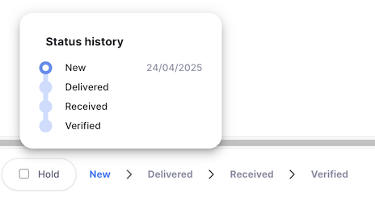

Cette expédition automatique a été créée le 10/04/2025, prélevée le 11/04/2025 et expédiée le 12/04/2025

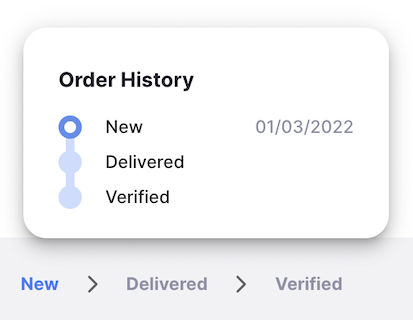

### Case à cocher En attente

Située dans le coin inférieur gauche, à gauche de la séquence de statuts.

Cocher la case `En attente` empêche l'Expédition Entrante d'être mise à jour vers le statut suivant.

### Boutons Fermer et Confirmer

#### Bouton Fermer

Cliquez sur le bouton `Fermer` pour quitter la vue de l'Expédition Entrante et revenir à la liste.

#### Bouton Confirmer

Le bouton `Confirmer` met à jour le statut de l'expédition. Lors de la gestion d'une Expédition Entrante, vous pouvez uniquement la confirmer comme Livrée ou Vérifiée.

| Confirmer...              | Statut actuel | Statut suivant |
| :------------------------ | :------------ | :------------- |
| **Confirmer Livrée**      | Expédiée      | Livrée         |
| **Confirmer Vérifiée**    | Livrée        | Vérifiée       |

Vous n'avez pas à suivre la séquence dans l'ordre. Vous pouvez choisir de passer directement à `Confirmer Vérifiée` par exemple.

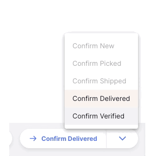

## Ajouter des lignes à une Expédition Entrante

Pour ajouter une ligne, appuyez sur le bouton `Ajouter un Article` dans le coin supérieur gauche.

Une nouvelle fenêtre `Ajouter un Article` s'ouvre.

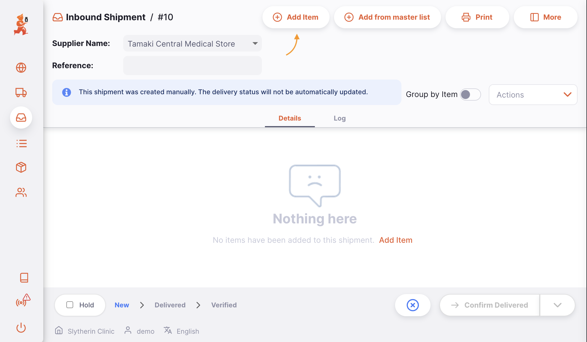

### Sélectionner un article

Dans la fenêtre `Ajouter un Article`, vous pouvez rechercher un article par la liste, par nom ou par code.

Une fois votre article mis en surbrillance, appuyez sur son nom ou sur `Entrée`.

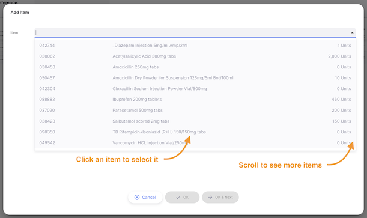
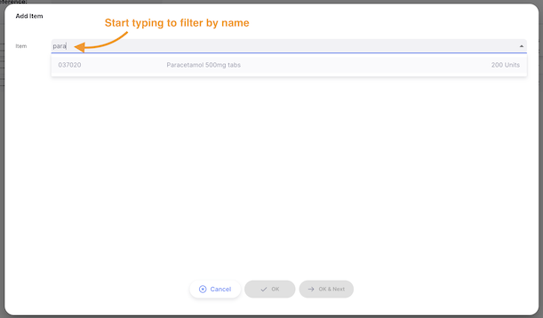
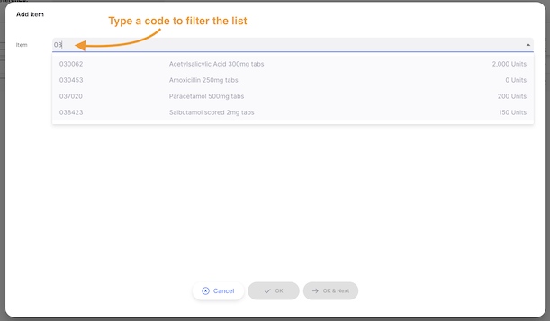

### Onglet Quantités

Dans l'onglet `Quantités`, vous pouvez mettre à jour les champs suivants :

1. **Lot** : saisissez le numéro de lot. Laissez vide si l'article n'est pas géré par numéro de lot.
2. **Expiration** : la date d'expiration du lot. Laissez vide si non applicable.
3. **Taille de conditionnement** : le nombre d'unités par conditionnement (par défaut : 1)
4. **Conditionnements reçus** : le nombre de conditionnement que vous recevez.
5. **Conditionnements expédiés** : le nombre de conditionnement envoyés par le fournisseur.
6. **Unités reçues** : le nombre d'unités que vous recevez.

L'intitulé « Unités » sera remplacé par le nom de l'unité définie pour cet article. Par exemple, si l'unité est « Comprimé », l'intitulé affichera « Comprimés reçus ».

**Colonnes vaccins supplémentaires**

L'onglet Quantités affichera des colonnes supplémentaires lorsque certaines préférences sont activées dans [Gérer > Dépôts](/docs/manage/facilities/#editing-store-preferences).

Avec la préférence `Afficher les vaccins en doses` :

1. **Doses par unité** : le nombre de doses par unité.
2. **Doses reçues** : le nombre de doses reçues.

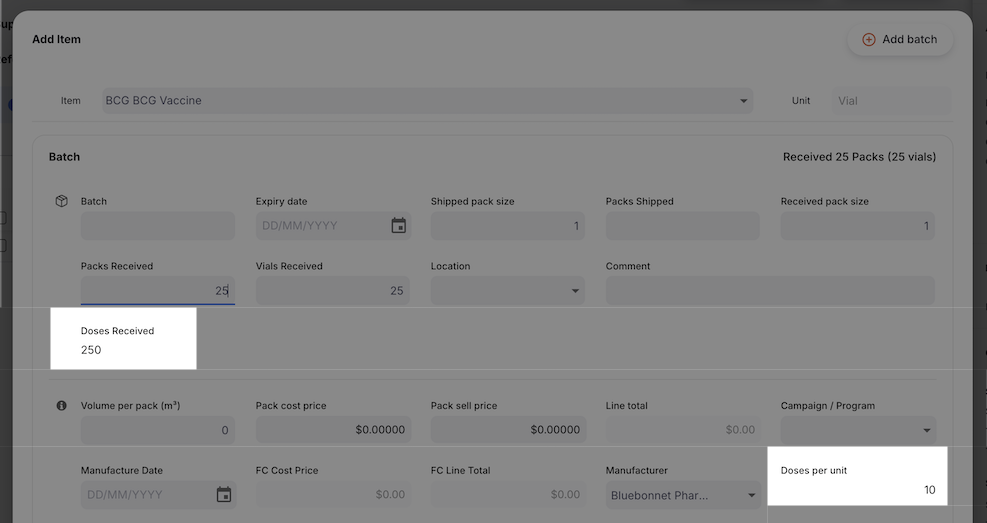

Avec la préférence `Gérer le statut VVM pour le stock` :

8. **Statut VVM** : le statut VVM actuel pour le lot.

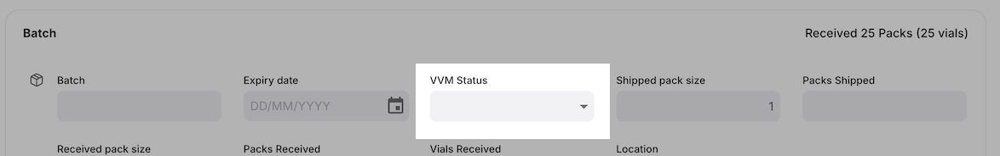

#### Ajouter des lots

Si vous recevez plusieurs numéros de lot pour le même article, appuyez sur le bouton `Ajouter un lot`.

Dans l'exemple ci-dessous, nous recevons 2 numéros de lot pour l'article <i>030063 - Acide Acétylsalicylique 100mg comprimés</i> avec des tailles de conditionnement différentes.

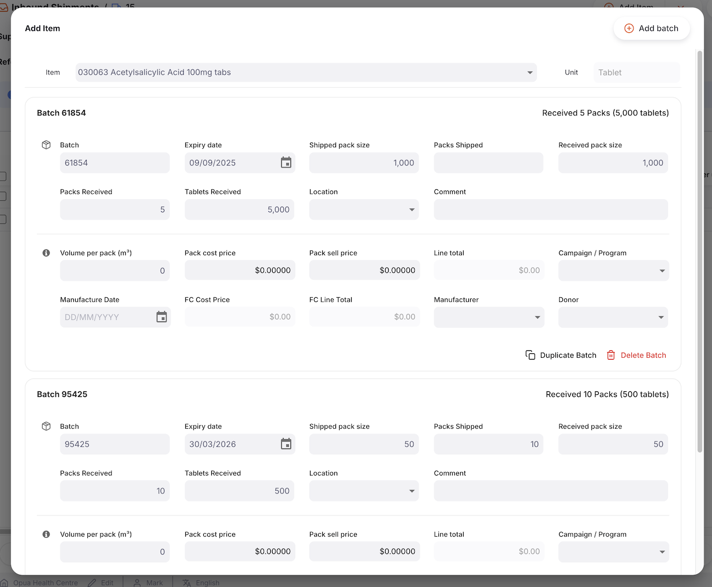

### Onglet Tarification

Dans l'onglet `Tarification`, vous pouvez mettre à jour les champs suivants (tous optionnels) :

- **Lot** (lecture seule) : numéro de lot
- **Taille de conditionnement** (lecture seule) : quantité d'unités par conditionnement
- **Qté conditionnements** (lecture seule) : quantité de conditionnements reçus
- **Coût conditionnement** : prix d'achat par conditionnement (valeur par défaut : 0)
- **Prix de vente conditionnement** : prix de vente par conditionnement (valeur par défaut : 0)
- **Total ligne** (lecture seule) : valeur d'achat totale pour le numéro de lot

Dans l'exemple ci-dessous, le prix de coût de la première ligne est de 0,01$ par unité et le prix de vente est de 0,10$ par unité.

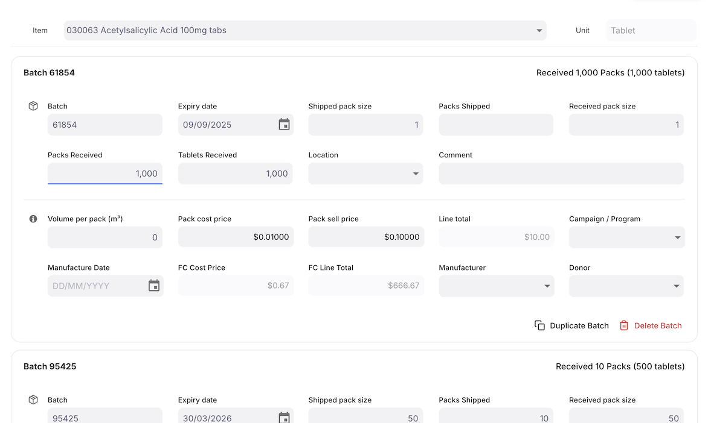

#### Tarification sur les livraisons transférées

Lorsqu'une Livraison Entrante est un transfert (résultat d'une Livraison Sortante depuis un autre dépôt), la tarification peut déjà être calculée. La logique suivante est utilisée pour déterminer le prix de vente :

1. Si un `prix de vente par défaut par conditionnement` est défini pour l'article dans le dépôt récepteur, ce prix est toujours utilisé.
2. Si l'article a une `marge` définie, cette marge est ajoutée au prix de coût. La priorité entre marge article et marge fournisseur est déterminée par la [Préférence globale](/docs/manage/global-preferences/) `La marge article prime sur la marge fournisseur`.
3. Si ni prix de vente par défaut ni marge ne sont définis, le prix de vente de la ligne entrante sera identique à celui de la ligne sortante.

### Onglet Autre

Dans le troisième onglet `Autre`, vous pouvez sélectionner :

- **Emplacement** : un emplacement de stockage pour le lot.
- **Commentaire** : champ de texte libre pour un commentaire.
- **Donateur** : un donateur, si le suivi des donateurs est configuré.
- **Campagne / Programme** : associez la ligne de stock à une campagne ou un programme.
- **Fabricant** : si des [Variantes d'Articles](/docs/catalogue/items/#item-variants) sont configurées, vous pouvez voir et modifier le fabricant.

### Confirmer l'article et les quantités

Lorsque vous avez terminé, vous pouvez ajouter la nouvelle ligne en appuyant sur :

- `OK` si vous ne souhaitez pas ajouter d'autre ligne
- `OK & Suivant` si vous avez d'autres lignes à créer

Sinon, appuyez sur `Annuler` pour ne pas enregistrer vos modifications.

## Ajouter des lignes via une liste maîtresse

Appuyez sur le bouton `Ajouter depuis une liste maîtresse` (coin supérieur droit).

Le bouton sera désactivé si le statut de l'Expédition Entrante est autre que <strong>Nouvelle</strong>.

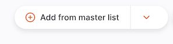

Une nouvelle fenêtre `Listes Maîtresses` s'ouvre. Cliquez simplement sur l'une des listes disponibles.

Cliquez sur `OK` sur le message de confirmation :

Des lignes de remplacement seront ajoutées à votre expédition avec une quantité de conditionnements à zéro, affichées en police bleue.

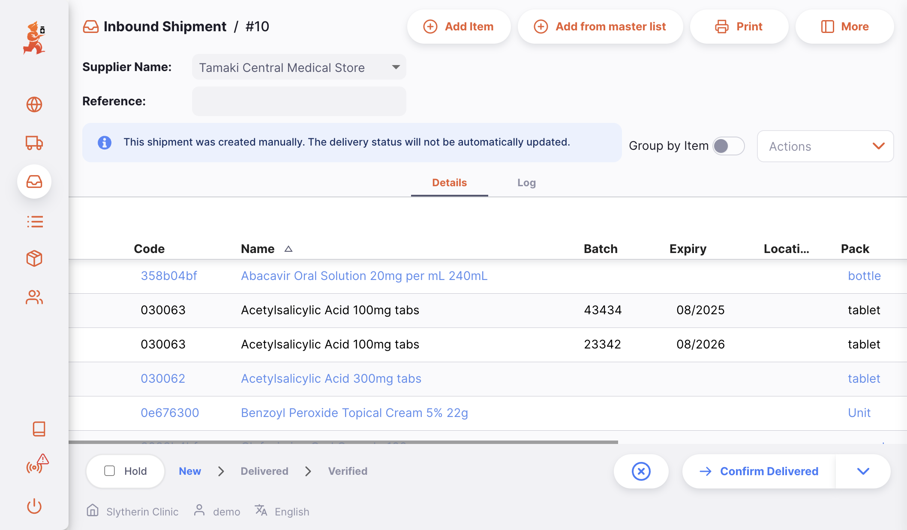

## Modifier une ligne d'Expédition Entrante

Pour modifier une ligne, appuyez simplement dessus. La fenêtre `Modifier un Article` s'ouvre, identique à `Ajouter un Article`, sauf que l'article est déjà choisi et ne peut pas être modifié.

### Modifier une ligne

Vous pouvez modifier une ligne d'expédition si l'expédition a un statut inférieur à <code>Vérifiée</code>.

### Supprimer une ligne

1. Ouvrez l'Expédition Entrante à modifier
2. Assurez-vous que le statut n'est pas encore `VÉRIFIÉE`
3. Sélectionnez la ou les lignes à supprimer en cochant les cases à gauche
4. Cliquez sur le bouton `Supprimer` en bas de la page.

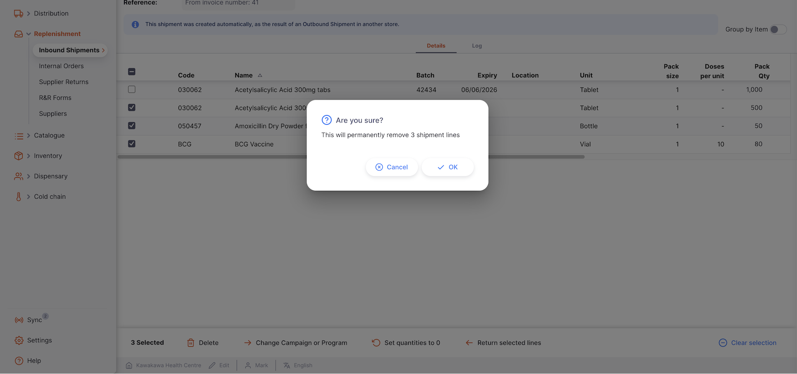

### Autres actions sur les lignes

| Action                             | Effet                                                                                                                                                |
| ---------------------------------- | ---------------------------------------------------------------------------------------------------------------------------------------------------- |
| Supprimer                          | Supprime les lignes sélectionnées                                                                                                                    |
| Modifier Campagne ou Programme     | Ouvre une fenêtre pour choisir un programme ou une campagne à associer à toutes les lignes sélectionnées                                             |
| Définir les quantités à 0          | Définit la valeur `Conditionnements reçus` à zéro pour toutes les lignes sélectionnées                                                               |
| Retourner les lignes sélectionnées | Ouvre une fenêtre pour retourner tout ou partie des lignes sélectionnées. Disponible uniquement si le statut de la livraison est `Reçu` ou ultérieur |
| Effacer la sélection               | Efface les cases de sélection                                                                                                                        |

## Télécharger des documents

Vous pouvez avoir des documents liés que vous souhaitez télécharger avec une Expédition Entrante (bons de livraison, documents de transport, relevés de température, etc.).

L'Expédition Entrante inclut un onglet `Documents`. Depuis cet onglet, sélectionnez `Télécharger un document` en haut de l'écran et choisissez un fichier :

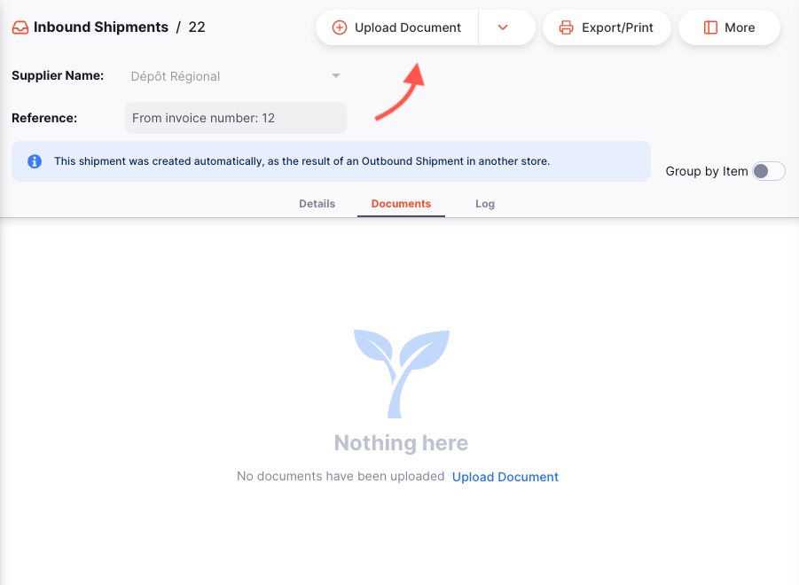

Vous pouvez télécharger ou supprimer des documents précédemment chargés en les sélectionnant dans la liste et en choisissant l'action appropriée en bas de l'écran :

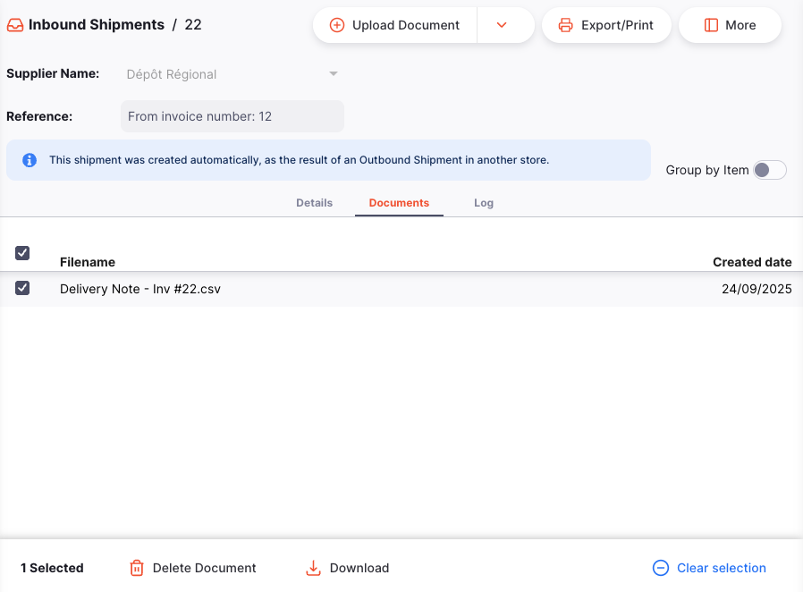

## Recevoir du stock avec une Expédition Entrante

### Confirmer la livraison de l'expédition

Que votre Expédition Entrante soit **manuelle** ou **automatique**, la première étape pour recevoir les articles est de confirmer la livraison.

À ce stade, vous n'avez pas à vérifier si les quantités ou d'autres informations sont correctes — vous reconnaissez simplement que vous avez reçu les articles de votre fournisseur.

Pour confirmer qu'une Expédition Entrante a été livrée, cliquez sur le bouton `Confirmer Livrée`.

Une fois cela fait :

- Les articles font maintenant partie de votre inventaire
- Le statut de l'expédition est maintenant `LIVRÉE`

Dans le cas d'une Expédition Entrante <b>automatique</b>, vous ne pouvez pas confirmer la livraison tant que le fournisseur n'a pas confirmé l'expédition. En d'autres termes, le statut de votre expédition doit être <code>EXPÉDIÉE</code> avant que vous puissiez confirmer la réception des articles.

Les lignes non allouées avec 0 conditionnement seront automatiquement supprimées lors de la confirmation de livraison.

### Réceptionner les articles

Une fois l'expédition marquée comme `LIVRÉE`, les articles peuvent être inspectés physiquement pour confirmer que les bons articles et les bonnes quantités ont été livrés.

Une fois que vous avez inspecté les articles, confirmez l'expédition comme `RÉCEPTIONNÉE` en appuyant sur `Confirmer Réceptionnée`.

Une fois cela fait :

- Le statut de l'expédition est maintenant `RÉCEPTIONNÉE`
- Les articles sont ajoutés à votre stock en dépôt et sont disponibles pour la distribution

### Vérifier votre Expédition Entrante

La vérification est la dernière étape pour recevoir des articles dans mSupply. À ce stade, vous pouvez vérifier :

- Les numéros de lot et leurs dates d'expiration
- La quantité de conditionnements et la taille de conditionnement
- Les informations de tarification : prix de coût et de vente
- L'emplacement de stockage des articles reçus

Une fois toutes les informations capturées ou vérifiées, confirmez l'expédition comme `VÉRIFIÉE` en appuyant sur `Confirmer Vérifiée`.

Une fois cela fait :

- Le statut de l'expédition est maintenant `VÉRIFIÉE`
- Vous ne pouvez plus modifier les lignes
- Vous ne pouvez plus supprimer l'expédition

## Retourner du stock depuis une Expédition Entrante

Parfois, vous devrez peut-être retourner du stock reçu via une Expédition Entrante. Vous pouvez le faire en créant un [Retour fournisseur](../supplier-returns).

1. Ouvrez l'Expédition Entrante pour laquelle vous souhaitez retourner du stock
2. Assurez-vous que le statut est au moins `LIVRÉE`
3. Sélectionnez la ou les lignes à retourner en cochant les cases à gauche
4. Cliquez sur le bouton `Retourner les lignes sélectionnées` en bas de la page.

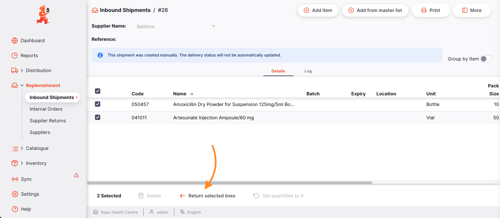

#### Sélectionner la quantité à retourner

Une fenêtre modale s'ouvrira avec chaque ligne sélectionnée :

|               Colonne               | Description                                                                                              |
| :---------------------------------: | :------------------------------------------------------------------------------------------------------- |
|              **Code**               | Code de l'article                                                                                        |
|               **Nom**               | Nom de l'article                                                                                         |
|               **Lot**               | Numéro de lot                                                                                            |
|           **Expiration**            | Date d'expiration du lot (format : MM/AAAA)                                                              |
| **Quantité disponible pour retour** | Nombre de conditionnements disponibles — c'est-à-dire non déjà alloués à d'autres livraisons ou retours. |
|      **Quantité à retourner**       | Nombre de conditionnements à retourner                                                                   |

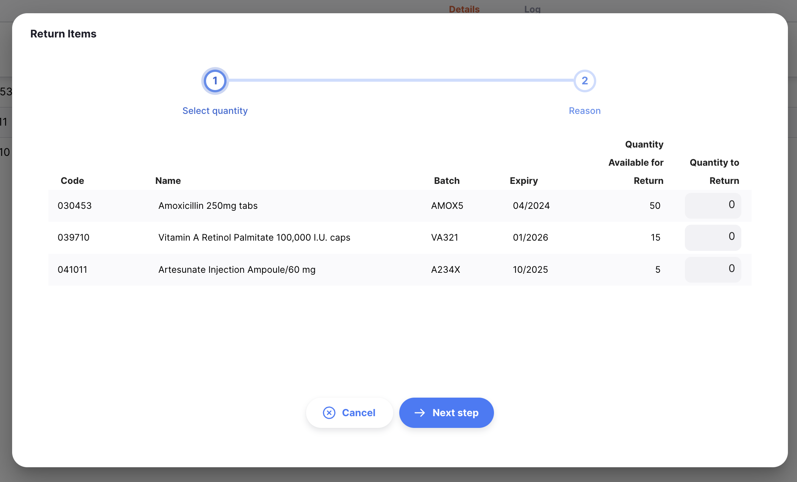

Les valeurs `Quantité à retourner` seront initialement à `0` — vous pouvez les ajuster pour retourner tout ou partie du stock disponible.

#### Avertissements

Si vous oubliez de saisir une quantité à retourner, vous verrez ce message d'avertissement.

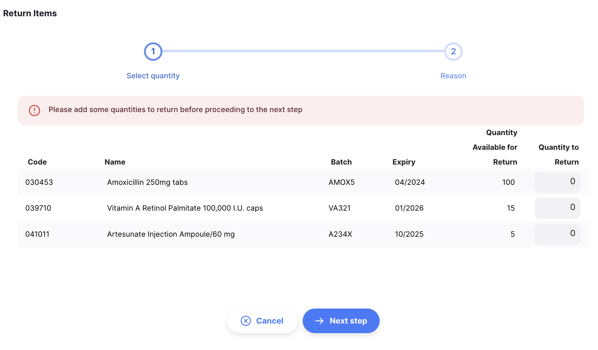

#### Fournir des raisons

Une fois satisfait de vos quantités, cliquez sur `Étape suivante`. La liste sera filtrée pour n'inclure que les lots pour lesquels vous avez fourni une quantité de retour. Vous pouvez fournir une raison et un commentaire supplémentaire pour chaque lot.

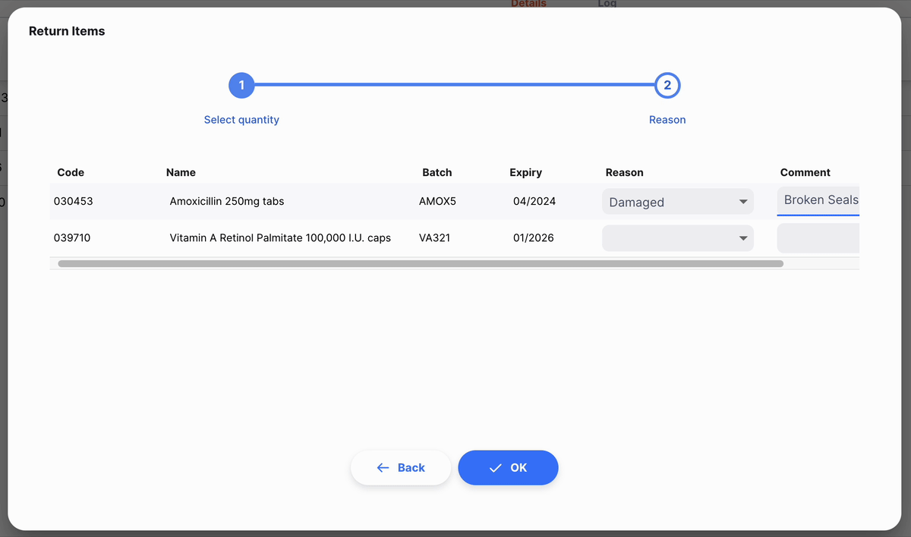

#### Confirmer

Lorsque vous êtes satisfait des quantités et des raisons, vous pouvez appuyer sur :

- le bouton `OK`. Un Retour fournisseur sera créé et vous serez redirigé pour le consulter.
- le bouton `Retour`, pour revenir à l'étape `Sélectionner la quantité`.

## Consulter une Expédition Entrante

Lors de la consultation d'une expédition spécifique, vous pouvez afficher les lots groupés par article ou chaque lot séparément. Pour changer le mode d'affichage, cliquez sur le bouton `Grouper par article`.

Si vous n'avez pas assez d'espace sur votre écran, vous avez la possibilité de masquer certaines colonnes. Cliquez sur le bouton `Afficher / masquer les colonnes` en haut à droite du tableau.

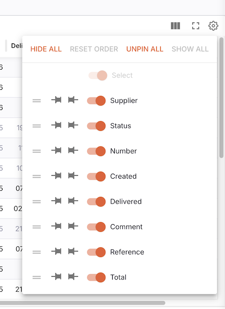

## Suivre le stock par donateur

Vous pouvez suivre le stock par donateur dans tout le système. Un donateur peut être lié à une expédition entrante et vous pouvez également spécifier le donateur pour chaque ligne.

Pour commencer, activez la [Préférence globale](/docs/manage/global-preferences/) `Permettre le suivi du stock par donateur`. Puis configurez des donateurs dans le serveur central mSupply.

Une fois la préférence activée et des donateurs configurés, ouvrez le [panneau d'informations](#consulter-ou-modifier-le-panneau-dinformations) de votre expédition entrante. Cliquez sur l'icône crayon pour modifier le donateur :

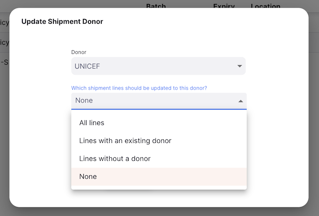

Lors de la sélection d'un donateur, vous avez la possibilité de spécifier comment cela affectera les lignes de l'expédition :

- Toutes les lignes — le donateur sélectionné est lié à chaque ligne
- Lignes avec donateur existant — remplace le donateur existant si assigné
- Lignes sans donateur — uniquement les lignes sans donateur seront liées
- Aucune

Lors de la modification d'une ligne, l'onglet `Autre` aura une sélection `Donateur` si la préférence est activée :

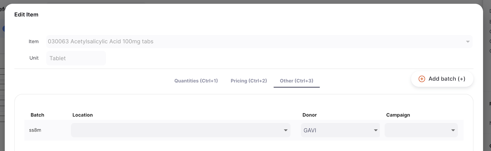

## Lier une commande interne

Si la [préférence du dépôt](/docs/settings/configuration/#store-preferences) `Peut lier manuellement une réquisition à une facture fournisseur` est activée, il est possible de lier une expédition entrante créée manuellement à une commande interne.

### Comment lier une commande interne

Cliquez sur le bouton `Nouvelle Expédition` pour créer une nouvelle expédition entrante manuelle et sélectionnez un fournisseur. Avec la préférence activée, vous verrez un nouvel écran affichant toutes les commandes internes que ce dépôt a créées pour le fournisseur sélectionné.

Seules les commandes au statut <i>Envoyée</i> sont affichées dans la liste

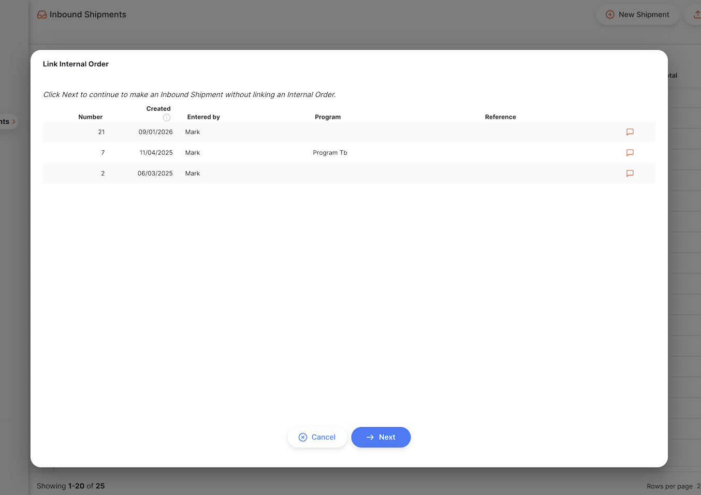

Depuis cette fenêtre, vous pouvez :

- Cliquer sur **Annuler** pour arrêter la création de l'expédition entrante
- Cliquer sur **Suivant** pour continuer sans lier de commande interne
- Cliquer sur une ligne de commande interne dans le tableau — cela liera la commande à la nouvelle expédition entrante

### Travailler avec une expédition liée

Un lien vers la commande interne est affiché dans la section _Documents liés_ du panneau _Plus d'infos_ :

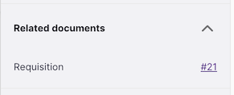

Une fois l'expédition et la commande liées, vous pouvez ajouter des lignes depuis la commande interne à l'expédition. Cliquez sur la flèche à côté du bouton **Ajouter un Article** :

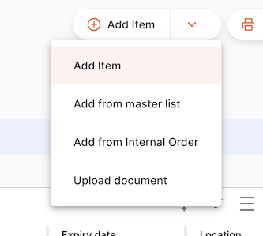

Cliquez sur l'option **Ajouter depuis la Commande Interne**.

Une fenêtre affiche toutes les lignes d'articles de la commande interne. Cochez les lignes à ajouter à l'expédition.

Vous pouvez cliquer sur la case principale pour sélectionner ou désélectionner toutes les lignes

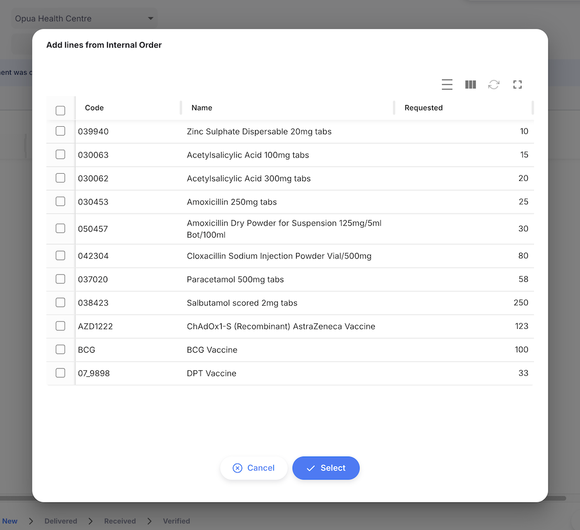

Cliquez sur le bouton **Sélectionner** pour ajouter les lignes à l'expédition.
