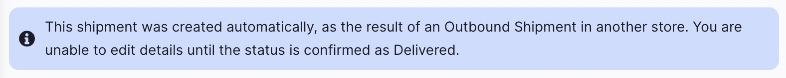
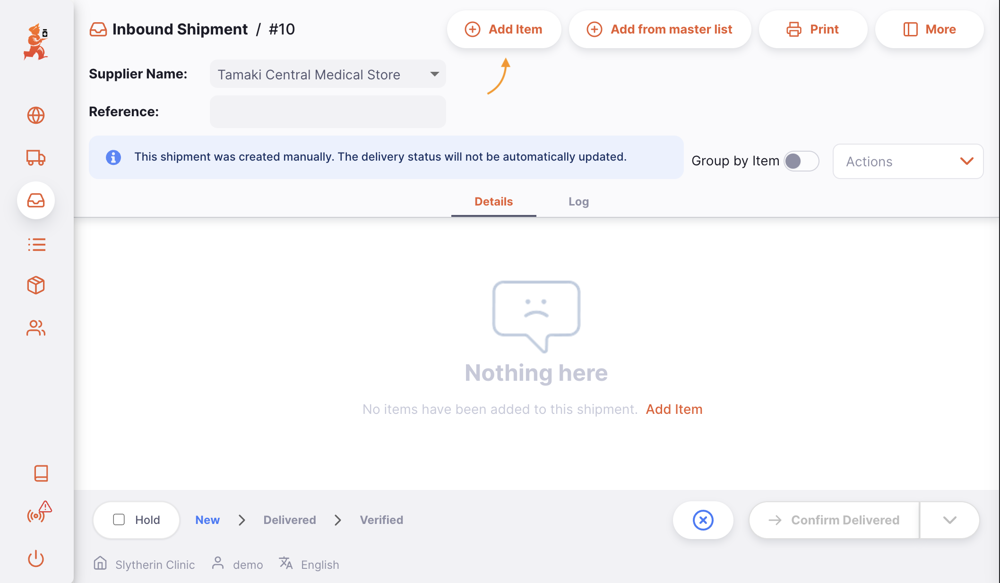
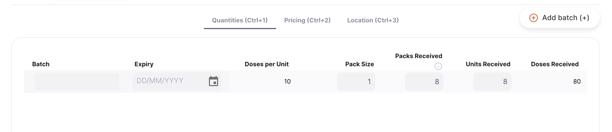
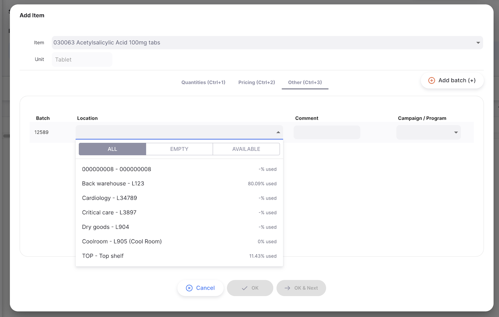
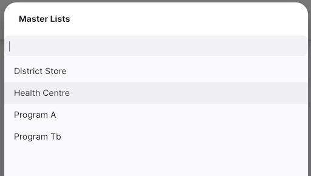
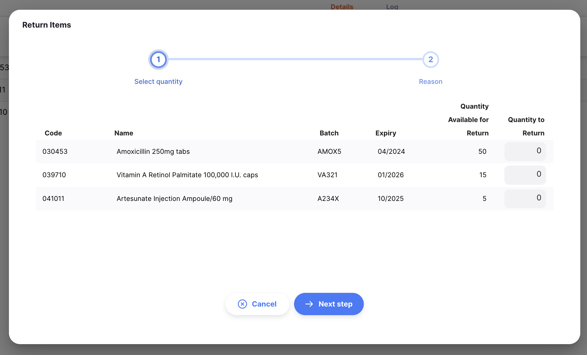
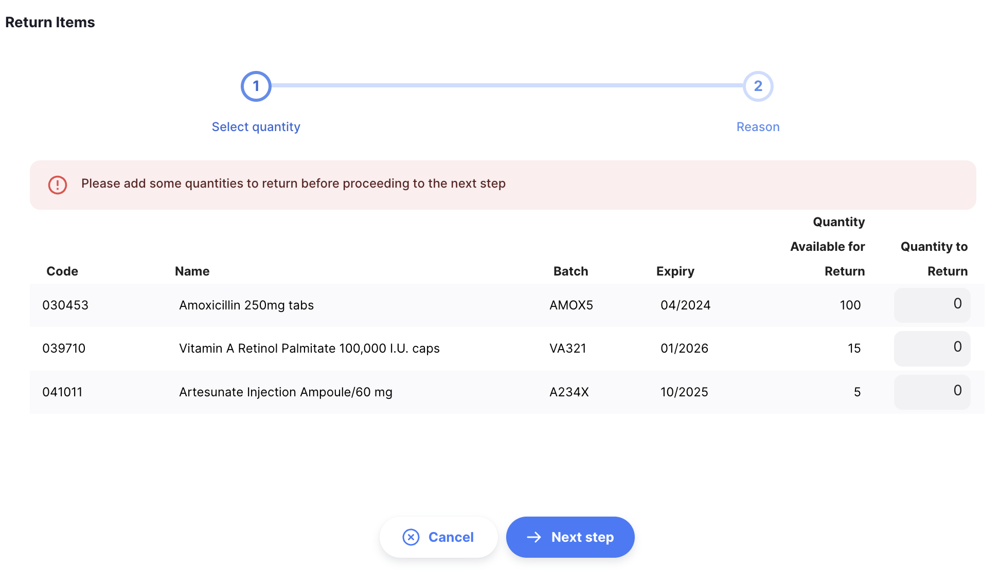
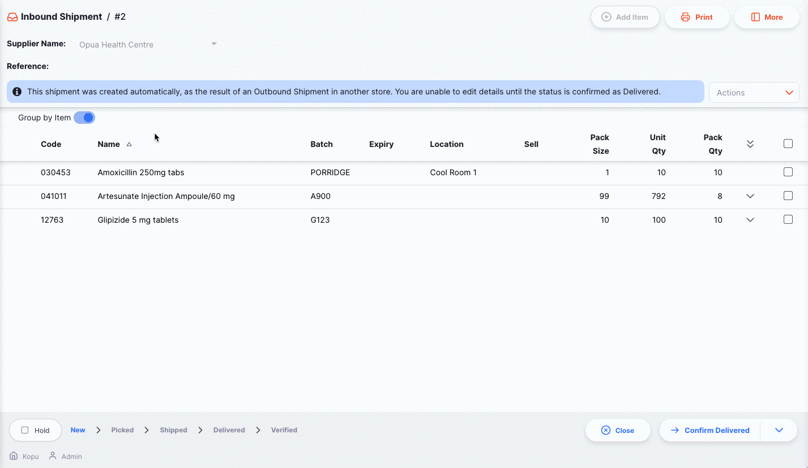
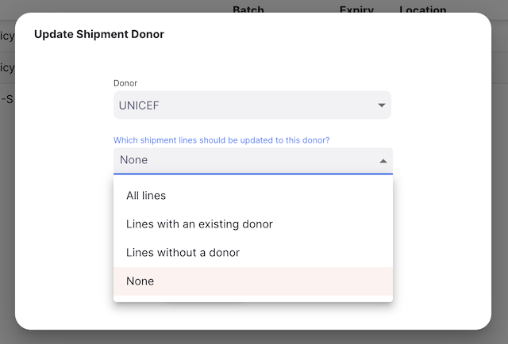
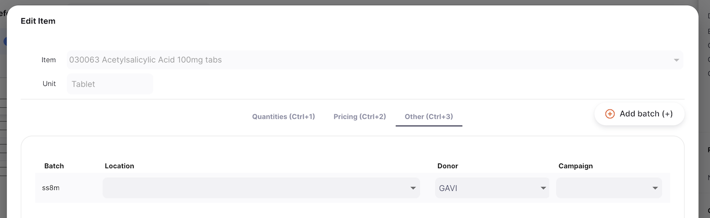

+++
title = "Livraisons"
description = "Recevoir du stock des fournisseurs."
date = 2022-03-19
updated = 2022-03-19
draft = false
weight = 4
sort_by = "weight"
template = "docs/page.html"

[extra]
toc = true
top = false
+++

La fonctionnalité _Livraison_ peut être utilisée pour recevoir du stock venant d'un ou plusieurs fournisseurs.

Si vous avez utilisé mSupply par le passé, vous devriez être familier avec le terme **Facture Fournisseur** au lieu de **_Livraison_**.

Toutes les articles reçus doivent être enregistrés dans mSupply soit par :

- Création manuelle d'une livraison entrante (livraison entrante manuelle)
- Traitement d'une livraison entrante qui a été créée automatiquement dans votre dépôt suite à un envoi de stock venant d'un autre dépôt fournisseur.

## Voir les Livraisons

### Ouvrir le Menu Livraison Entrante

Pour accéder au menu **Livraison** :

1. Allez dans `Approvisionnement` dans le panneau de navigation à gauche
2. Cliquez sur `Livraison entrante`

### Liste des Livraisons entrantes

La première chose que vous voyez est une liste des Livraisons entrantes.

La liste des livraisons comprend 7 colonnes:

| Colonne               | Description                                  |
| :-------------------- | :------------------------------------------- |
| **Nom**               | Nom du fournisseur                           |
| **Statut**            | Statut de la livraison                       |
| **Numéro de facture** | Numéro de référence de la livraison entrante |
| **Créé(e) le**        | Date de création de la livraison             |
| **Livré(e)**          | Date de confirmation de la livraison         |
| **Référence**         | Commentaire sur la livraison                 |
| **Total**             | Valeur totale                                |

1. La liste peut afficher **20 livraisons par page**. Dans le coin inférieur gauche, vous pouvez voir combien de livraisons sont actuellement affichées sur votre écran.

2. S'il y a plus de 20 livraisons, vous pouvez vous déplacer vers une autre page en cliquant sur le numéro de la page ou en utilisant les flèches droite ou gauche (coin inférieur droit).

### Recherche par nom de Fournisseur

Vous pouvez filtrer la liste des livraisons par nom de fournisseur. Cela peut être utile si vous recherchez une livraison en particulier !

Saisissez le nom du fournisseur dans le champ `Chercher par Nom` (à gauche, juste au-dessus des en-têtes de liste). Toutes les livraisons de ce fournisseur apparaîtront dans la liste.

### Exporter la liste des livraisons

La liste des livraisons peut être exportée dans un fichier CSV. Cliquez simplement sur le bouton **Exporter** (à droite, en haut de la page) et le fichier sera téléchargé.

La fonction d'exportation téléchargera toutes les livraisons, pas seulement la page actuelle, si vous en avez plus de 20.

### Supprimer une livraison

Vous pouvez supprimer une livraison de la liste.

1. Sélectionnez la livraison que vous souhaitez supprimer en cochant la case à l'extrémité gauche de la liste. Vous pouvez sélectionner plus d'une livraison à supprimer. Vous pouvez même toutes les sélectionner à l'aide de la case à cocher principale dans les en-têtes de liste.

2. Le pied de page `Actions` s'affichera en bas de l'écran lorsqu'un envoi est sélectionné. Il affichera le nombre d'envois sélectionnés et les actions qui peuvent être effectuées. Cliquez sur `Supprimer`.

Une notification confirme le nombre de livraisons supprimées (coin inférieur gauche)

Vous ne pouvez supprimer que les expéditions avec un statut <code>NOUVEAU</code>.

## Créer une nouvelle livraison entrante manuellement

1. Allez dans `Approvisionnement`> `Livraison entrante`
2. Cliquez sur le bouton `Nouvelle Livraison`, dans le coin supérieur droit
3. Une nouvelle fenêtre `Fournisseurs` vous invitant à sélectionner un _Fournisseur_ s'affiche.

### Sélectionner un Fournisseur

1. Dans la fenêtre `Fournisseurs`, vous verrez afficher une liste de fournisseurs. Vous pouvez sélectionner directement ou saisir le nom d'un fournisseur.

Vous pouvez savoir si un fournisseur utilise également mSupply dans son dépôt. Si c'est le cas, vous verrez une icône comme celle-ci  à côté du code fournisseur. 

Dans l'exemple ci-dessous, nous recevons du stock de <b>Tamaki Central Medical Store</b>. 

2. Une fois que vous avez sélectionné un Fournisseur, la livraison est créée.

Si tout s'est bien passé, vous devriez voir le nom de votre fournisseur dans le coin supérieur gauche et le statut actuel devrait être <code>Nouveau</code>.

### Modifier le nom du Fournisseur

Si vous n'avez pas sélectionné le bon fournisseur, vous pouvez toujours modifié le nom du fournisseur dans le champs `Nom du fournisseur` ou sélectionner un autre:

### Saisir une référence fournisseur

Une fois que la livraison a été créée, vous pouvez renseigner la référence du fournisseur dans le champs `Référence` s'il en a un: (Exple. _ PO#1234567 _)

### Afficher ou modifier le volet d'informations sur les livraisons

Le panneau d'information vous permet de voir ou de modifier les informations sur la livraison. Il est divisé en plusieurs sections :

- Informations supplémentaires
- Documents connexes
- Détails de la facture
- Détails des transports

Nous prévoyons d'ajouter d'autres sections à l'avenir au fur et à mesure du développement d'Open mSupply. 

#### Comment ouvrir et fermer le volet d'Information ?

Pour ouvrir le volet d'Information, vous pouvez appuyer sur le bouton `Plus`, situé dans le coin supérieur droit de la vue Livraison Entrante.

Vous pouvez le fermer en appuyant sur le bouton `X Fermer`, dans le coin supérieur droit du panneau d'information.

#### Informations Supplémentaires

Dans la section **Informations Supplémentaires**, vous pouvez :

- Nom du donateur (si vous avez [le suivi des donateurs](#suivre-le-stock-par-donateur) activé)
- Voir qui a créé la Livraison Entrante (nom de l'utilisateur)
- Voir et modifier la couleur de la Livraison Entrante. Pour modifier la couleur, appuyez sur le cercle coloré et sélectionnez une couleur dans la fenêtre contextuelle
- Écrire ou modifier un commentaire

#### Documents Connexes

Dans la section **Documents Connexes**, vous pouvez voir d'autres documents de transaction liés à la Livraison Entrante.

Si votre Livraison Entrante a été créée pour satisfaire une **Commande Interne**, le numéro de référence de votre commande apparaîtra dans cette section.

À l'avenir, nous inclurons également d'autres documents tels que les enregistrements de température, les documents de transport ou les bordereaux de prélèvement.

#### Détails de la Facture

Dans cette section, vous verrez par défaut le prix de revient total des articles listés dans la Livraison Entrante.

Vous pouvez également ajouter des **Frais de service** si vous souhaitez ajouter d'autres charges telles que les `Frais de Transport`. Note : Les frais de service doivent être dans votre Liste Maîtresse pour que vous puissiez les utiliser. Pour ajouter des Frais de service aux Détails de la Facture :

1. Appuyez sur le bouton `Modifier les Frais de Service`. Une nouvelle fenêtre s'ouvre.
2. Appuyez sur le bouton `Ajouter une charge` dans la nouvelle fenêtre. Une nouvelle ligne apparaît dans la liste des charges. Vous pouvez appuyer sur `Annuler` si vous ne souhaitez rien ajouter.
3. **Nom :** sélectionnez des frais de service dans la liste déroulante. Vous pouvez personnaliser la liste des charges disponibles. Contactez votre administrateur.
4. **Commentaire :** Vous pouvez ajouter un commentaire pour fournir plus de détails sur la nouvelle charge
5. **Montant :** Saisissez le montant des frais
6. **Taxe :** Saisissez un % de taxe pour les frais
7. **Total :** Le champ total est automatiquement calculé en fonction du Montant et du pourcentage de Taxe
8. **Supprimer :** Vous pouvez appuyer sur l'icône `Supprimer` pour supprimer les frais

Le taux de taxe (%) pour les frais de service et le prix de vente des articles peut également être modifié en cliquant sur l'icône crayon. Une fenêtre contextuelle apparaîtra pour vous permettre de saisir une valeur.

###### Devises Étrangères

Si votre dépôt émet dans des devises étrangères, suivez [ces instructions](https://docs.msupply.org.nz/other_stuff:currencies) dans la documentation du serveur central pour le configurer. Vous devrez également activer la préférence dépôt `Dépôt : Capable d'émettre en devise étrangère`. Cette préférence est compatible avec Open mSupply `v1.7.0+`.

L'icône crayon deviendra active une fois que les instructions ci-dessus ont été suivies et seulement si le client est un client externe. Cliquez sur cette icône et changez pour une devise dans laquelle vous souhaitez traiter la livraison. Le taux de change peut également être modifié si vous et le client avez convenu d'un taux différent.

Vous pouvez également voir les totaux en devise étrangère dans les détails de ligne de facture. 

Voir la <a href="/docs/introduction/faq/#is-there-support-for-my-currency">question sur le support des devises</a> pour la liste des codes supportés

#### Détails de Transport

Dans cette section, vous pouvez voir ou modifier un numéro de référence de transport (par ex. une réservation ou un numéro de référence de suivi).

#### Actions

1. **Supprimer :** Vous pouvez appuyer sur le bouton `Supprimer` pour supprimer la facture
2. **Copier dans le Presse-papiers** : Vous pouvez appuyer sur le bouton `Copier dans le Presse-papiers` pour copier les détails de la facture dans le presse-papiers.

### Séquence de Statut de Livraison Entrante

La séquence de statut est située dans le coin inférieur gauche de l'écran de Livraison Entrante.

Les statuts passés sont surlignés en bleu, les statuts suivants apparaissent en gris.

<figure>  <figcaption align="center">Séquence de Statut : le statut actuel est <code>Reçu</code>.</figcaption> </figure>

Il y a 6 statuts pour la Livraison Entrante :

| Statut      | Description                                                                                                                     | mSupply | Modifiable |
| ----------- | ------------------------------------------------------------------------------------------------------------------------------- | :-----: | :--------: |
| **Nouveau** | C'est le premier statut lorsque vous créez une nouvelle Livraison Entrante manuelle                                             |   nw    |            |
| **Prélevé** | Le fournisseur a confirmé que la livraison est prélevée et prête à expédier (s'applique uniquement aux livraisons automatiques) |   nw    |     ✓      |
| **Expédié** | La livraison a été expédiée et les marchandises sont maintenant en transit (s'applique uniquement aux livraisons automatiques)  |   nw    |            |
| **Livré**   | Lorsque vous confirmez que la livraison a été livrée.                                                                           |   sg    |     ✓      |
| **Reçu**    | Lorsque vous confirmez que la livraison a été validée. Les marchandises font maintenant partie de votre inventaire.             |   cn    |     ✓      |
| **Vérifié** | Lorsque vous avez vérifié la Livraison Entrante                                                                                 |   fn    |            |

Vous avez probablement remarqué que deux des valeurs de statut ne s'appliquent qu'aux livraisons créées automatiquement. Celles-ci sont créées par le système lorsqu'un autre magasin du système crée une Livraison Sortante pour livrer du stock à votre magasin. Si c'est le cas, vous verrez un message près du haut de la page :

Notez que ce message apparaît différemment si le statut est `Livré` ou `Vérifié`

Si, cependant, vous avez créé une Livraison Entrante manuellement, alors le message suivant s'affiche :

et vous verrez que la barre de statut n'a que les valeurs de statut qui s'appliquent à ce type de livraison.

<figure align="center">  <figcaption align="center">Séquence de Statut : le statut actuel est <code>Nouveau</code>.</figcaption> </figure>

Si vous passez la souris sur la séquence de statut, une fenêtre d'historique de livraison apparaît. Vous pouvez voir la date à laquelle une livraison a été mise à jour d'un statut à un autre.

 Cette livraison manuelle a été créée le 24/04/2025 

 Cette livraison automatique a été créée le 10/04/2025, prélevée le 11/04/2025 et expédiée le 12/04/2025 

### Case Suspendre

Située dans le coin inférieur gauche, à gauche de la séquence de statut.

Cocher la case `Suspendre` empêche la Livraison Entrante d'être mise à jour vers le statut suivant.

Show Image

### Boutons Fermer et Confirmer

#### Bouton Fermer

Cliquez sur le bouton `Fermer` pour quitter la vue Livraison Entrante et retourner à la liste des Livraisons Entrantes.

#### Bouton Confirmer

Le bouton `Confirmer` est le bouton pour mettre à jour le statut d'une livraison. Le statut que vous pouvez confirmer dépend du statut actuel de la livraison et suit la séquence montrée ci-dessous.

Lors de la gestion d'une Livraison Entrante, vous ne pouvez la confirmer que comme Livrée ou Vérifiée.

| Confirmer...             | Statut Actuel | Statut Suivant |
| ------------------------ | ------------- | -------------- |
| **Confirmer Livré(e)**   | Expédié(e)    | Livré(e)       |
| **Confirmer Vérifié(e)** | Livré(e)      | Vérifié(e)     |

Vous n'êtes pas obligé de mettre à jour une livraison au statut suivant dans la séquence. Vous pouvez choisir d'en ignorer certains pour aller directement à `Confirmer Vérifié(e)` par exemple.

Comme démontré ci-dessous, appuyez sur la flèche vers le bas du bouton `Confirmer` et sélectionnez le statut vers lequel vous voulez que la livraison soit mise à jour.

## Ajouter des lignes à une Livraison Entrante

Pour ajouter une ligne, appuyez sur le bouton `Ajouter un Article` situé dans le coin supérieur gauche de votre écran.

Une nouvelle fenêtre `Ajouter un Article` s'ouvre.

### Sélectionner un Article

Dans la fenêtre `Ajouter un Article`, vous pouvez rechercher un article par :

- Lecture de la liste des articles disponibles
- ou en tapant une partie ou la totalité du nom d'un article
- ou en tapant une partie ou la totalité du code d'un article

Une fois que votre article est surligné, appuyez sur le nom ou appuyez sur `Entrée`.

### Onglet Quantités

Dans l'onglet `Quantités`, vous pouvez mettre à jour les champs suivants :

1. **Lot** : Tapez ici le numéro de lot. Laissez vide si l'article n'est pas géré avec un numéro de lot.
2. **Péremption** : La date de péremption du numéro de lot. Laissez vide si non applicable
3. **Taille d'emballage** : Le nombre d'unités par emballage (par défaut, la taille de l'emballage est 1)
4. **Emballages Reçus** : Le nombre d'emballages que vous recevez. Ceci peut être saisi manuellement ou calculé basé sur Unités Reçues / Taille d'emballage
5. **Emballages Expédiés** : Le nombre de paquets envoyés par le fournisseur.
6. **Unités Reçues** : Le nombre d'unités que vous recevez. Ceci peut être saisi manuellement ou calculé basé sur Emballages x Taille Emballage (`[# Emballages] x [Taille d'Emballage]`)

Le titre 'Unités' ci-dessus sera remplacé par le nom de l'unité, tel que défini pour cet article. Par exemple, si l'unité est 'Comprimé' alors le titre affichera 'Comprimés Reçus'

**Colonnes supplémentaires pour vaccins**

L'onglet Quantités aura des colonnes supplémentaires affichées lorsque certaines préférences sont activées. Ces préférences sont contrôlées dans [Gérer > Magasins](/docs/manage/facilities/#editing-store-preferences).

Les colonnes supplémentaires disponibles avec la préférence `Afficher le vaccin en doses` activée sont :

1. **Doses par unité** : Le nombre de doses par unité.
2. **Doses Reçues** : Le nombre de doses que vous recevez. Ceci peut être saisi manuellement ou calculé basé sur Taille Emballage x Emballages x Doses

La colonne supplémentaire disponible avec la préférence `Gérer le Statut VVM Pour le Stock` activée est :

8. **Statut VVM** : Le statut VVM actuel pour le lot.

 Les Statuts VVM doivent également être configurés dans mSupply en ajoutant un statut à la <a href="https://docs.msupply.org.nz/cold_chain_equipment:configure">Liste des moniteurs de fiole de vaccin</a>. 

Sélectionner un Statut VVM dans une livraison entrante génèrera un journal de Statut VVM. Un journal sera enregistré par lot pour la livraison entrante (au statut de livraison Livré). Les journaux peuvent être consultés et modifiés en sélectionnant l'article dans `Voir le Stock` et en sélectionnant l'onglet `Historique des Statuts`.

#### Ajouter des Lots

Si vous recevez plus d'un numéro de lot pour le même article, vous pouvez appuyer sur le bouton `Ajouter un Lot`

 Dans l'exemple ci-dessous, nous recevons 2 numéros de lot pour l'article <i>030063 - Acetylsalicylic Acid 100mg tabs</i> avec une taille de paquet différente. 

### Onglet Prix

Sur le deuxième onglet, `Prix`, vous pouvez mettre à jour les champs suivants (tous sont optionnels) :

- **Lot** (lecture seule) : Numéro de lot
- **Taille Emballage** (lecture seule) : La quantité d'unités par emballage
- **Qté Emballage** (lecture seule) : La quantité d'emballages que vous recevez
- **Coût** : Le prix d'achat unitaire de l'article (valeur par défaut est 0)
- **Prix Vente Emballage** : Le prix de vente unitaire de l'article (valeur par défaut est 0)
- **Total Ligne** (lecture seule) : Valeur d'achat totale pour le numéro de lot (`[Qté Paquet] x [Coût]`)

 Les prix de Vente et Coût sont par unités et non par paquet. 
 
 Dans l'exemple ci-dessous, le prix de revient de la première ligne est de 0,01$ par unité et le prix de vente de 0,10$ par unité. 

### Onglet Autre

Dans le troisième onglet, `Autre`, vous pouvez sélectionner les éléments suivants :

- **Emplacement** : Un emplacement de stockage pour assigner le numéro de lot à un emplacement dans votre installation de stockage.
- **Commentaire** : C'est un champ de texte libre qui peut être utilisé pour ajouter un commentaire sur la ligne de livraison.
- **Donateur** : Un donateur, si configuré pour suivre les donateurs. Voir [Suivre le stock par donateur](#suivre-le-stock-par-donateur) pour plus de détails.
- **Campagne** : Si vous avez une campagne configurée (voir [Campagnes](/docs/manage/campaigns/)) alors cette colonne vous permet d'associer la ligne de stock avec une campagne

#### Emplacement

Sélectionnez simplement un emplacement de stockage dans le menu déroulant `Emplacement`.

 Vous ne connaissez pas encore l'emplacement de stockage ? Vous n'êtes pas obligé de le saisir tout de suite. Vous pouvez mettre à jour l'emplacement de stockage à tout moment si vous n'avez pas encore confirmé la vérification. 

Lors de la modification d'une ligne de la livraison, l'onglet `Autre` aura une sélection `Donateur` si vous avez la préférence activée :

### Confirmer l'article et les quantités

Lorsque vous avez terminé, vous pouvez ajouter la nouvelle ligne en appuyant sur :

- `OK` si vous ne voulez pas ajouter une autre ligne à votre livraison
- `OK & Suivant` si vous avez d'autres lignes à créer

Sinon, vous pouvez appuyer sur `Annuler` et vos modifications ne seront pas sauvegardées.

## Ajouter des lignes à une Livraison Entrante en utilisant une Liste Maître

Appuyez sur le bouton `Ajouter depuis la liste maître` (coin supérieur droit).

 Le bouton sera désactivé si le statut de la Livraison Entrante est autre que <code>Nouveau</code> 

Une nouvelle fenêtre `Listes Maîtres` s'ouvre. Cela vous permet de sélectionner la liste maître requise. Cliquez simplement sur une des listes (si vous en avez de disponibles).

Cliquez `OK` sur l'invite de commande :

Vous aurez alors des lignes de substitution ajoutées à votre livraison, qui ressembleront à ceci :

Les lignes importées auront zéro pour la valeur du nombre d'emballages, et sont donc affichées en police bleue avec le lot, la date de péremption, l'emplacement etc non affichés. Vous pouvez suivre les étapes pour modifier ces lignes, comme détaillé ci-dessus.

## Modifier une ligne de Livraison Entrante

Pour modifier une ligne de Livraison Entrante, appuyez simplement dessus. Vous verrez apparaître la fenêtre `Modifier l'Article`, qui est identique à la fenêtre `Ajouter un Article`, sauf que l'article est déjà choisi et ne peut pas être modifié.

### Modifier une Ligne de Livraison

 <b></b> vous pouvez modifier une ligne de livraison si la livraison a un statut inférieur à <code>Vérifié</code>. 

1. Ouvrez la Livraison Entrante que vous voulez modifier
2. Appuyez sur la ligne que vous voulez modifier. Une fenêtre identique à `Ajouter un Article` apparaît. À ce stade :
    - Modifiez le champ principal `Quantité d'Émission`
    - ou changez la valeur du nombre de paquets au niveau du numéro de lot

 <b></b> Lors de la modification d'une ligne de livraison, vous ne pouvez pas changer l'article. Vous devriez supprimer la ligne de livraison et en créer une nouvelle. 

### Supprimer une ligne de Livraison

1. Ouvrez la Livraison Entrante que vous souhaitez modifier
2. Assurez-vous que le statut n'est pas encore `VÉRIFIÉ`
3. Sélectionnez la ou les ligne(s) que vous voulez supprimer en cochant la ou les case(s) à gauche de la liste
4. Cliquez sur le bouton `Supprimer` qui apparaît en bas de la page.

 Vous pouvez supprimer plusieurs lignes à la fois. Assurez-vous de vérifier ce qui est sélectionné avant d'effectuer l'action Supprimer. 

## Réception de stock avec une Livraison Entrante

### Confirmer la livraison de l'envoi

Que votre Envoi Entrant soit **manuel** ou **automatique**, la première étape pour recevoir les marchandises est de confirmer la livraison.

À cette étape, vous n'avez pas à vérifier si les quantités ou autres informations sont correctes, vous devez simplement reconnaître que vous avez reçu les marchandises de votre fournisseur.

Pour confirmer qu'un Envoi Entrant a été livré, cliquez sur le bouton `Confirmer Livré(e)`.

Une fois que vous avez fait cela :

- Les marchandises font maintenant partie de votre inventaire
- Le statut de l'envoi est maintenant `LIVRÉ`

 Dans le cas où votre Envoi Entrant est <b>automatique</b>, vous ne pouvez pas confirmer sa livraison à moins que le fournisseur n'ait confirmé son expédition. En d'autres termes, le statut de votre envoi doit être <code>EXPÉDIÉ</code> avant que vous puissiez confirmer que vous avez reçu les marchandises. 
 
 Toutes les lignes non allouées avec une valeur de 0 nombre de paquets seront automatiquement supprimées pour vous lorsque vous confirmez. 

### Vérifier votre Livraison Entrante

La vérification est la dernière étape pour recevoir des marchandises dans mSupply. À cette étape, vous pouvez vérifier ce que vous avez reçu et vous assurer que les informations dans mSupply sont correctes.

Vous avez la possibilité de vérifier les informations suivantes :

- Numéros de lot et leurs dates d'expiration
- Quantité de paquets et taille des paquets
- Informations de prix : prix de revient et prix de vente

Vous pouvez également saisir où les marchandises reçues doivent être stockées dans l'onglet `Emplacement`.

Une fois que toutes les informations ont été saisies ou vérifiées, vous pouvez confirmer l'Envoi comme `VÉRIFIÉ` en appuyant sur le bouton `Confirmer Vérifié`.

Une fois que vous avez fait cela :

- Le statut de l'envoi est maintenant `VÉRIFIÉ`
- Vous ne pouvez plus modifier les lignes d'envoi
- Vous ne pouvez plus supprimer l'envoi

## Retourner du stock d'une Livraison Entrante

Parfois, vous pourriez avoir besoin de retourner du stock que vous avez reçu via un Envoi Entrant. Vous pouvez le faire en créant un [Retour Fournisseur](../supplier-returns).

1. Ouvrez l'Envoi Entrant pour lequel vous souhaitez retourner une partie ou la totalité du stock
2. Assurez-vous que le statut est au moins `LIVRÉ`
3. Sélectionnez la ou les ligne(s) que vous voulez retourner en cochant la ou les case(s) à gauche de la liste
4. Cliquez sur le bouton `Retourner les lignes sélectionnées` qui apparaît en bas de la page.

#### Sélectionner la quantité à retourner

Une fenêtre modale s'ouvrira, contenant chaque ligne que vous avez sélectionnée pour retour :

| Colonne                             | Description                                                                                                                                                                                                     |
| ----------------------------------- | --------------------------------------------------------------------------------------------------------------------------------------------------------------------------------------------------------------- |
| **Code**                            | Code de l'article                                                                                                                                                                                               |
| **Nom**                             | Nom de l'article                                                                                                                                                                                                |
| **Lot**                             | Numéro de lot. C'est une désignation donnée aux produits fabriqués dans la même série de production.                                                                                                            |
| **Péremption**                      | Date de péremption du lot (format : MM/AAAA)                                                                                                                                                                    |
| **Quantité Disponible pour Retour** | Nombre d'emballages disponibles. Cela signifie le nombre d'emballages pas encore alloués à d'autres envois ou retours, donc la quantité pourrait être moindre que la quantité reçue dans la Livraison Entrante. |
| **Quantité à Retourner**            | Nombre d'emballages à retourner                                                                                                                                                                                 |

Les valeurs `Quantité à Retourner` seront initialement `0` - vous pouvez ajuster cela pour retourner une partie ou la totalité du stock disponible.

#### Avertissements

Si vous oubliez d'entrer une quantité à retourner pour un lot et cliquez sur `Étape suivante`, vous verrez ce message d'avertissement. Vous devrez ajouter une quantité à retourner d'au moins un lot. Vous pouvez cliquer sur `Annuler` si vous ne voulez plus retourner ce stock.

#### Fournir des motifs

Une fois que vous êtes satisfait de vos quantités à retourner, vous pouvez cliquer sur `Étape suivante`. La liste des lots sera filtrée pour inclure seulement les lots pour lesquels vous avez fourni une quantité de retour. Dans cette vue, vous pouvez fournir un motif pour retourner chaque lot, et un commentaire supplémentaire.

#### Confirmer

Lorsque vous êtes satisfait des quantités et des raisons, vous pouvez appuyer sur :

- le bouton `OK`. Un Retour Fournisseur sera créé, et vous serez redirigé pour le voir. Les quantités de stock sélectionnées pour retour seront réservées pour le nouveau retour.
- le bouton `Retour`, pour revenir à l'étape `Sélectionner la quantité`

## Visualiser une Livraison Entrante

Lors de la visualisation d'une livraison spécifique, vous pouvez voir les lots de cette livraison groupés par article ou avec chaque lot listé séparément. Pour changer le mode d'affichage, cliquez sur le bouton `Grouper par article`.

Lorsqu'ils sont groupés par article, vous pouvez déplier l'article pour voir les lots individuels, ou utiliser le développement dans l'en-tête du tableau pour voir toutes les lignes groupées. Si vous cliquez sur un article, vous verrez également tous les lots sélectionnés, comme montré dans cet exemple :

Si vous n'avez pas assez de place sur votre écran, ou si vous n'êtes simplement pas intéressé par certaines des colonnes affichées, vous avez l'option de masquer quelles colonnes sont affichées dans cette vue.

Cliquez sur le bouton `Afficher / masquer les colonnes` qui se trouve en haut à droite du tableau. Cela donne une liste des colonnes disponibles - vous pouvez cocher les colonnes que vous voulez voir. Les options choisies sont stockées pour le navigateur actuel, donc la prochaine fois que vous visualiserez un envoi entrant, vous ne verrez que les colonnes sélectionnées. Si vous avez choisi quelles colonnes afficher, alors le bouton est affiché en bleu pour vous rappeler qu'il y a plus de colonnes disponibles.

## Suivre le stock par donateur

Vous pouvez suivre le stock par donateur à travers tout le système. Un donateur peut être lié à un envoi entrant et vous pouvez également spécifier le donateur pour chaque ligne sur l'envoi.

Pour commencer, activez la [Préférence globale](/docs/manage/global-preferences/) pour `Permettre le suivi du stock par donateur`. Ensuite, configurez quelques donateurs dans le serveur central mSupply. Cette [page de documentation](https://docs.msupply.org.nz/receiving_goods:donors?s%5B%5D=donor#adding_or_editing_donors) vous dira comment faire.

Une fois que vous avez activé la préférence et avez quelques donateurs configurés, ouvrez le [volet d'informations](#view-or-edit-the-inbound-shipment-information-panel) de votre envoi entrant

Ici, vous pouvez voir le donateur actuellement alloué et ajouter ou changer un donateur. Cliquez sur l'icône crayon pour afficher la fenêtre d'édition :

Lors de la sélection d'un donateur, vous avez l'option de spécifier comment cela affectera les lignes sur l'envoi :

- Toutes les lignes - le donateur sélectionné est lié à chaque ligne sur l'envoi
- Lignes avec donateur existant - le donateur sélectionné remplace le donateur existant si un est assigné à une ligne
- Lignes sans donateur - seules les lignes sans donateur seront liées à ce donateur
- Aucune

Lors de l'édition d'une ligne sur l'envoi, l'onglet `Autre` aura une sélection `Donateur` si vous avez la préférence activée :

Sélectionnez simplement le donateur pour cette ligne de stock.