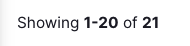
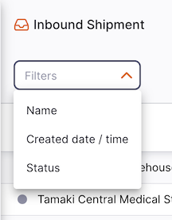
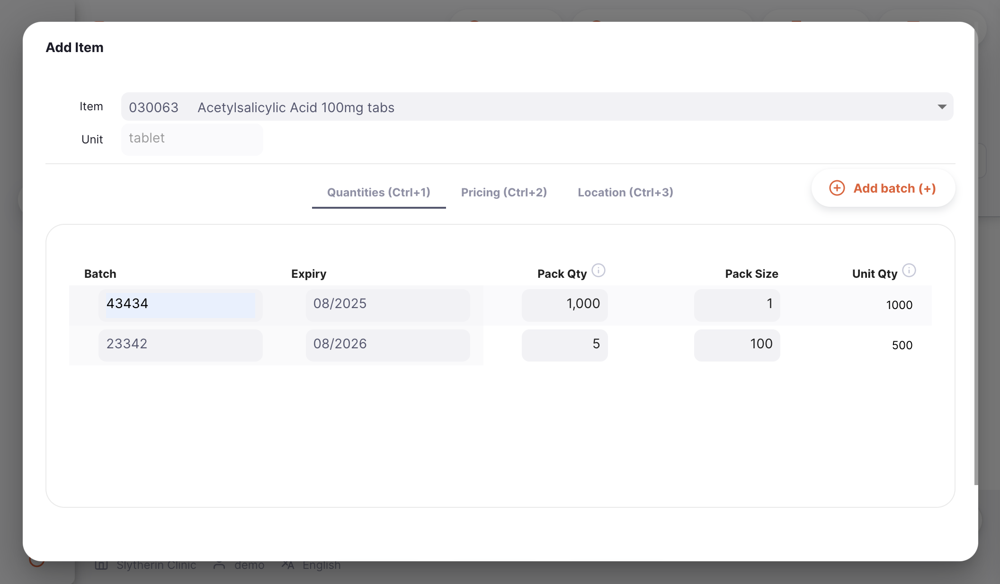

+++
title = "Inbound Shipments"
description = "Receiving stock from suppliers."
date = 2022-03-19
updated = 2022-03-19
draft = false
weight = 44
sort_by = "weight"
template = "docs/page.html"

[extra]
toc = true
top = false
+++

Inbound Shipments can be used to receive stock from suppliers.

If you have used mSupply in the past, you may be familiar with the term **Supplier Invoice** instead of Inbound Shipment.

All received goods should be recorded in mSupply either by:

- Manually creating an Inbound Shipment (manual Inbound Shipment)
- Working with an Inbound Shipment that has been created automatically as a result of a stock transfer from another store in your mSupply

## Viewing Inbound Shipments

### Go to the Inbound Shipments Menu

To access the **Inbound Shipment** menu:

1. Go to the `Replenishment` menu in the navigation panel
2. Click on `Inbound Shipment`

### Inbound Shipments list

First thing you see is a list of existing Inbound Shipments.

The Inbound Shipments list is divided into 7 columns:

| Column        | Description                                                                   |
| :------------ | :---------------------------------------------------------------------------- |
| **Name**      | Name of the Supplier                                                          |
| **Status**    | Current Status of the shipment                                                |
| **Number**    | Reference Number of the shipment                                              |
| **Created**   | Creation date of the shipment                                                 |
| **Delivered** | Date when the shipment was delivered                                          |
| **Comment**   | Comment for the shipment                                                      |
| **Reference** | This will contain the supplier invoice number if it was created automatically |
| **Total**     | Total value of the shipment                                                   |

2. The list can display a fixed number of shipments per page. On the bottom left corner, you can see how many shipments are currently displayed on your screen.

3. If you have more shipments than the current limit, you can navigate to the other pages by clicking on the page number or using the right of left arrows (bottom right corner).

4. You can also select a different number of rows to show per page using the option at the bottom right of the page.

### Filter Inbound Shipments

You can filter the list of shipments by supplier name, created date or status. This can be useful if you're looking for one particular shipment!

For example, to filter by supplier name, click on `Filters`, select `Name` and start typing some or all of a supplier name in the `Name` field. All the shipments for this supplier will appear in the list.

### Exporting Inbound Shipments

The list of Inbound Shipments can be exported to a comma separated file (csv). Simply click the export button (on the right, at the top of the page)

and the file will be downloaded. The export function will download all Inbound Shipments, not just the current page, if you have more than 20 of them.

### Delete an Inbound Shipment

You can delete a shipment from the Inbound Shipment list.

1. Select the shipment that you want to delete by checking the box on the left end of the list. You can select more than one shipments to be deleted. You can even select them all using the master checkbox in the list headers.

2. The `Actions` footer will display at the bottom of the screen when a shipment is selected. It will display the number of shipments selected and the actions which can be taken. Click `Delete`.

A notification confirms how many shipments were deleted (bottom left corner).

You can only delete Inbound Shipments with a status <code>NEW</code>.

## Creating a new manual Inbound Shipment

1. Go to `Replenishment`> `Inbound Shipment`
2. Press the `New Shipment` button, in the top right corner
3. A new window `Suppliers` opens, inviting you to select a supplier

### Select a Supplier

1. In the `Suppliers` window, you will be presented with a list of suppliers. You can select your supplier from the list or you can type as much of a supplier name as you want.

You can tell if a supplier is also using Open mSupply in their store. If they do, you will see icon like this  next to the supplier code. 

In the below example, we are receiving stock from <b>Tamaki Central Medical Store</b>. 

2. Once you have selected a supplier, your Inbound Shipment is created.

If everything went well, you should see the name of your supplier in the top left corner and current status should be <code>New</code>.

### Edit the Supplier Name

If you have selected the wrong supplier, you can change the supplier name in the `Supplier Name` field or select one the dropdown list:

In the below example, we are replacing <b>Tamaki Central Medical Store</b> by <b>Waikato District Store</b>. 

### Enter a Supplier Reference

Once your Inbound Shipment has been created, you can capture a supplier reference in the `Supplier Ref` field, if they have one (eg. _ PO#1234567 _)

### View or edit the Inbound Shipment Information Panel

The Information Panel allows you see or to edit information about the Inbound Shipment. It is divided in multiple sections:

- Additional Info
- Related Documents
- Invoice Details
- Transport Details

We are planning to add more sections in the future as Open mSupply grows. 

#### How to open and close the Information Panel ?

To open the Information Panel, you can tap on the `More` button, located in the top right corner of the Inbound Shipment view.

You can close by tapping on the `X Close` button, on the top right corner of the information panel.

#### Additonal Info

In the **Additional Info** section, you can:

- Donor name (if you have [donor tracking](#track-stock-by-donor) enabled)
- See who created the Inbound Shipment (name of the user)
- View and edit the Inbound Shipment color. To edit the color, tap on the colored circle and select a color from the pop-up
- Write or edit a comment

#### Related Documents

In the **Related Documents** section, you can see other related transaction document for the Inbound Shipment.

If your Inbound Shipment was created to fulfill a **Internal Order**, the reference number of your order would appear in this section.

In the future, we would also include other documents such as temperature records, transportation documents or pickslips.

#### Invoice Details

In this section, you will see by default the total cost price of the items listed in the Inbound Shipment.

You can also add a **Service charges** if you wish to add other charges such as `Freight Costs`. Note: Service charges must be in your Master List for you to use them. To add a Service charges to the Invoice Details:

1. Tap on the `Edit Service Charges` button. A new window opens.
2. Tap on the `Add charge` button on the new window. A new line appears in the list of charges. You tap on `Cancel` if you do not wish to add anything.
3. **Name:** select a service charges in the dropdown list. You can customise the list of available charges. Contact your administrator.
4. **Comment:** You can add a comment to provide further details about the new charge
5. **Amount:** Enter the amount of the charge
6. **Tax:** Enter a % of tax for the charge
7. **Total:** The total field is automatically calculated based on the Amount and the Tax percentage
8. **Delete:** You can tap on the `Delete` icon to delete the charge

The tax rate (%) for service charges and the items sell price can also be edited by clicking on the pencil icon. A pop-up window will appear for you to enter a value.

###### Foreign Currencies

If your store is issuing in foreign currencies follow [these instructions](https://docs.msupply.org.nz/other_stuff:currencies) in the central server documentation to set it up. You will also need to enable the store preference `Store: Able to issue in foreign currency`. This preference is compatible with Open mSupply `v1.7.0+`.

The pen icon will become active once the above instructions have been followed and only if the customer is an external customer. Click on this icon and change to a currency that you would like to issue the shipment in. The currency rate can also be edited if you and the customer have agreed on a different rate.

You can also see the foreign currency totals in the invoice line details as well.

See the <a href="/docs/introduction/faq/#is-there-support-for-my-currency">currency support question</a> for the list of codes supported

#### Transport Details

In this section, you can see or edit a transport reference number (eg. a booking or a tracking reference number).

#### Actions

1. **Delete:** You can tap on the `Delete` button to delete the invoice
2. **Copy to Clipboard**: You can tap on the `Copy to Clipboard` button to copy the invoice details to the clipboard.

### Inbound Shipment Status Sequence

The status sequence is located at the bottom left corner of the Inbound Shipment screen.

Passed statuses are hightlighted in blue, next statuses appear in grey.

<figure>
    
    <figcaption align="center">Status Sequence: current status is <code>New</code>.</figcaption>
</figure>

<figure>
    
    <figcaption align="center">Status Sequence: current status is </i><code>Shipped</code>.</figcaption>
</figure>

There are 5 status for the Inbound Shipment:

| Status        | Description                                                                                                        |
| :------------ | ------------------------------------------------------------------------------------------------------------------ |
| **New**       | This is the first status when you create a new manual Inbound Shipment                                             |
| **Picked**    | Supplier has confirmed that shipment is picked and ready to ship (applies only to automatically created shipments) |
| **Shipped**   | Shipment has been shipped and goods are now in transit (applies only to automatically created shipments)           |
| **Delivered** | When you confirm that the shipment has been delivered                                                              |
| **Verified**  | When you have verified the Inbound Shipment                                                                        |

You probably noticed that two of the status values only apply to automatically created shipments. These are created by the system when another store in the system creates an Outbound Shipment to deliver stock to your store. If this is the case you'll see a message near the top of the page:

Note that this message appears differently if the status is `Delivered` or `Verified`

If, however, you've created an Inbound Shipment manually, then the following message shows:

and you'll see that the status bar has only the status values which apply to this type of shipment.

<figure align="center">
    
    <figcaption align="center">Status Sequence: current status is </i><code>New</code>.</figcaption>
</figure>

If you hover over the status sequence, a shipment history window appears. You can see the date when a shipment was updated from one status to another.

This manual shipment has been created on 03/03/2022

This automatic shipment has been created on 03/03/2022, allocated on 04/03/2022 and picked on 07/03/2022

### Hold checkbox

Located on the bottom left corner, on the left of the status sequence.

Check the `Hold` checkbox prevents the Inbound Shipment from being updated to the next status.

### Close and Confirm button

#### Close Button

Click on the `Close` button to quit the Inbound Shipment view and return to the Inbound Shipments list.

#### Confirm Button

The `Confirm` button is the button to update the status of a shipment. The status which you can confirm depends on the current status of the shipment and follows the sequence shown below.

When managing an Inbound Shipment, you can only confirm it as Delivered or Verified.

| Confirm...            | Current Status | Next Status |
| :-------------------- | :------------- | :---------- |
| **Confirm Delivered** | Shipped        | Delivered   |
| **Confirm Verified**  | Delivered      | Verified    |

You don't have to update a shipment to next status in the sequence. You can choose to skip some of them to go directly to `Confirm Verified` for example.

As demonstrated below, tap on the down arrow of the `Confirm` button and select the status you want the shipment to be updated to.

## Adding lines to an Inbound Shipment

To add a line, tap on the `Add Item` button located in the top left corner of your screen.

A new `Add Item` window opens.

### Select an Item

In the `Add Item` window, you can look up an item by:

- Reading through the list of available items
- or by typing some or all of an item name
- or by typing some or all of an item code

Once your item is highlighted, tap on the name or press `Enter`.

### Quantities tab

In the `Quantities` tab, you can update the following fields:

1. **Batch**: Type here the batch number. Leave blank if item is not managed with batch number.
2. **Expiry**: The expiry date of the batch number. Leave blank is not applicable
3. **Pack Size**: The quantity of units per pack (by default, pack size is 1)
4. **Packs Received**: The quantity of packs you are receiving. This can be entered manually or calculated based on Unit Received / Pack Size
5. **Unit Received** The quantity of units you are receiving. This can be entered manually or calculated based on Packs x Pack Size (`[# Packs] x [Pack Size]`)

**Additional vaccine columns**

The Quantities tab will have extra columns shown when certain preferences are enabled. These preferences are controlled in [Manage > Stores](/docs/manage/facilities/#editing-store-preferences).

The additional columns available with the `Display vaccine in doses` preference on are:

6. **Doses per unit**: The number of doses per unit.
7. **Doses Received**: The number of doses you are receiving. This can be entered manually or calculated based on Pack Size x Packs x Doses

The additional column available with the `Manage Vvm Status For Stock` preference on is:

8. **VVM Status**: The current VVM Status for the batch.

VVM Statuses must also be configured in mSupply by adding a status to the <a href="https://docs.msupply.org.nz/cold_chain_equipment:configure">Vaccine vial monitor list</a>. 

Selecting a VVM Status in an inbound shipment will generate a VVM Status log. One log will be recorded per batch for the inbound shipment (at shipment status Delivered). Logs can be viewed and edited by selecting the item in `View Stock` and selecting the `Status History` tab.

#### Adding Batches

If you are receiving more than one batch number for the same item, you can tap on the `Add Batch` button

In the below example, we are receiving 2 batch numbers for item <i>030063 - Acetylsalicylic Acid 100mg tabs</i> with a different pack size. 

### Pricing tab

On the second tab, `Pricing`, you can update the following fields (all are optional):

- **Batch** (read-only): Batch number
- **Pack Size** (read-only): The quantity of units per pack
- **Pack Qty** (read-only): The quantity of packs you are receiving
- **Cost**: The purchasing unit price of the item (default value is 0)
- **Pack Sell Price**: The selling unit price of the item (default value is 0)
- **Line Total** (read-only): Total purchasing value for the batch number (`[Pack Qty] x [Cost]`)

Sell & Cost prices are per units and not per pack. 

In the below example, the first line's cost price is $0.01 per unit and the sell price $0.10 per unit. 

### Other tab

In the third tab, `Other`, you can select the following:

- **Location**: A storage location to assign the batch number to a location in your storage facility.
- **Donor**: A donor, if configured to track donors. See [Track stock by donor](#track-stock-by-donor) for details.
- **Campaign**: If you have a campaign configured (see [Campaigns](/docs/manage/campaigns/)) then this column allows you to associate the stock line with a campaign

#### Location

Simply select a storage location from the `Location` dropdown menu.

Don't know the storage location yet? You don't have to capture it right away. You can update the storage location at any time if you haven't confirmed the verification yet. 

When editing a line on the shipment, the `Other` tab will have a `Donor` selection if you have the preference enabled:

### Confirm item and quantities

When you're done, you can add the new line by tapping on:

- `OK` if you don't want to add another line to your shipment
- `OK & Next` if you have other lines to create

Otherwise, you can tap on `Cancel` and your changes won't be saved.

## Adding lines to an Inbound Shipment using a Master List

Tap on the `Add from master list` button (top right corner).

The button will be disabled if the status of the Inbound Shipment is anything other than <code>New</code>

A new `Master Lists` window opens. This allows you to select the required master list. Simply click on one of the lists (if you have some available).

Click `OK` on the prompt:

You will then have placeholder lines added to your shipment, which will then look like this:

The imported rows will have zero for the number of packs value, and are therefore shown in a blue font with the batch, expiry, location etc not shown. You can follow the steps for editing these lines, as detailed above.

## Editing an Inbound Shipment line

To edit an Inbound Shipment line, simply tap on it. You will be presented with the `Edit Item` window, which is identical to the `Add Item` window, except that the item is already chosen and cannot be modified.

### Edit a Shipment Line

 <b></b> you can edit a shipment line if the shipment has a status higher lower than <code>Verified</code>. 

1. Open the Inbound Shipment you want to edit
2. Tap on the line you want to edit. An identical window to `Add Item` appears. At this stage:

   - Edit the main `Issue Quantity` field
   - or change the number of packs value at the batch number level

 <b></b> When editing a shipment line, you cannot change the item. You would need to delete the shipment line and to create a new one. 

### Delete a Shipment line

1. Open the Inbound Shipment that you would like to edit
2. Make sure that status is not yet `VERIFIED`
3. Select the line(s) you want to delete by checking the box(es) on the left of the list
4. Click the `Delete` button which appears at the bottom of the page.

You can delete multiple lines at once. Be sure to review what is selected before performing the Delete action. 

## Receiving stock with an Inbound Shipment

### Confirm the delivery of the shipment

Whether your Inbound Shipment is **manual** or **automatic**, the first step to receive the goods is to confirm the delivery.

At this stage, you don't have to check if quantities or other information are correct, you just have to acknowledge that you have received the goods from your supplier.

To confirm that an Inbound Shipment has been delivered, click on the `Confirm Delivered` button.

Once you have done this:

- Goods are now part of your inventory
- Shipment status is now `DELIVERED`

In case your Inbound Shipment is <b>automatic</b>, you cannot confirm its delivery unless the supplier has confirmed its shipment. In other words, your shipment status has to be <code>SHIPPED</code> before you can confirm that you have received the goods. 

Any unallocated lines with a 0 number of packs value will automatically be removed for you when you confirm.

### Verify your Inbound Shipment

Verification is the last step to receive goods in mSupply. At this stage, you can check what you have received and make sure that that information in mSupply are correct.

You have the possibility to verify the following information:

- Batch numbers and their expiry dates
- Quantity of packs and pack size
- Pricing information: cost and sell prices

You can also capture where received goods are to be stored in the `Location` tab.

Once all information have been captured or verified, you can confirm the Shipment as `VERIFIED` by tapping on the `Confirm Verified` button.

Once you have done this:

- Shipment status is now `VERIFIED`
- You can no longer edit shipment lines
- You can no longer delete the shipment

## Returning stock from an Inbound Shipment

Sometimes, you might need to return stock that you received via an Inbound Shipment. You can do this by creating an [Supplier Return](../supplier-returns).

1. Open the Inbound Shipment for which you would like to return some or all of the stock
2. Make sure that status is at least `DELIVERED`
3. Select the line(s) you want to return by checking the box(es) on the left of the list
4. Click the `Return selected lines` button which appears at the bottom of the page.

#### Select quantity to return

A modal will open, containing each line you selected to return:

|              Column               | Description                                                                                                                                                                                      |
| :-------------------------------: | :----------------------------------------------------------------------------------------------------------------------------------------------------------------------------------------------- |
|             **Code**              | Item code                                                                                                                                                                                        |
|             **Name**              | Item name                                                                                                                                                                                        |
|             **Batch**             | Batch number. It is a designation given to products made in the same manufacturing run.                                                                                                          |
|            **Expiry**             | Expiry date of the batch (format: MM/YYYY)                                                                                                                                                       |
| **Quantity Available for Return** | Number of packs available. This means the number of packs not already allocated to other shipments or returns, so the quantity could be less than the quantity received in the Inbound Shipment. |
|      **Quantity to Return**       | Number of packs to be returned                                                                                                                                                                   |

The `Quantity to Return` values will initially be `0` - you can adjust this to return some or all of the available stock.

#### Warnings

If you forget to enter a quantity to return for any batch and click `Next step`, you will see this warning message. You'll need to add a quantity to return from at least one batch. You can click `Cancel` if you no longer want to return any of this stock.

#### Provide reasons

Once you are happy with your quantities to return, you can click `Next step`. The list of batches will be filtered to only include the batches you provided a return quantity for. In this view, you can provide a reason for returning each batch, and an additional comment.

#### Confirm

When you are happy with the quantities and reasons, you can press on:

- the `OK` button. A Supplier Return will be created, and you will be redirected to view it. The quantities of stock selected to return will be reserved for the new return.
- the `Back` button, to go back to the `Select quantity` step

## Viewing an Inbound Shipment

When viewing a specific shipment, you can view the batches on that shipment grouped by item or with each batch listed separately.
To change the view mode, click the `Group by item` switch.

When grouped by item, you can expand the item to see individual batches, or use the expand in the table header to expand all grouped rows. If you click on an item you will also see all selected batches, as shown in this example:

If you do not have enough room on your screen, or simply aren't interested in some of the columns shown, you have the option of hiding which columns are shown in this view.

Click on the `Show / hide columns` button which is at the top right of the table. This gives a list of the columns available - you can check the columns you want to see. The options chosen are stored for the current browser, so next time you view an inbound shipment, you will see the selected columns only. If you have chosen which columns to show, then the button is shown in blue to remind you that there are more columns available.

## Track stock by donor

You can track stock by donor throughout the system. A donor can be linked to an inbound shipment and you can also specify the donor for each line on the shipment.

To begin, enable the [Global preference](/docs/manage/global-preferences/) for `Allow tracking of stock by donor`. Then configure some donors in the mSupply central server. This [documentation page](https://docs.msupply.org.nz/receiving_goods:donors?s[]=donor#adding_or_editing_donors) will tell you how.

Once you have enabled the preference and have some donors configured, open the [information panel](#view-or-edit-the-inbound-shipment-information-panel) of your inbound shipment

Here you can view the currently allocated donor and add or change a donor. Click the pencil icon to show the edit window:

When selecting a donor you have the option to specify how this will affect lines on the shipment:

- All lines - the selected donor is linked to every line on the shipment
- Lines with existing donor - the selected donor replaces the existing donor if one is assigned to a line
- Lines without a donor - only lines with no donor will be linked to this donor
- None

When editing a line on the shipment, the `Other` tab will have a `Donor` selection if you have the preference enabled:

Simply select the donor for that stock line.
