+++
title = "Commandes Internes"
description = "Commander chez des fournisseurs utilisant mSupply."
date = 2022-03-19
updated = 2022-03-19
draft = false
weight = 2
sort_by = "weight"
template = "docs/page.html"

[extra]
toc = true
top = false
+++

Les commandes internes portent plusieurs autres noms dans certains pays ou systèmes :

- Réquisitions
- Commandes
- Rapports Commande

Les commandes internes sont un moyen qui permet aux utilisateurs d'adresser une commande à l'endroit d'un autre dépôt.

## Voir les Commandes Internes

Pour adresser une commande à un fournisseur:

1. Allez dans le menu `Approvisionnement`
2. Cliquez sur `Commandes internes`

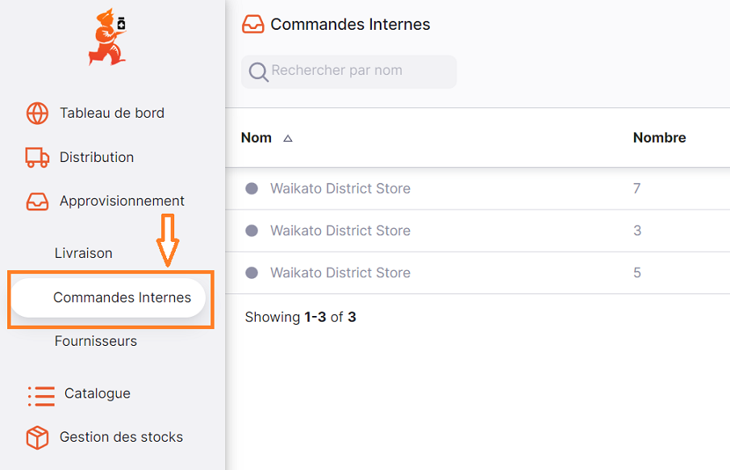

Une liste de commandes internes s'affiche à l'écran:

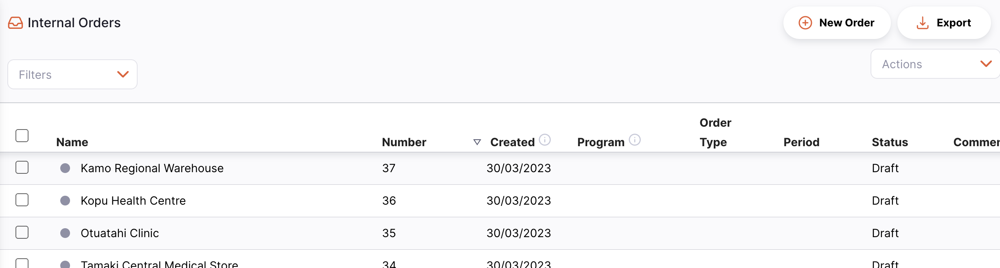

Vous pouvez utiliser le champs `Search by comment` pour filter la liste par commentaire:

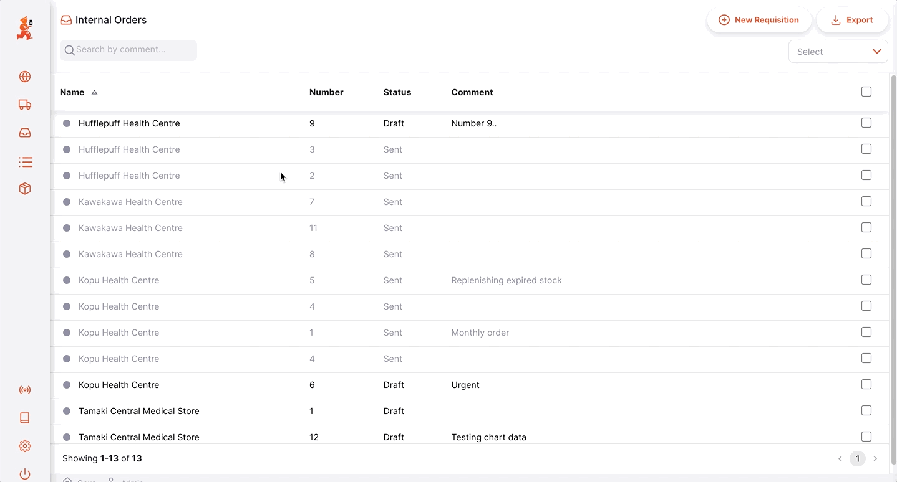

Vous pouvez trier la liste à l'aide des en-têtes de colonne :

1. Appuyez sur l'en-tête de la colonne que vous souhaitez trier. La colonne est triée par ordre croissant.
2. Appuyez à nouveau sur l'en-tête, la colonne sera triée dans l'ordre inverse.

## Créer une nouvelle commande interne

### Sélectionner un fournisseur

1. Cliquez sur le bouton `Nouvelle Commande` (dans le coin supérieur droit):

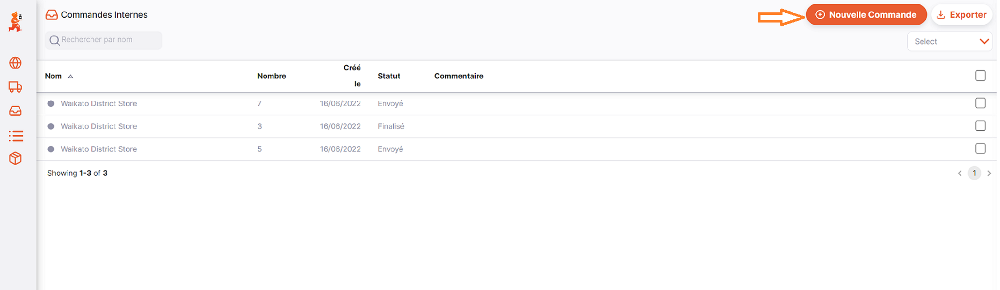

2. Une nouvelle fenêtre vous invitant à choisir un fournisseur s'ouvre:

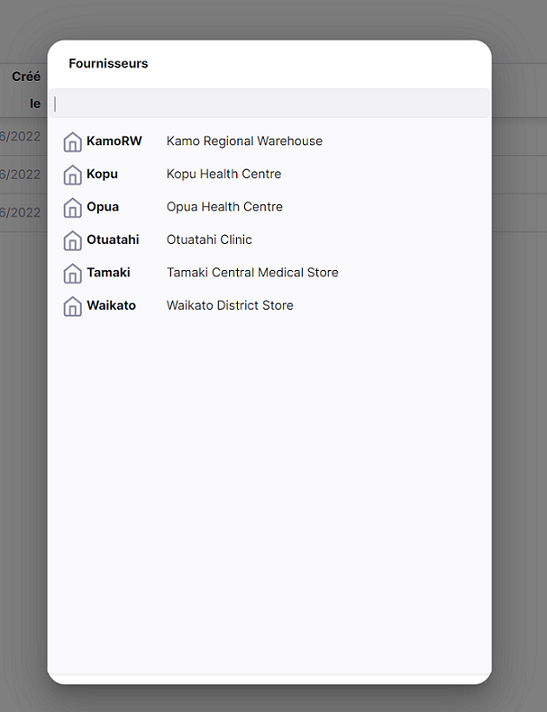

3. Sélectionnez un fournisseur en cliquant sur son nom. Vous verrez une fenêtre comme celle-ci :

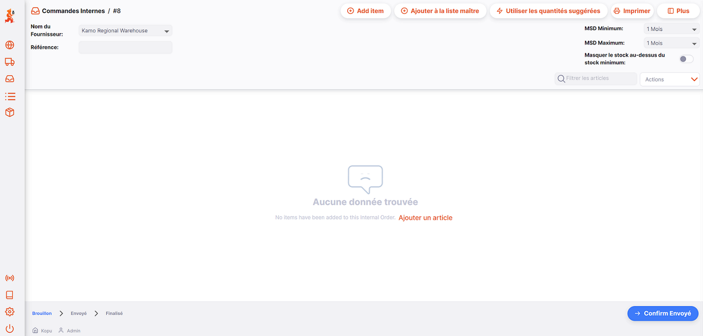

### Defining Maximum Month of Stock (Maximum MOS)

La définition du MOS (mois de stock) maximum est essentielle pour le calcul de la **Quantité suggérée** et vous pouvez la modifier :

- Il existe une règle générale dans l'industrie selon laquelle, le _Maximum MOS_ doit être fixé à 3 fois le cycle de commande.
- Par défaut le _MOS Maximum _ est de 3,0, ce qui est basé sur un cycle de commande mensuel.
- Si, par exemple, le cycle de commande a lieu tous les deux mois, le _Maximum MOS_ doit être fixé à 3 x 2 = `6.0`.

Dans l'exemple ci-dessous, nous fixons notre MOS maximale à 3 mois.  

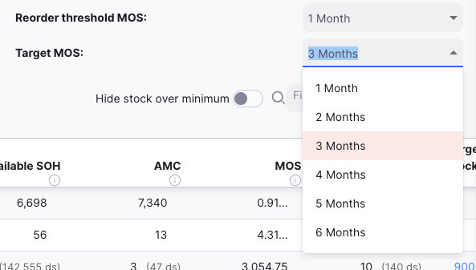

Cette opération peut être effectuée avant ou après l'ajout d'articles à votre commande.

### Adding a single item

Cliquez sur `Ajouter un article` pour ajouter un seul article à votre commande. Une nouvelle fenêtre s'ouvre :

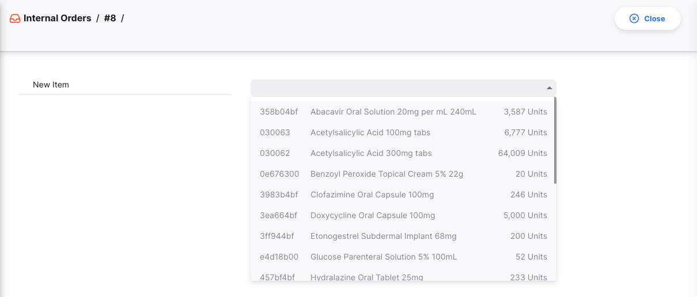

Sélectionnez d'abord l'article que vous souhaitez ajouter à votre commande. Ouvrez la fenêtre `Détails du stock` et sélectionnez votre article dans la liste. Vous pouvez également taper tout ou une partie du nom d'un article (ou d'un code) pour rechercher un article spécifique.

Une fois l'élément sélectionné, les informations suivantes s'affichent dans la fenêtre :

- **Code de l'article** et **Nom de l'article**
- **Unité**: l'unité par défaut utilisée pour cet élément (_eg. Tablette, Fiole_)
- **CMM**: Consommation mensuelle moyenne. La quantité de stock que votre magasin utilise en moyenne chaque mois (sur la base d'un nombre de mois configurable, la valeur par défaut est de 3 mois).
- **Quantité suggérée**: quelle quantité de stock mSupply suggère que votre commande atteigne votre quantité cible de stock
- **Quantité commandée**: la quantité d'unités que vous demandez à votre fournisseur

Vous devriez également voir les graphiques suivants :

- **Distribution des stocks**: Dans ce tableau, vous trouverez les informations suivantes :
  - La _quantité cible_ de l'article. Elle est calculée comme suit : MOS maximum x CMM.
  - Votre _Stock Actuel_ (en gris)
  - La _quantité suggérée_ calculée par mSupply

Dans l'exemple ci-dessous, notre quantité cible est de 600 unités, ce qui équivaut à 3 mois de stock (3 x 200 = 600 unités). Notre stock disponible (en gris) est de 50 unités. Pour atteindre mon objectif, mSupply me suggère de commander 550 unités (600 - 50). 

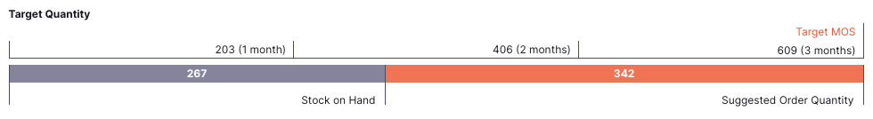

Dans l'exemple ci-dessous, la quantité cible est de 62 unités. Comme nous avons déjà 250 unités en stock (en gris), la quantité suggérée est de zéro. 

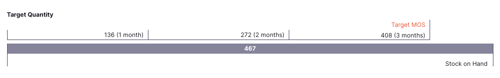

- **Historique de la consommation (mensuel)**: ce graphique montre la consommation mensuelle jusqu'à 12 mois dans le passé (en gris) et la CMM actuel (en orange) :
  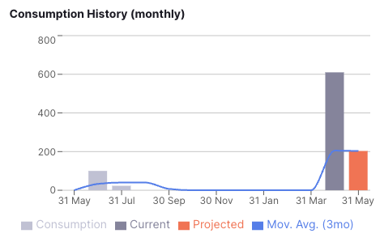

- **Évolution des stocks**: ce graphique vous montre votre niveau de stock pour les 30 derniers jours et votre stock prévisionnel pour les 30 prochains jours. Le stock prévisionnel sera mis à jour en fonction des données que vous aurez saisies dans le champ `Quantité commandée`:

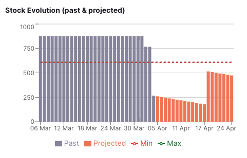

### Ajout d'éléments à l'aide d'une liste de base

Si votre organisation utilise les listes maîtresses, vous pouvez ajouter plusieurs articles à la fois en utilisant les listes maîtresses de votre magasin. Cette fonction est particulièrement utile lorsque vous avez beaucoup d'articles dans votre commande et que vous ne voulez pas les ajouter tous un par un.

1. Tapez sur le bouton `Ajouter à partir de la liste principale`
2. Sélectionner une liste de base
3. Une fenêtre de dialogue s'ouvre pour vous demander si vous souhaitez ajouter tous les éléments de cette liste de base. Appuyez `OK` si vous souhaitez poursuivre.

Tous les articles de la liste principale figurent désormais dans votre commande. Si vous avez déjà ajouté un seul article, il ajoutera les articles qui ne sont pas déjà présents.

Tapez sur une ligne de commande pour modifier la **Quantité commandée** ou tapez sur le bouton `Demandé à Suggéré`

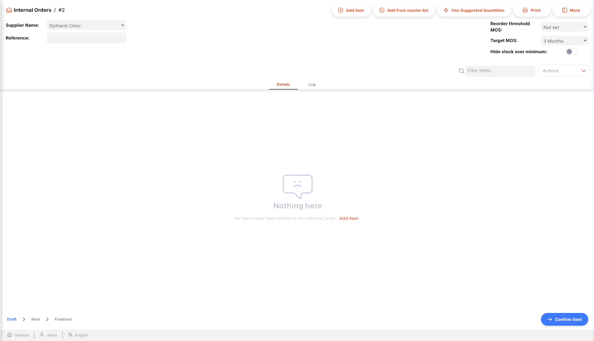

 
Les listes de base sont définies et attribuées aux points de vente au niveau du serveur central. Vous ne pouvez voir que les listes maîtresses visibles par votre point de vente. 
   
Si vous ne trouvez pas la liste maîtresse que vous recherchez et si vous souhaitez en créer une nouvelle, veuillez contacter votre administrateur.

Vous pouvez créer des commandes internes à partir de plusieurs listes de base en répétant les actions ci-dessus avec une autre liste de base. 

### Lecture de la liste de l'ordre interne

Lorsque vous ajoutez des articles (à l'aide d'une liste de base ou non), l'article est ajouté au tableau de la commande. Les informations suivantes sont fournies pour chaque ligne de commande :

| Colonne                | Description                                                                                                                                                                                  |
| :--------------------- | -------------------------------------------------------------------------------------------------------------------------------------------------------------------------------------------- |
| **Code**               | Code de l'article                                                                                                                                                                            |
| **Nom**                | Nom de l'article                                                                                                                                                                             |
| **SDU (Est. restant)** | Quantité de stock actuellement disponible dans votre magasin                                                                                                                                 |
| **CMM**                | Consommation mensuelle moyenne : la quantité de stock que votre magasin utilise en moyenne chaque mois (sur la base d'un nombre de mois configurable, la valeur par défaut étant de 3 mois). |
| **Stock cible**        | C'est le stock que vous visez. Calculé comme suit : CMM x MOS maximum                                                                                                                        |
| **Quantité suggérée**  | La quantité de stock que mSupply suggère pour votre commande. Cette quantité est calculée comme suit : CMM x MOS maximum - SDU                                                               |
| **Demandé**            | Cette valeur est fixée par défaut à zéro. Il s'agit de la quantité d'unités que vous commandez à votre fournisseur.                                                                          |
| **Commentaire**        | Un commentaire pour la ligne de commande. Les commentaires seront visibles par votre fournisseur.                                                                                            |

### Utilisation des quantités suggérées

Si vous tapez sur le bouton `Quantités suggérées pour l'utilisation` dans l'en-tête de la demande d'achat, mSupply copiera automatiquement les valeurs de l'élément **Quantité suggérée** dans la colonne **Quantité demandée** colonne.

Vous pouvez toujours modifier manuellement la quantité commandée pour chaque ligne de commande en cliquant sur celle-ci.

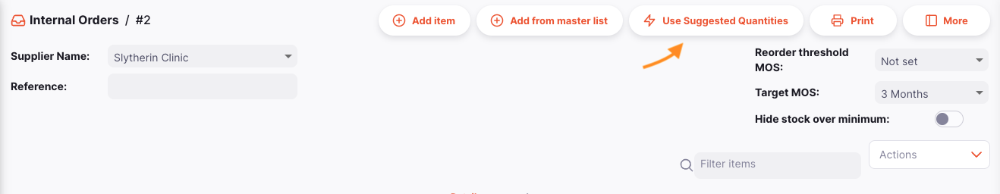

### Impression d'une commande interne

Pour consulter un ordre interne spécifique, il suffit de cliquer sur le bouton `Imprimer` qui se trouve en haut à droite de la page.
Lors de l'impression, un fichier PDF est généré pour vous, qui s'ouvre alors dans un nouvel onglet du navigateur. Vous pouvez ensuite l'imprimer à l'aide de votre navigateur en cliquant sur "Imprimer" ou en utilisant le bouton "Imprimer". `contrôle`+`P` (si vous utilisez Windows) ou `cmd`+`P` de votre clavier (si vous utilisez un Mac).

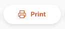

Il s'agit soit

- Affiche un menu de rapports possibles à sélectionner avant de créer un PDF. Cela se produira si plusieurs rapports sont définis pour le fichier `Demande d'information` type de rapport.
- Créer un PDF immédiatement, s'il n'y a qu'un seul rapport à sélectionner

### Envoi d'un ordre interne

Pour envoyer la commande à votre fournisseur :

1. Tapez sur `Confirmer l'envoi` (en bas à droite)
2. Une fenêtre de dialogue s'ouvre pour vous demander si vous êtes sûr de vouloir envoyer la commande. Cliquez sur `OK` de procéder
3. Le statut de votre commande est maintenant `ENVOI` et l'ordre n'est plus modifiable

Assurez-vous que votre commande est correcte avant de l'envoyer à votre fournisseur. Une fois envoyées, les commandes finalisées ne peuvent plus être modifiées. 

