+++
title = "Commandes Internes"
description = "Demander du stock à vos fournisseurs."
date = 2022-03-19
updated = 2022-03-19
draft = false
weight = 42
sort_by = "weight"
template = "docs/page.html"

[extra]
toc = true
top = false
+++

Les Commandes Internes portent plusieurs autres noms selon les pays ou les systèmes :

- Réquisitions
- Commandes
- Rapport & Réquisition
- R&R

Les Commandes Internes permettent aux utilisateurs de demander du nouveau stock auprès d'un autre dépôt.

## Consulter les Commandes Internes

Pour commander du stock auprès de votre fournisseur :

1. Accédez au menu `Réapprovisionnement`
2. Appuyez sur `Commandes Internes`

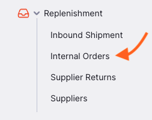

Vous verrez la liste de toutes les Commandes Internes existantes :

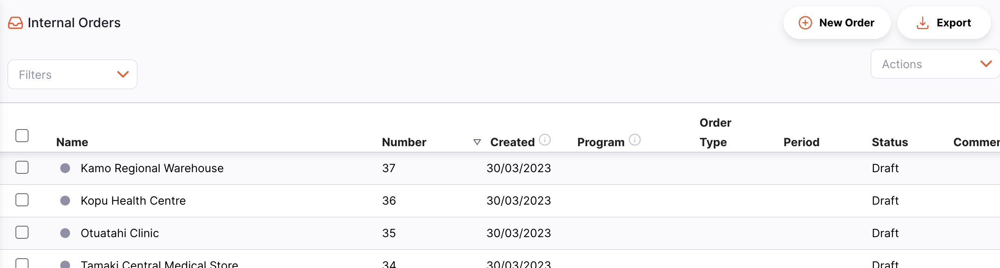

Vous pouvez utiliser les filtres pour filtrer la liste par nom, statut ou numéro de réquisition :

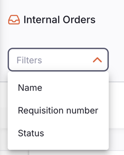

Si vous utilisez des réquisitions de programme, des options de filtre supplémentaires peuvent être disponibles, comme le filtrage par type de commande. Cela est utile pour trouver rapidement des commandes d'urgence. Voir <a href="/docs/programs/requisitions/">Réquisitions de Programme</a> pour plus de détails sur les commandes d'urgence.

Vous pouvez trier la liste en utilisant les en-têtes de colonnes :

1. Appuyez sur l'en-tête de la colonne que vous souhaitez trier. La colonne est triée par ordre croissant.
2. Appuyez à nouveau sur l'en-tête et la colonne sera triée dans l'ordre inverse.

## Créer une nouvelle Commande Interne

### Sélectionner un fournisseur

1. Cliquez sur le bouton `Nouvelle Commande` (coin supérieur droit) :

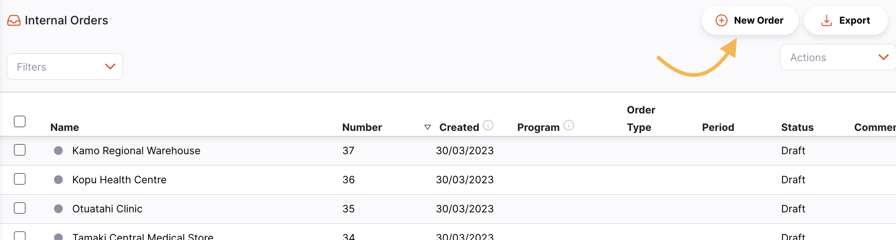

2. Une nouvelle fenêtre s'ouvre, vous invitant à sélectionner un fournisseur :

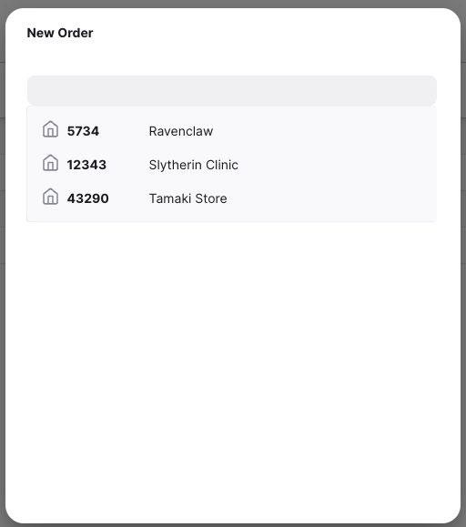

3. Sélectionnez un fournisseur en appuyant sur son nom. Vous serez redirigé vers une fenêtre comme celle-ci :

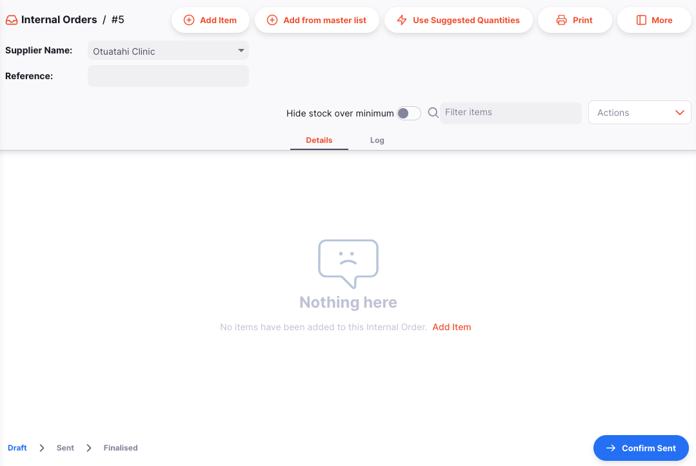

### Définir le seuil de réapprovisionnement MDS (MDS minimum)

Le _Seuil de réapprovisionnement MDS_ (anciennement connu sous le nom de _MDS Minimum_) est utilisé dans le calcul de la **Quantité suggérée**. Si le MDS d'un article est supérieur au _Seuil de réapprovisionnement MDS_, le système ne calculera pas de valeur de quantité suggérée. Voir la section <a href="#quantite-suggeree">Quantité suggérée</a> pour plus de détails.

Si vous avez défini une valeur de seuil, vous pouvez également filtrer la liste des articles de cette commande interne en activant le bouton _Masquer le stock au-dessus du minimum_. Cela masquera les articles dont les niveaux de stock dépassent ce seuil.

Dans l'exemple ci-dessous, nous avons défini notre seuil de réapprovisionnement MDS à 1 mois.

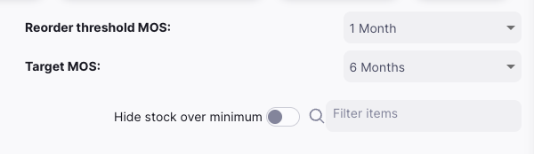

### Définir le MDS cible (MDS maximum)

La définition du MDS cible (Mois de Stock) est essentielle au calcul de la **Quantité suggérée** :

- Il est communément admis que le _MDS cible_ doit être défini à 3 fois le cycle de commande
- Le _MDS cible_ par défaut est `3,0`, basé sur un cycle de commande mensuel
- Par exemple, si le cycle de commande est tous les deux mois, le _MDS cible_ devrait être défini à 3 x 2 = `6,0`

Dans l'exemple ci-dessous, nous définissons notre MDS cible à 3 mois.

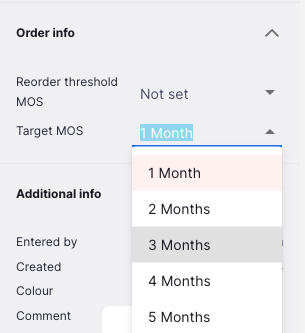

Cela peut être fait avant ou après avoir ajouté des articles à votre commande.

### Ajouter un article individuel

Appuyez sur `Ajouter un Article` pour ajouter un article à votre commande.

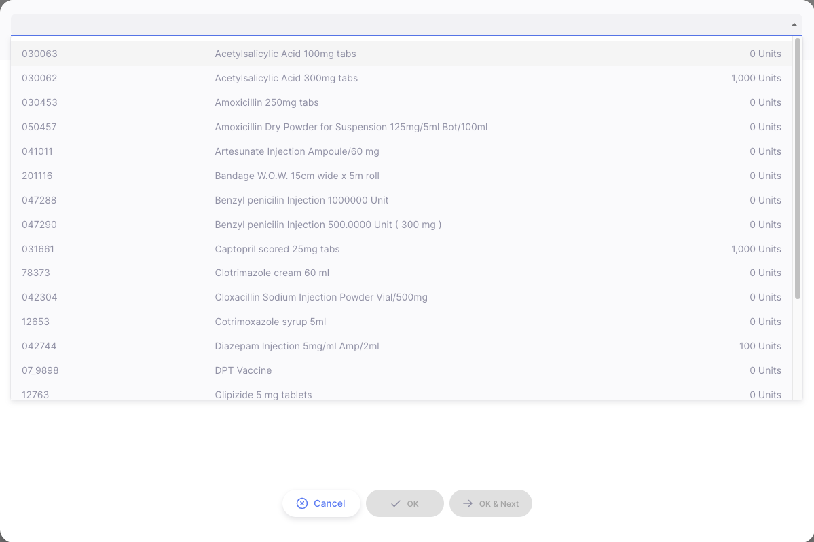

Sélectionnez d'abord l'article que vous souhaitez ajouter à votre commande. Vous pouvez également saisir tout ou partie d'un nom d'article (ou d'un code) pour rechercher un article spécifique.

Une fois un article sélectionné, vous devriez voir les informations suivantes sur la page.

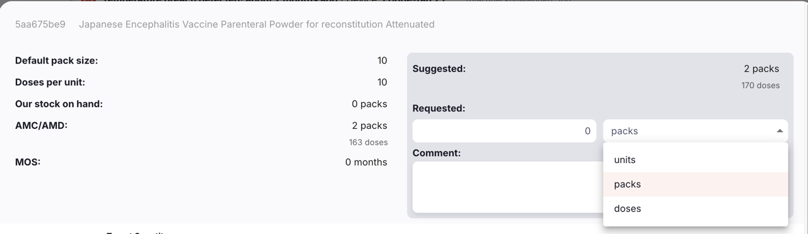

- **Unité** : l'unité définie pour l'article (ex. Comprimé, Flacon)
- **Taille de paquet par défaut** : la taille de paquet par défaut de l'article
- **Doses par unité** : (affiché uniquement si cet article est un vaccin) le nombre de doses par unité, ex. par flacon
- **Notre SED** : Stock En Dépôt. La quantité de stock actuellement disponible dans le dépôt
- **CMM/DMM** : Consommation Mensuelle Moyenne / Distribution Mensuelle Moyenne. La quantité de stock utilisée par votre dépôt chaque mois en moyenne (basé sur un nombre configurable de mois, par défaut 3 mois)
- **MDS** : Mois De Stock — combien de mois le stock actuel durera, utilisé au taux mensuel moyen (CMM)
- **Suggérée** : le nombre d'unités que mSupply suggère de commander pour atteindre votre quantité cible
- **Demandée** : le nombre d'unités que vous demandez à votre fournisseur
- **Sélecteur unité/paquet/dose** : un menu déroulant pour choisir entre commander en unités, paquets ou doses, selon les préférences de votre dépôt. Voir [Demander une quantité](#demander-une-quantite) pour plus de détails.
- **Commentaire** : tout commentaire que vous souhaitez ajouter à la commande

De plus, si vous consultez une commande de programme et avez activé la préférence du dépôt `Utiliser la consommation et le stock des clients pour les commandes internes`, vous verrez des champs supplémentaires :

- **Expiration proche** : combien d'unités de cet article ont une date d'expiration dans les 3 prochains mois
- **Stock entrant** : combien de stock a été ajouté par des expéditions durant la période de cette commande interne
- **Sorties** : combien a été retiré du stock par des expéditions durant la période de cette commande interne
- **Pertes** : combien a été retiré du stock par des inventaires ou ajustements durant la période de cette commande interne
- **Ajouts** : combien a été ajouté au stock par des inventaires ou ajustements durant la période de cette commande interne
- **Jours sans stock** : le nombre de jours durant la période où le dépôt n'avait pas de stock de cet article

Vous pouvez également voir les graphiques suivants :

- **Quantité cible** : ce graphique affiche les informations suivantes :
  - La _Quantité cible_ pour l'article. Calculée comme : MDS cible x CMM.
  - Votre _Stock en Dépôt_ actuel (en gris)
  - La _Quantité suggérée_ calculée par mSupply

Dans l'exemple ci-dessous, notre quantité cible est de 609 unités, ce qui équivaut à 3 mois de stock (3 x 203 = 609 unités). Notre stock en dépôt (en gris) est de 269, donc pour atteindre ma cible, mSupply suggère de commander 342 unités (609 - 269).

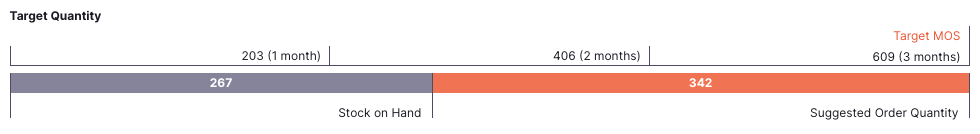

Dans l'exemple ci-dessous, la quantité cible est de 408 unités. Comme nous avons déjà 467 unités en stock (en gris), la quantité suggérée est zéro.

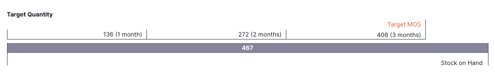

- **Historique de consommation (mensuel)** : ce graphique montre la consommation mensuelle sur les 12 derniers mois (en gris), la CMM actuelle (en gris foncé), la consommation projetée (en orange) et la moyenne mobile (ligne bleue) :

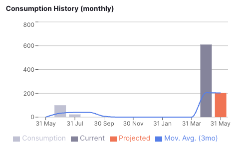

- **Évolution du stock** : ce graphique montre votre niveau de stock sur les 30 derniers jours et votre inventaire projeté pour les 30 prochains jours. Le stock projeté sera mis à jour en fonction de vos saisies dans le champ `Quantité demandée` :

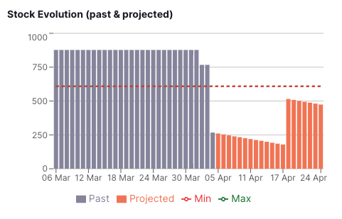

Si vous avez activé la préférence globale [`Afficher les prévisions basées sur la population`](/docs/manage/global-preferences/), vous verrez le calcul de prévision basé sur la population à la place.

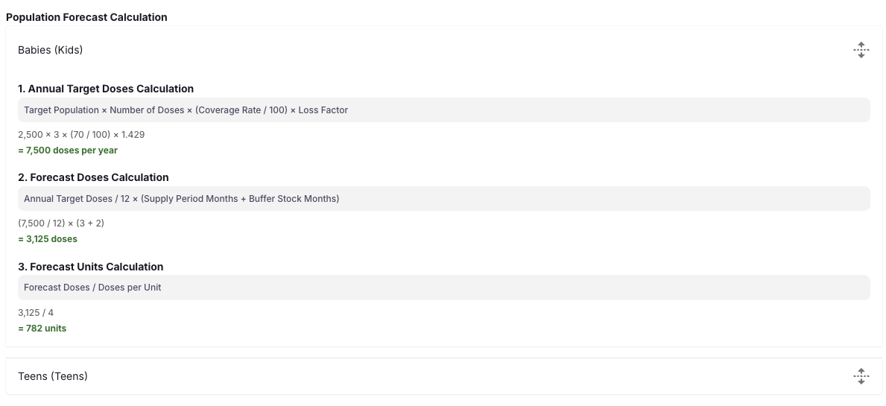

### Demander une quantité

Le menu déroulant à côté du champ **Demandée** vous permet de choisir entre saisir les quantités en **unités**, **paquets** ou **doses**. Lorsque vous changez la sélection, les valeurs affichées pour le stock en dépôt, la CMM et la quantité suggérée sont adaptées en conséquence.

Les options disponibles dépendent des préférences de votre dépôt. L'option `paquets` est disponible lorsque la préférence `Commander en paquets` est activée. Pour les vaccins, l'option `doses` est disponible lorsque la préférence `Gérer les vaccins en doses` est activée. Si les deux préférences sont activées, l'option `paquets` est sélectionnée par défaut.

### Ajouter des articles via une liste maîtresse

Si votre organisation utilise des Listes Maîtresses, vous pouvez ajouter plusieurs articles à la fois en utilisant les listes maîtresses de votre dépôt. C'est particulièrement utile lorsque vous avez beaucoup d'articles à commander et que vous ne souhaitez pas les ajouter un par un.

1. Appuyez sur le bouton `Ajouter depuis une liste maîtresse`
2. Sélectionnez une liste maîtresse
3. Une fenêtre de dialogue s'ouvre vous demandant si vous souhaitez ajouter tous les articles de cette liste maîtresse. Appuyez sur `OK` pour continuer.

Tous les articles de la liste maîtresse figurent maintenant dans votre commande. Si vous aviez précédemment ajouté des articles individuels, les articles qui n'y figurent pas encore seront ajoutés.

Appuyez sur une ligne de commande pour modifier la **Quantité demandée** ou appuyez sur le bouton `Utiliser les quantités suggérées` pour copier automatiquement les valeurs de la colonne **Quantité suggérée** dans la colonne **Quantité demandée**.

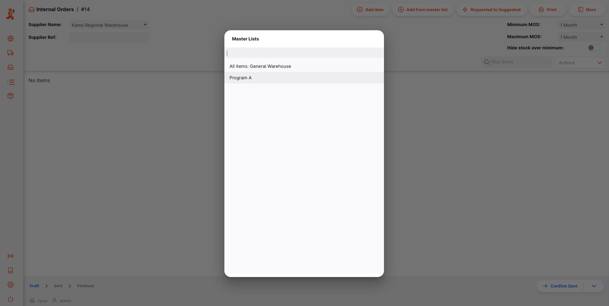

Les Listes Maîtresses sont définies et assignées aux dépôts au niveau du serveur central. Vous ne pouvez voir que les listes maîtresses visibles pour votre dépôt.
 Sachez également que si vous utilisez la fonctionnalité des programmes, seules les listes maîtresses qui ne font pas partie d'un programme peuvent être sélectionnées.
  
Si vous ne trouvez pas la liste maîtresse que vous cherchez et souhaitez en créer une nouvelle, contactez votre administrateur.

Vous pouvez créer des Commandes Internes à partir de plusieurs listes maîtresses en répétant les actions ci-dessus avec une autre liste maîtresse.

### Lire la liste de la Commande Interne

Lorsque vous ajoutez des articles (avec ou sans liste maîtresse), l'article est ajouté au tableau de la commande. Les informations suivantes sont fournies pour chaque ligne de commande :

| Colonne                   | Description                                                                                                                                                                                                                                      |
| :------------------------ | ------------------------------------------------------------------------------------------------------------------------------------------------------------------------------------------------------------------------------------------------ |
| **Code**                  | Code de l'article                                                                                                                                                                                                                                |
| **Nom**                   | Nom de l'article                                                                                                                                                                                                                                 |
| **Unité**                 | Unité de l'article, ex. Comprimé, Gélule, Flacon                                                                                                                                                                                                |
| **Doses par unité**       | Si la préférence `Gérer les vaccins en doses` est activée, cette colonne est ajoutée. Elle indique le nombre de doses par unité (ex. Flacon) si l'article est un vaccin, et `-` sinon.                                                           |
| **TDP**                   | Taille de paquet par défaut de l'article                                                                                                                                                                                                         |
| **SED (reste estimé)**    | Stock En Dépôt : la quantité de stock actuellement disponible dans votre dépôt                                                                                                                                                                   |
| **CMM**                   | Consommation Mensuelle Moyenne : la quantité de stock utilisée chaque mois en moyenne (basé sur un nombre configurable de mois, par défaut 3 mois). Cette colonne est masquée lorsque les prévisions basées sur la population sont activées.     |
| **Stock cible (CMM)**     | C'est le stock que vous visez. Calculé comme : CMM x MDS cible                                                                                                                                                                                   |
| **Quantité suggérée**     | La quantité que mSupply suggère de commander. Calculée comme : (CMM x MDS cible) - SED                                                                                                                                                           |
| **Demandée**              | Définie à zéro par défaut. C'est la quantité d'unités que vous commandez à votre fournisseur.                                                                                                                                                    |

Les prévisions basées sur la population pour les vaccins sont disponibles en tant que fonctionnalité intégrée. Pour l'activer, activez <a href="/docs/manage/facilities/#available-preferences">Utiliser les prévisions basées sur la population</a>. Lorsqu'elle est activée, vous verrez une colonne supplémentaire <b>Stock cible (population)</b> indiquant la cible calculée en fonction de la population desservie par ce dépôt.

#### Quantité suggérée

La valeur de la quantité suggérée sera zéro si l'une de ces conditions est vraie :

- La valeur CMM est `0`
- La valeur _MDS cible_ est `0`
- Le nombre de mois de stock pour l'article est supérieur au _Seuil de réapprovisionnement MDS_

Si aucune de ces conditions n'est vraie, la quantité suggérée est donnée par la formule suivante :

`(MDS cible - MDS) * CMM`

puis arrondie au nombre entier supérieur.

### Imprimer une Commande Interne

Lorsque vous consultez une Commande Interne spécifique, cliquez simplement sur le bouton `Imprimer` en haut à droite de la page.
Lors de l'impression, un fichier PDF est généré et s'ouvrira dans un nouvel onglet du navigateur. Il peut ensuite être imprimé via votre navigateur en cliquant sur imprimer ou en utilisant les touches `Ctrl`+`P` (sous Windows) ou `Cmd`+`P` (sous Mac).

Cela affichera soit :

- Un menu de rapports disponibles parmi lesquels choisir avant de créer le PDF, si plusieurs rapports sont définis pour le type de rapport `Réquisition`.
- Un PDF immédiatement, s'il n'y a qu'un seul rapport disponible.

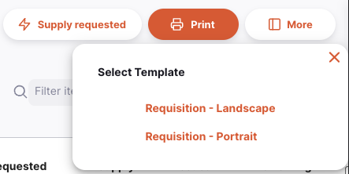

### Envoyer une Commande Interne

Vous aurez besoin de la permission [Peut confirmer la Commande Interne comme Envoyée](/docs/settings/permissions/) pour pouvoir envoyer une Commande Interne :

1. Appuyez sur le bouton `Confirmer Envoyée` (coin inférieur droit)
2. Une fenêtre de dialogue s'ouvre vous demandant si vous êtes sûr de vouloir envoyer la commande. Appuyez sur `OK` pour continuer
3. Le statut de votre commande est maintenant `ENVOYÉE` et la commande n'est plus modifiable

Assurez-vous que votre commande est correcte avant de l'envoyer à votre fournisseur. Une fois `ENVOYÉE`, aucune modification ne peut être apportée à la commande.

## Approuver les Commandes Internes

### Processus d'approbation à distance

Certains dépôts peuvent exiger que leurs réquisitions soient approuvées par des utilisateurs spécifiques avant qu'elles puissent être traitées. Pour une description complète de ce processus, consultez la documentation mSupply sur l'[Autorisation à distance](https://docs.msupply.org.nz/other_stuff:remote_authorisation).

Pour ce faire :

- Dans le dépôt demandeur, activez la préférence `Inclure les réquisitions de ce dépôt dans le processus d'autorisation à distance du fournisseur`
- Dans le dépôt fournisseur, activez la préférence `Utiliser l'autorisation à distance pour les réquisitions de réponse`

Lorsque cette configuration est en place, le dépôt demandeur verra une colonne supplémentaire dans la liste des Commandes Internes, indiquant le statut d'approbation :

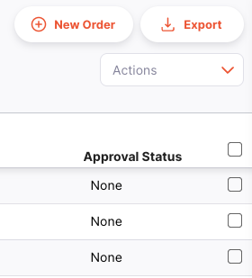

Et lors de la consultation d'une Commande Interne spécifique, des colonnes indiquant la quantité approuvée, le nombre de paquets approuvés et un commentaire de l'approbateur s'affichent :

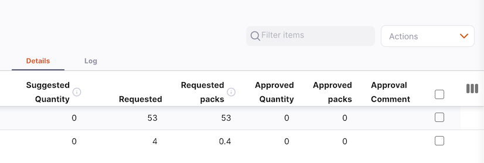

De même, le dépôt fournisseur aura une colonne supplémentaire dans la vue liste des réquisitions indiquant le statut d'approbation :

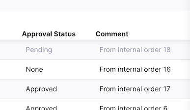

Et une réquisition spécifique aura également de nouvelles colonnes pour la quantité approuvée et un commentaire d'approbation :

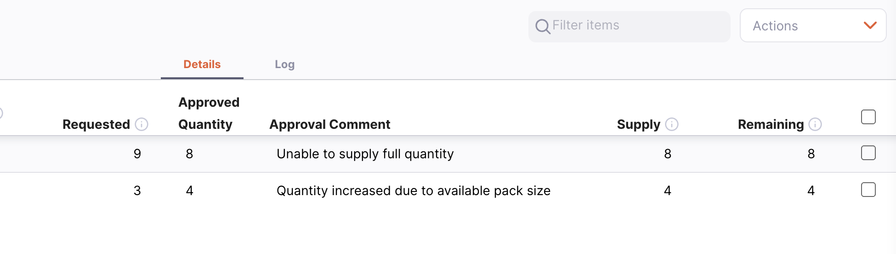

### Processus d'approbation locale

Une autre option pour mettre en place une étape d'approbation pour les Commandes Internes est d'activer ce qu'on appelle l'« approbation locale ». Cela vous permet de n'autoriser que certains utilisateurs à changer le statut d'une Commande Interne en `Envoyée`. Pour permettre à un utilisateur de changer le statut en `Envoyée`, la permission `Peut confirmer la Commande Interne comme Envoyée` doit être activée.

Pour définir la permission, modifiez l'utilisateur dans mSupply et passez à l'onglet `Permissions Open mSupply` :

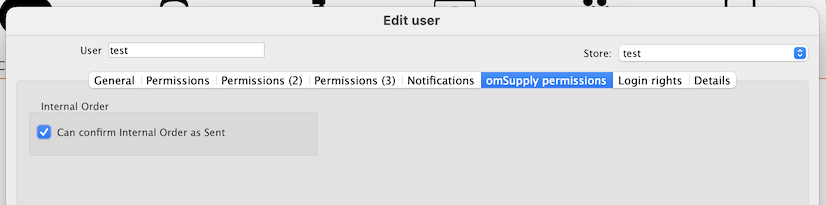

Sans cette option cochée, l'utilisateur ne pourra pas mettre à jour le statut de la Commande Interne en `Envoyée`.

Lors du changement de statut en `Envoyée`, les détails de l'utilisateur sont ajoutés au champ commentaire, visible dans le panneau de détails de la Commande Interne :

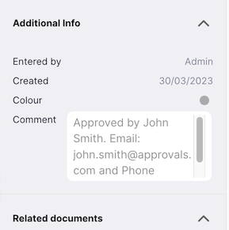

Le texte supplémentaire est de la forme :

`Approuvé par [nom complet de l'utilisateur]. E-mail : [adresse e-mail de l'utilisateur] et Numéro de téléphone : [numéro de téléphone de l'utilisateur].`
