+++
title = "Commandes d'Achat"
description = "Commander du stock auprès de fournisseurs externes."
date = 2025-09-26
updated = 2025-09-26
draft = false
weight = 10
sort_by = "weight"
template = "docs/page.html"

[extra]
toc = true
top = false
+++

Les Commandes d'Achat peuvent être utilisés pour commander du stock auprès de fournisseurs externes.

## Préférences

### Utiliser les Commandes d'Achat

Pour utiliser les Commandes d'Achat, vous devez avoir activé la préférence de dépôt [Utiliser la fonctionnalité d'achat](/docs/manage/facilities/#store-preferences) pour votre dépôt.

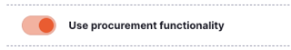

### Autoriser les Commandes d'Achat

L'autorisation est requise si la [préférence globale](/docs/manage/global-preferences/) `Autoriser les Commandes d'Achat` est activée.

Lorsqu'elle est activée, le prochain statut d'une Commande d'Achat après `Nouveau` est `Prêt pour approbation`. Seul un utilisateur disposant des permissions d'autorisation peut confirmer le passage au statut suivant, `Prêt pour envoi`.

## Permissions

### Autoriser les Commandes d'Achat

Les utilisateurs devant être en mesure d'autoriser les Commandes d'Achat doivent avoir la [permission utilisateur](https://docs.msupply.org.nz/admin:managing_users#permissions_tabs) `Autoriser les Commandes d'Achat` activée.

Cette permission permet à l'utilisateur de faire passer le statut d'une Commande d'Achat de `Prêt pour approbation` à `Prêt pour envoi` si l'autorisation est requise.

Elle permet également à l'utilisateur de modifier la valeur `Conditionnements ajustés` une fois que la Commande d'Achat est au statut `Prêt pour envoi` ou ultérieur. Les utilisateurs sans cette permission ne peuvent pas modifier ce champ.

## Consulter les Commandes d'Achat

### Accéder au menu Commandes d'Achat

Avec la préférence `Utiliser la fonctionnalité d'achat` activée, vous pourrez accéder au menu **Commandes d'Achat** :

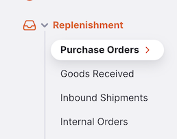

1. Allez dans le menu `Réapprovisionnement` dans le panneau de navigation
2. Cliquez sur `Commandes d'Achat`

### Liste des Commandes d'Achat

La première chose que vous voyez est une liste des Commandes d'Achat existantes.

La liste des Commandes d'Achat est divisée en les colonnes suivantes :

| Colonne                | Description                              |
| :--------------------- | :--------------------------------------- |
| **Fournisseur**        | Nom du fournisseur                       |
| **Numéro**             | Numéro de la Commande d'Achat            |
| **Créé**               | Date de création                         |
| **Confirmé**           | Date de confirmation                     |
| **Envoyé**             | Date d'envoi                             |
| **Livraison demandée** | Date de livraison demandée               |
| **Statut**             | Statut actuel                            |
| **Mois cibles**        | Mois d'approvisionnement cibles          |
| **Lignes**             | Nombre de lignes sur la Commande d'Achat |
| **Commentaire**        | Commentaire de la Commande d'Achat       |

### Filtrer les Commandes d'Achat

Vous pouvez filtrer la liste des Commandes d'Achat par fournisseur, statut, date de confirmation, date de livraison demandée et date d'envoi.

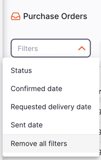

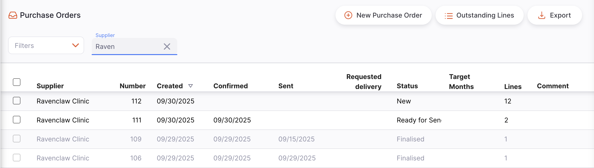

### Exporter les Commandes d'Achat

La liste des Commandes d'Achat peut être exportée en fichier CSV. Cliquez simplement sur le bouton d'export (à droite, en haut de la page).

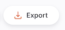

La fonction d'export téléchargera tous les Commandes d'Achat, pas seulement la page actuelle, si vous en avez plus de 20.

### Supprimer une Commande d'Achat

Vous pouvez supprimer une commande depuis la liste des Commandes d'Achat

1. Sélectionnez la Commande d'Achat à supprimer en cochant la case à gauche de la liste. Vous pouvez en sélectionner plusieurs. Vous pouvez même tous les sélectionner en utilisant la case principale dans les en-têtes de liste.

2. Le pied de page `Actions` s'affichera en bas de l'écran lorsqu'une Commande d'Achat est sélectionné. Cliquez sur `Supprimer`.

Une notification confirme le nombre de Commandes d'Achat supprimées (coin inférieur gauche).

Vous ne pouvez supprimer que les Commandes d'Achat avec le statut <code>Nouveau</code>.

## Lignes de Commandes d'Achat en attente

Pour voir les lignes actuellement en attente sur les Commandes d'Achat, appuyez sur le bouton `Lignes en attente`.

Cela vous amènera à une liste des lignes actuellement en attente — des lignes qui ont été envoyées au fournisseur mais n'ont pas encore été reçues ou sont partiellement reçues.

Appuyer sur une ligne vous amènera à la Commande d'Achat, où vous pourrez voir les lignes et mettre à jour le statut de ligne.

### Colonnes des lignes en attente

| Colonne                       | Description                                              |
| :---------------------------- | :------------------------------------------------------- |
| **N° BC**                     | Numéro de la Commande d'Achat                            |
| **Référence BC**              | Référence fournisseur                                    |
| **Créé par**                  | Utilisateur ayant créé la Commande d'Achat               |
| **Code fournisseur**          | Code du fournisseur                                      |
| **Nom fournisseur**           | Nom du fournisseur                                       |
| **Nom de l'article**          | Nom de l'article en attente                              |
| **BC confirmé**               | Date de confirmation                                     |
| **Date de livraison prévue**  | Date de livraison prévue                                 |
| **Unités ajustées (prévues)** | Quantité d'unités commandées dans cette Commande d'Achat |
| **Unités reçues**             | Quantité d'unités reçues pour cette Commande d'Achat     |
| **Unités en attente**         | Nombre d'unités encore en attente                        |

## Créer une nouvelle Commande d'Achat

1. Allez dans `Réapprovisionnement` > `Commandes d'Achat`
2. Appuyez sur le bouton `Nouvelle Commande d'Achat`, dans le coin supérieur droit
3. Une nouvelle fenêtre `Fournisseurs` s'ouvre, vous invitant à sélectionner un fournisseur
4. Lorsqu'un fournisseur est sélectionné, la Commande d'Achat est créée

### Sélectionner un fournisseur

1. Dans la fenêtre `Fournisseurs`, une liste de fournisseurs vous est présentée. Vous pouvez sélectionner votre fournisseur dans la liste ou commencer à saisir le nom d'un fournisseur pour filtrer la liste.

Les Commandes d'Achat ne peuvent être créées que pour des fournisseurs externes — c'est-à-dire un fournisseur qui n'est <em>pas</em> un dépôt dans votre système mSupply.

Dans l'exemple ci-dessous, nous commandons du stock auprès de <b>Ravenclaw Clinic</b>.

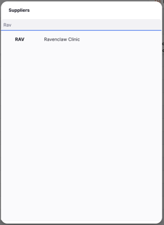

2. Une fois que vous avez sélectionné un fournisseur, votre Commande d'Achat est créée.

Si tout s'est bien passé, vous devriez voir le nom de votre fournisseur dans le coin supérieur gauche et le statut actuel devrait être <code>Nouveau</code>.

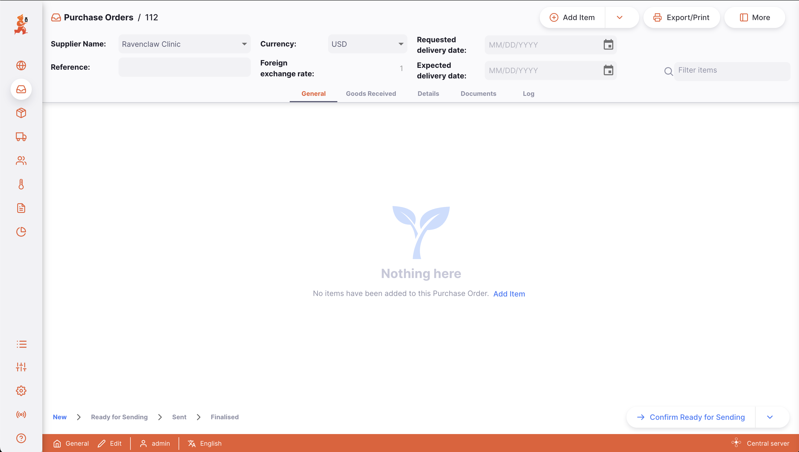

### Modifier le nom du fournisseur

Si vous avez sélectionné le mauvais fournisseur, vous pouvez changer le nom dans le champ `Nom du fournisseur` ou en sélectionner un dans la liste déroulante :

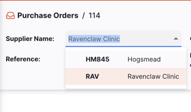

### Saisir une référence fournisseur

Une fois votre Commande d'Achat créé, vous pouvez saisir une référence fournisseur dans le champ `Réf. fournisseur`, s'ils en ont une (ex. BC#1234567)

### Saisir une date de livraison demandée

Saisissez la date de livraison demandée pour la Commande d'Achat. Si certains articles nécessitent une date différente, elle peut être ajoutée lors de la création ou de la modification de l'article.

### Saisir une date de livraison prévue

Saisissez la date de livraison prévue pour la Commande d'Achat, fournie par le fournisseur. Si certains articles nécessitent une date différente, elle peut être ajoutée lors de la création ou de la modification de l'article.

### Devises étrangères

Vous pouvez sélectionner une devise étrangère pour la Commande d'Achat. Il s'agit généralement de la devise de votre fournisseur. Cliquez sur le menu déroulant et sélectionnez la devise souhaitée.

Voir la <a href="/docs/introduction/faq/#is-there-support-for-my-currency">question sur la prise en charge des devises</a> pour la liste des codes pris en charge

### Consulter ou modifier le panneau d'informations de la Commande d'Achat

Le panneau d'informations vous permet de voir ou de modifier les informations relatives à la Commande d'Achat. Il est divisé en plusieurs sections :

- Tarification
- Autre
- Dates

#### Comment ouvrir et fermer le panneau d'informations ?

Pour ouvrir le panneau d'informations, appuyez sur le bouton `Plus`, situé dans le coin supérieur droit de la vue de la Commande d'Achat.

Vous pouvez le fermer en appuyant sur le bouton `X Fermer`, dans le coin supérieur droit du panneau d'informations.

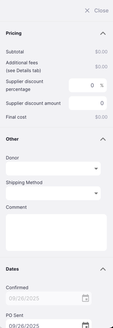

#### Tarification

Dans la section **Tarification**, vous pouvez voir les informations de prix pour la Commande d'Achat, notamment : sous-total, frais supplémentaires, pourcentage de remise fournisseur, montant de remise fournisseur et coût final.

#### Autre

Dans la section **Autre**, vous pouvez : renseigner un nom de donateur, sélectionner un mode d'expédition, et rédiger ou modifier un commentaire.

La configuration des donateurs est effectuée sur le serveur central mSupply. Cette <a href="https://docs.msupply.org.nz/receiving_goods:donors?s[]=donor#adding_or_editing_donors">page de documentation</a> vous explique comment procéder.

#### Dates

Dans cette section, vous verrez les dates clés de la Commande d'Achat : confirmé, envoyé, contrat signé, avance payée.

### Séquence de statuts de la Commande d'Achat

La séquence de statuts est située dans le coin inférieur gauche de l'écran de la Commande d'Achat.

Les statuts passés sont mis en surbrillance en bleu, les statuts suivants apparaissent en gris.

<figure>
    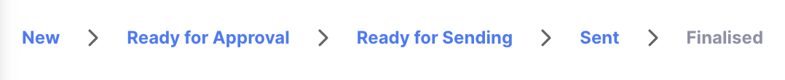
    <figcaption align="center">Séquence de statuts : le statut actuel est <code>Envoyé</code>.</figcaption>
</figure>

Il y a 5 statuts pour les Commandes d'Achat (vous pourriez en voir moins si l'autorisation n'est pas requise) :

| Statut                    | Description                                                                                                                                | mSupply | Lignes modifiables | Lignes modifiables pour les utilisateurs autorisés |
| :------------------------ | ------------------------------------------------------------------------------------------------------------------------------------------ | :-----: | :----------------: | :------------------------------------------------: |
| **Nouveau**               | Premier statut lors de la création d'une nouvelle Commande d'Achat                                                                         |   nw    |         ✓          |                         ✓                          |
| **Prêt pour approbation** | La commande est prête à être approuvée par quelqu'un disposant d'une autorisation (uniquement si la préférence d'autorisation est activée) |   sg    |         ✓          |                         ✓                          |
| **Prêt pour envoi**       | La Commande d'Achat est prête à être envoyé au fournisseur                                                                                 |   cn    |                    |                         ✓                          |
| **Envoyé**                | La Commande d'Achat a été envoyée au fournisseur. Les lignes seront mises à jour au statut `Envoyé`                                        |   cn    |                    |                         ✓                          |
| **Finalisé**              | Lorsque vous confirmez que la commande a été reçue. Les lignes seront mises à jour au statut `Clôturé`                                     |   fn    |                    |                                                    |

<figure align="center">
    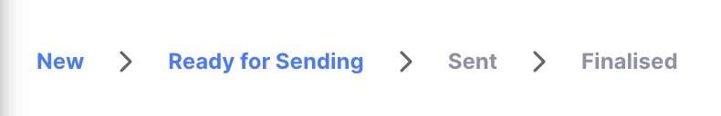
    <figcaption align="center">Séquence de statuts : le statut actuel est <code>Prêt pour envoi</code>.</figcaption>
</figure>

Cette Commande d'Achat a été créé le 24/09/2025, prêt pour envoi le 24/09/2025 et envoyé le 30/09/2025

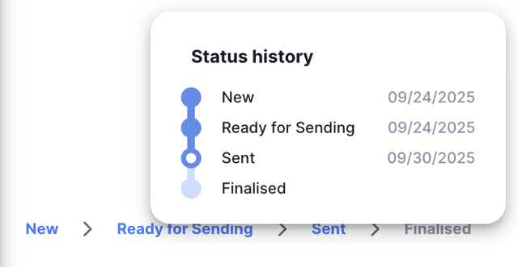

### Bouton Confirmer

Le bouton `Confirmer` permet de mettre à jour le statut d'une Commande d'Achat. Les statuts ne peuvent pas être sautés.

| Confirmer...              | Statut actuel          | Statut suivant (autorisation activée) | Statut suivant (autorisation désactivée) |
| :------------------------ | :--------------------- | :------------------------------------ | ---------------------------------------- |
| **Nouveau**               | Nouveau                | Prêt pour approbation                 | Prêt pour envoi                          |
| **Prêt pour approbation** | Prêt pour approbation  | Prêt pour envoi                       | N/A                                      |
| **Prêt pour envoi**       | Prêt pour envoi        | Envoyé                                | Envoyé                                   |
| **Envoyé**                | Envoyé                 | Finalisé                              | Finalisé                                 |

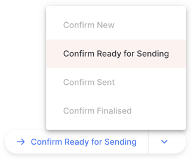

## Ajouter des lignes à une Commande d'Achat

Pour ajouter une ligne, appuyez sur le bouton `Ajouter un Article` dans le coin supérieur gauche de votre écran.

Une nouvelle fenêtre `Ajouter un Article` s'ouvre.

### Sélectionner un article

Dans la fenêtre `Ajouter un Article`, vous pouvez rechercher un article par : la liste des articles disponibles, tout ou partie d'un nom d'article, ou tout ou partie d'un code article.

Une fois votre article mis en surbrillance, appuyez sur son nom ou sur `Entrée`.

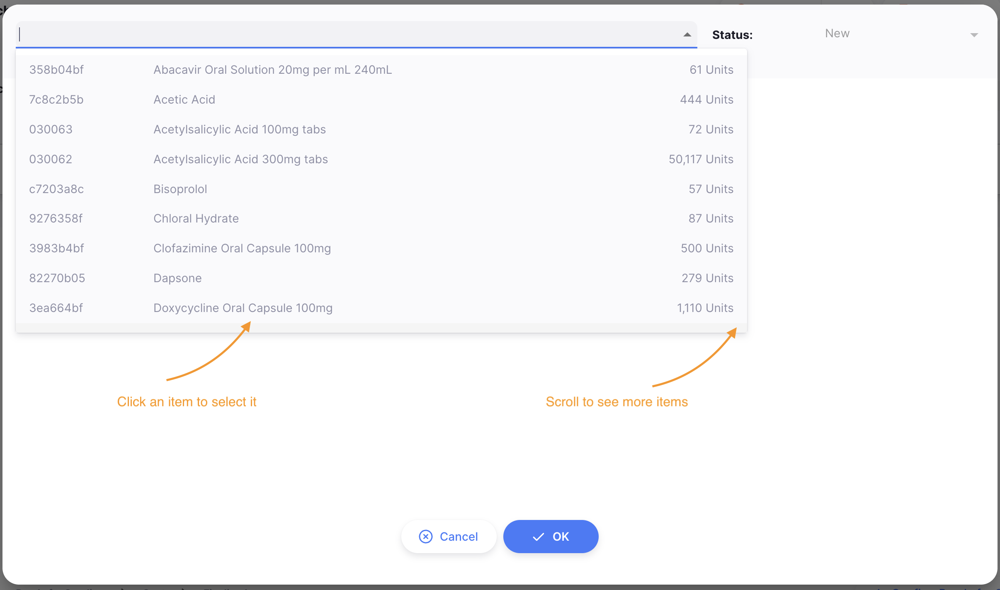
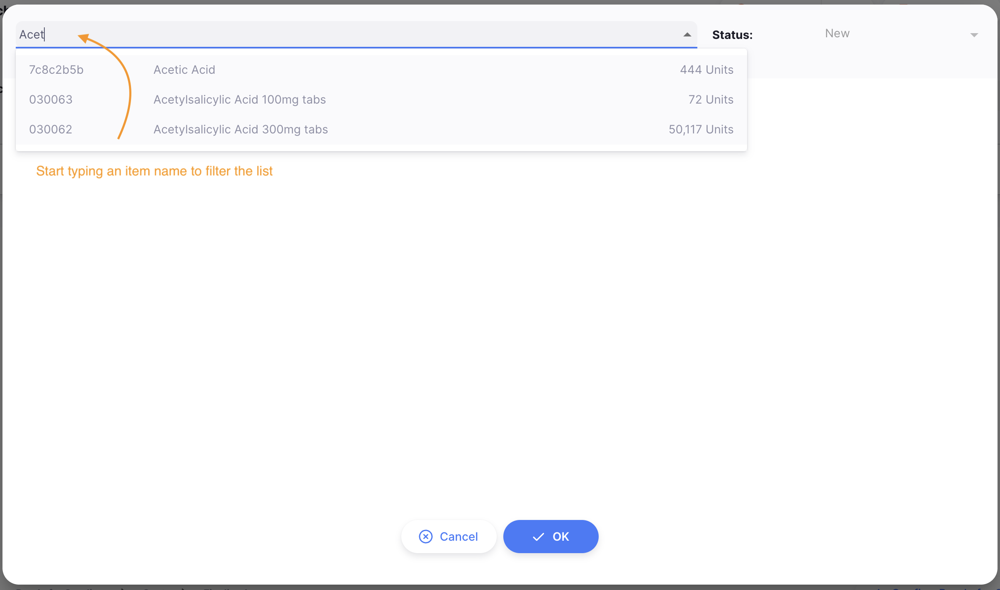
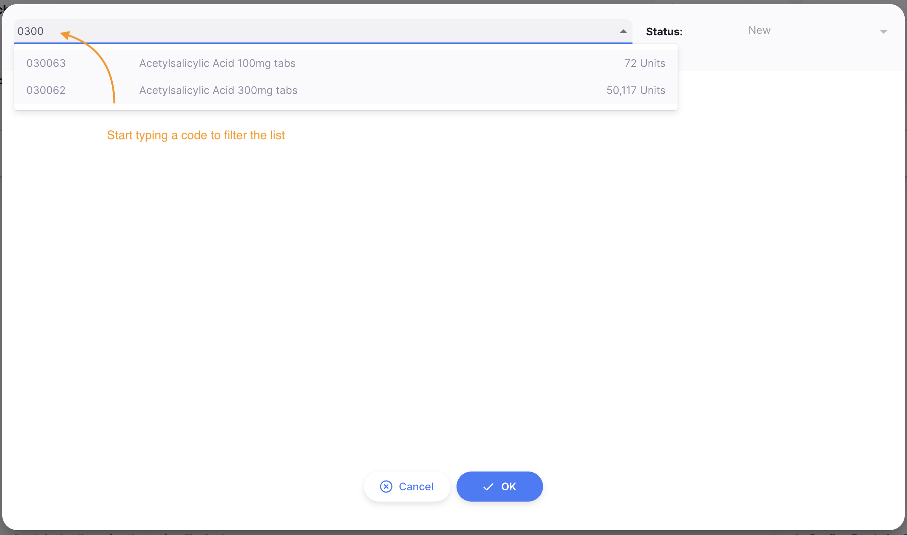

### Détails de l'article

Plusieurs champs contiennent des informations sur l'article. La plupart des champs sont modifiables lorsque la Commande d'Achat est au statut Nouveau ou Prêt pour approbation.

| Champ                                       | Description                                                                                                                                                                                                                                                  |
| :------------------------------------------ | :----------------------------------------------------------------------------------------------------------------------------------------------------------------------------------------------------------------------------------------------------------- |
| **Statut**                                  | Le statut de cette ligne. Modifiable uniquement lorsque la Commande d'Achat est au statut `Envoyé`                                                                                                                                                           |
| **Numéro de ligne**                         | La ligne sur laquelle se trouve cet article pour cette Commande d'Achat.                                                                                                                                                                                     |
| **Stock en dépôt**                          | Le nombre d'unités de cet article dans votre dépôt.                                                                                                                                                                                                          |
| **Unité**                                   | Le type d'unités commandées, par exemple « comprimé ».                                                                                                                                                                                                       |
| **Code article fournisseur**                | Le code article utilisé par le fournisseur. Laisser vide si non applicable.                                                                                                                                                                                  |
| **Fabricant**                               | Sélectionnez un fabricant dans la liste déroulante.                                                                                                                                                                                                          |
| **Conditionnements demandés**               | Le nombre de conditionnements que vous demandez — modifiable uniquement aux statuts `Nouveau` et `Prêt pour approbation`                                                                                                                                     |
| **Conditionnement ajustés**                 | Si la Commande d'Achat est au statut `Prêt pour envoi` ou `Envoyé`, les utilisateurs autorisés peuvent modifier ce champ. Cela devient le nouveau nombre de conditionnement commandés. Ne peut pas être inférieur à la quantité déjà reçue pour cet article. |
| **Taille de conditionnement**               | Le nombre d'unités par conditionnement (par défaut, taille de conditionnement = 1).                                                                                                                                                                          |
| **Demandé**                                 | Champ en lecture seule avec le nombre de conditionnements demandés.                                                                                                                                                                                          |
| **Prix par conditionnement (avant remise)** | Le prix de base par conditionnement dans la devise sélectionnée.                                                                                                                                                                                             |
| **Pourcentage de remise**                   | Le montant de remise applicable à cet article.                                                                                                                                                                                                               |
| **Prix par conditionnement (après remise)** | Le prix par conditionnement remisé dans la devise sélectionnée.                                                                                                                                                                                              |
| **Coût total**                              | Champ en lecture seule avec le coût calculé de tous les conditionnements pour cet article, après remise.                                                                                                                                                     |
| **Date de livraison demandée**              | Date de livraison demandée pour cet article. Peut différer de celle de la Commande d'Achat.                                                                                                                                                                  |
| **Date de livraison prévue**                | Date de livraison prévue pour cet article.                                                                                                                                                                                                                   |
| **Commentaire**                             | Champ de texte libre pour un commentaire sur cet article.                                                                                                                                                                                                    |
| **Notes**                                   | Champ de texte libre pour des notes sur cet article.                                                                                                                                                                                                         |

Si la Commande d'Achat est au statut <code>Envoyé</code> et que les <code>Conditionnements ajustés</code> sont modifiés pour un article, le statut de la Commande d'Achat passera à <code>Prêt pour envoi</code> et le statut de la ligne passera à <code>Nouveau</code>.

Dans l'exemple ci-dessous, nous commandons 50 conditionnements de 100 pour l'article <i>030063 - Acide Acétylsalicylique 100mg comprimés</i> au prix de 35$ par conditionnement avec une remise article de 5%.

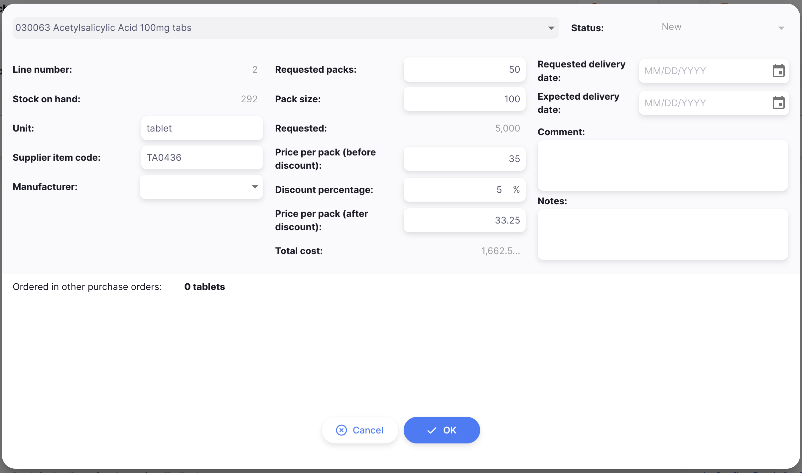

### Confirmer l'article et les quantités

Une fois terminé, vous pouvez ajouter la nouvelle ligne en appuyant sur :

- `OK` si vous ne souhaitez pas ajouter d'autre ligne à votre Commande d'Achat
- `OK & Suivant` si vous avez d'autres lignes à créer

Vous pouvez également appuyer sur `Annuler` pour annuler sans enregistrer.

## Ajouter des lignes via une liste maîtresse

Appuyez sur le bouton `Ajouter depuis une liste maîtresse` dans la sélection du bouton Ajouter.

Le bouton sera désactivé si le statut de la Commande d'Achat est autre que <strong>Nouveau</strong> ou <strong>Prêt pour approbation</strong>.

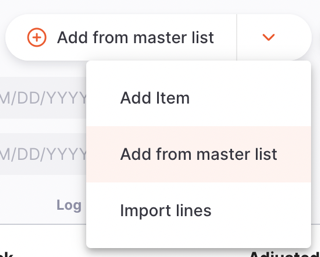

Une nouvelle fenêtre `Listes Maîtresses` s'ouvre. Cliquez simplement sur l'une des listes disponibles.

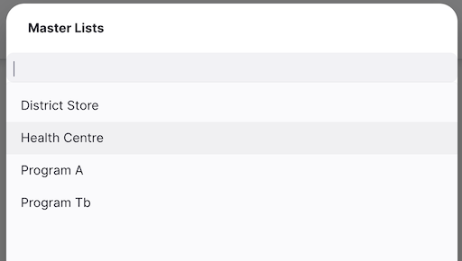

Cliquez sur `OK` sur le message de confirmation :
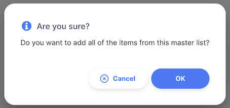

Des lignes de remplacement seront ajoutées à votre Commande d'Achat, affichées en police bleue avec une quantité de conditionnements à zéro. Vous pouvez ensuite les modifier en suivant les étapes décrites ci-dessus.

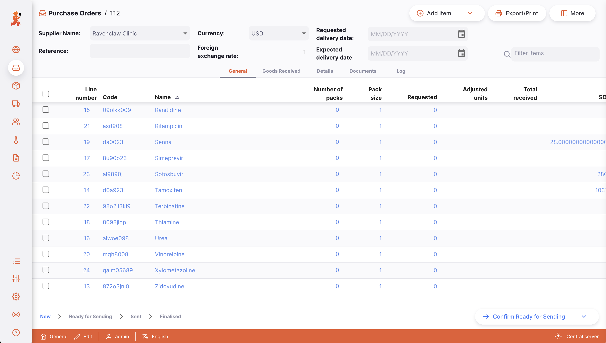

## Ajouter des lignes via une importation

Appuyez sur le bouton `Importer des lignes` dans la sélection du bouton Ajouter.

Le bouton sera désactivé si le statut de la Commande d'Achat est autre que <strong>Nouveau</strong> ou <strong>Prêt pour approbation</strong>.

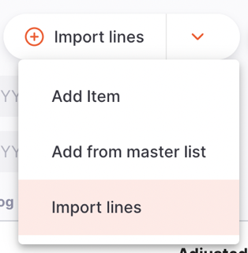

Une fenêtre d'importation s'ouvrira. Cliquez sur `Télécharger un modèle` pour télécharger un modèle CSV que vous pouvez utiliser pour importer des articles.

Lorsque vous êtes prêt, glissez-déposez le fichier CSV dans la fenêtre ou cliquez sur `Parcourir les fichiers` pour le sélectionner depuis votre ordinateur.

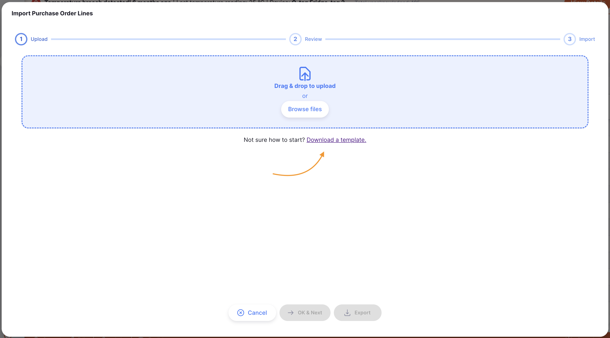

##### Erreurs d'import

Après le chargement de votre fichier CSV, vos données seront validées et affichées pour révision. Si les données ne sont pas valides, un message d'erreur s'affichera et vous ne pourrez pas continuer.

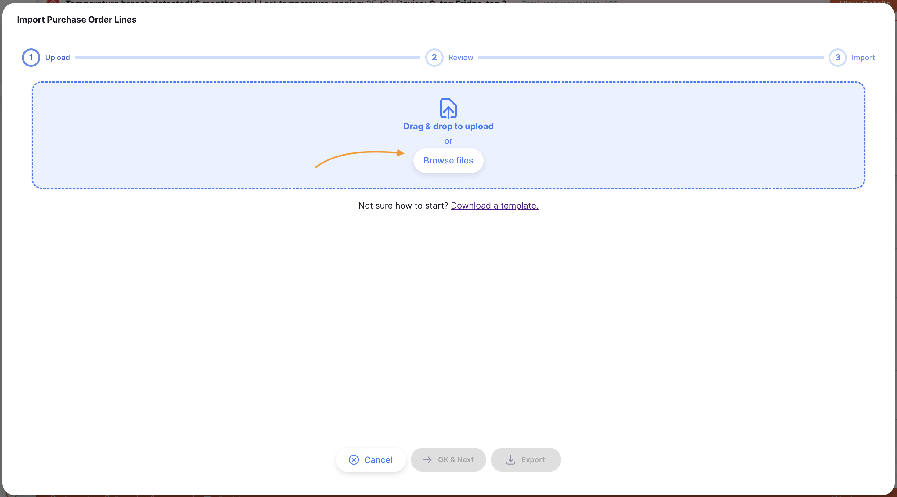

Vous pouvez utiliser le bouton `Exporter` en bas de la fenêtre d'import pour télécharger un CSV incluant les messages d'erreur.

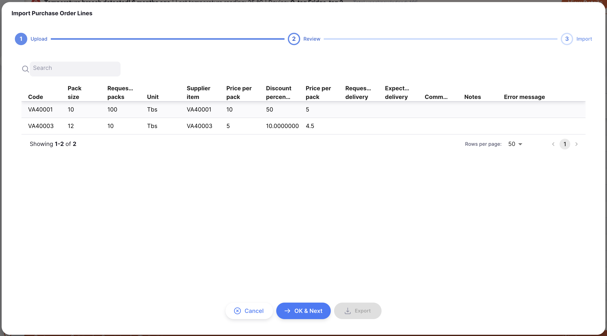

## Modifier une ligne d'une Commande d'Achat

Pour modifier une ligne, appuyez simplement dessus.

La plupart des champs sont modifiables lorsque la Commande d'Achat est aux statuts <code>Nouveau</code> ou <code>Prêt pour approbation</code>. À des statuts ultérieurs, différents champs sont disponibles.

| Champ                                          | Nouveau ou Prêt pour approbation | Prêt pour envoi | Envoyé |
| :--------------------------------------------- | :------------------------------: | :-------------: | :----: |
| **Conditionnements demandés**                  |                ✓                 |                 |        |
| **Taille de conditionnement**                  |                ✓                 |                 |        |
| **Prix par conditionnement et remise article** |                ✓                 |                 |        |
| **Nom de l'unité**                             |                ✓                 |                 |        |
| **Code fournisseur**                           |                ✓                 |        ✓        |   ✓    |
| **Fabricant**                                  |                ✓                 |                 |        |
| **Dates de livraison demandée et prévue**      |                ✓                 |                 |        |
| **Date de livraison prévue**                   |                ✓                 |        ✓        |        |
| **Commentaire et note**                        |                ✓                 |        ✓        |   ✓    |
| **Sonditionnements ajustés**                   |                                  |        ✓        |   ✓    |
| **Statut de la ligne**                         |                                  |                 |   ✓    |

### Supprimer une ligne de Commande d'Achat

1. Ouvrez la Commande d'Achat à modifier
2. Assurez-vous que le statut n'est pas encore `Prêt pour envoi`
3. Sélectionnez la ou les lignes à supprimer en cochant les cases à gauche
4. Cliquez sur le bouton `Supprimer` en bas de la page

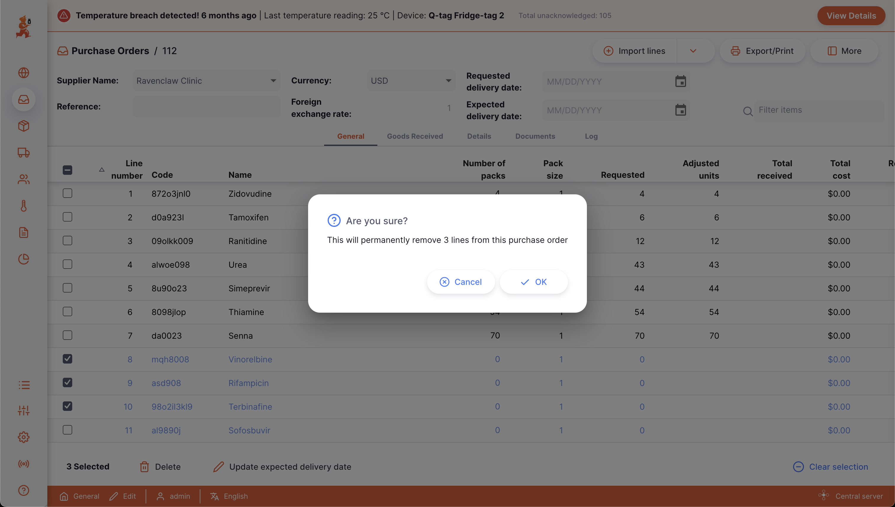

### Autres actions sur les lignes

| Action                              | Effet                                                                                                                                                      |
| ----------------------------------------- | ---------------------------------------------------------------------------------------------------------------------------------------------------------- |
| Supprimer                           | Supprime les lignes sélectionnées                                                                                                                          |
| Mettre à jour la date de livraison prévue | Ouvre une fenêtre pour choisir une date de livraison prévue pour toutes les lignes sélectionnées                                                           |
| Clôturé pour réception              | Définit le `Statut de la ligne` à `Clôturé` pour toutes les lignes sélectionnées. Disponible uniquement lorsque la Commande d'Achat est au statut `Envoyé` |
| Effacer la sélection                | Efface les cases de sélection                                                                                                                              |

## Onglets de la Commande d'Achat

### Marchandises reçues

Cet onglet affiche les `Marchandises reçues` liées à cette Commande d'Achat

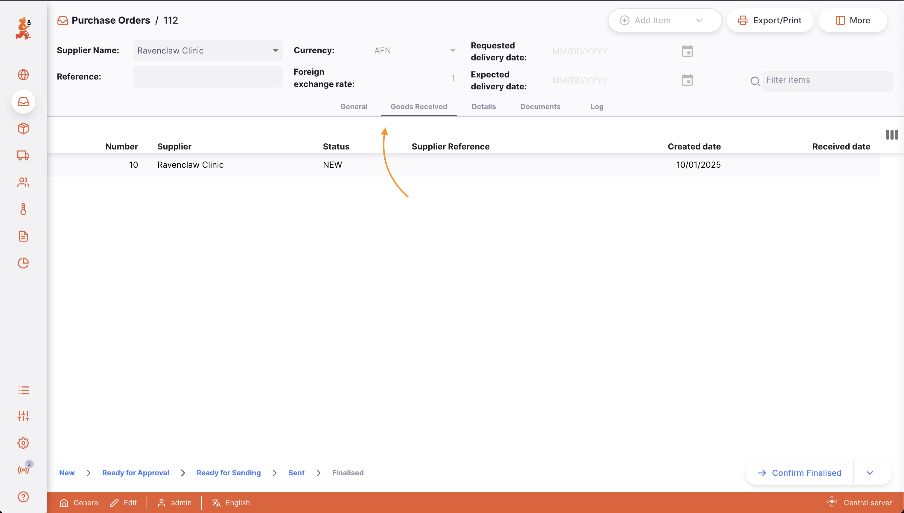

### Détails

Des informations supplémentaires sur la Commande d'Achat peuvent être saisies ici : officier d'autorisation 1 & 2, instructions supplémentaires, agent du fournisseur, message d'en-tête, conditions de fret, commission de l'agent, frais documentaires, frais de communication, frais d'assurance, frais de fret.

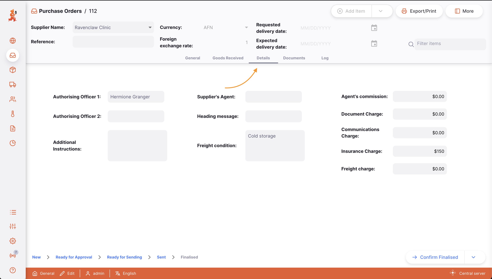

### Documents

L'onglet `Documents` affiche les documents téléchargés pour la Commande d'Achat.

Appuyez sur le bouton `Télécharger un document` pour ouvrir une fenêtre d'upload. Glissez-déposez votre document ou cliquez sur `Parcourir les fichiers`.

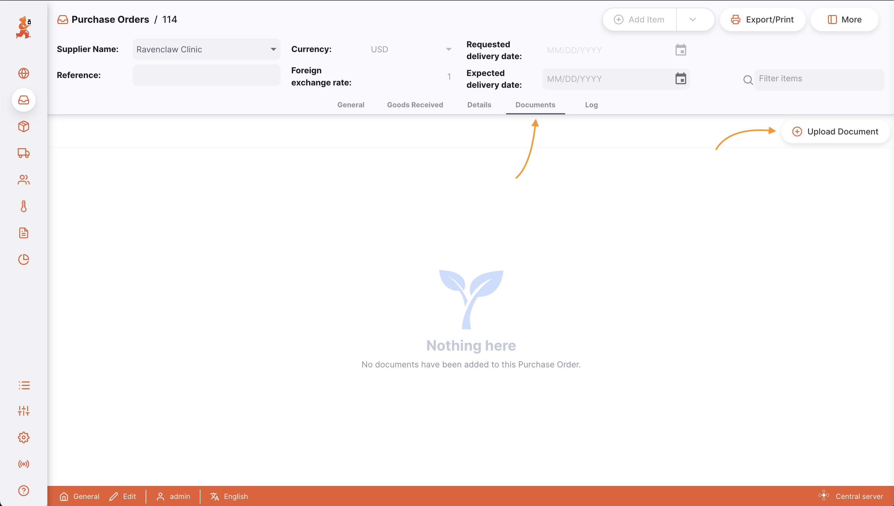
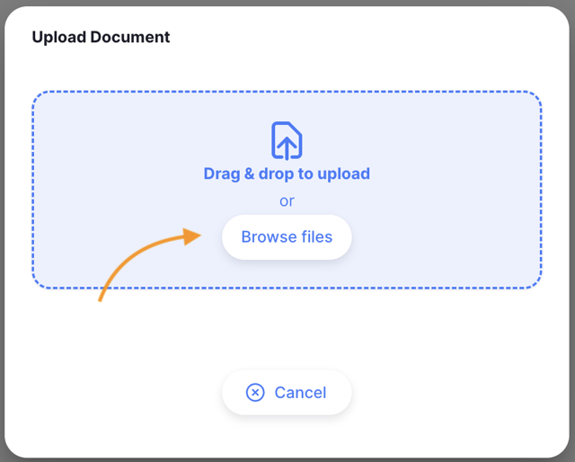

### Journal

L'onglet `Journal` affiche le journal d'activité de cette Commande d'Achat, enregistrant toutes les actions des utilisateurs effectuées via Open mSupply.

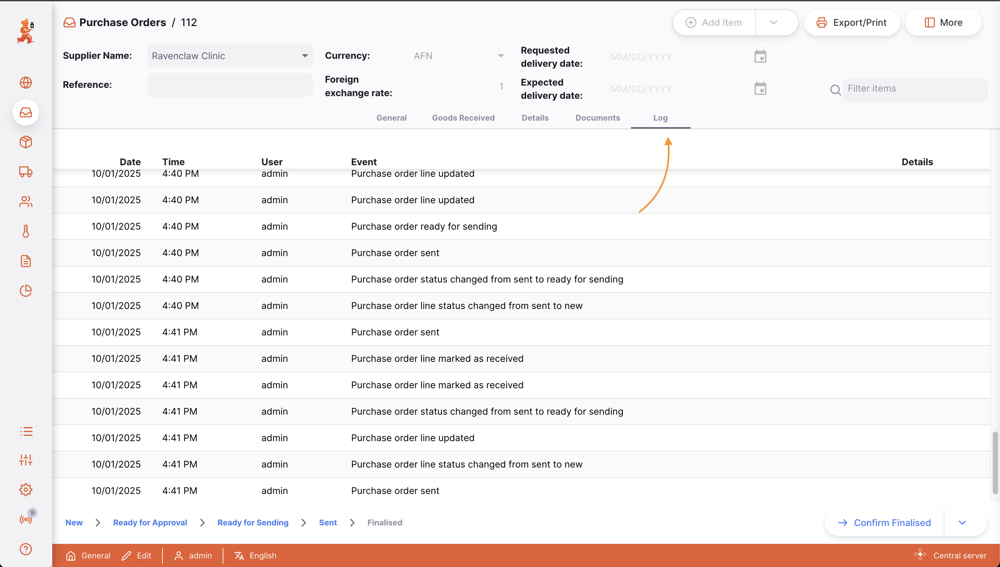
