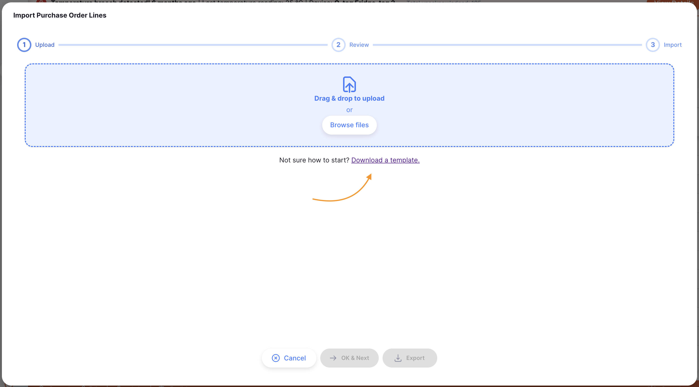

+++
title = "Purchase Orders"
description = "Requesting stock from external suppliers."
date = 2025-09-26
updated = 2025-09-26
draft = false
weight = 10
sort_by = "weight"
template = "docs/page.html"

[extra]
toc = true
top = false
+++

Intro

## Viewing Purchase Orders

### Go to the Purchase Orders Menu

First you need to have purchase orders enabled for your store.

1. Go to the [Manage](/docs/manage/facilities/#store-preferences) menu in the navigation panel
2. Click on `Stores`, then select your store
3. In the `Preferences` section, enable `Use procurement functionality`

Now you will be able to access the **Purchase Order** menu:

1. Go to the `Replenishment` menu in the navigation panel
2. Click on `Purchase Orders`

### Purchase Orders list

The first thing you see is a list of existing Purchase Orders.

The Purchase Orders list is divided into the following columns:

| Column                 | Description                           |
| :--------------------- | :------------------------------------ |
| **Supplier**           | Name of the Supplier                  |
| **Number**             | Purchase Order Number                 |
| **Created**            | Created date                          |
| **Confirmed**          | Confirmed date                        |
| **Sent**               | Sent date                             |
| **Requested delivery** | Requested delivery date               |
| **Status**             | Current status                        |
| **Target Months**      | Target months supply                  |
| **Lines**              | Number of lines on the purchase order |
| **Comment**            | Purchase order comment                |

### Filter Purchase Orders

You can filter the list of purchase orders by supplier, status, confirmed date, requested delivery date, and sent date. This can be useful if you're looking for one particular order!

For example, to filter by supplier name, click on Filters, select `Supplier` and start typing some or all of a supplier name in the `Supplier` field. All the purchase orders for this supplier will appear in the list.

### Exporting Purchase Orders

The list of Purchase Orders can be exported to a comma separated file (csv). Simply click the export button (on the right, at the top of the page) and the file will be downloaded.

The export function will download all Purchase Orders, not just the current page, if you have more than 20 of them.

### Delete a Purchase Order

You can delete an order from the Purchase Order list.

1. Select the purchase order that you want to delete by checking the box on the left end of the list. You can select more than one purchase order to be deleted. You can even select them all using the master checkbox in the list headers.

2. The `Actions` footer will display at the bottom of the screen when a purchase order is selected. It will display the number of purchase orders selected and the actions which can be taken. Click `Delete`.

A notification confirms how many purchase orders were deleted (bottom left corner).

You can only delete Purchase Orders with a status <code>New</code>.

## Outstanding Purchase Order Lines

To see the lines currently outstanding on purchase orders, tap on the `Outstanding lines` button.

This will take you to a list of lines currently outstanding. These are lines that have been sent to the supplier, but are yet to be received or are partially received.

Tapping on a line will take you to the purchase order. Here you can view the lines on the purchase order, and update the line status

### Outstanding Purchase Order Lines Columns

1. **Status**: The status of this line. Editable only when the purchase order is at `Sent` status
2. **Line number**: The line this item is on for this purchase order.
3. **Stock on hand**: The number of units of this item in your store.
4. **Unit**: Type here the type of units being ordered, for example 'tablet'.
5. **Supplier item code**: The item code used by the supplier. Leave blank is not applicable.
6. **Manufacturer**: Select a manufacturer from the dropdown list.
7. **Requested packs**: The number of packs you are requesting - only editable at `

| Column                        | Description                                        |
| :---------------------------- | :------------------------------------------------- |
| **PO Number**                 | Purchase Order Number                              |
| **PO reference**              | Supplier reference                                 |
| **Created by**                | User who created the purchase order                |
| **Supplier code**             | Code for the supplier                              |
| **Supplier name**             | Name for the supplier                              |
| **Item name**                 | Name of the outstanding item                       |
| **PO Confirmed**              | Confirmed date                                     |
| **Expected delivery date**    | Expected delivery date                             |
| **Adjusted units (expected)** | Quantity of units ordered in this purchase order   |
| **Received units**            | Quantity of units received to this purchase order  |
| **Outstanding units**         | Outstanding number of units in this purchase order |

### Exporting Outstanding Lines

## Creating a new Purchase Order

1. Go to `Replenishment`> `Purchase Orders`
2. Press the `New Purchase Order` button, in the top right corner
3. A new window `Suppliers` opens, inviting you to select a supplier
4. When a supplier is selected, the purchase order is created

### Select a Supplier

1. In the `Suppliers` window, you will be presented with a list of suppliers. You can select your supplier from the list or you can type as much of a supplier name as you want.

Purchase orders can only be created for external suppliers - this is a supplier that is _not_ a store in your mSupply system 

In the below example, we are ordering stock from <b>Ravenclaw Clinic</b>. 

2. Once you have selected a supplier, your Purchase Order is created.

If everything went well, you should see the name of your supplier in the top left corner and current status should be <code>New</code>.

### Edit the Supplier Name

If you have selected the wrong supplier, you can change the supplier name in the `Supplier Name` field or select one the dropdown list:

### Enter a Supplier Reference

Once your Purchase Order has been created, you can capture a supplier reference in the `Supplier Ref` field, if they have one (eg. PO#1234567 \_)

### Enter a Requested delivery date

Enter the requested delivery date for the purchase order. If any item(s) needs a different date, this can be added when creating or editing the item.

### Enter an Expected delivery date

Enter the expected delivery date for the purchase order, provided by the supplier. If any item(s) needs a different date, this can be added when creating or editing the item.

### Foreign Currencies

You can select a foreign currency for the purchase order. This will usually be in your suppliers currency. Click on the dropdown menu and select the currency that you would like to use for the purchase order.

See the <a href="/docs/introduction/faq/#is-there-support-for-my-currency">currency support question</a> for the list of codes supported

### View or edit the Purchase Order Information Panel

The Information Panel allows you see or to edit information about the Purchase Order. It is divided in multiple sections:

- Pricing
- Other
- Dates

#### How to open and close the Information Panel ?

To open the Information Panel, you can tap on the `More` button, located in the top right corner of the Purchase Order view.

You can close by tapping on the `X Close` button, on the top right corner of the information panel.

#### Pricing

In the **Pricing** section, you can see pricing information for the Purchase Order.

This includes:

- Subtotal
- Additional fees (entered in the #XXDetails tab)
- Supplier discount percentage
- Supplier discount amount
- Final cost

#### Other

In the **Other** section, you can:

- Donor name
- Select a shipping method (if you have this configured in mSupply XX)
- Write or edit a comment

Configuring donors is done in the mSupply central server. This [documentation page](https://docs.msupply.org.nz/receiving_goods:donors?s[]=donor#adding_or_editing_donors) will tell you how.

#### Dates

In this section, you will see key dates for the Purchase Order.

- Confirmed
- Sent
- Contract signed
- Advance paid

### Purchase Order Status Sequence

The status sequence is located at the bottom left corner of the Purchase Order screen.

Passed statuses are highlighted in blue, next statuses appear in grey.

<figure> 
    
    <figcaption align="center">Status Sequence: current status is <code>New</code>.</figcaption>
</figure>

There are 5 statuses for the Purchase Orders (although you might see a smaller number, if Authorisation is not required):

| Status                 | Description                                                                                                                   | mSupply | Lines editable | Lines editable for authorised users |
| :--------------------- | ----------------------------------------------------------------------------------------------------------------------------- | :-----: | :------------: | :---------------------------------: |
| **New**                | This is the first status when you create a new Purchase Order                                                                 |   nw    |       ✓        |                  ✓                  |
| **Ready for Approval** | The order is ready to be approved by someone with authorisation (applies only if the Requires Authorisation preference is on) |   sg    |       ✓        |                  ✓                  |
| **Ready for Sending**  | The purchase order is ready to send to the supplier                                                                           |   cn    |                |                  ✓                  |
| **Sent**               | The purchase order has been sent to the supplier. Purchase order lines will be updated to the `Sent` status                   |   cn    |                |                  ✓                  |
| **Finalised**          | When you confirm that the order has been received. Purchase order lines will be updated to the `Closed` status                |   fn    |                |                                     |

The Ready for Approval status only applies if the Authorise Purchase Orders global preference is turned on. If the preference is off, purchase orders will progress from New status to Ready for Sending.

You'll see that the status bar has only the status values which apply depending on Authorisation preferences.

<figure align="center">
     
    <figcaption align="center">Status Sequence: current status is <code>Ready for approval</code>.</figcaption>
</figure>

If you hover over the status sequence, an order history window appears. You can see the date when a purchase order was updated from one status to another.

This purchase order has been created on 24/09/2025, ready for sending on 24/09/2025 and sent on 30/09/2025

### Confirm button

The `Confirm` button is the button to update the status of a purchase order. The status which you can confirm depends on the current status of the purchase order and follows the sequence shown below.

When managing a Purchase Order, you can only confirm the next status which is shown on the button. Statuses cannot be skipped.

| Confirm...             | Current Status     | Next Status (If Authorisation is on) | Next Status (If Authorisation is off) |
| :--------------------- | :----------------- | :----------------------------------- | ------------------------------------- |
| **New**                | New                | Ready for Approval                   | Ready for Sending                     |
| **Ready for Approval** | Ready for Approval | Ready for Sending                    | N/A                                   |
| **Ready for Sending**  | Ready for Sending  | Sent                                 | Sent                                  |
| **Sent**               | Sent               | Finalised                            | Finalised                             |
| **Finalised**          | Finalised          |                                      |                                       |

Purchase orders must proceed through the statuses in the exact order. The status can also go back to a previous step when certain actions are taken. The system will always show you the next available status on the button.

Clicking on the confirm button will show a prompt to proceed, which may have further information.

## Adding lines to an Purchase Order

To add a line, tap on the `Add Item` button located in the top left corner of your screen.

A new `Add Item` window opens.

### Select an Item

In the `Add Item` window, you can look up an item by:

- Reading through the list of available items
- or by typing some or all of an item name
- or by typing some or all of an item code

Once your item is highlighted, tap on the name or press `Enter`.

### Item Details

There are a number of fields with information about the item. You can update most fields while the purchase order is at New or Ready for Approval status. Some fields are editable at later statuses, or are only for viewing additional information.

1. **Status**: The status of this line. Editable only when the purchase order is at `Sent` status
2. **Line number**: The line this item is on for this purchase order.
3. **Stock on hand**: The number of units of this item in your store.
4. **Unit**: Type here the type of units being ordered, for example 'tablet'.
5. **Supplier item code**: The item code used by the supplier. Leave blank is not applicable.
6. **Manufacturer**: Select a manufacturer from the dropdown list.
7. **Requested packs**: The number of packs you are requesting - only editable at `New` and `Ready for Approval` statuses
8. **Adjusted packs**: If the purchase order is at `Ready for Sending` or `Sent` statuses, users with permission are able to edit the adjusted packs field. This will become the new number of packs ordered, but is a separate field from the requested packs. The adjusted packs amount cannot be less than the amount already received for this item on the purchase order.
9. **Pack Size**: The number of units per pack (by default, pack size is 1).
10. **Requested**: A read-only field with of the number of packs requested.
11. **Adjusted packs**: A read-only field with the adjusted packs for the order.
12. **Price per pack (before discount)**: The base price per pack in the selected currency.
13. **Discount percentage**: The discount amount that applies to this item.
14. **Price per pack (after discount)**: The discounted price per pack in the selected currency.
15. **Total cost**: Read-only field with the calculated cost of all packs for this item, after any item discount is applied.
16. **Requested delivery date**: Requested delivery date for this item. It can be different to the requested delivery date for the purchase order.
17. **Expected delivery date**: Expected delivery date for this item.
18. **Comment**: Free text field for a comment regarding this item.
19. **Notes**: Free text field for including notes about this item.

If the purchase order is at <code>Sent</code> status and the <code>Adjusted packs</code> are edited for an item, the purchase order status will change to 
<code>Ready for sending</code> and the line status will change to <code>New</code>

In the below example, we are ordering 50 packs of 100 for item <i>030063 - Acetylsalicylic Acid 100mg tabs</i> with a price of $35 per pack and an item discount of 5%. 

The 'Ordered in other purchase orders' is a count of how many units of the same item are in other purchase orders with status 'Sent'

**Additional Details**

### Confirm item and quantities

When you're done, you can add the new line by tapping on:

- `OK` if you don't want to add another line to your purchase order
- `OK & Next` if you have other lines to create

Otherwise, you can tap on `Cancel` and your changes won't be saved.

## Adding lines to a Purchase Order using a Master List

Tap on the `Add from master list` button from the Add button selection.

The button will be disabled if the status of the Purchase Order is anything other than <strong>New</strong> or <strong>Ready for Approval</strong>

A new `Master Lists` window opens. This allows you to select the required master list. Simply click on one of the lists (if you have some available).

Click `OK` on the prompt:

You will then have placeholder lines added to your purchase order, which will then look like this:

The imported rows will have zero for the number of packs value, and are therefore shown in a blue font with no requested amount or pricing. You can follow the steps for editing these lines, as detailed above.

## Adding lines to a Purchase Order using an Import

Tap on the `Import lines` button from the Add button selection.

The button will be disabled if the status of the Purchase Order is anything other than <strong>New</strong> or <strong>Ready for Approval</strong>

This will open an import modal. Click on `Download a template` to download a csv
template which can be used to import assets.

Data will need to be converted into the format of the csv template provided in order for Open mSupply to be able to process and upload this data.

When you are ready, drag and drop the csv file into the modal or click on the `Browse files` button to select the file from your computer.

##### Upload Errors

After uploading your CSV file, your data will be validated and displayed to you to review. At this step, if the data in your uploaded file is not valid, you will see an error message and won't be able to continue to the import step.

Common mistakes here are uploading a file type other than CSV, or if a price value or calculation results in an invalid number. You'll see these errors in the `Error message` column.

You can use the `Export` button at the bottom of the upload window to download a CSV file which includes the error messages, to investigate what went wrong.

Once you have corrected the errors, you can go back to the `Upload` tab to upload the corrected file.

## Editing a Purchase Order line

To edit a Purchase Order line, simply tap on it. An identical window to `Add Item` appears.

Most fields are editable when the Purchase Order is at <code>New</code> or <code>Ready for approval</code> statuses. At later statuses different fields are available to edit. 

| Field                                     | New or Ready for Approval | Ready for Sending | Sent |
| :---------------------------------------- | :-----------------------: | :---------------: | :--: |
| **Requested packs**                       |             ✓             |                   |      |
| **Pack size**                             |             ✓             |                   |      |
| **Pricing per pack and item discount**    |             ✓             |                   |      |
| **Unit name**                             |             ✓             |                   |      |
| **Supplier code**                         |             ✓             |         ✓         |  ✓   |
| **Manufacturer**                          |             ✓             |                   |      |
| **Requested and expected delivery dates** |             ✓             |                   |      |
| **Expected delivery date**                |             ✓             |         ✓         |      |
| **Comment and note**                      |             ✓             |         ✓         |  ✓   |
| **Adjusted packs**                        |                           |         ✓         |  ✓   |
| **Line status**                           |                           |                   |  ✓   |

When editing a purchase order line, you cannot change the item. You would need to delete the line and create a new one. 

### Delete a Purchase Order line

1. Open the Purchase Order that you would like to edit
2. Make sure that status is not yet `Ready for Sending`
3. Select the line(s) you want to delete by checking the box(es) on the left of the list
4. Click the `Delete` button which appears at the bottom of the page.

You can delete multiple lines at once. Be sure to review what is selected before performing the Delete action. 

### Other line actions

If you have selected some lines by checking the box on the left of the list there are several actions which are possible. These affect the selected lines only.

| Action                        | Effect                                                                                                                                              |
| ----------------------------- | --------------------------------------------------------------------------------------------------------------------------------------------------- |
| Delete                        | As described above, this deletes the selected line(s)                                                                                               |
| Update expected delivery date | Opens a window which allows you to choose an expected delivery date. This will be associated with all the selected lines                            |
| Closed for receipt            | This will set the `Line status` to `Closed` on all of the selected lines. This action is only available when the Purchase Order is at `Sent` status |
| Clear selection               | Will clear the selection checkboxes                                                                                                                 |

## Viewing a Purchase Order

If you do not have enough room on your screen, or simply aren't interested in some of the columns shown, you have the option of hiding which columns are shown in this view.

Click on the `Show / hide columns` button which is at the top right of the table. This gives a list of the columns available - you can check the columns you want to see. The options chosen are stored for the current browser, so next time you view an purchase order, you will see the selected columns only. If you have chosen which columns to show, then the button is shown in blue to remind you that there are more columns available.

## Purchase Order Tabs

### Goods Received

This tab show any `Goods Received` that are linked to this purchase order. You can tap on the Goods Received line to open it.

### Details

Additional details about the purchase order can be entered here. The following fields are available to edit:

- Authorising officer 1
- Authorising officer 2
- Additional instructions
- Supplier’s agent
- Heading message
- Freight conditions
- Agent’s commission
- Document charge
- Communications charge
- Insurance charge
- Freight charge

### Documents

The `Documents` tab shows documents which have been uploaded for the purchase order.

Tap on the `Upload document` button, you will see an Upload Document modal.

Drag and drop your document into the modal or click on the `Browse files` button to select the file from your computer.

### Log

The `Log` tab shows the activity log of this purchase order.

This records all user actions which have been taken for the purchase order using the Open mSupply system.

## Preferences

### Use purchase orders

In order to use purchase orders you need to have the [Use procurement functionality](/docs/manage/facilities/#store-preferences) store preference enabled for your store.

### Authorise purchase orders

Authorisation is required if the [Global preference](/docs/manage/global-preferences/) `Authorise Purchase Orders` is enabled.

When enabled, the next purchase order status after `New` is `Ready for Approval`. Only an user with authorisation permissions can confirm proceeding to the next status, `Ready for Sending`.

## Permissions

### Authorise purchase orders

Any users who should be able to authorise purchase orders should have the [user permission](https://docs.msupply.org.nz/admin:managing_users#permissions_tabs) `Authorise purchase orders` enabled.

Having this permission enabled will allow the user to proceed the purchase order status from `Ready for Approval` to `Ready for Sending` if authorisation is required.

It also allows the user to edit the `Adjusted packs` value after the purchase order is at `Ready for Sending` status or further. Users without permission are unable to edit this field.
