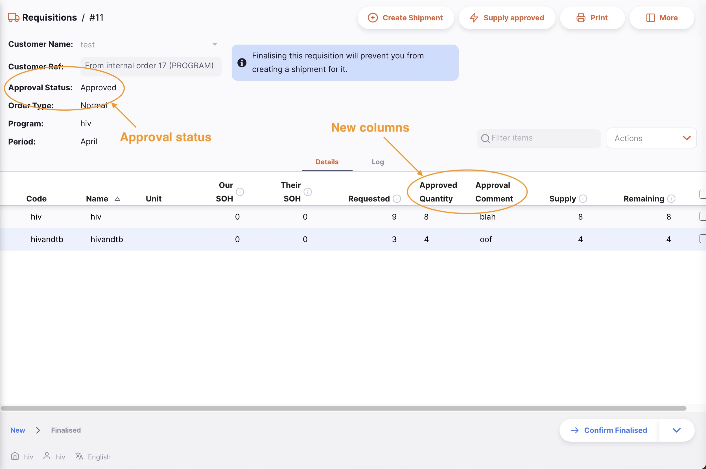
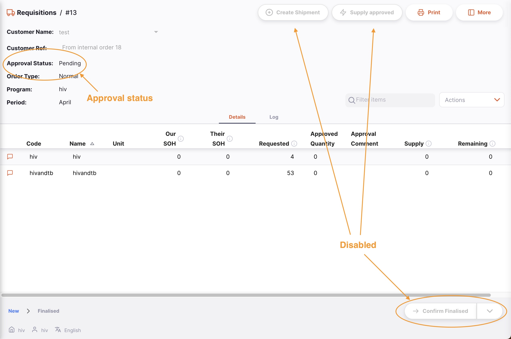

+++
title = "Autorización Remota"
description = "Proceso de autorización / aprobación"
date = 2023-05-05
updated = 2023-05-05
draft = false
weight = 43
sort_by = "weight"
template = "docs/page.html"

[extra]
lead = "Autorizar requisiciones de cliente de forma remota"
toc = true
top = false
+++

La autorización remota permite a personas con el permiso adecuado autorizar requisiciones basadas en programas mediante una aplicación web. Esto permite que el proceso de pedido tenga un paso adicional de validación antes de que se cree una Salida y se envíe stock a los clientes.

El proceso de autorización remota está disponible actualmente solo para requisiciones que se han creado para un programa. Será necesario tener programas configurados para utilizar esta función.

Al usar la autorización remota, el flujo del proceso es el siguiente:

- Se crea una Orden Interna en el almacén del cliente, usando un programa
- El almacén del cliente sincroniza y la solicitud se envía al almacén proveedor
- El proceso espera hasta que el estado de la Orden Interna se configure en `Enviada`
- La Requisición se crea automáticamente en el almacén proveedor y tiene un estado de aprobación como `Pendiente`
- Los autorizadores son notificados por correo electrónico de que hay una Requisición que requiere autorización
- Al hacer clic en el enlace del correo electrónico, el autorizador es dirigido a la aplicación web (que está alojada en el servidor central)
- Después de iniciar sesión, puede ajustar, comentar y autorizar (o denegar) la solicitud
- Una vez autorizada, el estado se actualiza:
  - para la Orden Interna (en el almacén del cliente)
  - para la Requisición (en el almacén proveedor)
- Los comentarios realizados por el autorizador y cualquier ajuste en las cantidades se muestran en la Orden Interna del almacén del cliente

## Configuración

La configuración del flujo de trabajo de autorización requiere algunos ajustes en el servidor central:

1. Activa la autorización remota. Sigue [estas instrucciones](https://docs.msupply.org.nz/other_stuff:remote_authorisation#turn_on_remote_authorisation) en la documentación del servidor central
2. Configura a los autorizadores. Consulta [estas instrucciones](https://docs.msupply.org.nz/other_stuff:remote_authorisation#set_up_authorisers)
3. Es posible que también necesites [habilitar el envío de correos electrónicos](https://docs.msupply.org.nz/other_stuff:remote_authorisation#enable_emailing_of_authorisers) en el servidor central

Además, es necesario que los almacenes estén configurados para el uso normal en Open mSupply, con las relaciones de proveedor y cliente establecidas. Los almacenes deben tener [listas maestras](https://docs.msupply.org.nz/items:master_lists) asignados a los almacenes de cliente y proveedor, así como programas y períodos de programa configurados.

## Uo de la autorización remota

### Ordenes Internas

Sigue el proceso de creación de una Orden Interna basada en un programa. Si tienes la configuración de preferencias del almacén correctamente establecida, verás una columna adicional en la vista de lista de Órdenes Internas, que muestra el estado de aprobación de la orden recién creada:

Además, al ver los detalles de la Orden Interna, aparecerán dos columnas nuevas y el estado de aprobación de la orden:

La **Cantidad Aprobada** es la cantidad aprobada por el autorizador, que puede ser diferente de la cantidad solicitada. Si es así, el autorizador tiene la opción de ingresar un comentario explicativo, que se muestra en la columna **Comentario de aprobación**.

### Autorización

El proceso de autorización se detalla en la [documentación del servidor central](https://docs.msupply.org.nz/other_stuff:remote_authorisation#authorising_using_the_web_app). Consulta esa sección para los pasos requeridos al autorizar.

### Requisiciones

En el almacén proveedor, también verás algunos cambios. La lista de Requisiciones tiene una columna adicional:

Al ver los detalles, puedes ver el estado de aprobación y nuevas columnas, igual que en la Orden Interna. Cuando la Requisición está en estado de aprobación `Pendiente`, tampoco puedes confirmarla como finalizada ni crear un envío:

Sin embargo, una vez que ha sido aprobada por el proceso de autorización remota, el estado se actualiza y puedes editar la requisición:

El estado de autorización puede tener varios valores:

- **Ninguna**: la Requisición no necesita autorización y no está sujeta al sistema de autorización remota. Esto se aplica a Requisiciones que no son para un programa. Todas las Requisiciones con este estado se pueden editar normalmente.
- **Pendiente**: la Requisición está esperando la autorización de una o más de sus líneas. Una Requisición con este estado no se puede editar y no puedes crear Salidas a partir de ella.
- **Autorizado**: todas las líneas que esperaban autorización han sido autorizadas (con o sin ajustes). Los comentarios y la cantidad a suministrar se pueden editar, y se pueden crear Salidas a partir de Requisiciones que están autorizadas.
- **Negado**: el autorizador ha revisado la Requisición y todas las líneas han sido denegadas. Al igual que con el estado Pendiente, una Requisición con este estado no se puede editar ni puedes crear Salidas a partir de ella.
