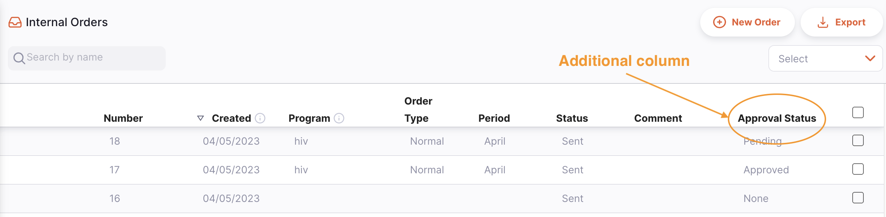
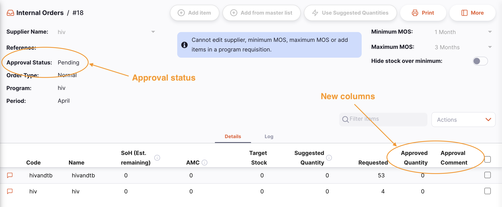
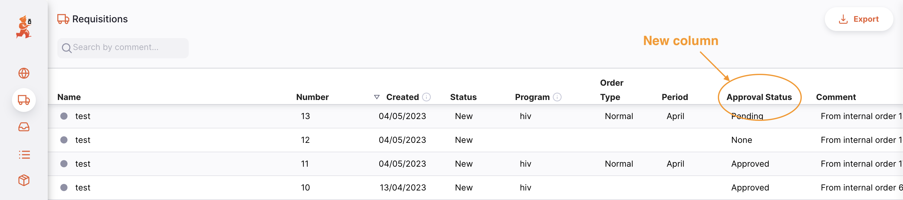
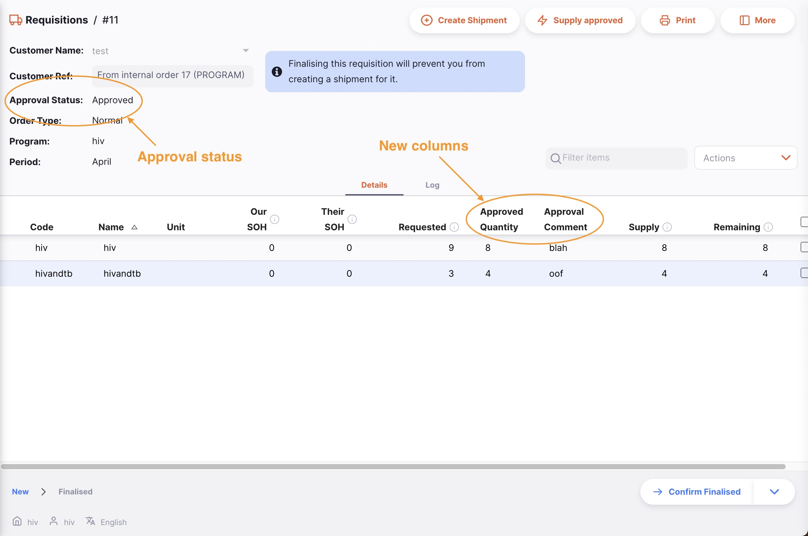
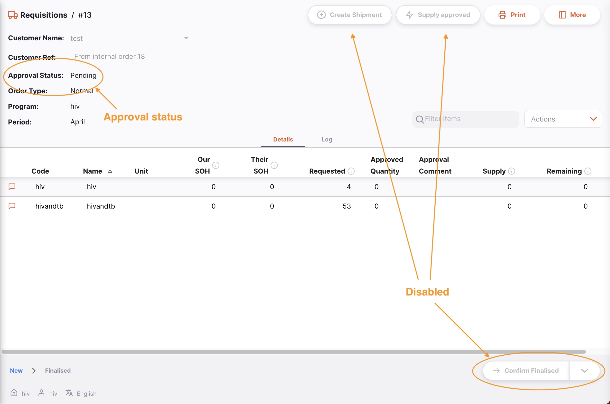

+++
title = "Autorisation à distance"
description = "Processus d'autorisation/approbation"
date = 2023-05-05
updated = 2023-05-05
draft = false
weight = 43
sort_by = "weight"
template = "docs/page.html"

[extra]
lead = "Autoriser les réquisitions clients à distance"
toc = true
top = false
+++

L'autorisation à distance permet aux personnes disposant des permissions appropriées d'autoriser les réquisitions basées sur des programmes via une application web. Cela permet au processus de commande de comporter une étape de validation supplémentaire avant qu'une Expédition Sortante soit créée et que le stock soit envoyé aux clients.

Le processus d'autorisation à distance est actuellement disponible uniquement pour les réquisitions créées dans le cadre d'un programme. Vous devrez avoir des programmes configurés pour utiliser cette fonctionnalité.

Lors de l'utilisation de l'autorisation à distance, le flux du processus est le suivant :

- Une Commande Interne est créée dans un dépôt client, en utilisant un programme
- Le dépôt client se synchronise et la demande est envoyée au dépôt fournisseur
- Le processus attend que le statut de la Commande Interne soit défini sur `Envoyée`
- La Réquisition est automatiquement créée dans le dépôt fournisseur, avec un statut d'approbation `En attente`
- Les approbateurs sont notifiés par e-mail qu'une Réquisition nécessite une autorisation
- En cliquant sur le lien dans l'e-mail, l'approbateur est dirigé vers l'application web (hébergée par le serveur central)
- Après connexion, ils peuvent ajuster, commenter et autoriser (ou refuser) la demande
- Une fois autorisée, le statut est mis à jour :
  - pour la Commande Interne (dans le dépôt client)
  - pour la Réquisition (dans le dépôt fournisseur)
- Les commentaires de l'approbateur et les quantités ajustées sont visibles dans la Commande Interne du dépôt client

## Configuration

La mise en place du flux de travail d'autorisation nécessite quelques modifications de configuration sur le serveur central :

1. Activer l'autorisation à distance. Suivez [ces instructions](https://docs.msupply.org.nz/other_stuff:remote_authorisation#turn_on_remote_authorisation) dans la documentation du serveur central
2. Configurer les approbateurs. Voir [ces instructions](https://docs.msupply.org.nz/other_stuff:remote_authorisation#set_up_authorisers)
3. Vous devrez peut-être également [activer l'envoi d'e-mails](https://docs.msupply.org.nz/other_stuff:remote_authorisation#enable_emailing_of_authorisers) sur le serveur central

De plus, vous devrez avoir les dépôts configurés pour une utilisation normale dans Open mSupply, avec les relations fournisseur et client configurées. Les dépôts devront avoir des [listes maîtresses](https://docs.msupply.org.nz/items:master_lists) assignées aux dépôts clients et fournisseurs, ainsi que des programmes et des périodes de programme configurés.

## Utiliser l'autorisation à distance

### Commandes Internes

Suivez le processus de création d'une Commande Interne basée sur un programme.
Si vous avez correctement configuré les préférences du dépôt, vous verrez une colonne supplémentaire dans la vue liste des Commandes Internes, indiquant le statut d'approbation de la commande nouvellement créée :

De plus, lors de la consultation des détails de la Commande Interne, vous verrez deux nouvelles colonnes et le statut d'approbation de la commande :

La **Quantité approuvée** est la quantité approuvée par l'approbateur. Elle peut différer de la quantité demandée. Si c'est le cas, l'approbateur a la possibilité de saisir un commentaire explicatif, qui est affiché dans la colonne **Commentaire d'approbation**.

### Autorisation

Le processus d'autorisation est détaillé dans la [documentation du serveur central](https://docs.msupply.org.nz/other_stuff:remote_authorisation#authorising_using_the_web_app). Veuillez vous y référer pour les étapes requises lors de l'autorisation.

### Réquisitions

Dans le dépôt fournisseur, vous verrez également quelques changements. La liste des Réquisitions a une colonne supplémentaire :

Et lors de la consultation des détails, vous pouvez voir le statut d'approbation et les nouvelles colonnes, comme dans la Commande Interne. Lorsque la Réquisition est en état d'approbation `En attente`, vous ne pouvez pas non plus confirmer la finalisation ni créer une expédition :

Une fois approuvée par le processus d'autorisation à distance, le statut est mis à jour et vous pouvez modifier la réquisition :

Le statut d'autorisation peut avoir plusieurs valeurs différentes :

- **Aucun** : la Réquisition n'a pas besoin d'autorisation et n'est pas soumise au système d'autorisation à distance. C'est le cas pour les Réquisitions qui ne concernent pas un programme. Toutes les Réquisitions avec ce statut peuvent être modifiées normalement.
- **En attente** : la Réquisition attend l'autorisation d'une ou plusieurs de ses lignes. Une Réquisition avec ce statut ne peut pas être modifiée et vous ne pouvez pas créer d'Expéditions Sortantes à partir de celle-ci.
- **Autorisée** : toutes les lignes en attente d'autorisation ont été autorisées (avec ou sans ajustements). Les commentaires et la quantité à fournir peuvent être modifiés, et des Expéditions Sortantes peuvent être créées à partir des Réquisitions autorisées.
- **Refusée** : l'approbateur a examiné la Réquisition et toutes les lignes ont été refusées. Comme pour le statut En attente, une Réquisition avec ce statut ne peut pas être modifiée et vous ne pouvez pas créer d'Expéditions Sortantes à partir de celle-ci.
