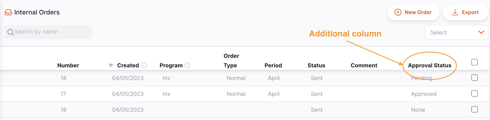
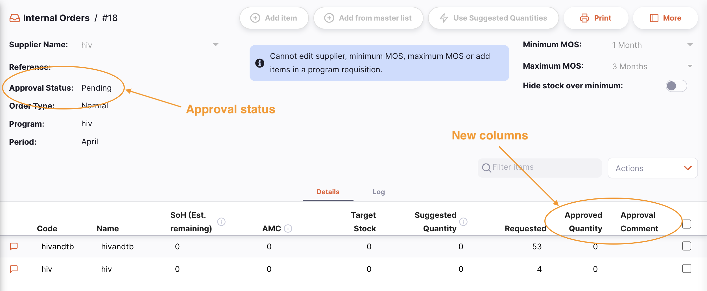
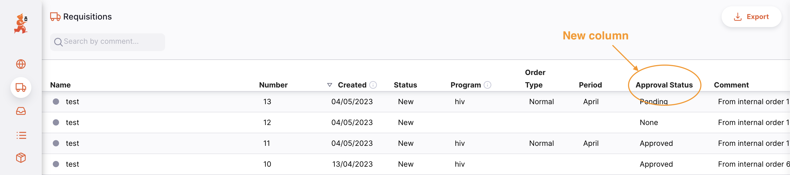
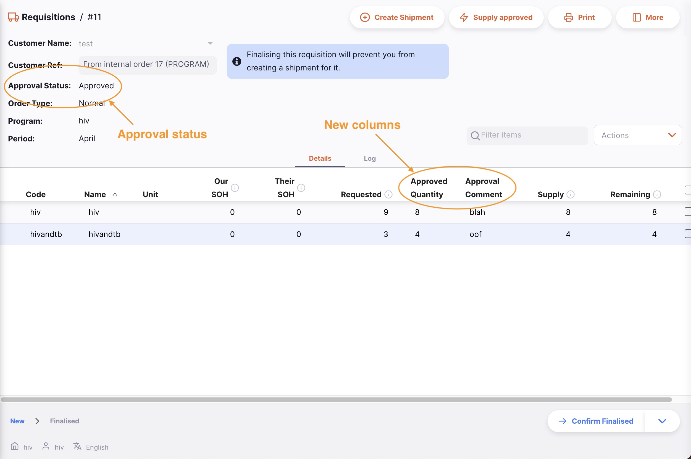
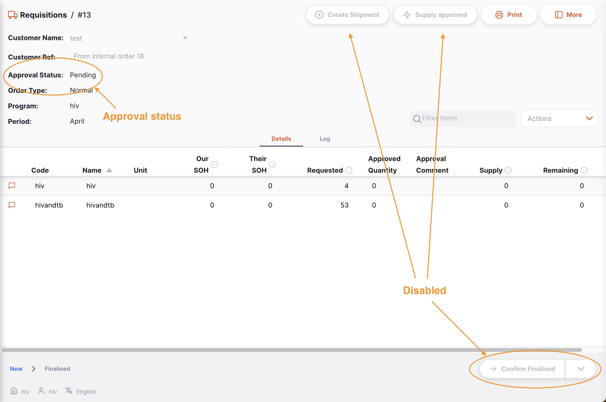

+++
title = "Remote Authorisation"
description = "Authorisation / approval process"
date = 2023-05-05
updated = 2023-05-05
draft = false
weight = 43
sort_by = "weight"
template = "docs/page.html"

[extra]
lead = "Authorise customer requisitions remotely"
toc = true
top = false
+++

Remote authorisation allows people with the appropriate permission to authorise program-based requisitions using a web app. This allows the ordering process to have an additional validation step before an Outbound Shipment is created and stock is sent out to customers.

The remote authorisation process is currently available only for requisitions which have been created for a program. You will need to have programs configured to use this feature.

When using remote authorisation, the process flow is as follows:

- An Internal Order is created in a customer store, using a program
- The customer store synchronises and the request is sent to the supplying store
- The process waits until the Internal Order status is set to `Sent`
- The Requisition is automatically created in the supplying store, and has an approval status of `Pending`
- Authorisers are notified via email that there is a Requisition requiring authorisation
- On clicking the link in the email, the authoriser is taken to the web app ( which is hosted by the central server )
- After logging in, they are able to adjust, comment and authorise ( or deny ) the request
- Once authorised, the status is updated:
  - for the Internal Order ( in the customer store )
  - for the Requisition ( in the supplying store )
- Comments made by the authoriser and any adjusted quantities, are shown in the customer store's Internal Order

## Configuration

The setting up of the authorisation workflow requires some configuration changes on the central server:

1. Turn on remote authorisation. Follow [these instructions](https://docs.msupply.org.nz/other_stuff:remote_authorisation#turn_on_remote_authorisation) in the central server documentation
2. Set up authorisers. See [these instructions](https://docs.msupply.org.nz/other_stuff:remote_authorisation#set_up_authorisers)
3. You may also need to [enable emailing](https://docs.msupply.org.nz/other_stuff:remote_authorisation#enable_emailing_of_authorisers) on the central server

In addition, you'll need to have the stores configured for normal usage in Open mSupply, with the supplier and customer relationships configured. Stores will need to have [master lists](https://docs.msupply.org.nz/items:master_lists) assigned to both customer and supplier stores, and programs and program periods configured.

## Using remote authorisation

### Internal Orders

Follow the process of creating a program based Internal Order.
If you have the store preferences configured correctly, you will see an additional column in the list view of Internal Orders, which shows the approval status of the newly created order:

In addition, when viewing the details of the Internal Order, you'll see two new columns and the approval status of the order:

The **Approved Quantity** is the quantity approved by the authoriser. This may be different to the requested quantity. If so, the authoriser has the option of entering an explanatory comment, which is shown in the **Approval Comment** column.

### Authorisation

The authorisation process is detailed in the [central server documentation](https://docs.msupply.org.nz/other_stuff:remote_authorisation#authorising_using_the_web_app). Please refer to that for the steps required when authorising.

### Requisitions

In the supplying store, you'll see a few changes too. The Requisition list has gained an additional column:

And when viewing details, you can see the approval status and new columns, just as in the Internal Order. When the Requisition is in the `Pending` approval state, you also cannot confirm finalised or create a shipment:

Once approved by the remote authorisation process though, the status is updated, and you can edit the requisition:

The authorisation status can have a few different values:

- **None**: the Requisition does not need authorisation and is not subject to the remote authorisation system. This is true for Requisitions which are not for a program. All Requisitions with this status can be edited normally.
- **Pending**: the Requisition is awaiting authorisation of one or more of its lines. A Requisition with this status cannot be edited and you cannot create Outbound Shipments from it.
- **Authorised**: all lines that were waiting for authorisation have been authorised (with or without adjustments). The comments and quantity to supply can be edited and Outbound Shipments can be created from Requisitions that are authorised.
- **Denied**: the authoriser has reviewed the Requisition and the lines have all been denied. Like the Pending status, a Requisition with this status cannot be edited and you cannot create Outbound Shipments from it.
