+++
title = "Retours fournisseurs"
description = "Retourner du stock à vos fournisseurs."
date = 2022-03-19
updated = 2022-03-19
draft = false
weight = 45
sort_by = "weight"
template = "docs/page.html"

[extra]
toc = true
top = false
+++

Les Retours fournisseurs peuvent être utilisés pour retourner du stock à un fournisseur.

Il est important de pouvoir retourner des articles à un fournisseur sans que cela soit comptabilisé comme des articles émis à un client. Si vous émettez simplement des articles à votre fournisseur via une Expédition Sortante, ces articles seront comptés dans les « émissions » (consommation) de votre dépôt. Un Retour fournisseur est la bonne façon de retourner des articles à un fournisseur.

Si vous avez utilisé mSupply par le passé, vous connaissez peut-être ce concept sous le nom de **Crédit fournisseur**.

## Consulter les Retours fournisseurs

### Accéder au menu Retours fournisseurs

Choisissez `Réapprovisionnement` > `Retours fournisseurs` dans le panneau de navigation.

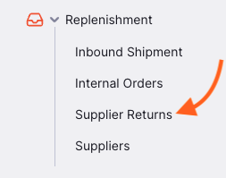

Une liste des Retours fournisseurs vous sera présentée (si vous n'en voyez pas, c'est que vous débutez probablement !).

Depuis cet écran, vous pouvez :

- Consulter la liste des Retours fournisseurs
- Créer un nouveau Retour fournisseur
- Exporter les Retours fournisseurs en fichier `.csv`

### Liste des Retours fournisseurs

1. La liste des Retours fournisseurs est divisée en 6 colonnes :

| Colonne         | Description                      |
| :-------------- | :------------------------------- |
| **Nom**         | Nom du fournisseur               |
| **Statut**      | Statut actuel du retour          |
| **Numéro**      | Numéro de référence du retour    |
| **Créé**        | Date de création du retour       |
| **Référence**   | Référence fournisseur            |
| **Commentaire** | Commentaire sur le retour        |

2. La liste peut afficher un nombre fixe de retours par page. En bas à gauche, vous pouvez voir combien de retours sont actuellement affichés.

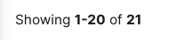

3. Si vous avez plus de retours que la limite actuelle, vous pouvez naviguer vers d'autres pages en appuyant sur le numéro de page ou en utilisant les flèches droite ou gauche (coin inférieur droit).

4. Vous pouvez également sélectionner un nombre différent de lignes à afficher par page en utilisant l'option en bas à droite.

### Rechercher par nom de fournisseur

Vous pouvez filtrer la liste des retours par nom de fournisseur ou par statut. Sélectionnez le filtre `Nom` dans la liste pour filtrer par nom de fournisseur :

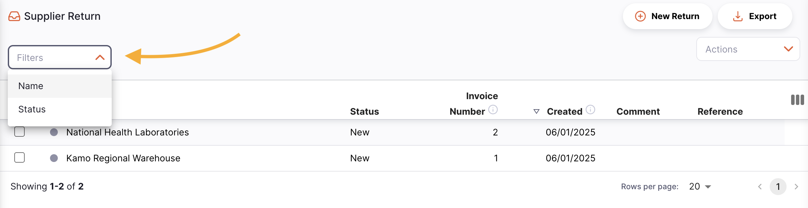

Saisissez le nom d'un fournisseur dans le champ `Nom`. Tous les retours pour ce fournisseur apparaîtront dans la liste.

### Exporter les Retours fournisseurs

La liste des Retours fournisseurs peut être exportée en fichier CSV. Cliquez simplement sur le bouton d'export (à droite, en haut de la page) et le fichier sera téléchargé. La fonction d'export téléchargera tous les Retours fournisseurs, pas seulement la page actuelle, si vous en avez plus de 20.

### Supprimer un Retour fournisseur

Vous pouvez supprimer un retour depuis la liste.

1. Sélectionnez le retour à supprimer en cochant la case à gauche. Vous pouvez en sélectionner plusieurs, voire tous en utilisant la case principale.

2. Le pied de page `Actions` s'affichera en bas de l'écran. Cliquez sur `Supprimer`.

3. Une notification confirme le nombre de retours supprimés (coin inférieur gauche).

Vous ne pouvez supprimer les Retours fournisseurs que s'ils n'ont pas été <code>EXPÉDIÉS</code>.

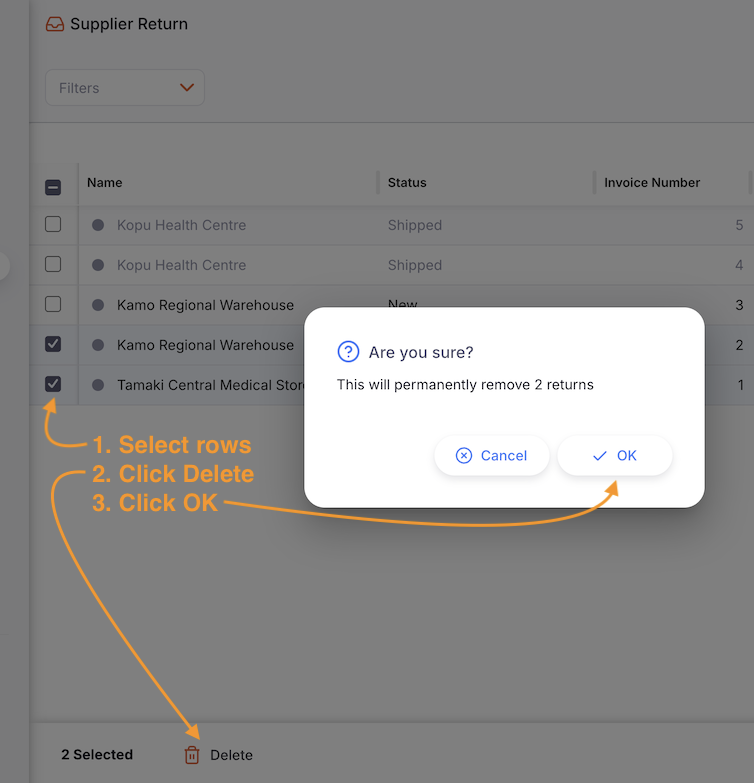

## Créer un Retour fournisseur

### Créer depuis une Expédition Entrante

Souvent, vous retournerez des articles que vous avez reçus via une Expédition Entrante. Dans ce cas, vous pouvez [créer un Retour fournisseur depuis l'Expédition Entrante](../inbound-shipments/#retourner-du-stock-depuis-une-expédition-entrante) elle-même.

### Créer manuellement

1. Allez dans `Réapprovisionnement` > `Retour fournisseur`.

2. Appuyez sur le bouton `Nouveau Retour`, dans le coin supérieur droit.

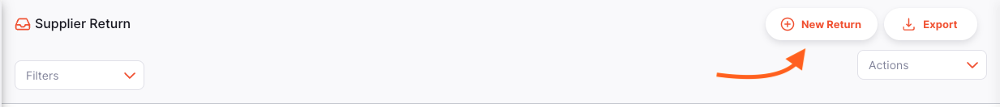

3. Une nouvelle fenêtre `Fournisseurs` s'ouvre, vous invitant à sélectionner un fournisseur.

#### Sélectionner un fournisseur

1. Dans la fenêtre `Fournisseurs`, une liste de fournisseurs disponibles vous est présentée. Vous pouvez sélectionner votre fournisseur dans la liste ou saisir tout ou partie de son nom.

Dans l'exemple ci-dessous, nous souhaitons retourner du stock à <b>Kamo Regional Warehouse</b>.

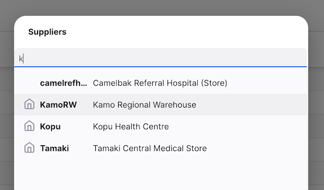

Vous pouvez savoir si un fournisseur utilise également Open mSupply dans son dépôt. Si c'est le cas, vous verrez une icône comme celle-ci 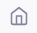 à côté du code fournisseur.

2. Une fois que vous appuyez ou cliquez sur un fournisseur, votre Retour fournisseur est automatiquement créé.

Si tout s'est bien passé, vous devriez voir le nom de votre fournisseur dans le coin supérieur gauche et le statut devrait être <code>NOUVEAU</code>.

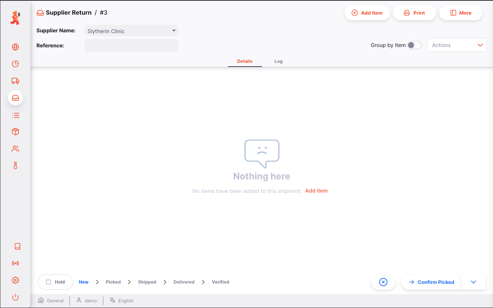

### Saisir une référence fournisseur

Une fois votre Retour fournisseur créé, vous pouvez saisir une référence fournisseur dans le champ `Référence`, s'ils en ont une (ex. _BC#1234567_).

### Consulter ou modifier le panneau d'informations

Le panneau d'informations vous permet de voir ou de modifier des informations sur le Retour fournisseur. Il est divisé en plusieurs sections :

- Informations supplémentaires
- Documents liés
- Détails de transport

#### Comment ouvrir et fermer le panneau d'informations ?

Sur un grand écran, le panneau d'informations sera automatiquement ouvert. Sur un écran de taille moyenne, il sera fermé par défaut.

Pour ouvrir le panneau, appuyez sur le bouton `Plus` dans le coin supérieur droit. Pour le fermer, appuyez sur le bouton `X Fermer`.

#### Informations supplémentaires

Dans cette section, vous pouvez : voir qui a créé le Retour fournisseur, voir et modifier la couleur du retour, et rédiger ou modifier un commentaire.

#### Documents liés

Dans cette section, vous pouvez voir d'autres documents de transaction liés au Retour fournisseur. Si votre retour a été créé depuis une **Expédition Entrante**, le numéro de référence de l'Expédition Entrante apparaîtra dans cette section.

#### Détails de transport

Dans cette section, vous pouvez voir ou modifier un numéro de référence de transport (ex. un numéro de réservation ou de suivi).

#### Actions

1. **Supprimer :** appuyez sur le bouton `Supprimer` pour supprimer le retour. Vous ne pouvez supprimer les Retours fournisseurs que s'ils n'ont pas été <code>EXPÉDIÉS</code>.
2. **Copier dans le presse-papiers** : copie les détails de la facture dans le presse-papiers.

### Séquence de statuts du Retour fournisseur

La séquence de statuts est située dans le coin inférieur gauche de l'écran.

Les statuts passés sont mis en surbrillance en bleu, les statuts suivants apparaissent en gris.

<figure>
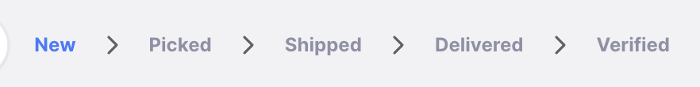
<figcaption align="center">Séquence de statuts : le statut actuel est <code>NOUVEAU</code>.</figcaption>
</figure>

<figure>
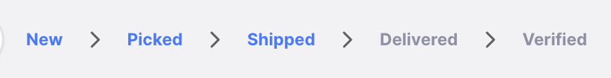
<figcaption align="center">Séquence de statuts : le statut actuel est <code>EXPÉDIÉ</code>.</figcaption>
</figure>

Il y a 5 statuts pour le Retour fournisseur :

| Statut       | Description                                                                                                                                                         |
| :----------- | ------------------------------------------------------------------------------------------------------------------------------------------------------------------- |
| **Nouveau**  | Premier statut lors de la création d'un retour. Les articles sont réservés (non disponibles pour d'autres expéditions) mais font encore partie de votre inventaire. |
| **Prélevé**  | Le retour est prélevé et prêt à être expédié. Les articles ne font plus partie de votre inventaire.                                                                  |
| **Expédié**  | Le retour a été expédié.                                                                                                                                             |
| **Livré**    | Votre fournisseur a reçu le retour.                                                                                                                                  |
| **Vérifié**  | Votre fournisseur a vérifié la quantité du retour. Les articles font maintenant partie de son inventaire.                                                            |

Si vous survolez la séquence de statuts, un historique du retour apparaît avec les dates de chaque changement de statut.

Ce retour a été créé le 03/03/2022, prélevé le 04/03/2022 et expédié le 07/03/2022.

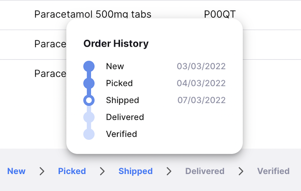

### Case à cocher En attente

Située dans le coin inférieur gauche, à gauche de la séquence de statuts.

Cocher la case `En attente` empêche le Retour fournisseur d'être mis à jour vers le statut suivant.

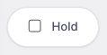

### Boutons Fermer et Confirmer

#### Bouton Fermer

Appuyez sur le bouton `Fermer` pour quitter la vue du Retour fournisseur et revenir à la liste.

#### Bouton Confirmer

Le bouton `Confirmer` met à jour le statut d'un retour. Lors de la gestion d'un Retour fournisseur, vous pouvez uniquement confirmer les statuts Prélevé et Expédié.

| Confirmer...           | Statut actuel | Statut suivant |
| :--------------------- | :------------ | :------------- |
| **Confirmer Prélevé**  | Nouveau       | Prélevé        |
| **Confirmer Expédié**  | Prélevé       | Expédié        |

Vous n'avez pas à suivre la séquence dans l'ordre. Vous pouvez choisir de passer directement à `Expédié` en sautant `Prélevé` par exemple.

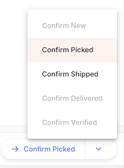

## Ajouter des lignes à un Retour fournisseur

Appuyez sur le bouton `Ajouter un Article` (coin supérieur droit).

Une nouvelle fenêtre `Ajouter un Article` s'ouvre.

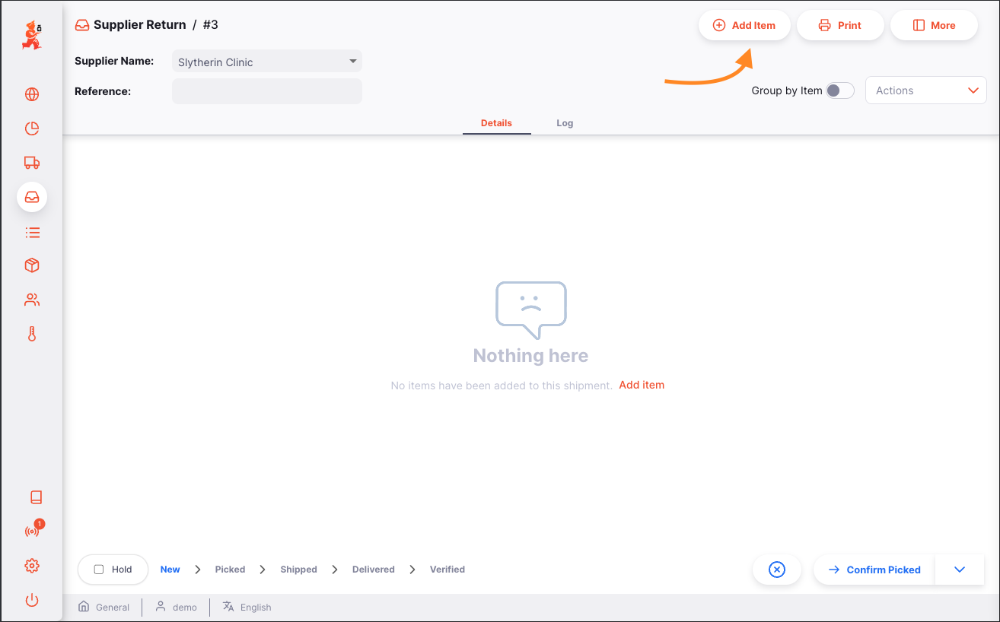

### Sélectionner un article

Dans la fenêtre `Ajouter un Article`, vous pouvez rechercher un article par la liste, par nom ou par code.

Une fois votre article mis en surbrillance, appuyez sur son nom ou sur `Entrée`.

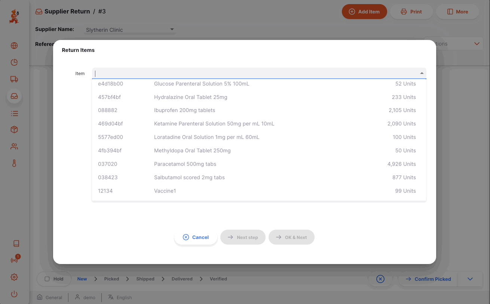

#### Liste des lots disponibles :

Voici la liste des numéros de lot que vous avez en stock pour cet article :

- **Code** : code de l'article
- **Nom** : nom de l'article
- **Lot** : numéro de lot
- **Expiration** : date d'expiration du lot (format : MM/AAAA)
- **En attente** : indique si la ligne de stock est en attente
- **Paquet** : nombre d'unités par paquet
- **Quantité disponible pour retour** : nombre de paquets disponibles (non déjà alloués à d'autres expéditions ou retours)
- **Quantité à retourner** : nombre de paquets à retourner

Les lignes de stock <b>en attente</b> seront affichées dans la liste mais sont désactivées et ne peuvent pas être sélectionnées pour un retour.

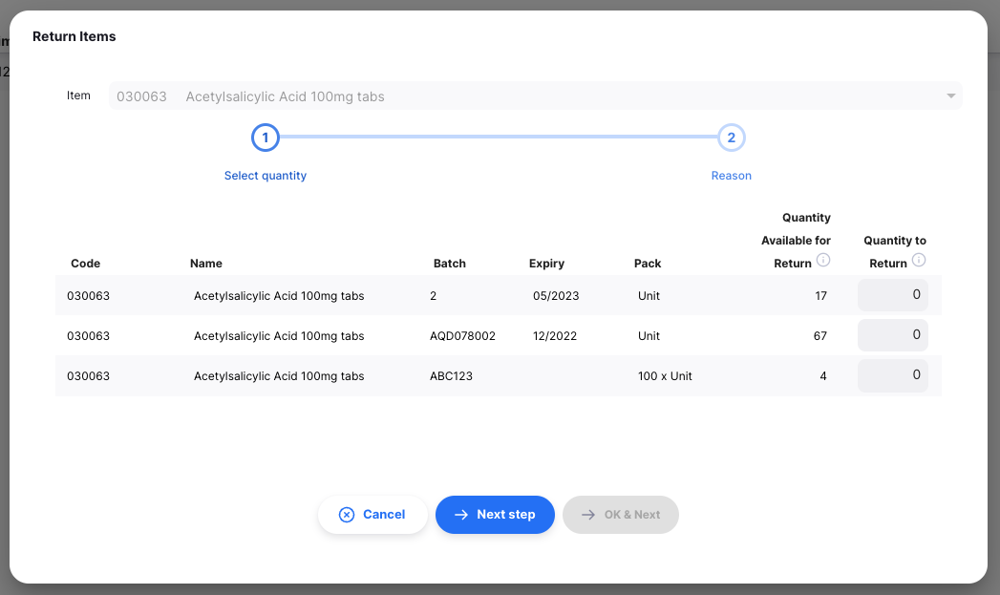

### Retourner une quantité de paquets

Comme vous pouvez le voir ci-dessus, la quantité de paquets à retourner pour chaque lot sera initialement à 0. Vous pouvez l'ajuster pour retourner tout ou partie du stock disponible dans ce lot.

Dans l'exemple ci-dessous, nous retournons les 17 paquets du premier lot de la liste, et seulement 5 paquets du deuxième lot.

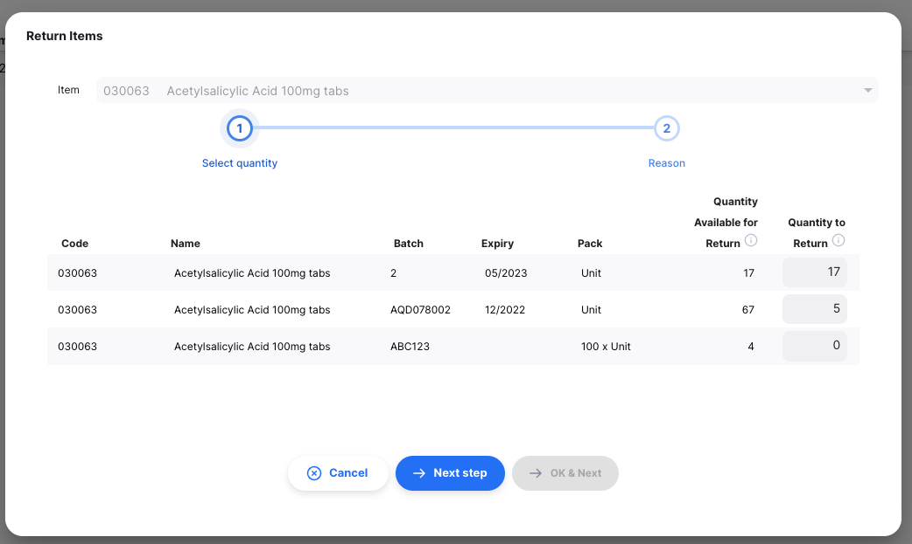

#### Avertissements

Si vous oubliez de saisir une quantité à retourner et cliquez sur `Étape suivante`, vous verrez ce message d'avertissement. Vous devrez ajouter une quantité à retourner pour au moins un lot.

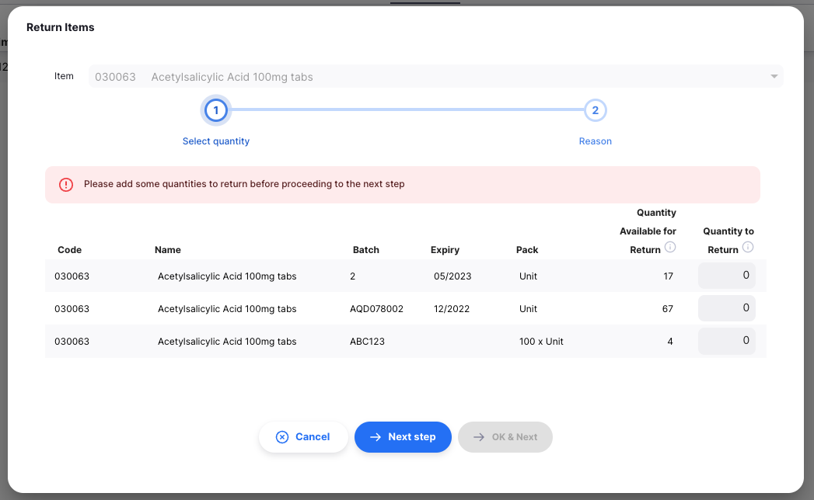

### Fournir des raisons

Les raisons de retour sont configurées sur le serveur central mSupply via les <b><a href="https://docs.msupply.org.nz/preferences:options">options</a></b>.

Lorsque vous êtes satisfait des quantités, appuyez sur le bouton `Étape suivante`. La liste des lots sera filtrée pour n'inclure que ceux pour lesquels vous avez défini une quantité de retour. Dans cette vue, vous pouvez fournir une raison de retour pour chaque lot et un commentaire supplémentaire.

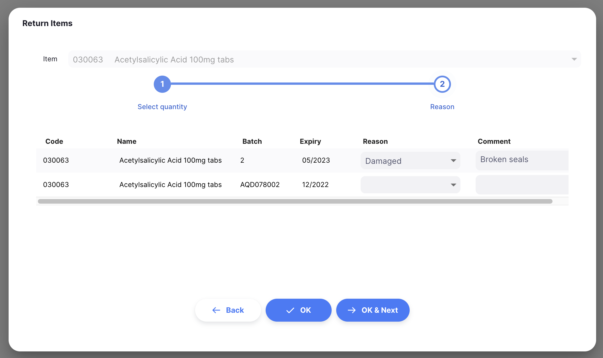

### Confirmer

Lorsque vous êtes satisfait des quantités et des raisons, vous pouvez appuyer sur :

- le bouton `OK`. Votre article sera ajouté au Retour fournisseur. Les quantités pour chaque lot seront réservées pour ce retour.
- le bouton `OK & Suivant` pour ajouter un autre article immédiatement
- le bouton `Retour`, pour revenir à l'étape `Sélectionner la quantité`

## Modifier une ligne de Retour fournisseur

Pour modifier une ligne de retour, appuyez dessus. La fenêtre `Modifier un Article` s'ouvre, identique à `Ajouter un Article`, sauf que l'article est déjà choisi.

### Modifier une ligne

Vous pouvez modifier une ligne de retour si le retour a un statut inférieur à <code>EXPÉDIÉ</code>.

1. Ouvrez le Retour fournisseur à modifier.
2. Appuyez sur la ligne à modifier. À ce stade, vous pouvez :
   - Modifier la quantité à retourner pour chaque lot
   - Cliquer sur `Étape suivante` pour voir/ajuster les raisons et commentaires

Si vous définissez la quantité à retourner à `0`, cette ligne sera supprimée du retour.

Si vous définissez toutes les quantités à `0` et cliquez sur `Étape suivante`, vous verrez un message d'avertissement vous informant qu'aucune quantité de retour n'a été fournie. En cliquant à nouveau sur `OK`, la fenêtre se fermera et toutes les lignes pour cet article seront supprimées.

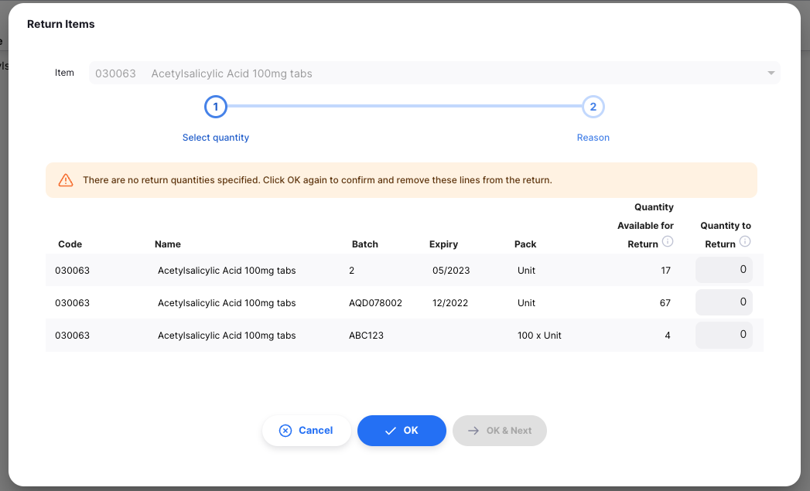

Lors de la modification d'une ligne de retour, vous ne pouvez pas changer l'article. Vous devrez supprimer la ligne de retour et en créer une nouvelle.

### Supprimer une ligne de retour

1. Ouvrez le Retour fournisseur à modifier.
2. Sélectionnez la ou les lignes à supprimer en cochant les cases à gauche.
3. Cliquez sur le bouton `Supprimer` en bas de la page.

Vous pouvez supprimer plusieurs lignes à la fois. Vérifiez bien la sélection avant de procéder à la suppression.

## Traiter un Retour fournisseur

### Confirmer le prélèvement du Retour fournisseur

Le prélèvement désigne le processus consistant à récupérer les articles individuels dans un entrepôt ou une pharmacie.

Une fois le retour créé, l'étape suivante est d'aller chercher les articles pour préparer le retour effectif. Pour faciliter cela, vous pouvez générer un document de **bon de prélèvement** indiquant :

- Les articles à prélever
- Les quantités et numéros de lot pour chaque article
- Si vous gérez votre inventaire avec des emplacements de stockage, où les articles sont situés

Une fois tous les articles prélevés et emballés, vous pouvez confirmer le prélèvement du retour pour indiquer qu'il est prêt à être expédié.

Pour confirmer qu'un retour a été prélevé, appuyez sur le bouton `Confirmer Prélevé`.

Une fois le prélèvement confirmé :

- Le statut du retour est maintenant `PRÉLEVÉ`
- Les articles ne font plus partie de votre inventaire
- Vous êtes invité à confirmer l'expédition via le bouton `Confirmer Expédié`
- Si votre fournisseur utilise également mSupply, un **Retour client** a été généré et est maintenant visible pour votre fournisseur

À ce stade, vous pouvez encore modifier les lignes de retour. Cependant, si le prélèvement a été confirmé, assurez-vous d'informer votre entrepôt de tout changement.

### Confirmer l'expédition du Retour fournisseur

La dernière étape pour retourner du stock est de confirmer que le stock a été expédié.

Pour confirmer qu'un Retour fournisseur a été expédié, appuyez sur le bouton `Confirmer Expédié`.

Une fois l'expédition confirmée :

- Le statut du retour est maintenant `EXPÉDIÉ`
- Vous ne pouvez plus modifier les lignes de retour
- Vous ne pouvez plus supprimer le retour
- Votre fournisseur peut marquer le retour comme `LIVRÉ` une fois qu'il le reçoit

### Suivre la progression des Retours fournisseurs

Si votre fournisseur utilise également mSupply, vous pourrez voir quand il reçoit vos retours :

- Le statut deviendra `LIVRÉ` lorsque les articles seront reçus : votre fournisseur a confirmé avoir reçu votre retour
- Le statut deviendra `VÉRIFIÉ` lorsque le retour aura été vérifié par votre fournisseur. Les articles font maintenant partie de son inventaire.

## Consulter un Retour fournisseur

Lors de la consultation d'un retour spécifique, vous pouvez afficher les lots groupés par article ou chaque lot séparément. Pour changer le mode d'affichage, cliquez sur le bouton `Grouper par article`.

Si vous n'avez pas assez d'espace sur votre écran, vous pouvez masquer certaines colonnes en cliquant sur le bouton `Afficher / masquer les colonnes` en haut à droite du tableau.

Dans l'exemple ci-dessous, nous masquons les colonnes de tarification.

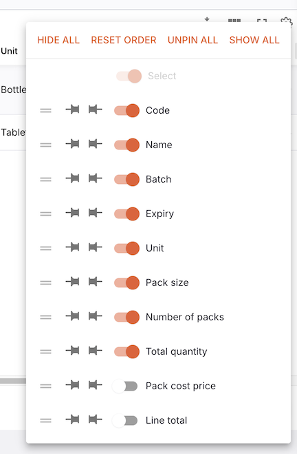
