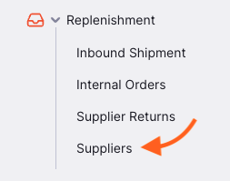
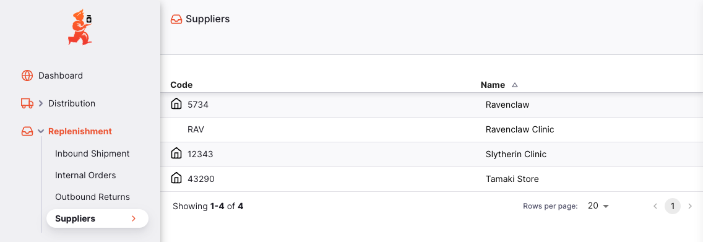
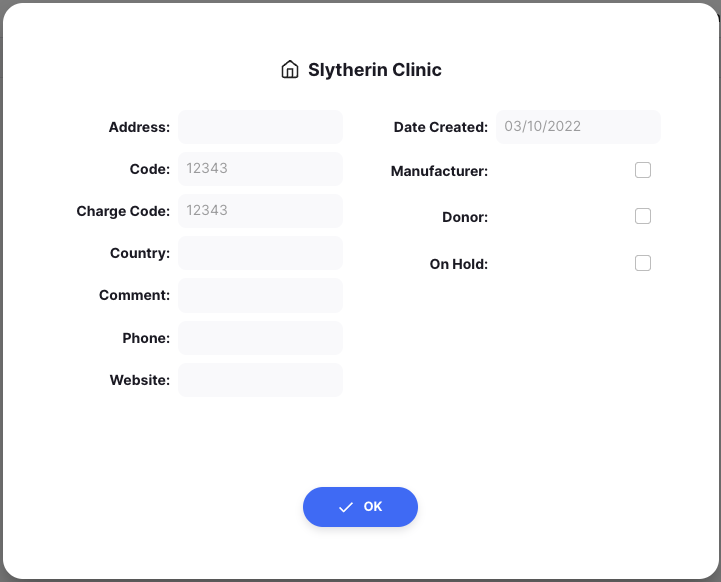

+++
title = "Proveedores"
description = "Gestione sus proveedores"
date = 2022-03-19
updated = 2022-03-19
draft = false
weight = 60
sort_by = "weight"
template = "docs/page.html"

[extra]
lead = "Ver y gestionar a tus proveedores"
toc = true
top = false
+++

En mSupply, un proveedor es una entidad que envía inventario a tu almacén.

En este momento, solo puedes ver tu proveedor y sus detalles. En el futuro, podrás crear y editar tus clientes (¡si tienes autorización para hacerlo!).

## Ver tus proveedores

Para ver los proveedores de tu almacén, ve a `Reabastacimiento` > `Proveedor` en el panel de navegación:

Aparece una lista de los proveedores de tu almacén:

## Ver detalles de proveedores

Para ver los detalles de un proveedor, simplemente haz clic en su nombre:

- **Dirección**: Dirección del proveedor
- **Código**: Este es el código asignado a este proveedor en mSupply
- **Centro de costo**: Generalmente es el mismo valor que el código, sin embargo, puede ser útil tener un código diferente para este proveedor cuando se trabaja con su sistema contable
- **País**: País del proveedor
- **Comentario**: Comentarios sobre el proveedor
- **Teléfono**: Número de teléfono del proveedor
- **Sitio Web**: Sitio web o dirección de correo electrónico del proveedor
- **Fecha de creación**: Fecha en que se creó el proveedor en mSupply
- **Fabricante**: Si se marca, el proveedor también es un fabricante
- **Donante**: Si se marca, el proveedor también es un donante
- **En espera**: Si se marca, no podrás crear nuevas transacciones para este proveedor.
