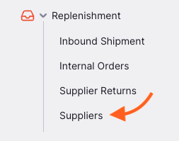
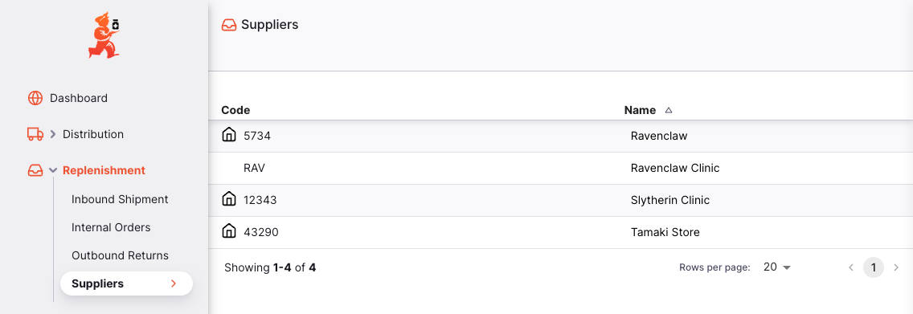
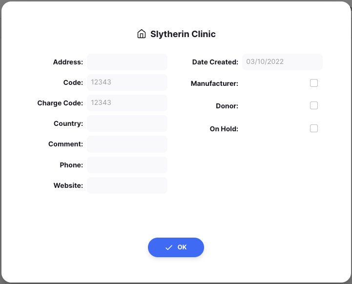

+++
title = "Fournisseurs"
description = "Gérer vos fournisseurs"
date = 2022-03-19
updated = 2022-03-19
draft = false
weight = 60
sort_by = "weight"
template = "docs/page.html"

[extra]
lead = "Consulter et gérer vos fournisseurs"
toc = true
top = false
+++

Dans mSupply, un fournisseur est une entité qui envoie du stock à votre dépôt.

Pour le moment, vous pouvez uniquement consulter vos fournisseurs et leurs détails. À l'avenir, vous pourrez créer et modifier vos fournisseurs (à condition d'en avoir l'autorisation !).

## Consulter les fournisseurs

Pour consulter les fournisseurs de votre dépôt, allez dans `Réapprovisionnement` > `Fournisseur` dans le panneau de navigation :

Une liste de vos fournisseurs apparaît :

## Consulter les détails d'un fournisseur

Pour voir les détails d'un fournisseur, appuyez simplement sur son nom :

- **Adresse** : adresse du fournisseur
- **Code** : code assigné à ce fournisseur dans mSupply
- **Code de facturation** : généralement la même valeur que le code, mais peut être utile lors du travail avec votre système comptable d'avoir un code différent pour ce fournisseur
- **Pays** : pays du fournisseur
- **Commentaire** : commentaire sur ce fournisseur
- **Téléphone** : numéro de téléphone du fournisseur
- **Site web** : site web ou adresse e-mail du fournisseur
- **Date de création** : date à laquelle le fournisseur a été créé dans mSupply
- **Fabricant** : si cette case est cochée, le fournisseur est également un fabricant
- **Donateur** : si cette case est cochée, le fournisseur est également un donateur
- **En attente** : si cette case est cochée, vous ne pourrez pas créer de nouvelles transactions pour ce fournisseur
