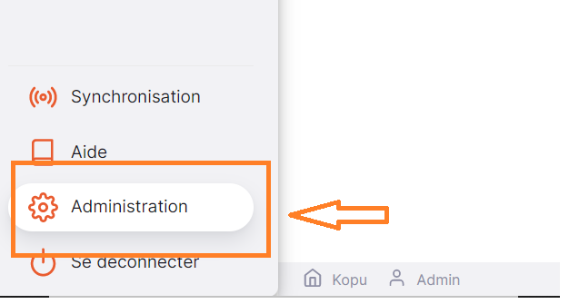
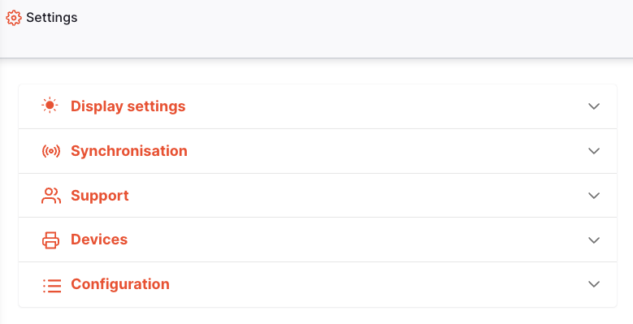

+++
title = "Configuration"
description = "Propriétés de configuration du système"
date = 2022-05-17
updated = 2022-05-17
draft = false
weight = 1
sort_by = "weight"
template = "docs/page.html"

[extra]
toc = true
top = false
+++

La section des paramètres de configuration vous permet de configurer des données personnalisées pour le système. Il est uniquement disponible sur le [Serveur Central Open mSupply](https://docs.msupply.foundation/fr/docs/getting_started/central-server/).

## Affichage des paramètres de configuration

Pour afficher les paramètres de configuration, accédez à `Paramètres` dans la section inférieure du panneau de navigation :

Si vous êtes sur le serveur central Open mSupply, vous verrez cette liste de sections de paramètres :

Cliquez sur le menu `Configuration` pour commencer.
