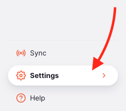

+++
title = "Configuration"
description = "Configure properties within the system"
date = 2022-05-17
updated = 2022-05-17
draft = false
weight = 1
sort_by = "weight"
template = "docs/page.html"

[extra]
toc = true
top = false
+++

The configuration settings section allows you to configure custom data for the system. It is only available on the [Open mSupply Central Server](/docs/getting_started/central-server).

## Viewing the configuration settings

To view the configuration settings, go to `Settings` in the lower section of the navigation panel:

If you are on the Open mSupply Central Server, you will see this list of settings sections:

Click on the `Configuration` section to begin.

## GAPS Store Properties

To operate fully, the [GAPS module](/docs/coldchain/gaps) requires a number of configuration changes and data records to be added to the system. In order to make this process easier, all of the required general configuration steps have been automated for you.

In order to add the GAPS configuration changes, simply click the `Initialise` button, shown below:

Once configured, the `Initialise` button will become disabled:

An `Edit` button will also appear in the footer, where you can edit the store properties for the store you are currently logged into:

Clicking that `Edit` button will open a new window, where you can [view and edit your store properties](/docs/manage/facilities/#editing-your-store-properties).

You will see a number of property inputs in this window. If you don't, there may be something wrong with the configuration - please contact support to investigate.

GAPS configuration is a one way process that cannot be undone! Please be sure you wish to use the GAPS module before initialising.

## Store preferences

Open mSupply is using some of the mSupply central server [store preferences](https://docs.msupply.org.nz/other_stuff:virtual_stores#preferences_tab).

Here's the list of preferences which are currently in use:

| Preference                                                                      | Used by                                                                                                  |
| ------------------------------------------------------------------------------- | -------------------------------------------------------------------------------------------------------- |
| Can manually link requisition to supplier invoice                               | [Internal Orders](/docs/replenishment/internal-orders/)                                                  |
| Edit prescribed quantity on prescription                                        | [Prescriptions](/docs/dispensary/prescriptions/)                                                         |
| Expiring items period                                                           | Used for some [Reports](/docs/getting_started/reports/)                                                  |
| Include requisitions from this store in suppliers' remote authorisation process | Used in [Internal Orders](/docs/replenishment/internal-orders/) if using the remote authorisation module |
| Keep requisition lines with zero requested quantity on finalise                 | [Requisitions](/docs/distribution/requisitions/)                                                         |
| Monthly consumption look back period                                            | Used for some [Reports](/docs/getting_started/reports/)                                                  |
| Months lead time                                                                | Used for some [Reports](/docs/getting_started/reports/)                                                  |
| Open mSupply: Uses program module                                               | If using [Patient Programs](/docs/programs/program-module/)                                              |
| Set pack to one for all visible items in this store                             | Will enable the 'pack to one' feature when receiving stock                                               |
| Show extra fields in requisition                                                | Displays additional fields for internal orders and requisitions                                          |
| Stocktake frequency                                                             | Used for some [Reports](/docs/getting_started/reports/)                                                  |
| Store: Able to issue in foreign currency                                        | If using multiple currencies, this setting is used in multiple places                                    |
| Threshold for overstock                                                         | Used for some [Reports](/docs/getting_started/reports/)                                                  |
| Threshold for understock                                                        | Used for some [Reports](/docs/getting_started/reports/)                                                  |
| Use consumption & stock from customers for internal orders                      | [Internal Orders](/docs/replenishment/internal-orders/)                                                  |
| Use remote authorisation for response requisitions                              | If using authorisation for [Requisitions](/docs/distribution/requisitions/)                              |
| mobile: Uses Vaccine Module                                                     | [Cold chain](/docs/coldchain/introduction/#getting-started)                                              |
