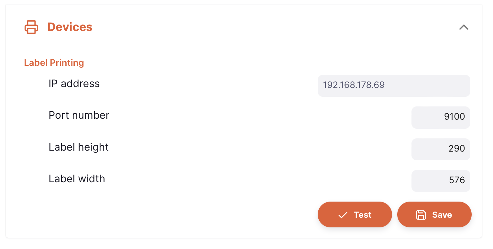
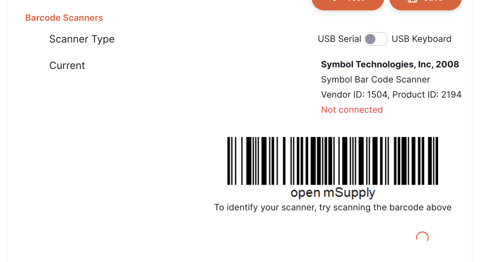
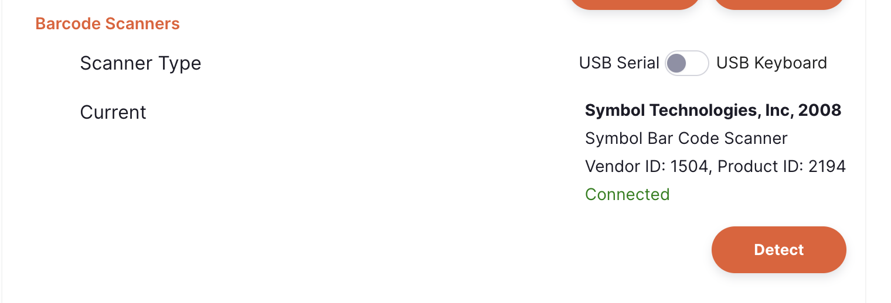

+++
title = "Dispositivos"
description = "Configurar los dispositivos conectados al sistema"
date = 2022-05-17
updated = 2022-05-17
draft = false
weight = 2
sort_by = "weight"
template = "docs/page.html"

[extra]
toc = true
top = false
+++

La sección de configuración de dispositivos te permite configurar los dispositivos que puedas tener conectados al sistema Open mSupply.

## Ver ajustes de dispositivos

Para ver la configuración de dispositivos, ve a `Ajustes` en la sección inferior del panel de navegación:

Verás la lista de secciones de configuración:

Haz clic en la sección `Dispositivos` para comenzar.

## Impresión de etiquetas

¡El soporte para la impresión de etiquetas es muy limitado en este momento! Las impresoras de etiquetas se utilizan solo para imprimir códigos QR para identificar equipos de cadena de frío. Sin embargo, se planea implementar la impresión de etiquetas en el dispensario. Consulta la <a href="/docs/introduction/roadmap/">hoja de ruta</a>  para más detalles.

La funcionalidad de impresión de etiquetas se encuentra actualmente en una fase experimental. Hay soporte limitado para impresoras de etiquetas, ya que solo se puede configurar una impresora de etiquetas habilitada para red que sea compatible con el lenguaje de impresora ZPL.

Introduce la dirección IP y otros detalles de la impresora. Para probar tu configuración, puedes hacer clic en el botó `Probar`.Esto intentará conectar con la impresora y obtener los detalles de configuración de la misma.

Si estás conforme con la configuración, haz clic en `Guardar` para guardar los detalles.

## Escáneres de códigos de barras

Esta sección te permite configurar un escáner de códigos de barras USB para su uso con Open mSupply en el escritorio. Soportamos escáneres en modo serial y en modo teclado. La preferencia son los escáneres seriales, que hemos encontrado que son más confiables. El modelo recomendado es el Zebra DS-22.

Al abrir la sección de escáneres de códigos de barras, es posible que veas el mensaje `No conectado`:

aunque tengas un escáner conectado. El sistema necesita ser informado de que hay un escáner disponible, y esto se hace de la siguiente manera:

Haz clic en el botón `Detectar`. Aparecerá un código de barras:

Escanea el código de barras con tu escáner (¡esto puede tomar varios intentos!). Verás la siguiente notificación cuando sea exitoso:

y luego el mensaje cambiará a lo siguiente:

¡Ahora puedes usar el escáner de códigos de barras!
