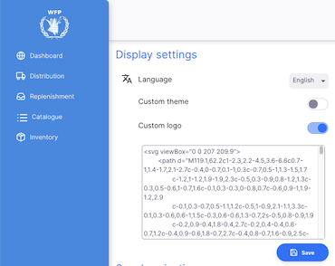

+++
title = "Configuración de visualización"
description = "Customise how the site looks for you"
date = 2022-05-17
updated = 2022-05-17
draft = false
weight = 71
sort_by = "weight"
template = "docs/page.html"

[extra]
toc = true
top = false
+++

La sección de configuración de visualización te permite personalizar cómo se ve el sitio para ti. Los cambios realizados solo afectarán tu experiencia - si otras personas desean cambiar el logotipo, por ejemplo, tendrán que realizar el cambio por sí mismas.

Exploremos lo que es posible...

## Ver la configuración de visualización

Para ver la configuración de visualización, ve a `Admin` en la sección inferior del panel de navegación:

Verás la sección de configuración de visualización en la parte superior de la página:

## Idioma

Para cambiar el idioma, simplemente debes seleccionarlo de la lista desplegable.

El idioma seleccionado se utilizará para todo lo que hagas en el sitio. Si recargas la página o abres una nueva pestaña, se utilizará este idioma. Sin embargo, si ves el sitio en un navegador diferente (por ejemplo, Firefox después de cambiar el idioma en Chrome), deberás seleccionar el idioma nuevamente.

## Personaliza el Logo

Es posible utilizar un logo personalizado para el sitio. Este se muestra en la navegación izquierda y en la pantalla de inicio de sesión. Por ejemplo:

El logo debe estar en formato `svg`. Para actualizarlo, simplemente

- habilita el logo personalizado haciendo clic en el switch
- copia el texto del archivo .svg y pégalo en el área de texto
- haz clic en guardar
  

## Personaliza la apariencia

También puedes configurar una apariencia personalizada para tu sitio utilizando un tema personalizado. Para hacer esto:

- habilita el tema personalizado haciendo clic en el switch
- verás una muestra del tema actual en el área de texto - esto te muestra lo que se puede actualizar
- edita el tema y haz clic en guardar para ver los resultados

