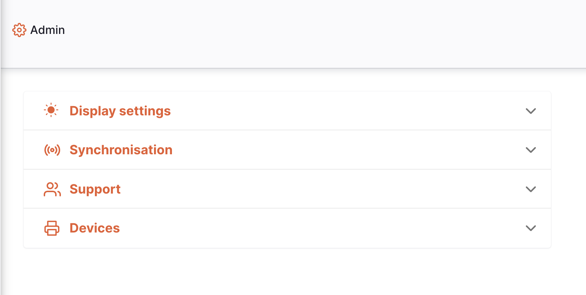
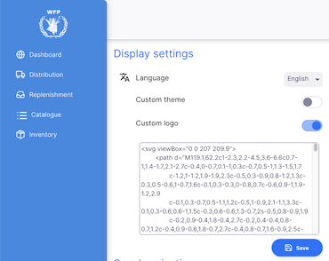

+++
title = "Display Settings"
description = "Customise how the site looks for you"
date = 2022-05-17
updated = 2022-05-17
draft = false
weight = 3
sort_by = "weight"
template = "docs/page.html"

[extra]
toc = true
top = false
+++

The display settings section allows you to customise how the site looks. Some changes will only affect you, and others will be for all users of the site.

Let's explore what's possible...

## Viewing the display settings

To view the display settings, go to `Settings` in the lower section of the navigation panel:

You will see the list of settings sections:

You will see the `Display settings` at the top, click on this to view the options:

## Language

To change the language, you simply have to select from the drop down list. The language selected will only affect you - each user can select the language which they want to view.

The selected language will be used for everything you do on the site. If you reload the page, open a new tab, or come back to the site at a later date, then this language will be used. However if you view the site in a different browser (for example Firefox after changing the language in Chrome) you will need to select the language again.

## Custom logo

It is possible to use a custom logo for the site. The new logo will be shown for all users of the site, so take care! The logo shows in the left navigation and on the login screen. For example:

The logo will need to be in the `svg` format. To update, simply

- enable the custom logo by clicking the toggle switch
- copy the text of the .svg file and paste it into the text area
- click save

## Custom theme

You can also configure a custom look for your site by using a custom theme. This is an advanced configuration feature and the changes you make here are shown to all users of the site so be careful!
To update the theme:

- enable the custom theme by clicking the toggle switch
- you'll see a sample of the current theme in the text area - this shows you what can be updated
- edit the theme and click save to view the results

