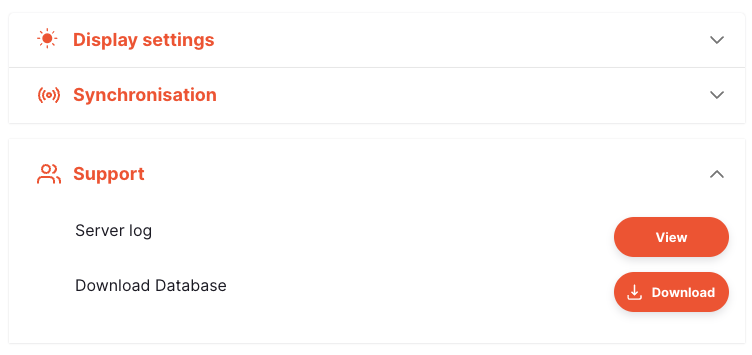
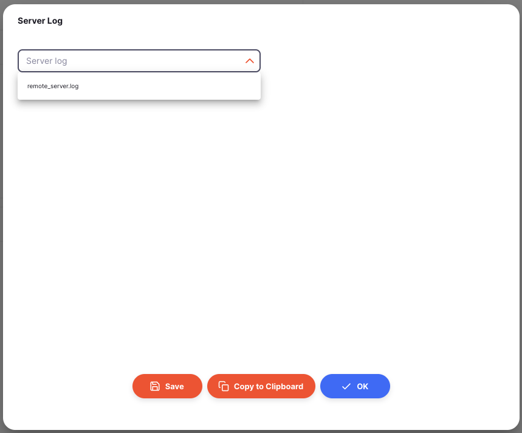
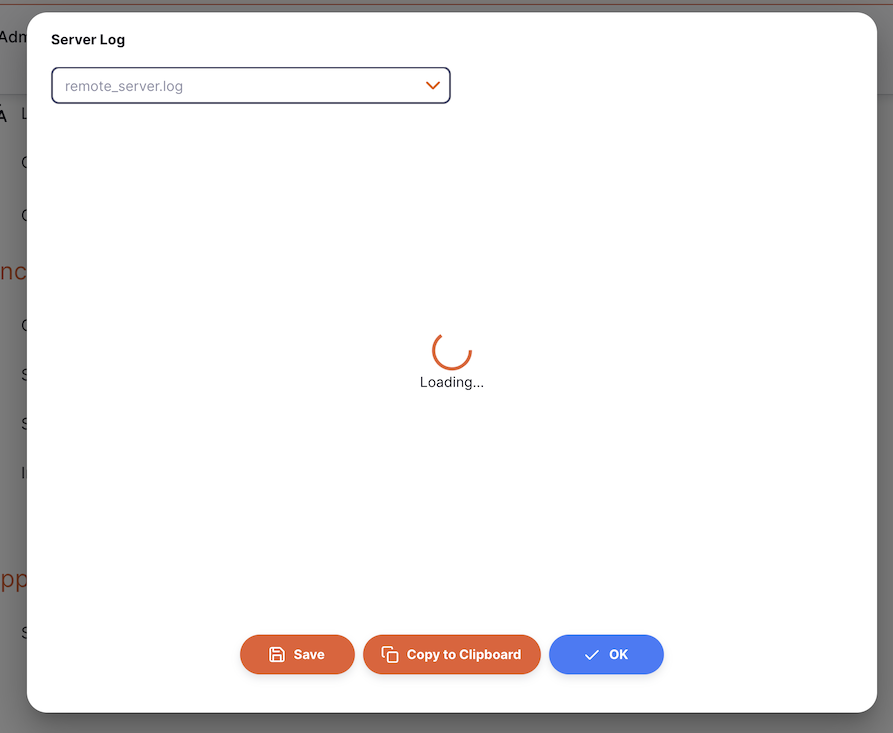
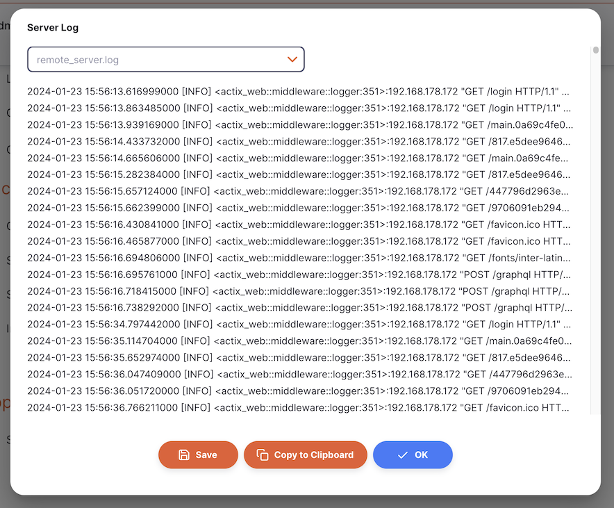

+++
title = "Soporte"
description = "¿Algo está mal? Aquí tienes algunas herramientas para ayudarte."
date = 2022-05-17
updated = 2022-05-17
draft = false
weight = 5
sort_by = "weight"
template = "docs/page.html"

[extra]
toc = true
top = false
+++

La sección de soporte proporciona herramientas para solucionar problemas y brindar soporte en una instalación de Open mSupply.

## Ver el registro de un servidor

Para ver el registro del servidor, ve a `Ajustes` en la parte inferior del panel de navegación:


Verás la sección `Soporte` debajo de los ajustes de Sincronización. Haz clic en esta para ver las opciones.



La sección de Soporte te permite ver los archivos de registro del servidor y descargar tu base de datos con fines de soporte.

Al presionar el el botón `Ver`, se abrirá una nueva ventana que te permitirá seleccionar el archivo de registro para visualizar. Los registros que se muestran en el menú desplegable `Registro del servidor` son todos los registros actualmente disponibles en el servidor.



<div class="nota">¡Ten en cuenta que es necesario tener habilitado el registro para poder ver los registros!</div>

Para habilitar el registro, se requiere la sección `logging` en el archivo de configuración `local.yaml` en el servidor. A continuación, se muestra un ejemplo:

```
logging:
#   uno de: All | Console | File
  mode: Console
#   uno de:  Error | Warn | Info (default) | Debug | Trace
  level: Info
  directory: log
  filename: remote_server.log
  max_file_count: 10
  max_file_size: 1
```

Después de seleccionar un archivo de registro para visualizar, se cargará su contenido. ¡Esto puede tomar un poco de tiempo si el registro es grande!



Una vez cargado, verás el contenido del registro en texto:



Para descargar la base de datos, presiona el botón `Descargar`. Podrás encontrar esta descarga en tu carpeta de descargas.


