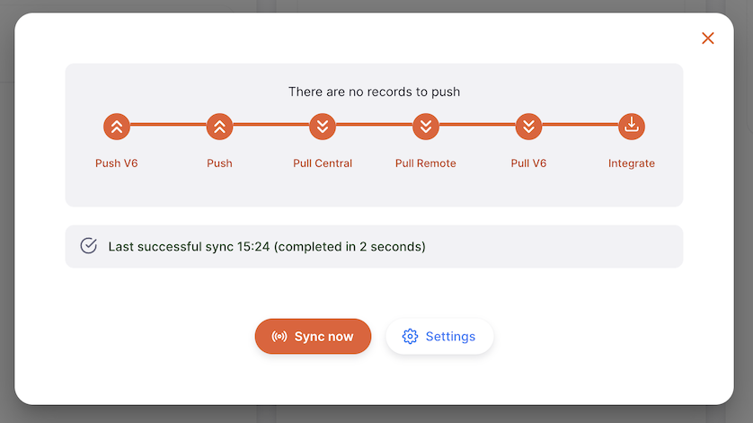
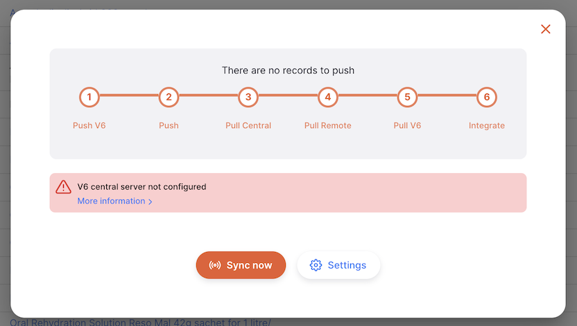

+++
title = "Sincronización"
description = "Configuración de sincronización del servidor"
date = 2022-05-17
updated = 2022-05-17
draft = false
weight = 81
sort_by = "weight"
template = "docs/page.html"

[extra]
lead = "La sincronización es el término que utilizamos para denotar el proceso de transferencia de datos entre tu servidor y el servidor central. Esta página cubre la visualización del estado actual y cómo iniciar manualmente la sincronización."
toc = true
top = false
+++

## Visualización del estado de sincronización

Para ver el estado de sincronización, ve a `Sincronización` en la sección inferior del panel de navegación:

La página muestra el número de registros que esperan ser enviados al servidor central y la hora en que se realizó la última sincronización.

## Sincronización Manual

En esta pantalla de sincronización también se puede iniciar una sincronización de forma inmediata en lugar de esperar al horario programado (recuerde que el intervalo de sincronización está configurado en la sección Admin > Sincronización, consulte la página de [Administración](/docs/settings/synchronisation/) para obtener más detalles).

Para iniciar una sincronización manualmente, simplemente haga clic en el botón `¡Sincronizar ahora!`. Cuando lo hagas, verás que el botón cambia a un spinner y el progreso se indica con los iconos de los pasos que cambian para mostrar cuál está activo en ese momento. Por ejemplo, en la imagen siguiente se muestra que `Obtener Remotamente` está activo.

Notará los totales debajo de los pasos `Push V6` y `Push` - este es el número de cambios a ser _procesados_ por cada paso.

Los registros serán enviados al servidor central de Open mSupply (V6) o al servidor central de mSupply, pero necesitan ser procesados antes de saber a dónde ir.

Por lo tanto, en el ejemplo anterior, se envían 4 registros de sincronización en total, no 8.

Si se produce algún error durante el proceso de sincronización, también lo verá en esta pantalla. Pasa el ratón por encima del icono `i` para ver más detalles.

