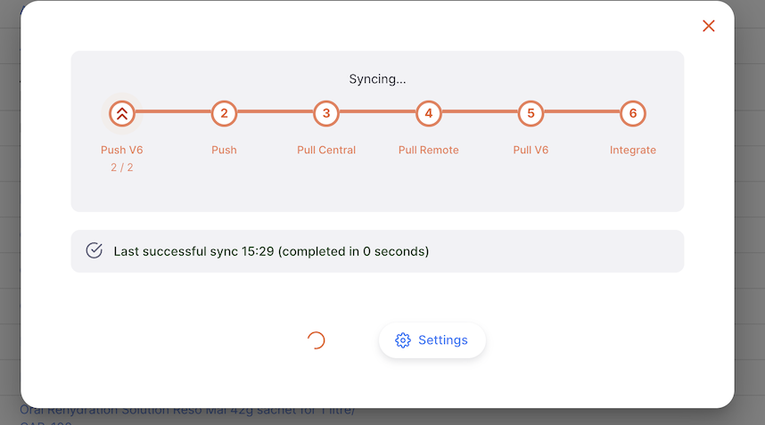

+++
title = "About Synchronisation"
description = "Configure the server sync settings"
date = 2022-05-17
updated = 2022-05-17
draft = false
weight = 81
sort_by = "weight"
template = "docs/page.html"

[extra]
lead = "Synchronisation is the term we use to denote the process of transferring data between your server and the central server. This page covers viewing the current status and how to manually initiate synchronisation."
toc = true
top = false
+++

## Viewing the synchronisation status

For a quick indication of the synchronisation status take a look at the `Sync` in the lower section of the navigation panel. If the icon is in the standard orange colour and there is no 'badge' (circle with a number in it) showing then there are no records waiting and the sync connection is working.

The badge will only display if the number of records waiting is greater than the configured threshold. See the <a href="/docs/manage/global-preferences/">global preferences</a> section for information about the `Sync records display threshold` setting.

If the badge is shown, then the number displayed is the number of records which the system is waiting to send.

If the icon is showing as a light grey then there is a problem with your internet connection and if the badge shows as orange then there have been records waiting to send for over a day.

and if the badge is red then the system has been unable to send sync records for 3 days or more!

For more detail about the sync status, click the `Sync` item in the navigation or press CTRL+ALT+S (CTRL+OPT+S if using a mac) on your keyboard:

The window shows the number of records waiting to be pushed to the central servers, and the time that the last sync happened.

As of v2.0.0, your Open mSupply server actually syncs to two central servers! The `Push V6` and `Pull V6` steps transfer data to and from the Open mSupply central server, which you can read more about [here](../../getting_started/central-server). The `Push`, `Pull Central` and `Pull Remote` steps are syncing with an mSupply central server.

To close the window you can press `Esc` on your keyboard or click the close button which is at the top right:

## Manual synchronisation

On this (sync) screen you are also able to initiate synchronisation immediately rather than wait for the scheduled time ( remember, the sync interval is configured in the Admin > Synchronisation section, see the [Settings](/docs/settings/synchronisation/) page for details ).

To start sync manually, simply click the `Sync now!` button. When you do, you'll see that the button changes to a spinner and the progress is indicated with the stepper icons which change to show which step is currently active. For example, in the image below you'll see that the `Push` step is active.

You'll notice the totals below the `Push V6` and `Push` steps - this is the number of changes to be _processed_ by each step.

The records will then be pushed to _either_ the Open mSupply central server (V6) or the mSupply central server, but they need to be processed before they know where to go!

So in the above example, 4 sync records are being sent in total, not 8.

If any errors are encountered during the sync progress you will see these on this screen too. Hover over the `i` icon to see additional details.

## Server details

At the top right of the `Settings` page the current server URL is displayed, along with a QR code. The code contains the server URL and can be used to easily configure [mSupply Cold Chain](/coldchain/introduction/) when synchronising with Open mSupply.

If you are having trouble scanning the code, you can click (or press, if using a tablet) the code to display a larger version.

