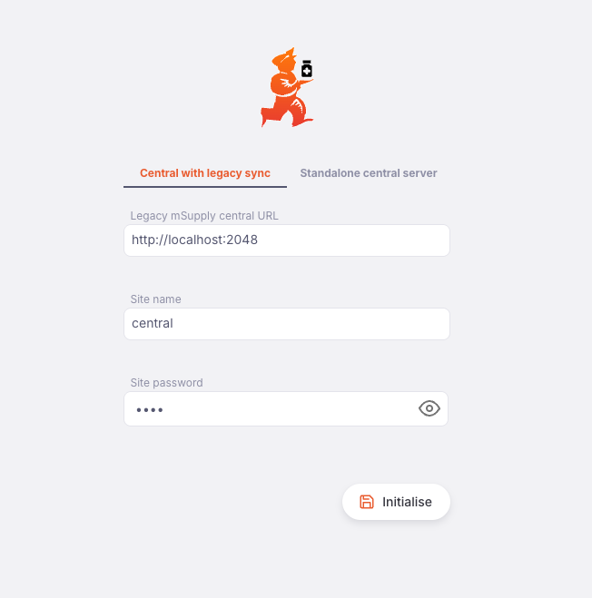
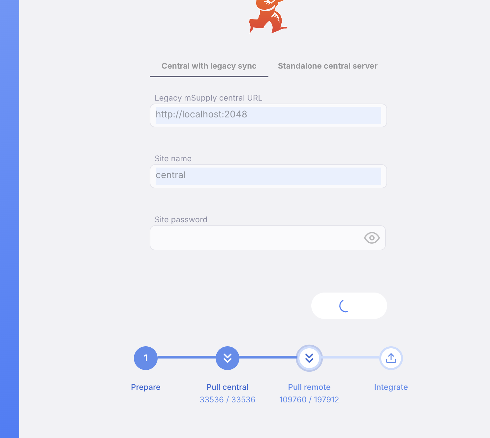
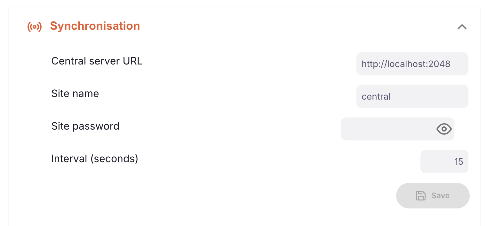
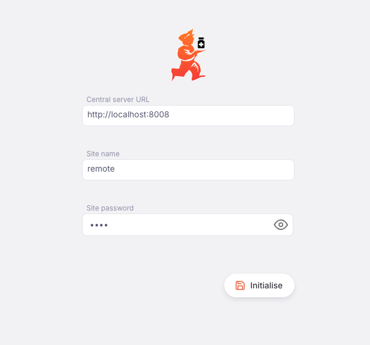
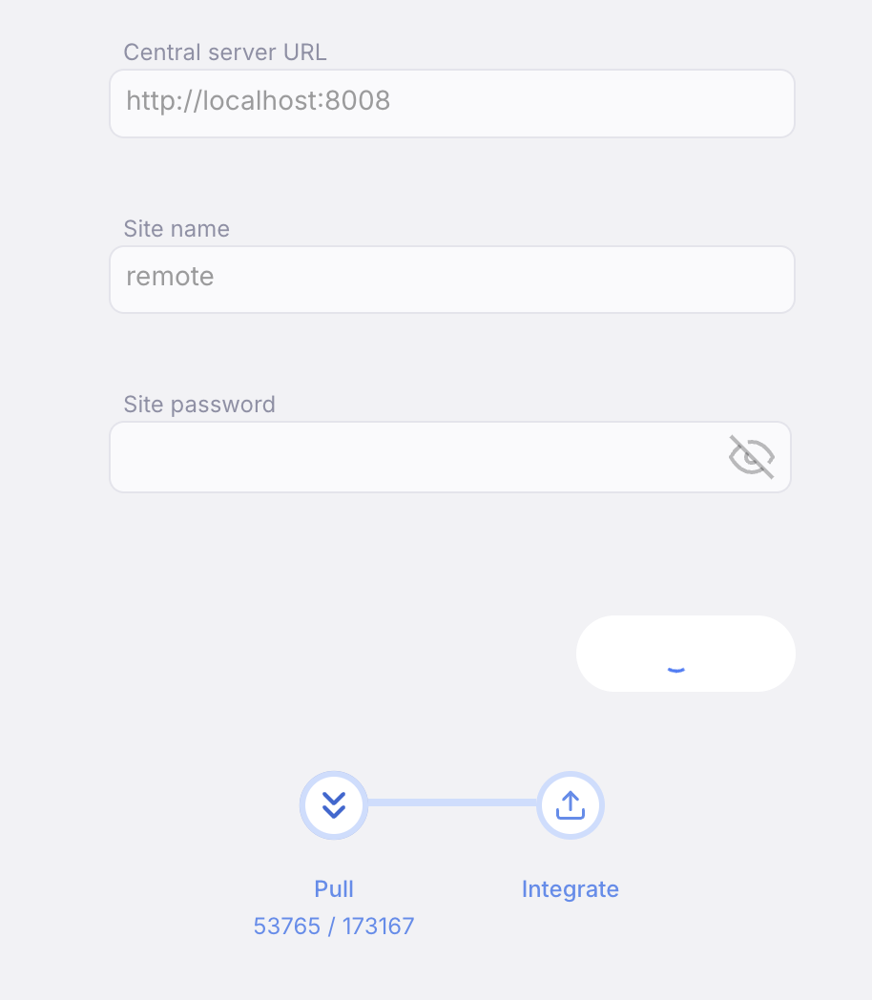
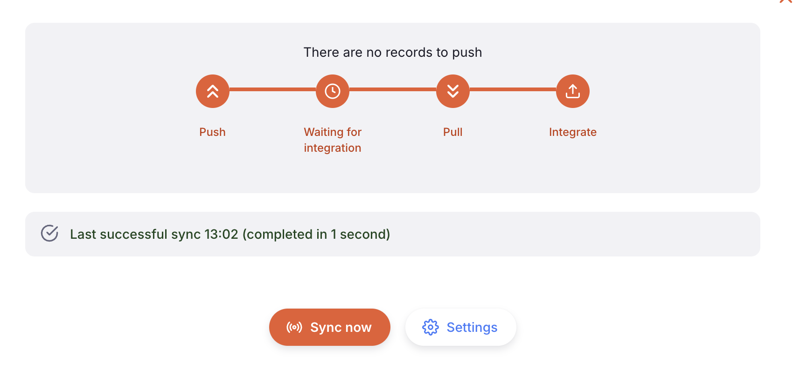
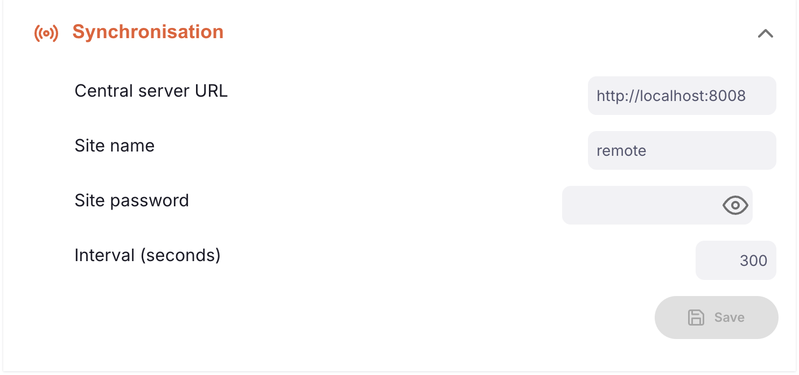
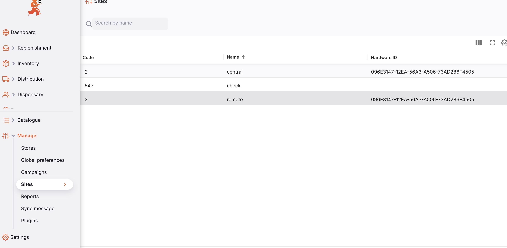
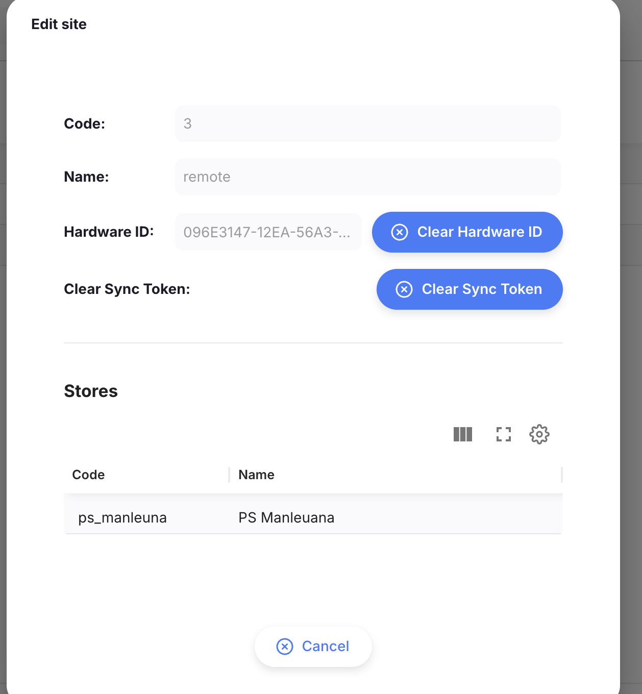

+++
title = "v3 upgrade guide"
description = "User and support facing changes introduced by Open mSupply v3 and sync v7"
date = 2026-06-29
updated = 2026-06-29
draft = false
weight = 1
sort_by = "weight"
template = "docs/page.html"

[extra]
lead = "This page should get you up to speed with the user/support facing changes introduced by v3 and sync v7 work."
toc = true
top = false
+++

List of content:
- [Central initialisation](#central-initialisation)
- [Remote initialisation](#remote-initialisation)
- [Central upgrade](#central-upgrade)
- [Remote upgrade](#remote-upgrade)
- [Site management](#site-management)
- [Synchronisation](#synchronisation)
- [Backward compatability](#backward-compatibility)
- [Standalone central](#standalone-central)
- [Settings changes](#settings-changes)

## Central initialisation

Setting up a new central server from the oms perspective is largely similar to previous versions. You need to have `override_is_central_server` under `server` settings set to be `true` in the yaml settings. After launching the server you would be met with two tabs as shown in the screenshot below. Pick `Central with legacy sync` and carry on as you normally would by entering the details and click on `Initialise`. This will pull all the records for the site you are initialising with.



Once you click `Initialise` the records begin syncing across, as shown by the progress steps below.



You can log in after this is finished and then you can begin using the app. But, before you are able to setup new remote v3 sites, you would have to wait for all the stores for that site, as defined in legacy (OG), to sync across to central. You need to follow the OG guide on how to perform this. On the central site you can speed this up by going to sync settings and setting a small interval time.



Then you can monitor the progress of stores syncing across to your central site in OG (refer to og user guide). OG will no longer allow you to manage/edit these sites. See the [Site management](#site-management) section on how to do this.

## Remote initialisation

Remote servers are setup pretty much entirely similar to older oms versions, with the exception that instead of initialising with a legacy server url, you now have to point to the central oms server url. After all the stores for this site have finished syncing to central, start your remote server and enter the sync information as below:



Once you click `Initialise` the records begin syncing across from central, as shown by the progress steps below.



After it is done initialising, you can start using the app.

## Central upgrade

Upgrading from an older database version to v3 central is pretty much the same process as all other upgrades. One thing to note is before upgrading, make sure `override_is_central_server` under `server` settings set is to `true`. From v3 all central server configurations require this. After doing that, run the upgrade as you would normally and you should be able to log in as per usual. Similar to a fresh initialisation described above, follow the OG guide on syncing all stores to your central site. You will have to wait for all stores of a particular remote site to be synced before you can initialise or upgrade that remote site to v7.

## Remote upgrade

This is the most seamless of all the steps. You essentially just need to upgrade to v3 like you would with any other version. You shouldn't have to change any yaml settings. After the upgrade (and migration) is done you can log in to the site and use it as you normally would. At this point if central is already has already received all the stores for this remote site from OG, then when the next sync runs on this remote site, it will switch over to v7. This is an automatic process and largely goes unnoticed unless you manually trigger the sync. If central is not ready yet, the switch over to sync v7 will fail. Not to worry, it will keep trying again until central is ready with the stores. Then you will see the sync modal and sync settings change after the switch over to sync v7 has completed successfully. What this means is that going forward remote site would no longer talk directly to OG. Remote sites now only know of central oms' presence.





## Site management

When initialising a remote site locally from customer data, you would usually go over to OG and clear the hardware id. But if you followed the above steps and began syncing stores over to central OG will no longer allow you to clear the hardware id. Going forward central oms will be responsible for hardware id checks. Navigate to the page shown below on central and click on the site whose hardware id you want to reset.



Then click the `Clear Hardware ID` button from the modal as shown below.



You might notice another `Clear Sync Token` button. This is a new concept to sync v7. Every remote site that syncs to central via v7 api now requires a token. This is automatically issued by central when the site first switches over to v7 or is initialised. The only time you would have to clear it is during reinitialisation. In the [Sync](#sync) settings section there are a few workarounds for testers and developers who might want to bypass hardware id and token checks. For now these are the only features regarding site management that is controlled by central oms. Everything else still happens on OG for now.

## Synchronisation

Without getting into detail, this section will give you the barebones understanding of how synchronisation works with v7. For a more detailed overview you can have a look at the dev docs [here](https://dev-docs.msupply.foundation/docs/sync/).

When referring to v7, we mean the sync api and mechanism through which a remote oms site syncs with central oms. Central still supports v5/v6 syncs. Central still communicates to OG using v5. And remote oms servers can still sync to central oms and og using v6/v5. When a remote site is v7, it means it no longer communicates directly to OG.

Lets say you have a couple of remote v7 sites A and B. You create an internal order from a store in A to a store in B. In order for B to be able to see this order, from A you will need to trigger a sync (or wait till it syncs in the background) and then trigger sync on B. What happens here is

- A: pushes the record to central oms
- A: waits for central oms to finish integrating the records it pushed
- A: then pulls any records from central if there are any for it
- A: integrates any pulled records

- B: pushed any records if it has to
- B: waits for central to finish integrating
- B: pulls the records from central oms, including the record for the order from A
- B: integrates these records

You will then see the requisition on B. If you want to see both the internal order and the requisition for these stores on OG, you first need to trigger a sync again on B so central oms now has the requistition line that was created from the previous integration. Now central oms has all the necessary information, trigger a sync from central. This will push the data to OG and you can now view the order from there on both the stores.

In short, v7 syncs are initialised from remote sites. Central only does site authentication and making sure the correct records are sent to the remote sites.

## Backward compatibility

As explained in the [Synchronisation](#synchronisation) section, even after upgrading to v3, central oms still supports v5v6 sync. So, a remote site that is still running a v2.xx version could still sync as it used to with OG and central oms. Whenever the site is ready to be upgraded it can be done as per the [Remote upgrade](#remote-upgrade) section.

All older versions of Open mSupply that are still being maintained are supported. Please raise an issue [here](https://github.com/msupply-foundation/open-msupply/issues/new) if you encounter any compatibility issues.

## Standalone central

Although you will find the option to initialise as standalone, this is still a work-in-progress feature. You are welcome to play around and see how things work with standalone but it is not considered to be functional as of yet. Sync v7 is the ground work needed to allow for standalone operation, but just sync v7 alone is not enough.

## Settings changes

This section outlines the changes with respect to yaml settings.

```yaml
server:
  # # Setting all three values below on a fresh DB initialises OMS central and comment out sync settings.
  # # Requires `override_is_central_server: true` above as well.
  standalone_store_name: 'Central Config'
  standalone_admin_username: 'admin'
  standalone_admin_password: 'pass'

sync:
  # url/username/password_sha256/interval_seconds are all-or-nothing: set them all, or omit them
  # all to carry only flags (e.g. on a central server). A partial set is a startup error.

  # Central server only. Relax the v7 hardware-id and "token already allocated" guards so a site
  # can re-pair from a new machine without an admin reset (name + password still required). For
  # recovery/migration only — leave false in normal operation.
  relax_hardware_id_token_checks: false

changelog_partition: # postgres-only; controls partitioning of the changelog table
  partition_size: 5000000      # cursor values per partition
  lookahead: 30000000          # number of insertable records headroom for changelog; also the lower bound — yaml values below this are clamped up
  interval:                    # poll period for the runtime top-up task
    hours: 0
    mins: 1
    secs: 0

changelog_dedup: # central + postgres only; periodically deletes superseded (duplicate) changelog rows
  interval:                    # how often the task wakes to consider a dedup run
    hours: 24
    mins: 0
    secs: 0
  time_window:                 # optional; if set, dedup only runs between these local times and stops at 'to'
    from: "02:00"
    to: "05:00"
  batch_size: 50000            # changelog rows deleted per committed batch
```

### Server

The settings with the `standalone_` prefix only affect standalone operation. Currently there are only store_name and admin username and password options. As mentioned earlier, standalone is still WIP. These are all optional

### Sync

`relax_hardware_id_token_checks` is an optional flag that can be used while setting up automation tests or during development. Do not use this in production. When set to true, central oms will reissue tokens when remote requests for one, even if central already has a token allocated to that remote site. Hardware id checks are completely removed with this option enabled.

### Changelog partition

As a part of sync v7 work, since central oms will now have data for all oms sites, its changelog table would grow to sizes above 100M for some customer sites. In order for the server to function without any performance hitches, the changelog table is partitioned. These settings allow you to tune the parameters by which partitioning is performed.

This entire section is optional. The server will use defaults which should perform adequately for most cases.

`partition_size`:  The number of records a single partition can hold
`lookahead`: The number of records of headroom to be available. This along with partition_size determines how many empty partitions will be created to make room for new records to be inserted
`interval`: How often the server should check for headroom and create partitions if needed

### Changelog dedup

Similar to [partitioning](#changelog-partition) these settings control how often deduplication is performed on the changelog table. Previously deduplications were done using a view. Now since the changelog sizes can be very large on central servers its better to perform them periodically by deleting the old duplicate records. Previously deduplication treat `UPSERTS` and `DELETES` as duplicates, with sync v7 and oms v3, they are treated as distinct.

`interval`: Similar to [changelog partition](#changelog-partition) section, controls how often deduplication is run
`time_window`: If this is set, the deduplication will only start within this time window (optional)
`batch_size`: Controls the batches with which delete operations are performed during deduplication (optional)
